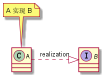

# 面向对象

面向对象或面向对象编程是一种编程范式，以类和对象作为代码的基本组织单位，具有抽象、封装、继承、多态四个基本特性。面向对象强调将现实世界的事物抽象为系统中的对象，使得系统软件组件直接映射到客观世界，并保持其之间的联系。

> 注意，不要将面向对象编程和面向对象编程语言混淆。
>
> 面向对象语言是一种编程语言，从语法上支持类和对象已经面向对象的四个基本特性。
>
> 面向对象编程不一定要用面向对象编程语言来实现，面向对象编程语言编写的代码也不一定是面向对象编程风格的。

## 面向对象与面向过程

面向过程编程也是一种编程范式或编程风格。它以过程（可以理解为方法、函数、操作）作为组织代码的基本单元，以数据（可以理解为成员变量、属性）与方法相分离为最主要的特点。

和面向对象将现实世界的“事物”抽象到系统组件不同，面向过程更强调“事”的概念。表示一种顺序的执行流程，接收数据并输出结果。

和面向过程先比，面向对象编程会更加适合大规模复杂程序的开发。因为复杂的系统程序的处理流程并非单一的一条主线，而是错综复杂的网状结构，面向对象编程比起面向过程编程，更能应对这种复杂性。

> 有没有思考过一个问题，像 Unix、Linux 这些复杂的系统，也都是基于 C 语言这种面向过程的编程语言开发的，你怎么看待这个现象？
>
> 实际上从计算机底层（计算机体系结构）出发，编程语言最终都会被转换成指令被 CPU 一条一条从内存读取并执行，CPU 这种开放性的设计使其并不关心上层应用的代码是用什么语言来写的。因此编程语言作为人和计算机沟通的语言或桥梁，其主要需要从两个方面进行考虑，一个是提高程序的运行效率，一个是提高程序的开发效率。遗憾的是，这二者很难兼得。
>
> C 语言在效率方面几乎做到了极致，它更适合挖掘硬件的价值，这很符合操作系统的定位。所以 C 语言会比 Java 或其他一些对程序员更友好的语言更适合来开发操作系统。

## 抽象

抽象可以简单理解为将事物的公共特征出去出来，强调从宏观视角去审视整体。抽象是处理复杂系统的有效手段，能在把控全局的情况下，有效的过滤掉不必要关注的细节，便于做出更具扩展性的上层设计。

比如，Java 中的抽象类和接口就是对抽象语义上的支持。

## 封装

封装是面向对象重要的一个特征，其对于代码提供者而言，可以保护数据，不被外部随意修改，提高类的可维护性。对于使用者而言，由于封装隐藏了一些实现细节，让使用者可以将注意力放到暴露的接口规格上面，减少使用时的心智负担。

比如，Java 中访问修饰符 public、protected、default、private 可以用在类、类中的方法和变量上，便是对封装在语言层面的支持。

## 继承

继承表示了类之间一种 is-a 关系，是实现代码复用的一项有效手段——子类可以继承父类，并直接访问父类里面的一些方法和属性。

但继承也存在着缺陷，比如继承的层次过深、继承的类过多都会影响到代码的可读性和可维护性。子类如果继承了父类，其必须**拥有**父类的全部方法，其实有些是子类不需要的。

因此也存在则多用组合少用继承的说法，并且 Java 语言只支持单继承，不支持多继承。

## 多态

多态从语法层面上来讲就是父类应用指向子类对象，我们可以在编写代码是基于父类的抽象进行组织，运行时根据具体的类型来表现对应子类的行为特征。

**这就表明，同一份代码（方法）可以具有不同的行为特征，复用了代码的同时，也更具扩展性**，所以多态也是很多设计模式、设计原则落地的基础。


Java 对多态的支持是通过继承重写/实现这两种方法来实现的。

子类需要继承父类，并重写父类方法，这样就在实际运行中执行重写后的逻辑，或者通过编写一个接口的实现类来实现多态。

可见 Java 实现多态是要求类之间具有父子关系（接口也可以看做是实现类的父类）。但一些动态语言，比如 python，只要两个类具有相同规格的方法，就可以实现多态，并不要求两个类之间有任何关系，这就是所谓的 duck-typing。

## 对象间的关系

### 泛化

泛化（Generalization）可以简单理解为继承关系。

```java
class A extends B {}

class B {}
```

用 UML 表示如下：


### 实现

实现（Realization）一般是指接口和实现类之间的关系。

```java
interface A {}

class B implements A {}
```

用 UML 表示如下：



### 组合

组合（Composition）也是一种包含关系。A 类对象包含 B 类对象，B 类对象的生命周期依赖 A 类对象的生命周期，不可单独存在，比如鸟与翅膀之间的关系。

```java
class A {
    
    private B b;

    A () {
        this.b = new B();
    }
}

class B {}
```

用 UML 表示如下：


### 聚合

聚合（Aggregation）是一种包含关系，A 类对象包含 B 类对象，B 类对象的生命周期可以不依赖 A 类对象的生命周期，也就是说可以单独销毁 A 类对象而不影响 B 对象，比如学生与课程之间的关系。	

```java
class A {

    private B b;

    A (B b) {
        this.b = b;
    }
}

class B {}
```

用 UML 表示如下：


### 关联

关联（Association）是一种非常弱的关系，包含聚合、组合两种关系。具体到代码层面，如果 B 类对象是 A 类的成员变量，那 B 类和 A 类就是关联关系。

```java
class A {

    private B b;
}

class B {}
```

用 UML 表示如下：


### 依赖

依赖（Dependency）是一种比关联关系更加弱的关系，包含关联关系。代码层面，只要 A 类对象使用了 B 类对象，不管是 B 类对象是 A 类对象的成员变量，还是 A 类的方法使用 B 类对象作为参数或者返回值、局部变量，我们都称 A 依赖了 B。

```java
class A {

    void func(B b) {}
}

class B {}
}
```

用 UML 表示如下：


