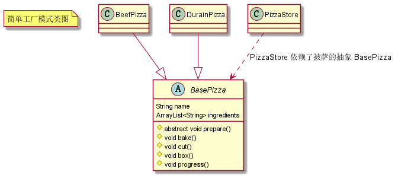
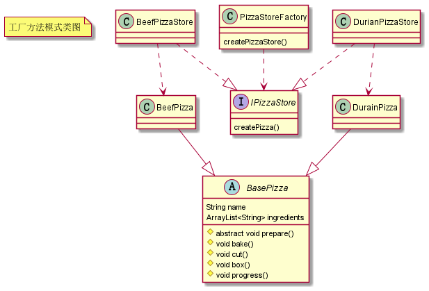
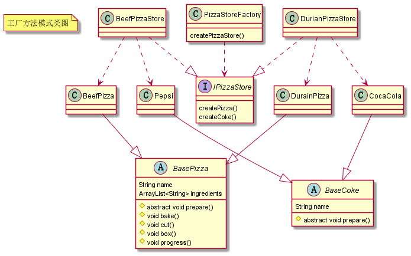

# 工厂设计模式

封装对象的创建过程，**将对象的创建和使用解耦**。

## 简单工厂

一类对象有多种创建方式，且创建逻辑比较简单，可以将对象创建的代码提取出来放到一个单独的类（简单工厂类）中，该类一般向外提供一个创建对象的静态方法，所以又叫静态工厂方法模式（Static Factory Method Pattern）。

比如有一个披萨商店，可以生产牛肉披萨和榴莲披萨，使用简单工厂可以这样创建这些披萨对象：

```java
public class PizzaStore {

    public static BasePizza createPizza(String type) {
        if (Objects.equals(BasePizza.PizzaType.BEEF_PIZZA, type)) {
            return new BeefPizza();
        } else if (Objects.equals(BasePizza.PizzaType.DURIAN_PIZZA, type)) {
            return new DurianPizza();
        } else {
            throw new UnsupportedOperationException("敬请期待...");
        }
    }
}
```

有时候为了避免太多的 if-else，并且要创建的对象是不用改变的，可以提前将对象创建好放到一个哈希表中，通过 key 来获取，如下：

```java
public class PizzaStore {

    private static final Map<String, BasePizza> pizzaMap = new HashMap<>();

    static {
        pizzaMap.put(BasePizza.PizzaType.BEEF_PIZZA, new BeefPizza());
        pizzaMap.put(BasePizza.PizzaType.DURIAN_PIZZA, new DurianPizza());
    }

    public static BasePizza createPizza(String type) {
        BasePizza pizza = pizzaMap.get(type);
        if (pizza == null) {
            throw new UnsupportedOperationException("敬请期待...");
        }
        return pizza;
    }
}
```

上述关系用 UML 表示如下：



## 工厂方法

当每个对象创建方式比较复杂，那么就不适合在同一个方法中实现，否则就会使得一个类变得臃肿，不好维护。为此我们可以进一步拆分职责，将不同对象的创建逻辑放到不同的工厂类中。

这时候可以将对象创建逻辑进行抽象（工厂方法），放到一个接口中，将对象的实现方式分别分散到不同的子类当中。最后还需要提供一个创建工厂的简单工厂。

还是上面披萨商店的例子，我们将每种披萨的创建过程放到不同的披萨商店中实现，代码如下：

```java
public interface IPizzaStore {

    BasePizza createPizza();
}

// 工厂的工厂
public class PizzaStoreFactory {

    public static IPizzaStore createPizzaStore(String type) {
        if (Objects.equals(StoreType.BEEF_PIZZA_STORE, type)) {
            return new BeefPizzaStore();
        } else  if (Objects.equals(StoreType.DURIAN_PIZZA_STORE, type)) {
            return new DurianPizzaStore();
        } else {
            throw new UnsupportedOperationException("敬请期待");
        }
    }
}

// 使用时
public static void main(String[] args) {
    IPizzaStore beefPizzaStore = PizzaStoreFactory.createPizzaStore(PizzaStoreFactory.StoreType.BEEF_PIZZA_STORE);
    BasePizza beefPizza = beefPizzaStore.createPizza();
    IPizzaStore durianPizzaStore = PizzaStoreFactory.createPizzaStore(PizzaStoreFactory.StoreType.DURIAN_PIZZA_STORE);
    BasePizza durianPizza = durianPizzaStore.createPizza();
}
```

上述关系用 UML 表示如下：



## 抽象工厂

在简单工厂和工厂方法中，类只有一种分类方式。若类有多种分类方式，为每种分类方式都去创建一个子类，就会导致有很多工厂类，这时候可以将类的不同分类方式抽象到一个工厂类接口中，用于**创建相关对象家族**。

还是上面一个披萨商店的例子，现在披萨商店将可乐和披萨绑定一起销售，因此在还需要生产可乐。为此我们扩展披萨商店的工厂方法，添加创建可乐的接口。

代码如下所示：

```java
public interface IPizzaStore {

    BasePizza createPizza();

    BaseCoke createCoke();
}

// 工厂的工厂
public class PizzaStoreFactory {

    public static IPizzaStore createPizzaStore(String type) {
        if (Objects.equals(StoreType.BEEF_PIZZA_STORE, type)) {
            return new BeefPizzaStore();
        } else  if (Objects.equals(StoreType.DURIAN_PIZZA_STORE, type)) {
            return new DurianPizzaStore();
        } else {
            throw new UnsupportedOperationException("敬请期待");
        }
    }
}

// 使用时

public static void main(String[] args) {
    IPizzaStore beefPizzaStore = PizzaStoreFactory.createPizzaStore(PizzaStoreFactory.StoreType.BEEF_PIZZA_STORE);
    BasePizza beefPizza = beefPizzaStore.createPizza();
    BaseCoke pepsi = beefPizzaStore.createCoke();
    
    IPizzaStore durianPizzaStore = PizzaStoreFactory.createPizzaStore(PizzaStoreFactory.StoreType.DURIAN_PIZZA_STORE);
    BasePizza durianPizza = durianPizzaStore.createPizza();
    BaseCoke cocaCola = durianPizzaStore.createCoke();
}
```

上述关系用 UML 表示如下：



## 总结

工厂设计模式主要特征是将对象的创建和对象的使用解耦。带来的好处如下：

- 隔离变化：创建逻辑有可能变化，封装成工厂类之后，创建逻辑的变更对调用者透明；
- 隔离复杂性：封装复杂的创建逻辑，使用者无需了解如何创建对象；
- 代码复用：创建代码抽离到独立的工厂类之后可以复用；
- 职责单一：将创建代码抽离出来，让原本的函数或类职责更单一，代码更简洁。

工厂设计模式中分为三类：

- 简单工厂：如果对象创建逻辑比较简单，可以通过一个简单工厂来实现，将这类对象的创建逻辑都放到一个方法中；
- 工厂方法：如果对象创建逻辑比较复杂，可以选择将不同对象的创建逻辑放到不同的工厂类中实现，最后提供一个工厂的简单工厂；
- 抽象工厂：如果我们不是创建一类对象，而是创建一个对象族群，这时候可以用到抽象工厂，让工厂方法支持多种类型的对象创建。

