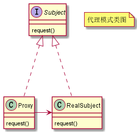
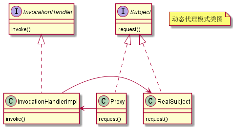

# 代理设计模式

不改变原始类（或叫被代理类）代码的情况下，通过引入代理类来给原始类附加功能，这样的模式叫做代理模式。代理模式主要目的是**控制对象访问**，而非加强功能，这是它跟装饰器模式最大的不同。

从调用者的角度出发，调用者只需要把代理类当中自己本来要访问的对象使用即可，代理类增强的能力调用方并不关心；而装饰器模式扩展的功能则是调用方所关心的，或则说调用方主动将当前类进行包装，以满足当前业务需求。

因此，代理模式适合用来给类扩展一些非功能需求，比如：监控、统计、鉴权、限流、事务、幂等、日志。我们将这些附加功能与业务功能解耦，放到代理类中统一处理，和业务逻辑相关的代码进行解耦。

代码模式从编码上实现有两种方式，静态代理和动态代理。

## 静态代理

比如现在我们有个处理用户登录和注册的类，现要求我们收集登录和注册这两个接口的请求数据。

原本处理请求的类如下所示：

```java
public class UserController {

    public Object login(String telephone, String password) {
        // 登录逻辑
        return null;
    }

    public Object register(String telephone, String password) {
        // 注册逻辑
        return null;
    }
}
```

方法一，可以在原本的类上进行增强，收集请求信息，代码如下所示：

```java
public class UserController {

    // 依赖注入
    private MetricsCollector metricsCollector;

    public Object login(String telephone, String password) {
        long startTimestamp = System.currentTimeMillis();

        // 登录逻辑...

        long endTimeStamp = System.currentTimeMillis();
        long responseTime = endTimeStamp - startTimestamp;
        RequestInfo requestInfo = new RequestInfo("login", responseTime, startTimestamp);
        metricsCollector.recordRequest(requestInfo);

        return null;
    }

    public Object register(String telephone, String password) {
        long startTimestamp = System.currentTimeMillis();

        // 注册逻辑...

        long endTimeStamp = System.currentTimeMillis();
        long responseTime = endTimeStamp - startTimestamp;
        RequestInfo requestInfo = new RequestInfo("register", responseTime, startTimestamp);
        metricsCollector.recordRequest(requestInfo);

        return null;
    }
}

```

上面的做法有明显的问题，对原本的代码具有侵入性，业务代码和非功能需求代码混合在一块，不利于维护与扩展。

这时候我们就可以使用代理模式，创建代理类来实现接口访问信息的收集功能，代码如下：

```java
public class UserControllerProxy extends UserController {

    // 依赖注入
    private MetricsCollector metricsCollector;

    public Object login(String telephone, String password) {
        long startTimestamp = System.currentTimeMillis();

        // 代理原本类的登录功能
        Object userVo = super.login(telephone, password);

        long endTimeStamp = System.currentTimeMillis();
        long responseTime = endTimeStamp - startTimestamp;
        RequestInfo requestInfo = new RequestInfo("login", responseTime, startTimestamp);
        metricsCollector.recordRequest(requestInfo);

        return userVo;
    }

    public Object register(String telephone, String password) {
        long startTimestamp = System.currentTimeMillis();

        // 代理原本类的注册功能
        Object userVo = super.register(telephone, password);

        long endTimeStamp = System.currentTimeMillis();
        long responseTime = endTimeStamp - startTimestamp;
        RequestInfo requestInfo = new RequestInfo("register", responseTime, startTimestamp);
        metricsCollector.recordRequest(requestInfo);

        return userVo;
    }
}
```

使用代理模式就做到避免对原生类的侵入。此外这里是通过继承复用了原生类的功能，我们也可以通过组合去实现。

代理模式可以下述 UML 来表示：



## 动态代理

上面给一个类手动创建一个代理类的方法叫做静态代理，特征是代理类实体在编译前就已经存在。这意味着如果我们需要代理多个类，就需要为每个类编写对应的代理类，即使我们需要增加的功能是一样的。这样就会存在大量的重复代码。

为了解决这个问题，可以使用动态代理，比如上述需求，如果使用动态代理，代码如下所示：

```java
public class MetricsCollectorProxy {

    private MetricsStorage metricsStorage;

    private MetricsCollector metricsCollector;

    public MetricsCollectorProxy() {
        this.metricsCollector = new MetricsCollector(metricsStorage);
    }

    private class DynamicProxyHandler implements InvocationHandler {

        /**
         * 被代理的对象
         */
        private Object proxiedObject;

        public DynamicProxyHandler(Object proxiedObject) {
            this.proxiedObject = proxiedObject;
        }

        @Override
        public Object invoke(Object proxy, Method method, Object[] args) throws Throwable {
            long startTimestamp = System.currentTimeMillis();

            // 代理原本类的功能
            Object result = method.invoke(proxiedObject, args);

            long endTimeStamp = System.currentTimeMillis();
            long responseTime = endTimeStamp - startTimestamp;
            String apiName = proxiedObject.getClass().getName() + ":" + method.getName();
            RequestInfo requestInfo = new RequestInfo(apiName, responseTime, startTimestamp);
            metricsCollector.recordRequest(requestInfo);
            return result;
        }
    }

    public Object createProxy(Object proxiedObject) {
        Class<?>[] interfaces = proxiedObject.getClass().getInterfaces();
        DynamicProxyHandler handler = new DynamicProxyHandler(proxiedObject);
        return Proxy.newProxyInstance(proxiedObject.getClass().getClassLoader(), interfaces, handler);
    }
}
```

有了动态代理（Dynamic Proxy），我们可以不用事先为每个原始类编写代理类，而是在运行的时候，动态地创建原始类对应的代理类。然后在运行过程中使用这个动态代理实例，当我们执行动态代理实例的方法时，最终会执行到我们编写增强类的逻辑。

动态代理的 UML 类图如下所示：



## 总结

当我们需要对现有的类增加非功能性需求时，就可以使用代理模式，避免对原生代码的侵入。

此外动态代理可以在运行期间动态的创建代理类，我们只需提前创建好我们需要增强的逻辑即可，这样可以避免编写大量的代理类。可以说动态代理就是为代理模式量身打造的一种技术。
