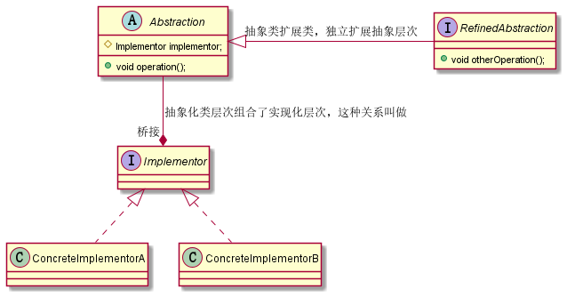

# 桥接设计模式

将抽象和实现放到不同的两个类层次中，使得它们可以独立改变。

## 涉及到的角色

- 抽象化（Abstraction）的角色：抽象化给出的定义，并保存一个对实现层次角色的引用（组合了实现层次角色）。

- 修正抽象化（RefinedAbstraction）角色：扩展抽象化角色，扩展或修正父父类对抽象化的定义。

- 实现化（Implementor）的角色：这个角色给出实现化角色的接口，但不给出具体的实现。

  必须指出的是，这个接口不一定和抽象化角色的接口定义相同，实际上，这两个接口可以非常不一样。实现化角色应当只给出底层操作，而抽象化角色应当只给出基于底层操作的更高一层的操作。

- 具体实现化（ConcreteImplementor）角色：这个角色给出实现化角色接口的具体实现。

上述角色的 UML 类图如下：



举个例子，有一个 API 接口监控告警的例子：根据不同的告警规则，触发不同类型的告警。告警支持多种通知渠道，包括：邮件、短信、微信、自动语音电话。通知的紧急程度有多种类型，包括：SEVERE（严重）、URGENCY（紧急）、NORMAL（普通）、TRIVIAL（无关紧要）。不同的紧急程度对应不同的通知渠道。比如，SERVE（严重）级别的消息会通过“自动语音电话”告知相关人员。


我们将告警处理定义为抽象类层次，其关系怎么处理告警信息，做出告警决策；将告警消息的通知方式定义为实现类层次，其关系具体消息的通知方式。

首先来看抽象层次的定义：

通知类，组合了实现类角色——消息发送器，代码如下：

```java
public abstract class Notification {

    /**
     * 消息通知抽象类，包含了不同的通知方式
     */
    protected MessageSender messageSender;

    /**
     * 通知方法
     *
     * @param message 通知消息
     */
    abstract void inform(String message);

    public Notification(MessageSender messageSender) {
        // fail fast
        this.messageSender = Objects.requireNonNull(messageSender, "MessageSender can not be null");
    }
}

// 严重等级消息通知
public class SevereNotification extends Notification {

    public SevereNotification(MessageSender messageSender) {
        super(messageSender);
    }

    @Override
    void inform(String message) {
        // 严重消息通知
        this.messageSender.sendMessage(message);
    }
}
```


实现类层次，包含不同种类的消息发送方式，代码如下：

```java
public interface MessageSender {

    /**
     * 发送消息
     *
     * @param message 消息内容
     * @return true/false 发送成功/失败
     */
    boolean sendMessage(String message);
}

// 邮件消息发送器，
public class EmailMessageSender implements MessageSender {

    @Override
    public boolean sendMessage(String message) {
        return false;
    }
}
```


这时候已经能看出来，抽象类层次和实现类层次已经可以独立扩展了，我们可以独立派生出其他等级的通知类，也可以独立扩展消息的通知方式。


现在我们有新的需求，要求告警时需要对消息进行检验，通过检验判断是否需要发送信息通知。这一块属于修正抽象化角色，是对抽象层次功能的扩展。

代码如下：

```java
// 告警处理器
public interface AlertHandler {

    /**
     * 处理 api 告警信息
     *
     * @param apiStatInfo api告警信息
     */
    void check(ApiStatInfo apiStatInfo);
}

public class EmailAlertHandler implements AlertHandler {

    private Notification notification;

    /**
     * 邮件地址
     */
    private List<String> emailAddresses;

    public EmailAlertHandler(Notification notification) {
        this.notification = Objects.requireNonNull(notification,"Notification can not be null");
    }

    @Override
    public void check(ApiStatInfo apiStatInfo) {
        boolean needAlert = false;
        if (needAlert) {
            notification.inform("");
        }
    }
}
```

使用时：

```java
public static void main(String[] args) {
    // 实现类层次
    MessageSender messageSender = new EmailMessageSender();
    // 抽象类层次
    Notification notification = new SevereNotification(messageSender);

    // 抽象类扩展，涵盖了抽象层次的功能，并进行增强
    EmailAlertHandler handler = new EmailAlertHandler(notification);
    handler.check(new ApiStatInfo());
}
```

## 总结

桥接模式的优点：

- 解耦了抽象和实现之间固有的绑定关系，使得抽象和实现可以沿着各自的维度来变化。所谓各自的纬度是指，抽象和实现不再在同一个继承层次结构中，而是分布到不同的类层次中，并且通过组合的方式“桥接起来”，这样抽象层次通组合实现层次解决了同一继承结构多维度分类导致类爆炸问题，而且由于是两个不同的类层次又可以独立扩展。

缺点：

- 桥接模式的关键点在于要正确识别出系统中两个独立变化的维度，因此其使用范围具有一定的局限性，如何正确识别两个独立维度也需要一定的经验积累。
- 桥接模式的使用会增加系统的理解与设计难度，由于关联关系建立在抽象层，要求开发者一开始就针对抽象层进行设计与编程。