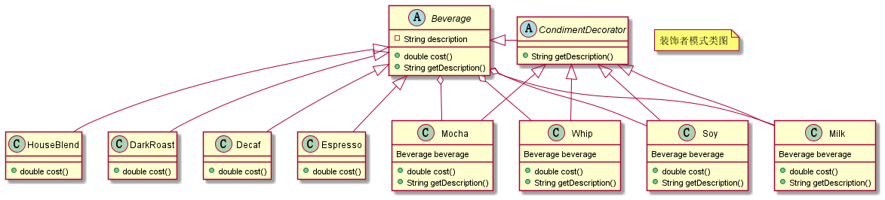

# 装饰器设计模式

装饰器设计模式强调对原类进行功能上的增强，这也是装饰器模式主要特点。装饰器类和原始类继承同样的父类，并通过组合原始类的方式进行嵌套包装。

## 示例

咖啡店出售不同类型的咖啡，每种饮料有对应的描述和价格。

咖啡出售时可以添加配料，配料也有对应的价格和名称，和饮料一起出售时要一起计算价格。


有一个饮料抽象类，如下所示：

```java
public abstract class Beverage {

	public String description = "unknown description";

	/**
	 * 获得饮料价格
	 */
	public abstract double cost();

	/**
	 * 获得饮料描述
	 */
	public String getDescription() {
		return this.description;
	}
}
```

其派生出深烘焙咖啡、低卡咖啡、浓缩咖啡、混合咖啡，代码如下：

```java
// 深烘焙咖啡
public class DarkRoast extends Beverage {

	public DarkRoast() {
		this.description = "深烘焙咖啡";
	}

	@Override
	public double cost() {
		return 1.1;
	}
}
```

添加一个配料类，对饮料进行包装，

```java
// 调料装饰者对象
public abstract class CondimentDecorator extends Beverage {

	public abstract String getDescription();
}

// 牛奶
public class Milk extends CondimentDecorator {

	private Beverage beverage;

	public Milk (Beverage beverage) {
		this.beverage = beverage;
	}

	@Override
	public double cost() {
		return beverage.cost() + 1.2;
	}

	@Override
	public String getDescription() {
		return beverage.getDescription() + "，加牛奶";
	}
}
```

使用时：

```java
public static void main(String[] args) {

    // 订单 1：深烘焙咖啡 + 牛奶
    Beverage beverage = new DarkRoast();
	beverage = new Milk(beverage);
}
```


上述示例 UML 类图如下所示：



## 总结

装饰器设计模式主要是对原类功能上的增加，调用者是关心这些增强功能的。

代理模式和装饰器模式都是对原有类扩展的实现，代理模式扩展的功能往往和原有功能无关，且调用者对代理类是无感知的（这一点和 Web 上的反向代理类似）。