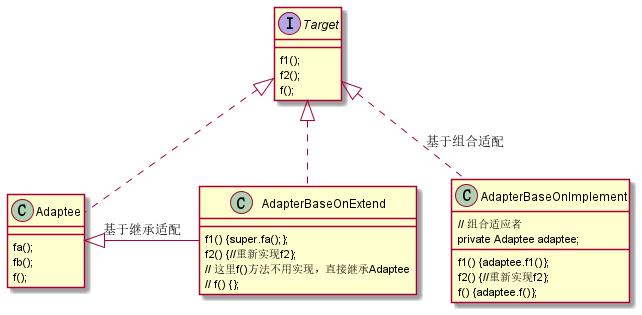

# 适配器设计模式

用做适配，将不兼容的接口转化为可兼容的接口，让原本不能兼容的类可以一起工作。

## 适配器两种实现方式

适配器设计模式设计三种角色：

- 目标对象：需要被适配的对象；

  ```java
  public interface Target {
  
      void f1();
  
      void f2();
  
      void f();
  }
  ```

- 适配者：适配目标对象的对象；

  ```java
  public class Adaptee {
  
      public void fa() {
          System.out.println("I can be used as f1");
      }
  
      public void fb() {
          System.out.println("I need be overwrote");
      }
  
      public void f() {
          System.out.println("I am same as f");
      }
  }
  ```

- 适配器：适配者通过适配器目标对象。适配器有两种实现方式：

  - 基于继承；

    ```java
    public class AdapterBaseOnExtend extends Adaptee implements Target {
    
        @Override
        public void f1() {
            super.fa();
        }
    
        @Override
        public void f2() {
            System.out.println("Overwrite fb");
        }
    
        // f 方法可以不用实现，直接使用继承的服父类，这是和基于实现适配最大的区别
    }
    ```

  - 基于实现。

    ```java
    public class AdapterBaseImplement implements Target {
    
        private Adaptee adaptee;
    
        public AdapterBaseImplement(Adaptee adaptee) {
            this.adaptee = Objects.requireNonNull(adaptee, "adaptee can not be null");
        }
    
        @Override
        public void f1() {
            adaptee.fa();
        }
    
        @Override
        public void f2() {
            System.out.println("Implement f2");
        }
    
        @Override
        public void f() {
            adaptee.f();
        }
    }
    ```

  适配器设计模式 UML 类图如下所示：

  

  ## 示例

  在 Java 中，我们可以通过迭代器（Iterator）或枚举类（Enumeration）去遍历集合。

  规格如下：

  ```java
  public interface Enumeration<E> {
  
      boolean hasMoreElements();
  
      E nextElement();
  }
  
  public interface Iterator<E> {
  
      boolean hasNext();
  
      E next();
  
      default void remove() {
          throw new UnsupportedOperationException("remove");
      }
  }
  ```

  Enumeration 是 JDK 1.0 添加的接口，`Vector`、`Stack`、`Hashtable` 等集合类可以使用其进行遍历。Iterator 是 JDK 1.2 添加的接口，`HashMap`、`ArrayList` 等集合类使用其进行遍历。

  可以看出二者的功能类似，但接口规格不同。那么如果我们想在 `Stack` 上使用迭代器，想在 `ArrayList` 使用枚举类，这时候就需要适配器进行适配。

  代码如下所示：

  ```java
  // 枚举类适配迭代器
  public class EnumerationIterator implements Iterator {
  
      Enumeration enumeration;
  
      public EnumerationIterator(Enumeration enumeration) {
          this.enumeration = enumeration;
      }
  
      @Override
      public void remove() {
          throw new UnsupportedOperationException();
      }
  
      @Override
      public boolean hasNext() {
          return enumeration.hasMoreElements();
      }
  
      @Override
      public Object next() {
          return enumeration.nextElement();
      }
  }
  
  // 使用时
  static void run() {
      Stack<Integer> stack = new Stack<>();
      stack.push(1);
      stack.push(2);
      Enumeration<Integer> elements = stack.elements();
  
      Iterator iterator = new EnumerationIterator(elements);
      while (iterator.hasNext()) {
          System.out.println(iterator.next());
      }
  }
  ```

  ```java
  // 迭代器适配枚举类
  public class IteratorAdapter implements Enumeration {
  
      Iterator iterator;
  
      public IteratorAdapter(Iterator iterator) {
          this.iterator = iterator;
      }
  
      @Override
      public boolean hasMoreElements() {
          return iterator.hasNext();
      }
  
      @Override
      public Object nextElement() {
          return iterator.next();
      }
  }
  
  // 使用时
  static void run() {
      ArrayList<Integer> arrayList = new ArrayList<>();
      arrayList.add(3);
      arrayList.add(4);
      Iterator<Integer> iterator = arrayList.iterator();
  
      Enumeration iteratorAdaptor = new IteratorAdapter(iterator);
      while (iteratorAdaptor.hasMoreElements()) {
          System.out.println(iteratorAdaptor.nextElement());
      }
  }
  ```

## 总结

代理、桥接、装饰器、适配器区别。

- 代理模式：代理模式在不改变原始接口条件下，为原始类定义一个代理类，主要是控制访问，而非加强功能。
- 桥接模式：桥接模式的目的是将抽象层次和实现层次分离，使其可以独立扩展。
- 装饰器模式：装饰器在不改变原始类的条件下，对原始类功能进行增强，并且支持多个装饰器嵌套使用。
- 适配器模式：适配器提供跟原始类不同的接口，而代理模式、装饰器模式提供都是跟原始类相同的接口。