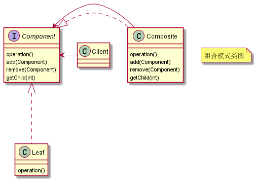

# 组合设计模式

将一组对象组织（Compose）成树形结构，以表示一种“部分 - 整体”的层次结构。组合让客户端可以统一单个对象和组合对象的处理逻辑。

## 设计树结构

组合模式 UML 类图如下所示：



使用组合设计模式设计一个树结构。

树节点对象：

```java
public abstract class TreeNode {

    private String key;
    private String icon;
    private String title;
    protected boolean isLeaf;
    private Map<String, Object> props;

    public abstract void addChild(TreeNode child);

    public TreeNode() {
    }

    public TreeNode(String key, String title) {
        this.key = key;
        this.title = title;
    }
}
```

非叶子节点：

```java
public class NonLeaf extends TreeNode {

    private List<TreeNode> children;

    public NonLeaf() {
        this.children = new ArrayList<>();
    }

    public NonLeaf(String key, String title) {
        super(key, title);
        this.children = new ArrayList<>();
    }

    @Override
    public void addChild(TreeNode child) {
        children.add(child);
    }
}
```

叶子节点：

```java
public class Leaf extends TreeNode {

    public Leaf() {
        super.isLeaf = true;
    }

    public Leaf(String key, String title) {
        super(key, title);
        super.isLeaf = true;
    }

    @Override
    public void addChild(TreeNode child) {
        throw new UnsupportedOperationException("叶子节点不支持添加孩子节点");
    }
}
```


通过上述组合模式，客户端在使用树节点来同一处理叶子节点和非叶子节点。

## 总结

因为其应用场景的特殊性，数据必须能表示成树形结构，这也导致了这种模式在实际的项目开发中并不那么常用。但是，一旦数据满足树形结构，这种模式就能发挥很大的作用，能让代码变得非常简洁。