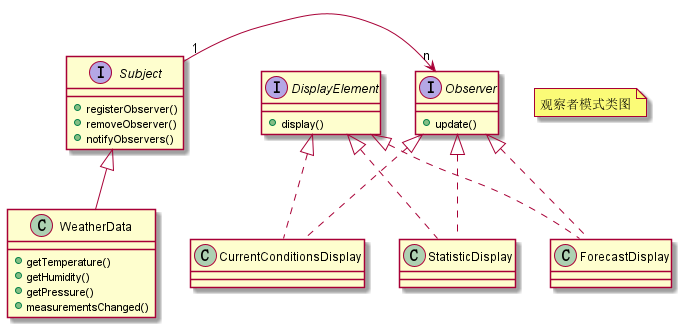

# 观察者设计模式

在对象之间定义一个一对多的依赖，当一个对象状态改变的时候，所有依赖的对象都会自动收到通知。

## 示例

有天气数据，包括温度、湿度、气压等数据，当天气数据更新时要通知气象板和酷热指数板对这些信息进行实时展示。

这里的天气数据就是被观察者，气象板和酷热指数板就时观察者。

这里状态改变通知使用同步的方式实现。

主题（被观察者）：

```java
public interface Subject {

	/**
	 * 观察者注册
	 */
	void registerObserver(Observer observer);

	/**
	 * 取消注册
	 */
	void removeObserver(Observer observer);

	/**
	 * 当主题状态改变时，这个方法会被调用，以通知所有的观察者。
	 */
	void notifyObservers();
}
```

气象数据：

```java
public class WeatherData implements Subject {

	private List<Observer> observerList = new ArrayList<>();
	private Float temperature;
	private Float humidity;
	private Float pressure;

	@Override
	public void registerObserver(Observer observer) {
		observerList.add(observer);
	}

	@Override
	public void removeObserver(Observer observer) {
		observerList.remove(observer);
	}

	@Override
	public void notifyObservers() {
		for (Observer observer : observerList) {
			observer.update(temperature, humidity, pressure);
		}
	}

	/**
	 *当从气象站得到更新观测值时，我们通知观察者
	 */
	public void measurementsChanged() {
		notifyObservers();
	}

	/**
	 * 从气象站得到更新观测值
	 */
	public void setMeasurements(float temperature, float humidity, float pressure) {
		this.temperature = temperature;
		this.humidity = humidity;
		this.pressure = pressure;
		measurementsChanged();
	}
}
```


观察者顶层接口：

**提供了获取更新数据的入口，被观者者通过调用该接口进行状态变更通知**。

```java
public interface Observer {

	/**
	 * 更新消息
	 */
	void update(float temp, float humidity, float pressure);
}
```

公告板顶层接口，用来展示数据：

```java
public interface DisplayElement {

	/**
	 * 展示方法
	 */
	void display();
}
```

气象公告板：

```java
public class CurrentConditionsDisplay implements Observer, DisplayElement {

	private float temperature;

	private float humidity;

	private float pressure;

	private Subject subject;

	public CurrentConditionsDisplay(Subject subject) {
		this.subject = subject;
		subject.registerObserver(this);
	}

	@Override
	public void display() {
		System.out.println("当前气象信息展示公告板");
		System.out.println("temperature:" + this.temperature);
		System.out.println("humidity:" + this.humidity);
		System.out.println("pressure:" + this.pressure);
	}

	@Override
	public void update(float temp, float humidity, float pressure) {
		this.temperature = temp;
		this.humidity = humidity;
		this.pressure = pressure;
		display();
	}
}
```

酷热指数公告板：

```java
public class HeatIndexDisplay implements Observer, DisplayElement {

	private float heatindex;

	private Subject subject;

	public HeatIndexDisplay(Subject subject) {
		this.subject = subject;
		subject.registerObserver(this);
	}

	@Override
	public void display() {
		System.out.println("酷热指数公告板");
		System.out.println("heatIndex:" + this.heatindex);
	}

	@Override
	public void update(float temp, float humidity, float pressure) {
		calculateHeatIndex(temp, humidity);
		display();
	}

	/**
	 * 计算酷热指数，体感指数
	 */
	private void calculateHeatIndex(float T, float RH) {
		this.heatindex = 16.923f + 1.85212f * 10 - 1 * T + 5.37941f * RH - 1.00254f * 10 - 1
				* T * RH + 9.41695f * 10 - 3 * T * T + 7.28898f * 10 - 3 * RH * RH + 3.45372f * 10
				- 4 * T * T * RH - 8.14971f * 10 - 4 * T * RH * RH + 1.02102f * 10 - 5 * T * T * RH * RH
				- 3.8646f * 10 - 5 * T * T * T + 2.91583f * 10 - 5 * RH * RH * RH + 1.42721f * 10 - 6 * T * T * T
				* RH + 1.97483f * 10 - 7 * T * RH * RH * RH - 2.18429f * 10 - 8 * T * T * T  * RH * RH + 8.43296f
				* 10 - 10 * T * T * RH * RH * RH - 4.81975f * 10 - 11 * T * T * T * RH * RH * RH;
	}
}
```

使用时：

```java
public static void main(String[] args) {
    // 创建一个主题
    WeatherData subject = new WeatherData();
    // 创建一个观察者，并注册主题
    CurrentConditionsDisplay observer1 = new CurrentConditionsDisplay(subject);
    HeatIndexDisplay observer2 = new HeatIndexDisplay(subject);

    // 数据更新
    subject.setMeasurements(80, 80, 80);
}
```


上述示例对应 UML 类图如下所示：



## 总结

观察者设计模式在对象之间定义一个一对多的依赖，当一个对象状态改变的时候，所有依赖的对象都会自动收到通知。

观察者设计模式使用广泛，Java 对观察者模式有原生的支持，对应 `java.util` 包下的 Observer 和 Observable 这两个类，不过在 Java 9 之后被废弃了。

观察者设计模式实现方式也有多种，在进程中有同步和异步两种方式，异步可以借助 Guava EventBus 实现。在进程间可以借助 RPC 和 MQ 技术来实现。

