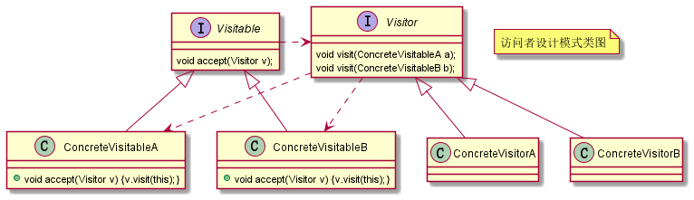

# 访问者设计模式

允许一个或者多个操作应用到一组对象上，解耦操作和对象本身。


访问者模式针对的是一组类型不同的对象。不过，尽管这组对象的类型是不同的，但是，它们往往继承相同的父类或者实现相同的接口。

在不同的应用场景下，我们需要对这组对象进行一系列不相关的业务操作。为了避免不断添加功能导致类不断膨胀，职责越来越不单一，我们使用访问者模式，**将对象数据与操作解耦**——将这些业务操作抽离出来，定义在独立细分的访问者类中。

## 示例

访问者设计模式 UML 类图如下所示：




比如我们有资源文件对象，根据文件格式的不同，分为不同的文件，比如 PDF 文件，Word 文件等。

现在我们要实现对文件的压缩和文本内容提取操作。虽然这两个都是对资源文件数据的操作，但它们之间并没有直接联系。如果将文件的操作逻辑都放到资源文件里实现，势必会导致资源文件类膨胀，久而久之变得不易维护和扩展。


为此我们将文件数据的操作逻辑抽象出来，且针对不同格式的文件，抽象出不同的处理接口。

那么现在的问题就是，抽象出来的逻辑要怎么访问到不同文件里的数据，这里就用到了访问者模式。

定义一个 Visitor 接口，表示了对不同类型文件数据的访问，如：

```java
public interface Visitor {

    void visit(PDFFile pdfFile);

    void visit(PPTFile pdfFile);

    void visit(WordFile pdfFile);
}
```

这时候文件对象实现一个 accept 方法，接受一个访问者，并将自己的文件内容传递给访问者。如：

```java
public abstract class ResourceFile {

    protected String filePath;

    public ResourceFile(String filePath) {
        this.filePath = filePath;
    }
	
    // 接待访问者并将数据传递出去
    abstract public void accept(Visitor visitor);
}

public class WordFile extends ResourceFile {

    public WordFile(String filePath) {
        super(filePath);
    }

    @Override
    public void accept(Visitor visitor) {
        visitor.visit(this);
    }
}
```

这样我们在使用的时候，就可以分区获取好资源文件，创建好访问者，就可以实现对文件数据的提取、压缩等操作。

```java
public static void main(String[] args) {
    Visitor extractor = new Extractor();
    List<ResourceFile> resourceFiles = listAllResourceFiles(null);
    for (ResourceFile resourceFile : resourceFiles) {
        resourceFile.accept(extractor);
    }

    Visitor compressor = new Compressor();
    for (ResourceFile resourceFile : resourceFiles) {
        resourceFile.accept(compressor);
    }
}
```

## 双分派（Double Dispatch）

所谓 Single Dispatch，指的是执行哪个对象的方法，根据对象的运行时类型来决定；执行对象的哪个方法，根据方法参数的**编译时类型**来决定。

所谓 Double Dispatch，指的是执行哪个对象的方法，根据对象的运行时类型来决定；执行对象的哪个方法，根据方法参数的**运行时类型**来决定。

Single Dispatch 之所以称为“Single”，是因为执行哪个对象的哪个方法，只跟“对象”的运行时类型有关。Double Dispatch 之所以称为“Double”，是因为执行哪个对象的哪个方法，跟“对象”和“方法参数”两者的运行时类型有关。


具体到编程语言的语法机制，Single Dispatch 和 Double Dispatch 跟多态和函数重载直接相关。

当前主流的面向对象编程语言（比如，Java、C++、C#）都只支持 Single Dispatch，不支持 Double Dispatch。比如，Java 支持多态特性，代码可以在运行时获得对象的实际类型（也就是前面提到的运行时类型），然后根据实际类型决定调用哪个方法。

尽管 Java 支持函数重载，但 Java 设计的函数重载的语法规则是，并不是在运行时，根据传递进函数的参数的实际类型，来决定调用哪个重载函数。而是在编译时，根据传递进函数的参数的声明类型（也就是前面提到的编译时类型），来决定调用哪个重载函数。也就是说，具体执行哪个对象的哪个方法，只跟对象的运行时类型有关，跟参数的运行时类型无关。


这里提单分派和双分派和访问者模式的实现有关。

如果一个语言支持双分派，那么可以不用在资源访问对象里创建 accept 方法，将数据传递出去。可以直接在使用时把不同的文件对象当做参数传入，双分派语言可以根据实际运行的类型执行对应的方法。

比如：

```java
public static void main(String[] args) {
    Extractor extractor = new Extractor();
    List<ResourceFile> resourceFiles = listAllResourceFiles(null);
    for (ResourceFile resourceFile : resourceFiles) {
        extractor.extract(resourceFile);
    }
}

public class Extractor {

    public void extract(PPTFile pptFile) {
        //...
        System.out.println("Extract PPT.");
    }

    public void extract(PDFFile pdfFile) {
        //...
        System.out.println("Extract PDF.");
    }

    public void extract(WordFile wordFile) {
        //...
        System.out.println("Extract WORD.");
    }
}
```

事实上，上述的代码在 Java 里面是编译不通过的，因为 Java 是一个单分派语言，具体要要调用的方法在编译期间就需要根据参数规格确定。

因为在编译期间并不知道 `ResourceFile` 具体是哪个子类型，因此无法选择知道该选择哪个方法执行，因此会编译不通过。

如果是双分派的语言则不存在这样的问题，这样来看，访问者模式是针对单分派语言设计的一种将数和数据操作通过访问者建立联系的设计模式。