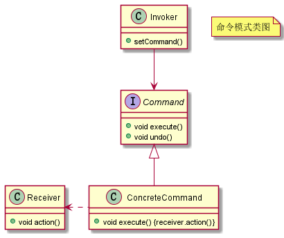

# 命令设计模式

命令模式将请求（命令）封装为一个对象，这样可以使用不同的请求参数化其他对象（将不同请求依赖注入到其他对象），并且能够支持请求（命令）的排队执行、记录日志、撤销等（附加控制）功能。

## 示例

命令模式 UML 类图如下所示：



比如我们要实现一个智能遥控器（Invoker），遥控器上有很多按键，我们可给每个按键绑定不同的指令（Command），然后当按下按键的时候就课题控制家里的电器设备（Receiver）。

首先我们给出命令的接口：

```java
public interface Command {

	/**
	 * 执行方法
	 */
	void execute();

	/**
	 * 撤销方法
	 */
	void undo();
}
```

这个接口只包含了两个功能，执行和回退，可以对应开和关，也可以代表其他动作。

然后我们可以实现一些具体的命令，比如组合灯，来控制灯的开关：

```java
public class LightOnCommand implements Command {

	/**
	 * 命令接受者，即接受命令，执行对应操作
	 */
	private Light light;

	public LightOnCommand(Light light) {
		this.light = light;
	}

	@Override
	public void execute() {
		light.on();
	}

	@Override
	public void undo() {
		light.off();
	}
}

public class Light {

	public void on() {
		System.out.println("灯打开了");
	}

	public void off() {
		System.out.println("灯关了");
	}
}
```


最后实现一个遥控器类（Invoker），来承载这些命令。

```java
public class RemoteControl {

    /**
     * 遥控器开启命令列表
     */
    private Command[] onCommands = new Command[7];
    /**
     * 遥控器关闭命令列表
     */
    private Command[] offCommands = new Command[7];
    /**
     * 记录上次执行的命令
     */
    private Command undoCommand;

    public RemoteControl() {
        DefaultCommand defaultCommand = new DefaultCommand();
        for (int i = 0; i < 7; i++) {
            onCommands[i] = defaultCommand;
            offCommands[i] = defaultCommand;
        }
        undoCommand = defaultCommand;
    }

    /**
     * 给遥控器按键绑定指令命令
     *
     * @param spot       按键位置
     * @param onCommand  开启命令
     * @param offCommand 关闭命令
     */
    public void setCommands(int spot, Command onCommand, Command offCommand) {
        onCommands[spot] = onCommand;
        offCommands[spot] = offCommand;
    }

    /**
     * 按下开启按钮
     */
    public void onButtonWasPushed(int spot) {
        onCommands[spot].execute();
        undoCommand = onCommands[spot];
    }

    /**
     * 按下关闭按钮
     */
    public void offButtonWasPushed(int spot) {
        offCommands[spot].execute();
        undoCommand = offCommands[spot];
    }

    /**
     * 按下撤销按钮
     */
    public void undoButtonWasPushed() {
        undoCommand.undo();
    }
}
```

使用时：

```java
public static void main(String[] args) {

    RemoteControl remoteControl = new RemoteControl();
    Light light = new Light();
    LightOnCommand lightOnCommand = new LightOnCommand(light);
    LightOffCommand lightOffCommand = new LightOffCommand(light);

    // 将灯的开关绑定带 0 号按键
    remoteControl.setCommands(0, lightOnCommand, lightOffCommand);
    // 开灯
    remoteControl.onButtonWasPushed(0);
    // 关灯
    remoteControl.offButtonWasPushed(0);
    // 取消关灯
    remoteControl.undoButtonWasPushed();
}
```

## 总结

命令模式将请求封装成对象，方便作为函数参数传递和赋值给变量。它主要的应用场景是给命令的执行附加功能，换句话说，就是控制命令的执行，比如，排队、异步、延迟执行命令、给命令执行记录日志、撤销重做命令等等。