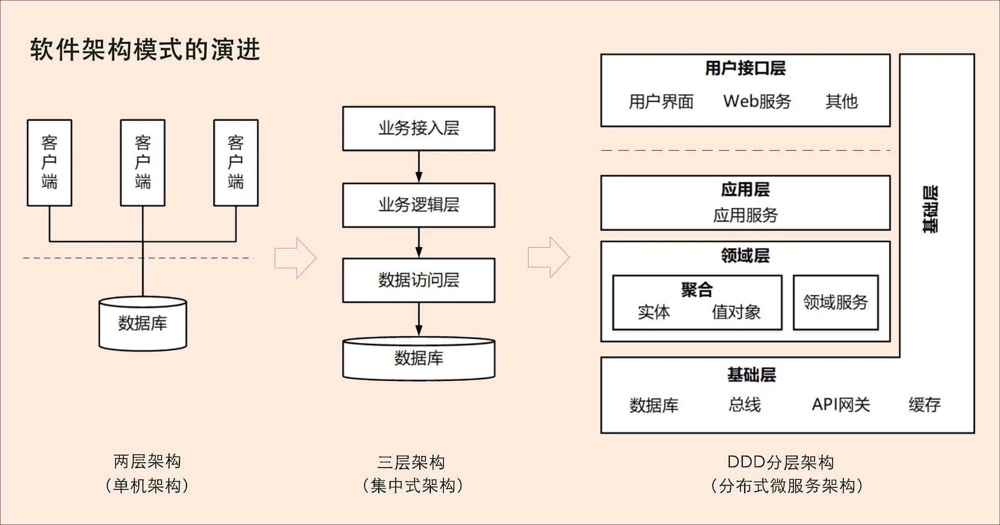

# 微服务为什么要选择DDD

架构就是业务的正交分解。DDD 是指导微服务架构的一种拆分方式，以一种领域驱动设计的架构思想。

原文链接：[01 | 领域驱动设计：微服务设计为什么要选择DDD？ (geekbang.org)](https://time.geekbang.org/column/article/149943)

## 软件架构模式的演进

## 微服务设计和拆分的困境

架构就是业务的正交分解。微服务这个概念从诞生开始，并没有一种指导微服务架构拆解的方案。当然业务的拆分和业务密切相关，并没有一种通用的解决方案。

微服务拆分困境产生的根本原因就是不知道业务或者微服务的边界到底在什么地方。换句话说，确定了业务边界和应用边界，这个困境也就迎刃而解了。

**DDD 核心思想是通过领域驱动设计方法定义领域模型，从而确定业务和应用边界，保证业务模型与代码模型的一致性（接口要自然体现业务需求，业务就是业务数据 + 接口）**。

利用 DDD 设计方法来建立领域模型，划分领域边界，再根据这些领域边界从业务视角来划分微服务边界。而按照 DDD 方法设计出的微服务的业务和应用边界都非常合理，可以很好地实现微服务内部和外部的“高内聚、低耦合”。于是越来越多的人开始把 DDD 作为微服务设计的指导思想。

## DDD 是什么？

DDD 是一种处理高度复杂领域的设计思想，它试图分离技术实现的复杂性，并围绕业务概念构建领域模型来控制业务的复杂性，以解决软件难以理解，难以演进的问题。DDD 不是架构，而是一种架构设计方法论，它通过边界划分将复杂业务领域简单化，帮我们设计出清晰的领域和应用边界，可以很容易地实现架构演进。

DDD 包括战略设计和战术设计两部分。

战略设计主要从业务视角出发，建立业务领域模型，划分领域边界，建立通用语言的限界上下文，限界上下文可以作为微服务设计的参考边界。

战术设计则从技术视角出发，侧重于领域模型的技术实现，完成软件开发和落地，包括：聚合根、实体、值对象、领域服务、应用服务和资源库等代码逻辑的设计和实现。

DDD 战略设计会建立领域模型，领域模型可以用于指导微服务的设计和拆分。

事件风暴是建立领域模型的主要方法，它是一个从发散到收敛的过程。它通常采用用例分析、场景分析和用户旅程分析，尽可能全面不遗漏地分解业务领域，并梳理领域对象之间的关系，这是一个发散的过程。事件风暴过程会产生很多的实体、命令、事件等领域对象，我们将这些领域对象从不同的维度进行聚类，形成如聚合、限界上下文等边界，建立领域模型，这就是一个收敛的过程。

我们可以用三步来划定领域模型和微服务的边界：

- 第一步：在事件风暴中梳理业务过程中的用户操作、事件以及外部依赖关系等，根据这些要素梳理出领域实体等领域对象。
- 第二步：根据领域实体之间的业务关联性，将业务紧密相关的实体进行组合形成聚合，同时确定聚合中的聚合根、值对象和实体。在这个图里，聚合之间的边界是第一层边界，它们在同一个微服务实例中运行，这个边界是逻辑边界，所以用虚线表示。
- 第三步：根据业务及语义边界等因素，将一个或者多个聚合划定在一个限界上下文内，形成领域模型。在这个图里，限界上下文之间的边界是第二层边界，这一层边界可能就是未来微服务的边界，不同限界上下文内的领域逻辑被隔离在不同的微服务实例中运行，物理上相互隔离，所以是物理边界，边界之间用实线来表示。

在从业务模型向微服务落地的过程中，也就是从战略设计向战术设计的实施过程中，我们会将领域模型中的领域对象与代码模型中的代码对象建立映射关系，将业务架构和系统架构进行绑定。当我们去响应业务变化调整业务架构和领域模型时，系统架构也会同时发生调整，并同步建立新的映射关系。

## DDD 与微服务的关系

DDD 是一种架构设计方法，微服务是一种架构风格，两者从本质上都是为了追求高响应力，而从业务视角去分离应用系统建设复杂度的手段。**两者都强调从业务出发，其核心要义是强调根据业务发展，合理划分领域边界，持续调整现有架构，优化现有代码，以保持架构和代码的生命力，也就是我们常说的演进式架构。**

业务是不断发展变化的，用这种渐进式架构的不变思想去应对变化的架构。应对业务需求的变化，遵循开闭原则，最好的结构应该是： 最小化的核心系统 + 多个彼此正交的周边系统。

DDD 主要关注：从业务领域视角划分领域边界，构建通用语言进行高效沟通，通过业务抽象，建立领域模型，维持业务和代码的逻辑一致性。

微服务主要关注：运行时的进程间通信、容错和故障隔离，实现去中心化数据管理和去中心化服务治理，关注微服务的独立开发、测试、构建和部署。