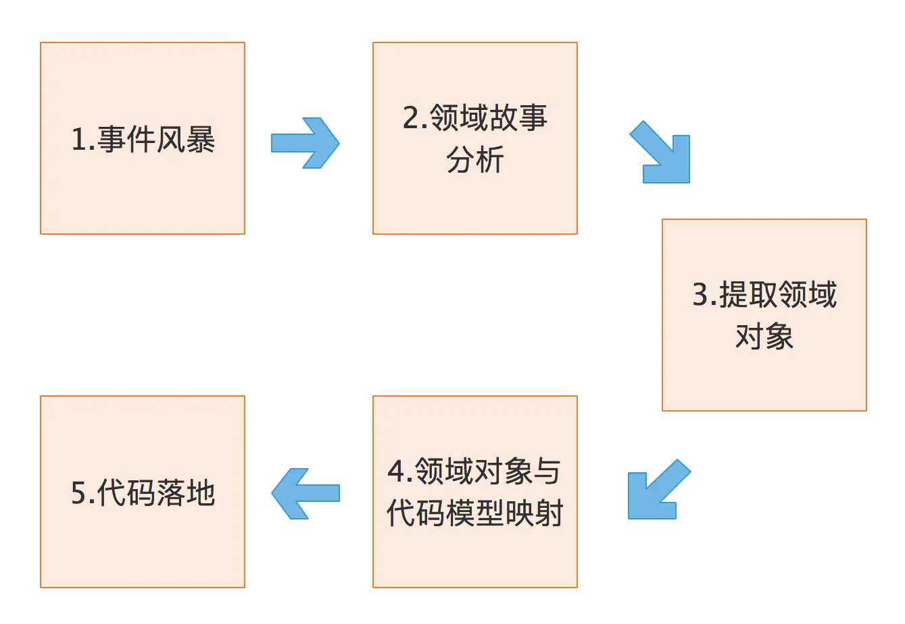
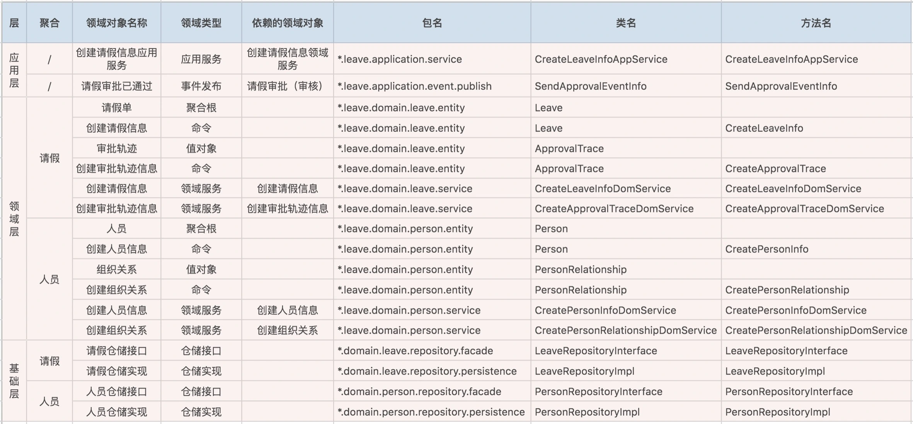

# 限界上下文：定义领域边界的利器

原文链接：[03 | 限界上下文：定义领域边界的利器 (geekbang.org)](https://time.geekbang.org/column/article/149950)

在 DDD 领域建模和系统建设过程中，有很多的参与者，包括领域专家、产品经理、项目经理、架构师、开发经理和测试经理等。对同样的领域知识，不同的参与角色可能会有不同的理解，那大家交流起来就会有障碍，怎么办呢？

因此，在 DDD 中就出现了“通用语言”和“限界上下文”这两个重要的概念。这两者相辅相成，通用语言定义上下文含义，限界上下文则定义领域边界，以确保每个上下文含义在它特定的边界内都具有唯一的含义，领域模型则存在于这个边界之内。

## 通用语言

> **让更多人参与到决策形成的过程现场，是更好的共识达成的方式。通过同步足够充分的信息，通过共创而非传达决策的方式让结论自然产生**。

团队的协同共识是否重要，如果能在项目进行之初形成团队的通用语言就再好不过了。换句话说，通用语言是团队达成共识的产物之一。

怎么理解通用语言这个概念呢？在事件风暴过程中，通过团队交流达成共识的，能够简单、清晰、准确描述业务涵义和规则的语言就是通用语言。

通用语言包含术语和用例场景，并且能够直接反映在代码中。通用语言中的名词可以给领域对象命名，如商品、订单等，对应实体对象；而动词则表示一个动作或事件，如商品已下单、订单已付款等，对应领域事件或者命令。

通用语言贯穿 DDD 的整个设计过程。作为项目团队沟通和协商形成的统一语言，基于它，你就能够开发出可读性更好的代码，将业务需求准确转化为代码设计。

通用语言不仅能够帮助团队形成共识，贯穿真个 DDD 的设计过程，还能减少团队之间协作沟通的成本，提供产品的开发效率。

下面这张图，这张图描述了从事件风暴建立通用语言到领域对象设计和代码落地的完整过程：

- 在事件风暴的过程中，领域专家会和设计、开发人员一起建立领域模型，在领域建模的过程中会形成**通用的业务术语和用户故事**。事件风暴也是一个项目团队统一语言的过程。
- 通过用户故事分析会形成一个个的领域对象，这些领域对象对应领域模型的业务对象，每一个业务对象和领域对象都有通用的名词术语，并且一一映射。
- 微服务代码模型来源于领域模型，每个代码模型的代码对象跟领域对象一一对应。

设计过程中我们可以用一些表格，来记录事件风暴和微服务设计过程中产生的领域对象及其属性。比如，领域对象在 DDD 分层架构中的位置、属性、依赖关系以及与代码模型对象的映射关系等。如下：

DDD 分析和设计过程中的每一个环节都需要保证限界上下文内术语的统一，在代码模型设计的时侯就要建立领域对象和代码对象的一一映射，从而保证业务模型和代码模型的一致，实现业务语言与代码语言的统一。

## 限界上下文

我们知道语言都有它的语义环境，同样，通用语言也有它的上下文环境。为了避免同样的概念或语义在不同的上下文环境中产生歧义，DDD 在战略设计上提出了“限界上下文”这个概念，用来确定语义所在的领域边界。

我们可以将限界上下文拆解为两个词：限界和上下文。限界就是领域的边界，而上下文则是语义环境。通过领域的限界上下文，我们就可以在统一的领域边界内用统一的语言进行交流。

综合一下，我认为限界上下文的定义就是：用来封装通用语言和领域对象，提供上下文环境，保证在领域之内的一些术语、业务相关对象等（通用语言）有一个确切的含义，没有二义性。这个边界定义了模型的适用范围，使团队所有成员能够明确地知道什么应该在模型中实现，什么不应该在模型中实现。

比如，电商领域的商品一样，商品在不同的阶段有不同的术语，在销售阶段是商品，而在运输阶段则变成了货物。同样的一个东西，由于业务领域的不同，赋予了这些术语不同的涵义和职责边界，这个边界就可能会成为未来微服务设计的边界。看到这，我想你应该非常清楚了，领域边界就是通过限界上下文来定义的。

