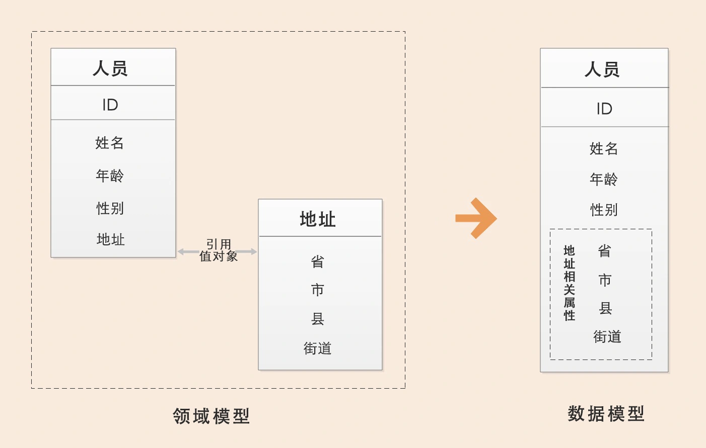
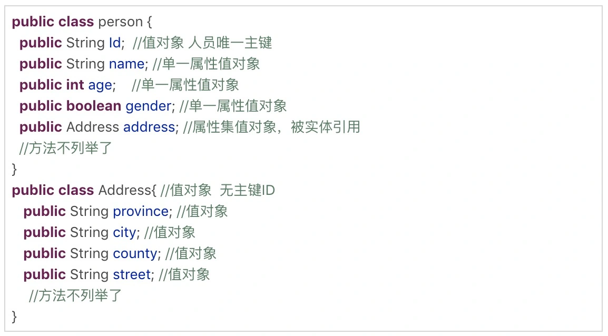
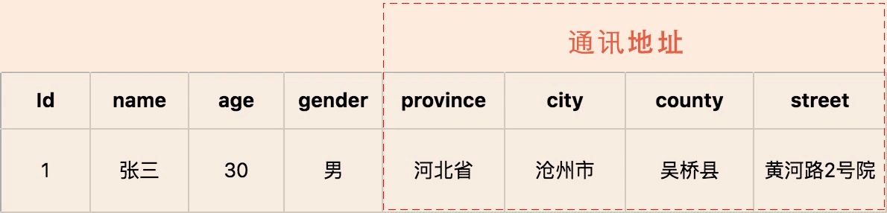
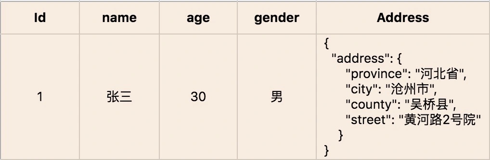

# 实体和值对象：从领域模型的基础单元看系统设计

原文链接：[04 | 实体和值对象：从领域模型的基础单元看系统设计 (geekbang.org)](https://time.geekbang.org/column/article/152677)

接口要自然体现业务。

实体和值对象是领域模型中的领域对象。

## 实体

在 DDD 中有这样一类对象，它们拥有唯一标识符，且标识符在历经各种状态变更后仍能保持一致。对这些对象而言，重要的不是其属性，而是其延续性和标识，对象的延续性和标识会跨越甚至超出软件的生命周期。我们把这样的对象称为实体。

### 实体的业务形态

在 DDD 不同的设计过程中，实体的形态是不同的。在战略设计时，实体是领域模型的一个重要对象。领域模型中的实体是多个属性、操作或行为的载体。在事件风暴中，我们可以根据命令、操作或者事件，找出产生这些行为的业务实体对象，进而按照一定的业务规则将依存度高和业务关联紧密的多个实体对象和值对象进行聚类，形成聚合。你可以这么理解，实体和值对象是组成领域模型的基础单元。

### 实体的代码形态

在代码模型中，实体的表现形式是实体类，这个类包含了实体的属性和方法，通过这些方法实现实体自身的业务逻辑。**在 DDD 里，这些实体类通常采用充血模型，与这个实体相关的所有业务逻辑都在实体类的方法中实现，跨多个实体的领域逻辑则在领域服务中实现**。

### 实体的运行形态

实体以 DO（领域对象）的形式存在，每个实体对象都有唯一的 ID。我们可以对一个实体对象进行多次修改，修改后的数据和原来的数据可能会大不相同。但是，由于它们拥有相同的 ID，它们依然是同一个实体。比如商品是商品上下文的一个实体，通过唯一的商品 ID 来标识，不管这个商品的数据如何变化，商品的 ID 一直保持不变，它始终是同一个商品。

### 实体的数据库形态

与传统数据模型设计优先不同，DDD 是先构建领域模型，针对实际业务场景构建实体对象和行为，再将实体对象映射到数据持久化对象。

在领域模型映射到数据模型时，一个实体可能对应 0 个、1 个或者多个数据库持久化对象。大多数情况下实体与持久化对象是一对一。在某些场景中，有些实体只是暂驻静态内存的一个运行态实体，它不需要持久化。比如，基于多个价格配置数据计算后生成的折扣实体。

而在有些复杂场景下，实体与持久化对象则可能是一对多或者多对一的关系。比如，用户 user 与角色 role 两个持久化对象可生成权限实体，一个实体对应两个持久化对象，这是一对多的场景。再比如，有些场景为了避免数据库的联表查询，提升系统性能，会将客户信息 customer 和账户信息 account 两类数据保存到同一张数据库表中，客户和账户两个实体可根据需要从一个持久化对象中生成，这就是多对一的场景。

## 值对象

通过对象属性值来识别的对象，它将多个相关属性组合为一个概念整体。在 DDD 中用来描述领域的特定方面，并且是一个没有标识符的对象，叫作值对象。

也就说，**值对象描述了领域中的一件东西，这个东西是不可变的，它将不同的相关属性组合成了一个概念整体。当度量和描述改变时，可以用另外一个值对象予以替换。它可以和其它值对象进行相等性比较，且不会对协作对象造成副作用**。

简单来说，值对象本质上就是一个集。那这个集合里面有什么呢？若干个用于描述目的、具有整体概念和不可修改的属性。那这个集合存在的意义又是什么？在领域建模的过程中，值对象可以保证属性归类的清晰和概念的完整性，避免属性零碎。

人员实体原本包括：姓名、年龄、性别以及人员所在的省、市、县和街道等属性。这样显示地址相关的属性就很零碎了对不对？现在，我们可以将“省、市、县和街道等属性”拿出来构成一个“地址属性集合”，这个集合就是值对象了。

### 值对象的业务形态

值对象是 DDD 领域模型中的一个基础对象，它跟实体一样都来源于事件风暴所构建的领域模型，都包含了若干个属性，它与实体一起构成聚合。

我们不妨对照实体，来看值对象的业务形态，这样更好理解。本质上，实体是看得到、摸得着的实实在在的业务对象，实体具有业务属性、业务行为和业务逻辑。而值对象只是若干个属性的集合，只有数据初始化操作和有限的不涉及修改数据的行为，基本不包含业务逻辑。值对象的属性集虽然在物理上独立出来了，但在逻辑上它仍然是实体属性的一部分，用于描述实体的特征。

在值对象中也有部分共享的标准类型的值对象，它们有自己的限界上下文，有自己的持久化对象，可以建立共享的数据类微服务，比如数据字典。

### 值对象的代码形态

值对象在代码中有这样两种形态。如果值对象是单一属性，则直接定义为实体类的属性；如果值对象是属性集合，则把它设计为 Class 类，Class 将具有整体概念的多个属性归集到属性集合，这样的值对象没有 ID，会被实体整体引用。如下所示：

### 值对象的运行形态

实体实例化后的 DO 对象的业务属性和业务行为非常丰富，但值对象实例化的对象则相对简单和乏味。除了值对象数据初始化和整体替换的行为外，其它业务行为就很少了。

值对象嵌入到实体表的话，有这样两种不同的数据格式，也可以说是两种方式，分别是属性嵌入的方式和序列化大对象的方式。

- 引用单一属性的值对象或只有一条记录的多属性值对象的实体，可以采用属性嵌入的方式嵌入。如：

  

- 引用一条或多条记录的多属性值对象的实体，可以采用序列化大对象的方式嵌入。比如，人员实体可以有多个通讯地址，多个地址序列化后可以嵌入人员的地址属性。值对象创建后就不允许修改了，只能用另外一个值对象来整体替换。

  

### 值对象的数据库形态

DDD 引入值对象是希望实现从“数据建模为中心”向“领域建模为中心”转变，减少数据库表的数量和表与表之间复杂的依赖关系，尽可能地简化数据库设计，提升数据库性能。

如何理解用值对象来简化数据库设计呢？

传统的数据建模大多是根据数据库范式设计的，每一个数据库表对应一个实体，每一个实体的属性值用单独的一列来存储，一个实体主表会对应 N 个实体从表。而值对象在数据库持久化方面简化了设计，它的数据库设计大多采用非数据库范式，值对象的属性值和实体对象的属性值保存在同一个数据库实体表中。

那到底应该怎样设计，才能让业务含义清楚，同时又不让数据库变得复杂呢？

我们可以综合这两个方案的优势，扬长避短。在领域建模时，我们可以把地址作为值对象，人员作为实体，这样就可以保留地址的业务涵义和概念完整性。而在数据建模时，我们可以将地址的属性值嵌入人员实体数据库表中，只创建人员数据库表。这样既可以兼顾业务含义和表达，又不增加数据库的复杂度。

值对象就是通过这种方式，简化了数据库设计，总结一下就是：在领域建模时，我们可以将部分对象设计为值对象，保留对象的业务涵义，同时又减少了实体的数量；在数据建模时，我们可以将值对象嵌入实体，减少实体表的数量，简化数据库设计。

### 值对象的优势和局限

值对象是一把双刃剑，它的优势是可以简化数据库设计，提升数据库性能。但如果值对象使用不当，它的优势就会很快变成劣势。

值对象采用序列化大对象的方法简化了数据库设计，减少了实体表的数量，可以简单、清晰地表达业务概念。这种设计方式虽然降低了数据库设计的复杂度，但却无法满足基于值对象的快速查询，会导致搜索值对象属性值变得异常困难。

值对象采用属性嵌入的方法提升了数据库的性能，但如果实体引用的值对象过多，则会导致实体堆积一堆缺乏概念完整性的属性，这样值对象就会失去业务涵义，操作起来也不方便。

## 实体和值对象的关系

实体和值对象是微服务底层的最基础的对象，一起实现实体最基本的核心领域逻辑。

值对象和实体在某些场景下可以互换，很多 DDD 专家在这些场景下，其实也很难判断到底将领域对象设计成实体还是值对象？可以说，值对象在某些场景下有很好的价值，但是并不是所有的场景都适合值对象。你需要根据团队的设计和开发习惯，以及上面的优势和局限分析，选择最适合的方法。

关于值对象，我还要多说几句。其实，DDD 引入值对象还有一个重要的原因，就是到底领域建模优先还是数据建模优先？

DDD 提倡从领域模型设计出发，而不是先设计数据模型。前面讲过了，传统的数据模型设计通常是一个表对应一个实体，一个主表关联多个从表，当实体表太多的时候就很容易陷入无穷无尽的复杂的数据库设计，领域模型就很容易被数据模型绑架。可以说，值对象的诞生，在一定程度上，和实体是互补的。

两者都经过属性聚类形成，实体有唯一性，值对象没有。在本文案例的限界上下文中，人员有唯一性，一旦某个人员被系统纳入管理，它就被赋予了在事件、流程和操作中被唯一识别的能力，而值对象没有也不必具备唯一性。
实体着重唯一性和延续性，不在意属性的变化，属性全变了，它还是原来那个它；值对象着重描述性，对属性的变化很敏感，属性变了，它就不是那个它了。
战略上的思考框架稳定不变，战术上的模型设计却灵活多变，实体和值对象也有可能随着系统业务关注点的不同而更换位置。比如，如果换一个特殊的限界上下文，这个上下文更关注地址，而不那么关注与这个地址产生联系的人员，那么就应该把地址设计成实体，而把人员设计成值对象。