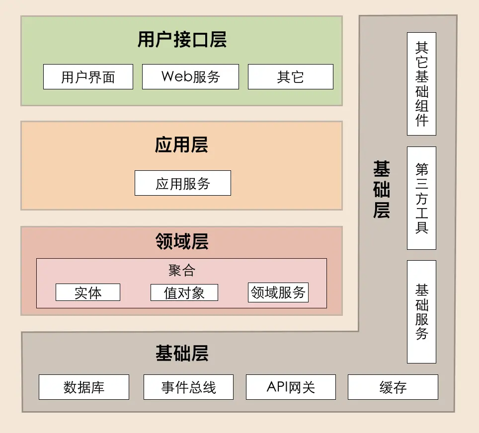

# DDD 分层架构

原文链接：[07 | DDD分层架构：有效降低层与层之间的依赖 (geekbang.org)](https://time.geekbang.org/column/article/156849)

- 用户接口层

  用户接口层负责向用户显示信息和解释用户指令。这里的用户可能是：用户、程序、自动化测试和批处理脚本等等。

- 应用层

  应用层是很薄的一层，理论上不应该有业务规则或逻辑，主要面向用例和流程相关的操作。

  但应用层又位于领域层之上，因为领域层包含多个聚合，所以它可以协调多个聚合的服务和领域对象完成服务编排和组合，协作完成业务操作。此外，应用层也是微服务之间交互的通道，它可以调用其它微服务的应用服务，完成微服务之间的服务组合和编排。

  这里我要提醒你一下：**在设计和开发时，不要将本该放在领域层的业务逻辑放到应用层中实现**。因为庞大的应用层会使领域模型失焦，时间一长你的微服务就会演化为传统的三层架构，业务逻辑会变得混乱。另外，应用服务是在应用层的，它负责服务的组合、编排和转发，负责处理业务用例的执行顺序以及结果的拼装，以粗粒度的服务通过 API 网关向前端发布。还有，应用服务还可以进行安全认证、权限校验、事务控制、发送或订阅领域事件等。

- 领域层

  领域层的作用是实现企业核心业务逻辑，通过各种校验手段保证业务的正确性。领域层主要体现领域模型的业务能力，它用来表达业务概念、业务状态和业务规则。

  领域层包含聚合根、实体、值对象、领域服务等领域模型中的领域对象。

  这里我要特别解释一下其中几个领域对象的关系，以便你在设计领域层的时候能更加清楚。首先，领域模型的业务逻辑主要是由实体和领域服务来实现的，其中实体会采用充血模型来实现所有与之相关的业务功能。其次，你要知道，实体和领域服务在实现业务逻辑上不是同级的，当领域中的某些功能，单一实体（或者值对象）不能实现时，领域服务就会出马，它可以组合聚合内的多个实体（或者值对象），实现复杂的业务逻辑。

- 基础层

  基础层是贯穿所有层的，它的作用就是为其它各层提供通用的技术和基础服务，包括第三方工具、驱动、消息中间件、网关、文件、缓存以及数据库等。比较常见的功能还是提供数据库持久化。

  基础层包含基础服务，它采用依赖倒置设计，封装基础资源服务，实现应用层、领域层与基础层的解耦，降低外部资源变化对应用的影响。

  比如说，在传统架构设计中，由于上层应用对数据库的强耦合，很多公司在架构演进中最担忧的可能就是换数据库了，因为一旦更换数据库，就可能需要重写大部分的代码，这对应用来说是致命的。那采用依赖倒置的设计以后，应用层就可以通过解耦来保持独立的核心业务逻辑。当数据库变更时，我们只需要更换数据库基础服务就可以了，这样就将资源变更对应用的影响降到了最低。

## DDD 分层原则

DDD 分层架构有一个重要的原则：每层只能与位于其下方的层发生耦合。

而架构根据耦合的紧密程度又可以分为两种：严格分层架构和松散分层架构。

在严格分层架构中，领域服务只能被应用服务调用，而应用服务只能被用户接口层调用，服务是逐层对外封装或组合的，依赖关系清晰。而在松散分层架构中，领域服务可以同时被应用层或用户接口层调用，服务的依赖关系比较复杂且难管理，甚至容易使核心业务逻辑外泄。

## DDD 分层架构如何推动架构演进

领域模型不是一成不变的，因为业务的变化会影响领域模型，而领域模型的变化则会影响微服务的功能和边界。那我们该如何实现领域模型和微服务的同步演进呢？

### 微服务架构的演进

通过基础篇的讲解，我们知道：领域模型中对象的层次从内到外依次是：值对象、实体、聚合和限界上下文。

实体或值对象的简单变更，一般不会让领域模型和微服务发生大的变化。但聚合的重组或拆分却可以。这是因为聚合内业务功能内聚，能独立完成特定的业务逻辑。那聚合的重组或拆分，势必就会引起业务模块和系统功能的变化了。

这里我们可以以聚合为基础单元，完成领域模型和微服务架构的演进。聚合可以作为一个整体，在不同的领域模型之间重组或者拆分，或者直接将一个聚合独立为微服务。如下所示：

- 当你发现微服务 1 中聚合 a 的功能经常被高频访问，以致拖累整个微服务 1 的性能时，我们可以把聚合 a 的代码，从微服务 1 中剥离出来，独立为微服务 2。这样微服务 2 就可轻松应对高性能场景。
- 在业务发展到一定程度以后，你会发现微服务 3 的领域模型有了变化，聚合 d 会更适合放到微服务 1 的领域模型中。这时你就可以将聚合 d 的代码整体搬迁到微服务 1 中。如果你在设计时已经定义好了聚合之间的代码边界，这个过程不会太复杂，也不会花太多时间。
- 最后我们发现，在经历模型和架构演进后，微服务 1 已经从最初包含聚合 a、b、c，演进为包含聚合 b、c、d 的新领域模型和微服务了。

### 微服务内服务的演进

在微服务内部，实体的方法被领域服务组合和封装，领域服务又被应用服务组合和封装。在服务逐层组合和封装的过程中，你会发现这样一个有趣的现象。

我们看下上面这张图。在服务设计时，你并不一定能完整预测有哪些下层服务会被多少个上层服务组装，因此领域层通常只提供一些原子服务，比如领域服务 a、b、c。但随着系统功能增强和外部接入越来越多，应用服务会不断丰富。有一天你会发现领域服务 b 和 c 同时多次被多个应用服务调用了，执行顺序也基本一致。这时你可以考虑将 b 和 c 合并，再将应用服务中 b、c 的功能下沉到领域层，演进为新的领域服务（b+c）。这样既减少了服务的数量，也减轻了上层服务组合和编排的复杂度。

## 三层架构如何演进到 DDD 分层架构

三层架构向 DDD 分层架构演进，主要发生在业务逻辑层和数据访问层。

DDD 分层架构在用户接口层引入了 DTO，给前端提供了更多的可使用数据和更高的展示灵活性。

DDD 分层架构对三层架构的业务逻辑层进行了更清晰的划分，改善了三层架构核心业务逻辑混乱，代码改动相互影响大的情况。DDD 分层架构将业务逻辑层的服务拆分到了应用层和领域层。应用层快速响应前端的变化，领域层实现领域模型的能力。

数据访问层和基础层之间。三层架构数据访问采用 DAO 方式；DDD 分层架构的数据库等基础资源访问，采用了仓储（Repository）设计模式，通过依赖倒置实现各层对基础资源的解耦。

仓储又分为两部分：仓储接口和仓储实现。仓储接口放在领域层中，仓储实现放在基础层。原来三层架构通用的第三方工具包、驱动、Common、Utility、Config 等通用的公共的资源类统一放到了基础层。

DDD中主要有一下几类对象：

- 数据持久化对象 (Persistent Object， PO)，与数据库结构一一映射，它是数据持久化过程中的数据载体。
- 领域对象（ Domain Object， DO），微服务运行时核心业务对象的载体， DO 一般包括实体或值对象。
- 数据传输对象（ Data Transfer Object， DTO），用于前端应用与微服务应用层或者微服务之间的数据组装和传输，是应用之间数据传输的载体。
- 视图对象（View Object， VO），用于封装展示层指定页面或组件的数据。

微服务基础层的主要数据对象是 PO。在设计时，我们需要先建立 DO 和 PO 的映射关系。大多数情况下 DO 和 PO 是一一对应的。但也有 DO 和 PO 多对多的情况。在 DO 和 PO 数据转换时，需要进行数据重组。对于 DO 对象较多复杂的数据转换操作，你可以在聚合用工厂模式来实现。
当 DO 数据需要持久化时，先将 DO 转换为 PO 对象，由仓储实现服务完成数据库持久化操作。当 DO 需要构建和数据初始化时，仓储实现服务先从数据库获取 PO 对象，将 PO 转换为 DO 后，完成 DO 数据构建和初始化。

领域层主要是 DO 对象。DO 是实体和值对象的数据和业务行为载体，承载着基础的核心业务逻辑，多个依赖紧密的 DO 对象构成聚合。领域层 DO 对象在持久化时需要转换为 PO 对象。
应用层主要对象有 DO 对象，但也可能会有 DTO 对象。应用层在进行不同聚合的领域服务编排时，一般建议采用聚合根 ID 的引用方式，应尽量避免不同聚合之间的 DO 对象直接引用，避免聚合之间产生依赖。在涉及跨微服务的应用服务调用时，在调用其他微服务的应用服务前，DO 会被转换为 DTO，完成跨微服务的 DTO数据组装，因此会有 DTO 对象。

在前端调用后端应用服务时，用户接口层先完成 DTO 到 DO 的转换，然后 DO 作为应用服务的参数，传导到领域层完成业务逻辑处理。

facade 接口服务在完成后端应用服务封装后，会对多个 DO 对象进行组装，转换为 DTO 对象，向前端应用完成数据转换和传输。
facade 接口服务在接收到前端应用传入的 DTO 后，完成 DTO 向多个 DO 对象的转换，调用后端应用服务完成业务逻辑处理。
前端应用主要是 VO 对象。展现层使用 VO 进行界面展示，通过用户接口层与应用层采用 DTO 对象进行数据交互。