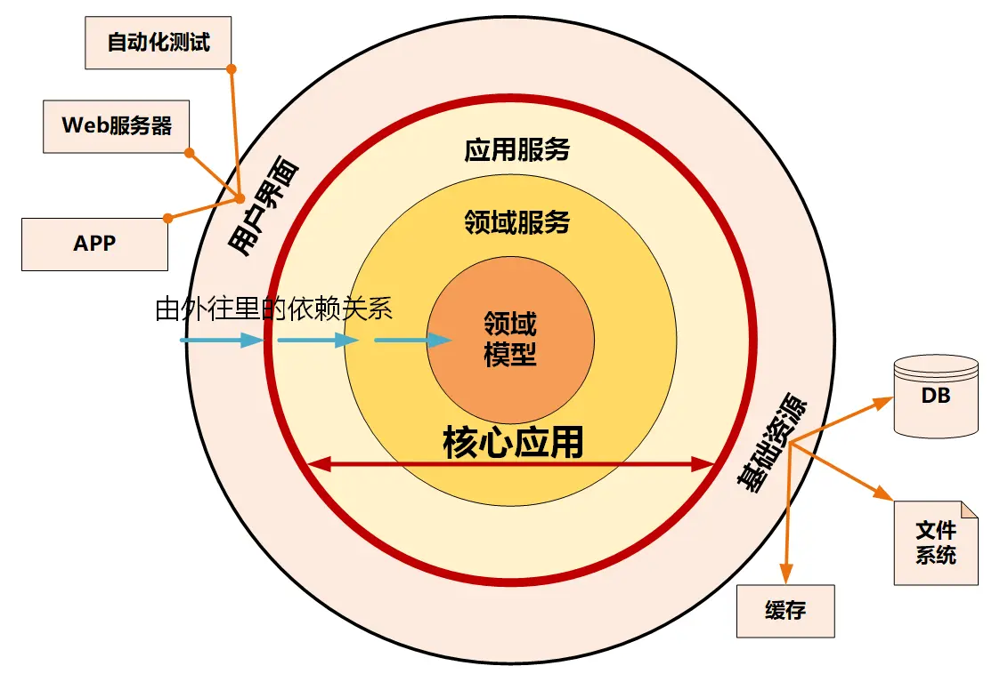
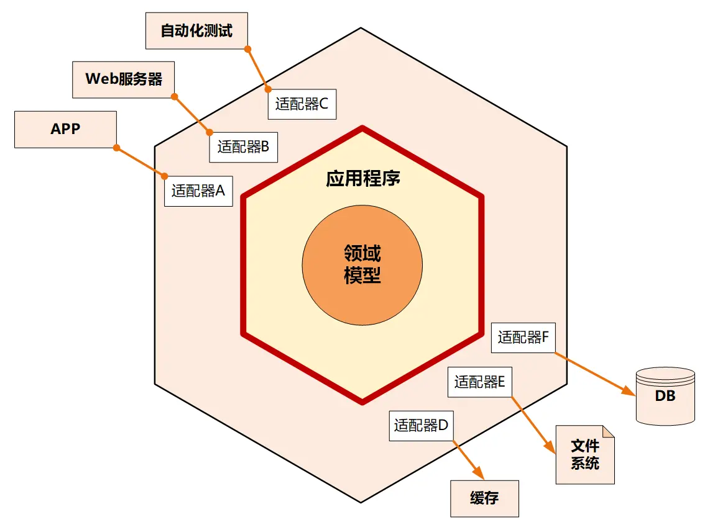
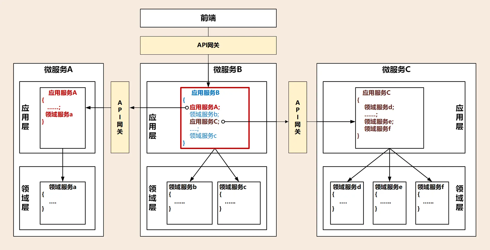
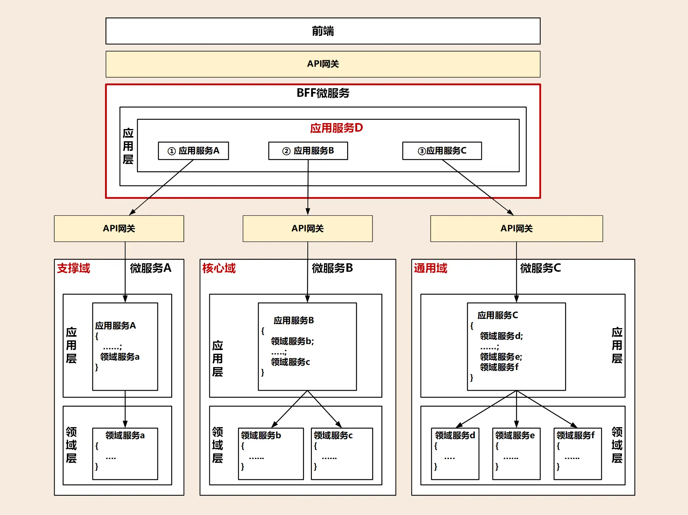

# 微服务架构模型：几种常见模型的对比和分析

原文链接：[08 | 微服务架构模型：几种常见模型的对比和分析 (geekbang.org)](https://time.geekbang.org/column/article/158248)

## 整洁架构

整洁架构又名“洋葱架构”。为什么叫它洋葱架构？看看下面这张图你就明白了。整洁架构的层就像洋葱片一样，它体现了分层的设计思想。

在整洁架构里，同心圆代表应用软件的不同部分，从里到外依次是领域模型、领域服务、应用服务和最外围的容易变化的内容，比如用户界面和基础设施。

整洁架构最主要的原则是依赖原则，它定义了各层的依赖关系，越往里依赖越低，代码级别越高，越是核心能力。外圆代码依赖只能指向内圆，内圆不需要知道外圆的任何情况。

在洋葱架构中，各层的职能是这样划分的：

- 领域模型实现领域内核心业务逻辑，它封装了企业级的业务规则。领域模型的主体是实体，一个实体可以是一个带方法的对象，也可以是一个数据结构和方法集合。
- 领域服务实现涉及多个实体的复杂业务逻辑。
- 应用服务实现与用户操作相关的服务组合与编排，它包含了应用特有的业务流程规则，封装和实现了系统所有用例。
- 最外层主要提供适配的能力，适配能力分为主动适配和被动适配。主动适配主要实现外部用户、网页、批处理和自动化测试等对内层业务逻辑访问适配。被动适配主要是实现核心业务逻辑对基础资源访问的适配，比如数据库、缓存、文件系统和消息中间件等。
- 红圈内的领域模型、领域服务和应用服务一起组成软件核心业务能力。

## 六边形架构

六边形架构又名“端口适配器架构”。追溯微服务架构的渊源，一般都会涉及到六边形架构。

六边形架构的核心理念是：应用是通过端口与外部进行交互的。我想这也是微服务架构下 API 网关盛行的主要原因吧。

也就是说，在上图的六边形架构中，红圈内的核心业务逻辑（应用程序和领域模型）与外部资源（包括 APP、Web 应用以及数据库资源等）完全隔离，仅通过适配器进行交互。它解决了业务逻辑与用户界面的代码交错问题，很好地实现了前后端分离。六边形架构各层的依赖关系与整洁架构一样，都是由外向内依赖。

六边形架构将系统分为内六边形和外六边形两层，这两层的职能划分如下：

- 红圈内的六边形实现应用的核心业务逻辑；
- 外六边形完成外部应用、驱动和基础资源等的交互和访问，对前端应用以 API 主动适配的方式提供服务，对基础资源以依赖倒置被动适配的方式实现资源访问。

六边形架构的一个端口可能对应多个外部系统，不同的外部系统也可能会使用不同的适配器，由适配器负责协议转换。这就使得应用程序能够以一致的方式被用户、程序、自动化测试和批处理脚本使用。

## 三种微服务架构模型的对比和分析

相对稳定的领域模型：

这三种架构都考虑了前端需求的变与领域模型的不变。需求变幻无穷，但变化总是有矩可循的，用户体验、操作习惯、市场环境以及管理流程的变化，往往会导致界面逻辑和流程的多变。但总体来说，不管前端如何变化，在企业没有大的变革的情况下，核心领域逻辑基本不会大变，所以领域模型相对稳定，而用例和流程则会随着外部应用需求而随时调整。把握好这个规律，我们就知道该如何设计应用层和领域层了。

外层依赖内层，单向依赖的严格分层思想：

架构模型通过分层的方式来控制需求变化从外到里对系统的影响，从外向里受需求影响逐步减小。面向用户的前端可以快速响应外部需求进行调整和发布，灵活多变，应用层通过服务组合和编排来实现业务流程的快速适配上线，减少传导到领域层的需求，使领域层保持长期稳定。

## 从三种架构模型看中台和微服务设计

中台本质上是领域的子域，它可能是核心域，也可能是通用域或支撑域。通常大家认为阿里的中台对应 DDD 的通用域，将通用的公共能力沉淀为中台，对外提供通用共享服务。中台作为子域还可以继续分解为子子域，在子域分解到合适大小，

通过事件风暴划分限界上下文以后，就可以定义微服务了，微服务用来实现中台的能力。表面上看，DDD、中台、微服务这三者之间似乎没什么关联，实际上它们的关系是非常紧密的，组合在一起可以作为一个理论体系用于你的中台和微服务设计。

### 中台建设要聚焦领域模型

中台需要站在全企业的高度考虑能力的共享和复用。

中台设计时，我们需要建立中台内所有限界上下文的领域模型，DDD 建模过程中会考虑架构演进和功能的重新组合。领域模型建立的过程会对业务和应用进行清晰的逻辑和物理边界（微服务）划分。领域模型的结果会影响到后续的系统模型、架构模型和代码模型，最终影响到微服务的拆分和项目落地。

因此，在中台设计中我们首先要聚焦领域模型，将它放在核心位置。

### 微服务要有合理的架构分层

微服务设计要有分层的设计思想，让各层各司其职，建立松耦合的层间关系。

不要把与领域无关的逻辑放在领域层实现，保证领域层的纯洁和领域逻辑的稳定，避免污染领域模型。也不要把领域模型的业务逻辑放在应用层，这样会导致应用层过于庞大，最终领域模型会失焦。如果实在无法避免，我们可以引入防腐层，进行新老系统的适配和转换，过渡期完成后，可以直接将防腐层代码抛弃。

微服务内部的分层方式我们已经清楚了，那微服务之间是否也有层次依赖关系呢？如何实现微服务之间的服务集成？

有的微服务可以与前端应用集成，一起完成特定的业务，这是项目级微服务。而有的则是某个职责单一的中台微服务，企业级的业务流程需要将多个这样的微服务组合起来才能完成，这是企业级中台微服务。两类微服务由于复杂度不一样，集成方式也会有差异。

## 微服务集成

### 项目级微服务

项目级微服务的内部遵循分层架构模型就可以了。领域模型的核心逻辑在领域层实现，服务的组合和编排在应用层实现，通过 API 网关为前台应用提供服务，实现前后端分离。但项目级的微服务可能会调用其它微服务，你看在下面这张图中，比如某个项目级微服务 B 调用认证微服务 A，完成登录和权限认证。

通常项目级微服务之间的集成，发生在微服务的应用层，由应用服务调用其它微服务发布在 API 网关上的应用服务。你看下图中微服务 B 中红色框内的应用服务 B，它除了可以组合和编排自己的领域服务外，还可以组合和编排外部微服务的应用服务。它只要将编排后的服务发布到 API 网关供前端调用，这样前端就可以直接访问自己的微服务了。

### 企业级中台微服务

企业级的业务流程往往是多个中台微服务一起协作完成的，那跨中台的微服务如何实现集成呢？

企业级中台微服务的集成不能像项目级微服务一样，在某一个微服务内完成跨微服务的服务组合和编排。

我们可以在中台微服务之上增加一层，你看下面这张图，增加的这一层就位于红色框内，它的主要职能就是处理跨中台微服务的服务组合和编排，以及微服务之间的协调，它还可以完成前端不同渠道应用的适配。如果再将它的业务范围扩大一些，我可以将它做成一个面向不同行业和渠道的服务平台。

我们不妨借用 BFF（服务于前端的后端，Backend for Frontends）这个词，暂且称它为 BFF 微服务。BFF 微服务与其它微服务存在较大的差异，就是它没有领域模型，因此这个微服务内也不会有领域层。BFF 微服务可以承担应用层和用户接口层的主要职能，完成各个中台微服务的服务组合和编排，可以适配不同前端和渠道的要求。

## 应用和资源的解耦与适配

传统以数据为中心的设计模式，应用会对数据库、缓存、文件系统等基础资源产生严重依赖。正是由于它们之间的这种强依赖的关系，我们一旦更换基础资源就会对应用产生很大的影响，因此需要为应用和资源解耦。

在微服务架构中，应用层、领域层和基础层解耦是通过仓储模式，采用依赖倒置的设计方法来实现的。在应用设计中，我们会同步考虑和基础资源的代码适配，那么一旦基础设施资源出现变更（比如换数据库），就可以屏蔽资源变更对业务代码的影响，切断业务逻辑对基础资源的依赖，最终降低资源变更对应用的影响。