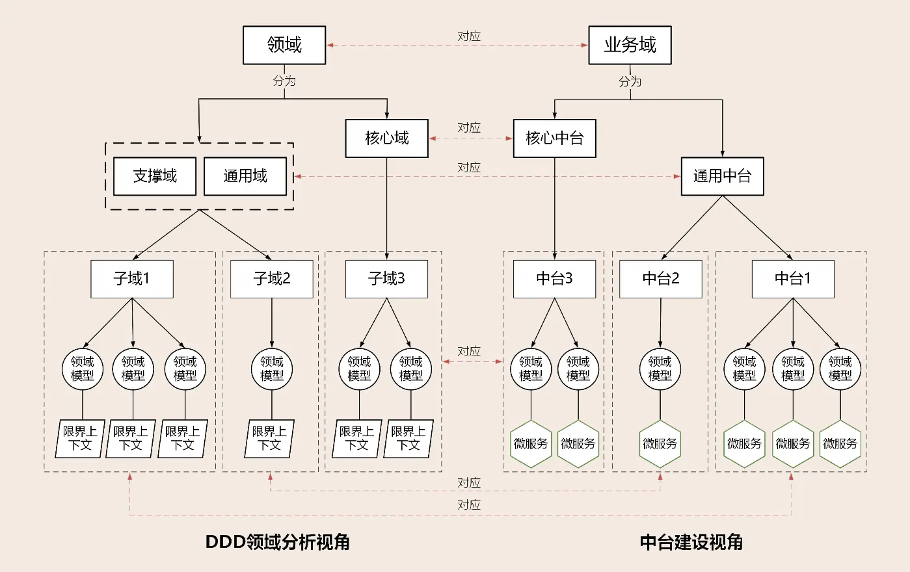
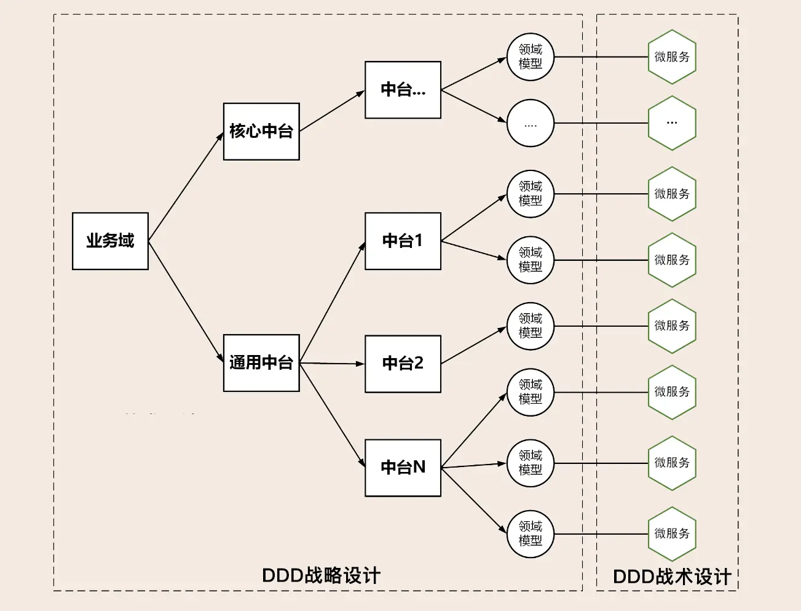

#  DDD、中台和微服务：它们是如何协作的？

原文链接：[10 | DDD、中台和微服务：它们是如何协作的？ (geekbang.org)](https://time.geekbang.org/column/article/161004)

凭什么 DDD 可以指导中台和微服务建设，究竟起到了什么作用呢？

DDD 有两把利器，那就是它的战略设计和战术设计方法。

中台在企业架构上更多偏向业务模型，形成中台的过程实际上也是业务领域不断细分的过程。在这个过程中我们会将同类通用的业务能力进行聚合和业务重构，再根据限界上下文和业务内聚的原则建立领域模型。而 DDD 的战略设计最擅长的就是领域建模。

那在中台完成领域建模后，我们就需要通过微服务来完成系统建设。此时，DDD 的战术设计又恰好可以与微服务的设计完美结合。可以说，中台和微服务正是 DDD 实战的最佳场景。

## DDD、中台和微服务的协作模式

实际上更多的企业还是会聚焦在传统企业中台建设的模式，也就是将通用能力与核心能力全部中台化，以满足不同渠道核心业务能力的复用，那么接下来我们就还是把重点放在传统企业上。

传统企业可以将需要共享的公共能力进行领域建模，建设可共享的通用中台。除此之外，传统企业还会将核心能力进行领域建模，建设面向不同渠道的可复用的核心中台。

而这里的通用中台和核心中台都属于我们上一讲讲到的业务中台的范畴。

如果将企业内整个业务域作为一个问题域的话，企业内的所有业务就是一个领域。在进行领域细分时，从 DDD 视角来看，子域可分为核心域、通用域和支撑域。从中台建设的视角来看，业务域细分后的业务中台，可分为核心中台和通用中台。

从领域功能属性和重要性对照来看，通用中台对应 DDD 的通用域和支撑域，核心中台对应 DDD 的核心域。从领域的功能范围来看，子域与中台是一致的。领域模型所在的限界上下文对应微服务。建立了这个映射关系，我们就可以用 DDD 来进行中台业务建模了。

当完成业务建模后，我们就可以采用 DDD 战术设计，设计出聚合、实体、领域事件、领域服务以及应用服务等领域对象，再利用分层架构模型完成微服务的设计。

## 中台如何建模？

中台业务抽象的过程就是业务建模的过程，对应 DDD 的战略设计。系统抽象的过程就是微服务的建设过程，对应 DDD 的战术设计。下面我们就结合 DDD 领域建模的方法，讲一下中台业务建模的过程。

- 第一步：按照业务流程（通常适用于核心域）或者功能属性、集合（通常适用于通用域或支撑域），将业务域细分为多个中台，再根据功能属性或重要性归类到核心中台或通用中台。核心中台设计时要考虑核心竞争力，通用中台要站在企业高度考虑共享和复用能力。
- 第二步：选取中台，根据用例、业务场景或用户旅程完成事件风暴，找出实体、聚合和限界上下文。依次进行领域分解，建立领域模型。
- 第三步：以主领域模型为基础，扫描其它中台领域模型，检查并确定是否存在重复或者需要重组的领域对象、功能，提炼并重构主领域模型，完成最终的领域模型设计。
- 第四步：选择其它主领域模型重复第三步，直到所有主领域模型完成比对和重构。
- 第五步：基于领域模型完成微服务设计，完成系统落地。

