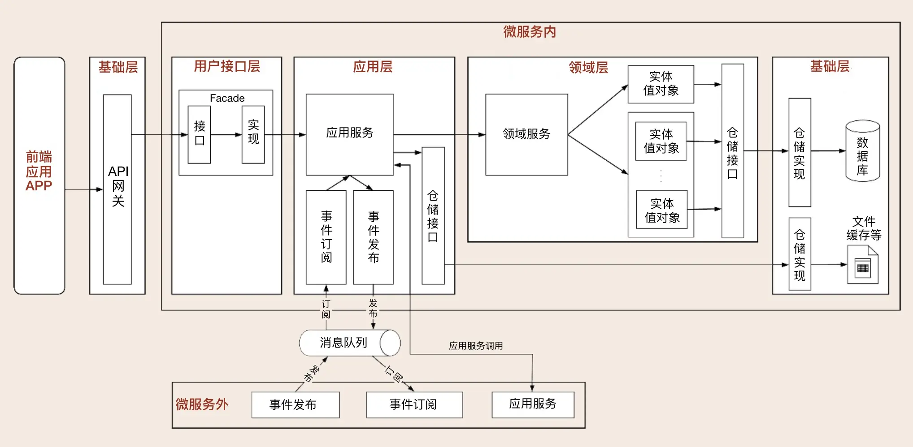
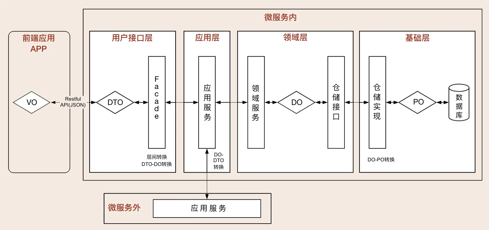

# 服务协作

原文链接：[16 | 视图：如何实现服务和数据在微服务各层的协作？ (geekbang.org)](https://time.geekbang.org/column/article/167710)

在 DDD 分层架构和微服务代码模型里，我们根据领域对象的属性和依赖关系，将领域对象进行分层，定义了与之对应的代码对象和代码目录结构。分层架构确定了微服务的总体架构，微服务内的主要对象有服务和实体等，它们一起协作完成业务逻辑。

那在运行过程中，这些服务和实体在微服务各层是如何协作的呢？今天我们就来解剖一下基于 DDD 分层架构的微服务，看看它的内部结构到底是什么样的。

## 服务的协作

### 服务的类型

按照分层架构设计出来的微服务，其内部有 Facade 服务、应用服务、领域服务和基础服务。各层服务的主要功能和职责如下。

Facade 服务：位于用户接口层，包括接口和实现两部分。用于处理用户发送的 Restful 请求和解析用户输入的配置文件等，并将数据传递给应用层。或者在获取到应用层数据后，将 DO 组装成 DTO，将数据传输到前端应用。

应用服务：位于应用层。用来表述应用和用户行为，负责服务的组合、编排和转发，负责处理业务用例的执行顺序以及结果拼装，对外提供粗粒度的服务。

领域服务：位于领域层。领域服务封装核心的业务逻辑，实现需要多个实体协作的核心领域逻辑。它对多个实体或方法的业务逻辑进行组合或编排，或者在严格分层架构中对实体方法进行封装，以领域服务的方式供应用层调用。

基础服务：位于基础层。提供基础资源服务（比如数据库、缓存等），实现各层的解耦，降低外部资源变化对业务应用逻辑的影响。基础服务主要为仓储服务，通过依赖倒置提供基础资源服务。领域服务和应用服务都可以调用仓储服务接口，通过仓储服务实现数据持久化。

### 服务的调用

我们看一下下面这张图。微服务的服务调用包括三类主要场景：微服务内跨层服务调用，微服务之间服务调用和领域事件驱动。

微服务内跨层服务调用

微服务架构下往往采用前后端分离的设计模式，前端应用独立部署。前端应用调用发布在 API 网关上的 Facade 服务，Facade 定向到应用服务。应用服务作为服务组织和编排者，它的服务调用有这样两种路径：

- 第一种是应用服务调用并组装领域服务。此时领域服务会组装实体和实体方法，实现核心领域逻辑。领域服务通过仓储服务获取持久化数据对象，完成实体数据初始化。
- 第二种是应用服务直接调用仓储服务。这种方式主要针对像缓存、文件等类型的基础层数据访问。这类数据主要是查询操作，没有太多的领域逻辑，不经过领域层，不涉及数据库持久化对象。

微服务之间的服务调用

微服务之间的应用服务可以直接访问，也可以通过 API 网关访问。由于跨微服务操作，在进行数据新增和修改操作时，你需关注分布式事务，保证数据的一致性。

领域事件驱动

领域事件驱动包括微服务内和微服务之间的事件。微服务内通过事件总线（EventBus）完成聚合之间的异步处理。微服务之间通过消息中间件完成。异步化的领域事件驱动机制是一种间接的服务访问方式。

当应用服务业务逻辑处理完成后，如果发生领域事件，可调用事件发布服务，完成事件发布。

当接收到订阅的主题数据时，事件订阅服务会调用事件处理领域服务，完成进一步的业务操作。

### 服务的封装与组合

基础层

基础层的服务形态主要是仓储服务。仓储服务包括接口和实现两部分。仓储接口服务供应用层或者领域层服务调用，仓储实现服务，完成领域对象的持久化或数据初始化。

领域层

领域层实现核心业务逻辑，负责表达领域模型业务概念、业务状态和业务规则。主要的服务形态有实体方法和领域服务。

实体采用充血模型，在实体类内部实现实体相关的所有业务逻辑，实现的形式是实体类中的方法。实体是微服务的原子业务逻辑单元。在设计时我们主要考虑实体自身的属性和业务行为，实现领域模型的核心基础能力。不必过多考虑外部操作和业务流程，这样才能保证领域模型的稳定性。

DDD 提倡富领域模型，尽量将业务逻辑归属到实体对象上，实在无法归属的部分则设计成领域服务。领域服务会对多个实体或实体方法进行组装和编排，实现跨多个实体的复杂核心业务逻辑。对于严格分层架构，如果单个实体的方法需要对应用层暴露，则需要通过领域服务封装后才能暴露给应用服务。

应用层

应用层用来表述应用和用户行为，负责服务的组合、编排和转发，负责处理业务用例的执行顺序以及结果的拼装，负责不同聚合之间的服务和数据协调，负责微服务之间的事件发布和订阅。

通过应用服务对外暴露微服务的内部功能，这样就可以隐藏领域层核心业务逻辑的复杂性以及内部实现机制。应用层的主要服务形态有：应用服务、事件发布和订阅服务。

应用服务内用于组合和编排的服务，主要来源于领域服务，也可以是外部微服务的应用服务。除了完成服务的组合和编排外，应用服务内还可以完成安全认证、权限校验、初步的数据校验和分布式事务控制等功能。

为了实现微服务内聚合之间的解耦，聚合之间的服务调用和数据交互应通过应用服务来完成。原则上我们应该禁止聚合之间的领域服务直接调用和聚合之间的数据表关联。

用户接口层

用户接口层是前端应用和微服务之间服务访问和数据交换的桥梁。它处理前端发送的 RESTful 请求和解析用户输入的配置文件等，将数据传递给应用层。或获取应用服务的数据后，进行数据组装，向前端提供数据服务。主要服务形态是 Facade 服务。

用户接口层是前端应用和微服务之间服务访问和数据交换的桥梁。它处理前端发送的 RESTful 请求和解析用户输入的配置文件等，将数据传递给应用层。或获取应用服务的数据后，进行数据组装，向前端提供数据服务。主要服务形态是 Facade 服务。

## 数据对象视图

在 DDD 中有很多的数据对象，这些对象分布在不同的层里。它们在不同的阶段有不同的形态。

我们先来看一下微服务内有哪些类型的数据对象？它们是如何协作和转换的？

- 数据持久化对象 PO(Persistent Object)，与数据库结构一一映射，是数据持久化过程中的数据载体。
- 领域对象 DO（Domain Object），微服务运行时的实体，是核心业务的载体。
- 数据传输对象 DTO（Data Transfer Object），用于前端与应用层或者微服务之间的数据组装和传输，是应用之间数据传输的载体。
- 视图对象 VO（View Object），用于封装展示层指定页面或组件的数据。

