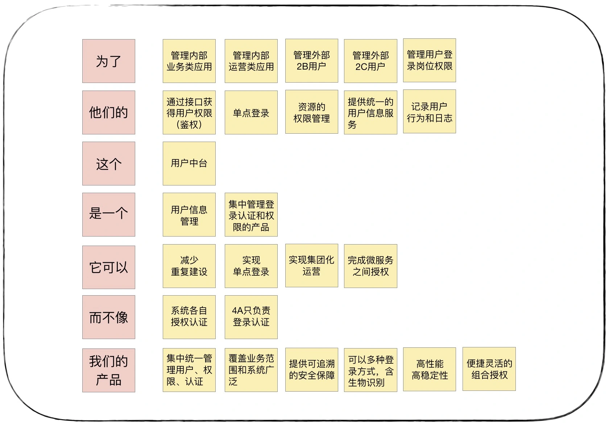
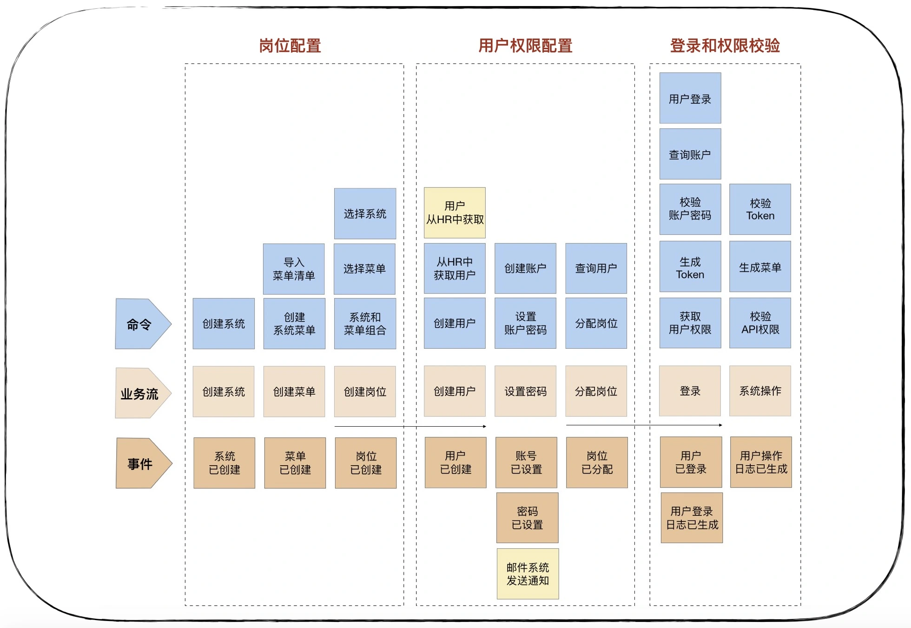
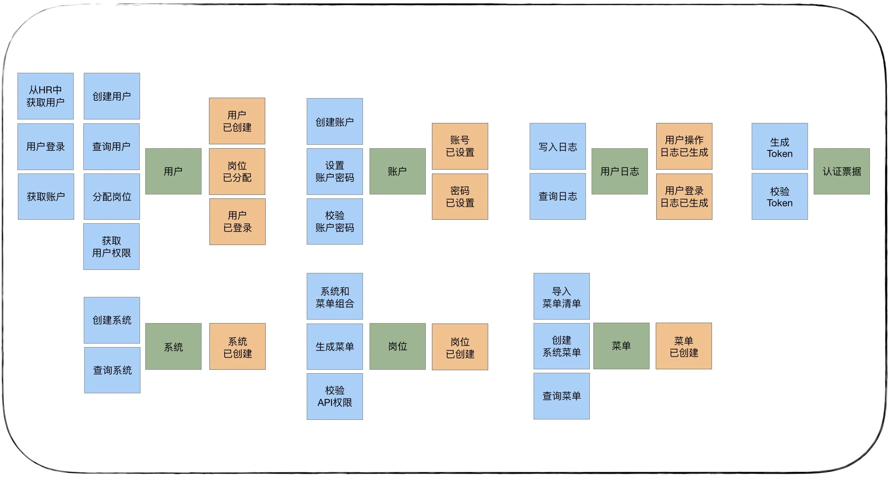
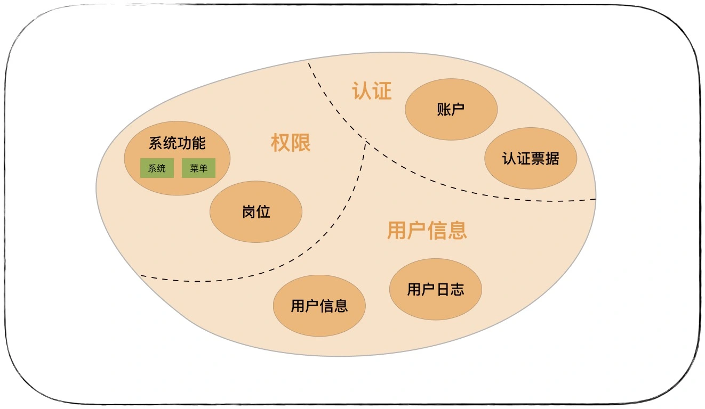
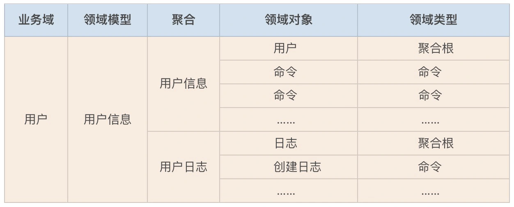

# 基于DDD的微服务设计案例

原文链接：[18 | 知识点串讲：基于DDD的微服务设计实例 (geekbang.org)](https://time.geekbang.org/column/article/169881)

​					[基于DDD的微服务设计实例代码详解 (geekbang.org)](https://time.geekbang.org/column/article/185174)

​					[12 | 领域建模：如何用事件风暴构建领域模型？ (geekbang.org)](https://time.geekbang.org/column/article/163961)

## 项目基本信息

## 战略设计

战略设计是根据用户旅程分析，找出领域对象和聚合根，对实体和值对象进行聚类组成聚合，划分限界上下文，建立领域模型的过程。

战略设计采用的方法是事件风暴，包括：产品愿景、场景分析、领域建模和微服务拆分等几个主要过程。

战略设计阶段建议参与人员：领域专家、业务需求方、产品经理、架构师、项目经理、开发经理和测试经理。

### 产品愿景

产品愿景是对产品顶层价值设计，对产品目标用户、核心价值、差异化竞争点等信息达成一致，避免产品偏离方向。

产品愿景的得出过程也是团队达成共识的重要一环，让更多的人发表对要做产品的意见，在产品愿景形成的现场。

根据大家的讨论将发散的意见统一为通用语言，建立如下图的产品愿景墙：

### 场景分析

场景分析是从**用户视角**出发，探索业务领域中的典型场景，产出领域中需要支撑的场景分类、用例操作以及不同子域之间的依赖关系，用以支撑领域建模。

在一个具体的业务场景，按照业务流程，一步一步搜寻用户业务流程中的关键领域事件，再找出什么行为会引起这些领域事件，这些行为可能是一个或若干个命令组合在一起产生的。根据场景分析出该场景包含的命令、实体、领域事件、补充信息。

### 领域建模

领域建模时，我们会根据场景分析过程中产生的领域对象，比如命令、事件等之间关系，找出产生命令的实体，分析实体之间的依赖关系组成聚合，为聚合划定限界上下文，建立领域模型以及模型之间的依赖。领域模型利用限界上下文向上可以指导微服务设计，通过聚合向下可以指导聚合根、实体和值对象的设计。

领域建模是一个收敛的过程，分三步：

- 第一步：从命令和事件中提取产生这些行为的实体；

  

- 第二步，根据聚合根的管理性质从实体中找出聚合根，然后根据业务依赖和业务内聚原则，将聚合根以及它关联的实体和值对象组合为聚合；

- 第三步划定限界上下文，根据上下文语义将聚合归类。

  

领域建模的过程中产生的领域对象实在太多了，我们可以借助表格来记录。

### 微服务拆分

理论上一个限界上下文就可以设计为一个微服务，但还需要综合考虑多种外部因素，比如：职责单一性、敏态与稳态业务分离、非功能性需求（如弹性伸缩、版本发布频率和安全等要求）、软件包大小、团队沟通效率和技术异构等非业务要素。

## 战术设计

战术设计是根据领域模型进行微服务设计的过程。这个阶段主要梳理微服务内的领域对象，梳理领域对象之间的关系，确定它们在代码模型和分层架构中的位置，建立领域模型与微服务模型的映射关系，以及服务之间的依赖关系。

战术设计阶段建议参与人员：领域专家、产品经理、架构师、项目经理、开发经理和测试经理等。

战术设计包括以下两个阶段：分析微服务领域对象和设计微服务代码结构。

### 分析微服务领域对象

领域模型有很多领域对象，但是这些对象带有比较重的业务属性。要完成从领域模型到微服务的落地，还需要进一步的分析和设计。在事件风暴基础上，我们进一步细化领域对象以及它们的关系，补充事件风暴可能遗漏的业务和技术细节。

我们分析微服务内应该有哪些服务？服务的分层？应用服务由哪些服务组合和编排完成？领域服务包括哪些实体和实体方法？哪个实体是聚合根？实体有哪些属性和方法？哪些对象应该设计为值对象等。

服务的识别和设计

### 设计微服务代码结构

### 后续的工作

详细设计

代码开发和测试

