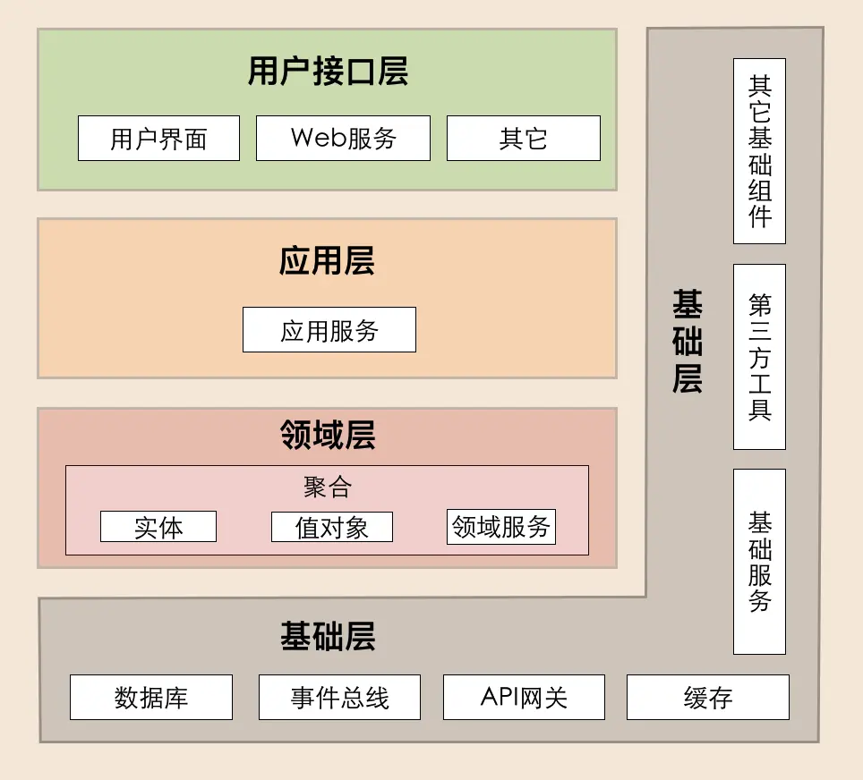

# 总结

## 什么是 DDD

架构就是业务的正交分解。以一种**领域驱动设计**的架构设计思想，可用来指导微服务架构的拆分。更详细来讲，DDD 核心思想是通过领域驱动设计方法定义**领域模型**，根据领域模型划分**领域边界**，从而确定业务和应用的边界作为微服务的边界。领域模型和边界确定后，就可以设计**领域对象**，在利用分层架构完成微服务的设计。

DDD 包括战略设计和战术设计两部分：

- 战略设计主要从业务视角出发，建立业务领域模型，划分领域边界，建立通用语言的限界上下文，限界上下文可以作为微服务设计的参考边界。
- 战术设计则从技术视角出发，侧重于领域模型的技术实现，完成软件开发和落地，包括：聚合根、实体、值对象、领域服务、应用服务和资源库等代码逻辑的设计和实现。

### 事件风暴

DDD 战略设计中**事件风暴**是建立领域模型，确定领域边界的主要方法，事件风暴是一个由发散到收敛的过程。

它通常采用用例分析、场景分析和用户旅程分析，尽可能全面不遗漏地分解业务领域，并梳理领域对象之间的关系，这是一个发散的过程。

事件风暴过程会产生很多的实体、命令、事件等领域对象，我们将这些领域对象从不同的维度进行聚类，形成如聚合、限界上下文等边界，建立领域模型，这就是一个收敛的过程。


具体来讲，事件风暴应该包含：产品愿景、场景分析、领域建模和微服务拆分等几个主要过程。

这几个过程，详细可看[实战案例](./3.5.实战案例)。

## DDD 分层架构



## 领域和领域对象

在研究和解决业务问题时，DDD 会按照一定的规则将业务领域进行细分（正交分解），当领域细分到一定的程度后，DDD 会将问题范围收敛到边界内，在这个边界内建立领域模型，进而用代码实现该领域模型，解决相应的业务问题。

简言之，DDD 的领域就是这个边界内收敛聚合的业务问题。


在 DDD 中如果领域很大的话，领域对象内部由小到大的顺序大概是这样的：

值对象 -> 实体 -> 聚合（最小业务功能单元，如果非常必要可以拆分为微服务）-> 限界上下文（一般作为拆分为微服务的依据，包含一到多个聚合）-> 子域（包含一到多个限界上下文）-> 领域（包含支撑子域、核心子域或通用子域等一到多个子域）。
服务的从底向上关系是这样的：实体方法 -> 领域服务 -> 应用服务 -> Facade 接口。

### 领域划分

领域是用来限定业务边界和范围的，那么就会有大小之分，领域越大，业务范围就越大，反之则相反。领域可以进一步划分为子领域。我们把划分出来的多个子领域称为子域，每个子域对应一个更小的问题域或更小的业务范围。

根据子域的重要性和功能属性划分为四类：核心域、通用域和支撑域。

- 核心域：核心域决定产品和公司核心竞争力，核心域一定要收敛稳定，如果一个问题是发散的，那么它就不适合放到核心域，不管后续业务如何发展，核心域一定要保持整洁。
- 通用域：没有太多个性化的诉求，同时被多个子域使用的通用功能子域是通用域。
- 支撑域：还有一种功能子域是必需的，但既不包含决定产品和公司核心竞争力的功能，也不包含通用功能的子域，它就是支撑域。

### 领域对象

- 实体

  在 DDD 中有这样一类对象，它们**拥有唯一标识符**，且标识符在历经各种状态变更后仍能保持一致，通过唯一标识可判断是否是同一个实体。实体具有业务属性和业务行为，在实现上通常采用充血模型，与实体业务相关的方法要做实体的内部实现，对外暴露方法要自然体现业务需求，跨多个实体的领域逻辑应该在**领域服务**中实现。

- 值对象

  值对象描述了领域中的一件东西，这个东西是不可变的，它将不同的相关属性组合成了一个概念整体。当度量和描述改变时，可以用另外一个值对象予以替换，且不会造成副作用。

- 聚合

  实体和值对象都只是个体化的对象，它们的行为表现出来的是个体的能力，而能让实体和值对象协同工作的组织就是聚合，它用来确保这些领域对象在实现共同的业务逻辑时，能保证数据的一致性。

  对于数据一致性，你可以这么理解，聚合就是由业务和逻辑紧密关联的实体和值对象组合而成的，聚合是数据修改和持久化的基本单元，每一个聚合对应一个仓储，实现数据的持久化。

  聚合在 DDD 分层架构里属于领域层，领域层包含了多个聚合，共同实现核心业务逻辑。聚合内实体以充血模型实现个体业务能力，以及业务逻辑的高内聚。跨多个实体的业务逻辑通过领域服务来实现，跨多个聚合的业务逻辑通过应用服务来实现。

  一个聚合的代码结构如下所示：

  ```
  -- order（聚合名称）
  --- entity
  --- event
  --- repository 
  --- service
  ```

- 聚合根

  如果把聚合比作组织，那聚合根就是这个组织的负责人。聚合根也称为根实体，它不仅是实体，还是聚合的管理者。

  首先它作为实体本身，拥有实体的属性和业务行为，实现自身的业务逻辑。其次它作为聚合的管理者，在聚合内部负责协调实体和值对象按照固定的业务规则协同完成共同的业务逻辑。

  最后在聚合之间，它还是聚合对外的接口人，以聚合根 ID 关联的方式接受外部任务和请求，在上下文内实现聚合之间的业务协同。也就是说，聚合之间通过聚合根 ID 关联引用，如果需要访问其它聚合的实体，就要先访问聚合根，再导航到聚合内部实体，外部对象不能直接访问聚合内实体。

  

  聚合在 DDD 分层架构里属于领域层，领域层包含了多个聚合，共同实现核心业务逻辑。聚合内实体以充血模型实现个体业务能力，以及业务逻辑的高内聚。跨多个实体的业务逻辑通过领域服务来实现，跨多个聚合的业务逻辑通过应用服务来实现。比如有的业务场景需要同一个聚合的 A 和 B 两个实体来共同完成，我们就可以将这段业务逻辑用领域服务来实现；而有的业务逻辑需要聚合 C 和聚合 D 中的两个服务共同完成，这时你就可以用应用服务来组合这两个服务。

  

  聚合的一些设计原则

  - 在一致性边界内建模真正的不变条件。聚合用来封装真正的不变性，而不是简单地将对象组合在一起。聚合内有一套不变的业务规则，各实体和值对象按照统一的业务规则运行，实现对象数据的一致性，边界之外的任何东西都与该聚合无关，这就是聚合能实现业务高内聚的原因。
  - 设计小聚合。如果聚合设计得过大，聚合会因为包含过多的实体，导致实体之间的管理过于复杂，高频操作时会出现并发冲突或者数据库锁，最终导致系统可用性变差。而小聚合设计则可以降低由于业务过大导致聚合重构的可能性，让领域模型更能适应业务的变化。
  - 通过唯一标识引用其它聚合。**聚合之间是通过关联外部聚合根 ID 的方式引用，而不是直接对象引用的方式**。外部聚合的对象放在聚合边界内管理，容易导致聚合的边界不清晰，也会增加聚合之间的耦合度。
  - 在边界之外使用最终一致性。聚合内数据强一致性，而聚合之间数据最终一致性。在一次事务中，最多只能更改一个聚合的状态。如果一次业务操作涉及多个聚合状态的更改，应采用领域事件的方式异步修改相关的聚合，实现聚合之间的解耦（相关内容我会在领域事件部分详解）。
  - 通过应用层实现跨聚合的服务调用。为实现微服务内聚合之间的解耦，以及未来以聚合为单位的微服务组合和拆分，应避免跨聚合的领域服务调用和跨聚合的数据库表关联。

  

  聚合、聚合根、实体和值对象它们之间的联系和区别

  - 聚合的特点：高内聚、低耦合，它是领域模型中最底层的边界，可以作为拆分微服务的最小单位，但我不建议你对微服务过度拆分。但在对性能有极致要求的场景中，聚合可以独立作为一个微服务，以满足版本的高频发布和极致的弹性伸缩能力。

    一个微服务可以包含多个聚合，聚合之间的边界是微服务内天然的逻辑边界。有了这个逻辑边界，在微服务架构演进时就可以以聚合为单位进行拆分和组合了，微服务的架构演进也就不再是一件难事了。

  - 聚合根的特点：聚合根是实体，有实体的特点，具有全局唯一标识，有独立的生命周期。一个聚合只有一个聚合根，聚合根在聚合内对实体和值对象采用直接对象引用的方式进行组织和协调，聚合根与聚合根之间通过 ID 关联的方式实现聚合之间的协同。

  - 实体的特点：有 ID 标识，通过 ID 判断相等性，ID 在聚合内唯一即可。状态可变，它依附于聚合根，其生命周期由聚合根管理。实体一般会持久化，但与数据库持久化对象不一定是一对一的关系。实体可以引用聚合内的聚合根、实体和值对象。

  - 值对象的特点：无 ID，不可变，无生命周期，用完即扔。值对象之间通过属性值判断相等性。它的核心本质是值，是一组概念完整的属性组成的集合，用于描述实体的状态和特征。值对象尽量只引用值对象。

- 限界上下文

  限界就是领域的边界，而上下文则是语义环境。通过领域的限界上下文，我们就可以在统一的领域边界内用统一的语言进行交流。

### 领域对象协作

聚合内的聚合根和实体与值对象的协作：

聚合根引用实体和值对象，它可以组合聚合内的多个实体，在聚合根实体类方法中完成复杂的业务行为，这种复杂的业务行为也可以在聚合领域服务里实现。

但为了职责和边界清晰，我建议聚合要根据自身的业务行为在实体类方法中实现，而涉及多个实体组合才能实现的业务能力由领域服务完成。


### 领域事件

领域事件是领域模型中非常重要的一部分，用来表示领域中发生的事件。一个领域事件将导致进一步的业务操作，在实现业务解耦的同时，还有助于形成完整的业务闭环。

// TODO ...

### 仓储模式

领域模型中 DO 实体的数据持久化是必不可少的，DDD 采用仓储模式实现数据持久化，使得业务逻辑与基础资源逻辑解耦，实现依赖倒置。持久化时先完成 DO 与 PO 对象的转换，然后在仓储服务中完成 PO 对象的持久化

为了解耦业务逻辑和基础资源，我们可以在基础层和领域层之间增加一层仓储服务，实现依赖倒置。通过这一层可以实现业务逻辑和基础层资源的依赖分离。在变更基础层数据库的时候，你只要替换仓储实现就可以了，上层核心业务逻辑不会受基础资源变更的影响，从而实现依赖倒置。

一个聚合一个仓储，实现聚合数据的持久化。领域服务通过仓储接口来访问基础资源，由仓储实现完成数据持久化和初始化。仓储一般包含：仓储接口和仓储实现。

### 聚合工厂

对于大型的复杂领域模型，聚合内的聚合根、实体和值对象之间的依赖关系比较复杂，这种过于复杂的依赖关系，不适合通过根实体构造器来创建。为了协调这种复杂的领域对象的创建和生命周期管理，在 DDD 里引入了工厂模式（Factory），在工厂里封装复杂的对象创建过程。

当聚合根被创建时，聚合内所有依赖的对象将会被同时创建。工厂与仓储模式往往结对出现，应用于数据的初始化和持久化两类场景。

- DO 对象的初始化：获取持久化对象 PO，通过工厂一次构建出聚合根所有依赖的 DO 对象，完数据初始化。
- DO 的对象持久化：将所有依赖的 DO 对象一次转换为 PO 对象，完成数据持久化。

## 服务协作

### 服务内

基础服务

基础层的服务形态主要是仓储服务。仓储服务包括接口和实现两部分。仓储接口服务供应用层或者领域层服务调用，仓储实现服务，完成领域对象的持久化或数据初始化。


领域服务

领域层实现核心业务逻辑，负责表达领域模型业务概念、业务状态和业务规则。主要的服务形态有实体方法和领域服务。

领域服务会对多个实体或实体方法进行组装和编排，实现跨多个实体的复杂核心业务逻辑。对于严格分层架构，如果单个实体的方法需要对应用层暴露，则需要通过领域服务封装后才能暴露给应用服务。


应用服务

应用层用来表述应用和用户行为，负责服务的组合、编排和转发，负责处理业务用例的执行顺序以及结果的拼装，负责不同聚合之间的服务和数据协调，负责微服务之间的事件发布和订阅。

通过应用服务对外暴露微服务的内部功能，这样就可以隐藏领域层核心业务逻辑的复杂性以及内部实现机制。应用层的主要服务形态有：应用服务、事件发布和订阅服务。

应用服务内用于组合和编排的服务，主要来源于领域服务，也可以是外部微服务的应用服务。除了完成服务的组合和编排外，应用服务内还可以完成安全认证、权限校验、初步的数据校验和分布式事务控制等功能。

为了实现微服务内聚合之间的解耦，聚合之间的服务调用和数据交互应通过应用服务来完成。原则上我们应该禁止聚合之间的领域服务直接调用和聚合之间的数据表关联。


Facade 服务

用户接口层是前端应用和微服务之间服务访问和数据交换的桥梁。它处理前端发送的 RESTful 请求和解析用户输入的配置文件等，将数据传递给应用层。或获取应用服务的数据后，进行数据组装，向前端提供数据服务。主要服务形态是 Facade 服务。

用户接口层是前端应用和微服务之间服务访问和数据交换的桥梁。它处理前端发送的 RESTful 请求和解析用户输入的配置文件等，将数据传递给应用层。或获取应用服务的数据后，进行数据组装，向前端提供数据服务。主要服务形态是 Facade 服务。


服务间

// TODO ...

## 数据对象视图

在 DDD 中有很多的数据对象，这些对象分布在不同的层里。它们在不同的阶段有不同的形态。

我们先来看一下微服务内有哪些类型的数据对象？它们是如何协作和转换的？

- 数据持久化对象 PO(Persistent Object)，与数据库结构一一映射，是数据持久化过程中的数据载体。
- 领域对象 DO（Domain Object），微服务运行时的实体，是核心业务的载体。
- 数据传输对象 DTO（Data Transfer Object），用于前端与应用层或者微服务之间的数据组装和传输，是应用之间数据传输的载体。
- 视图对象 VO（View Object），用于封装展示层指定页面或组件的数据。


## DDD 设计案例

参考[实战案例](./3.5.实战案例.md)

