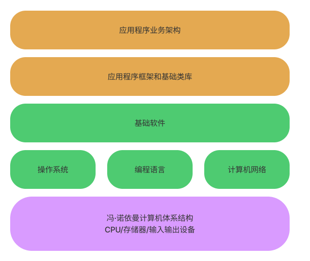
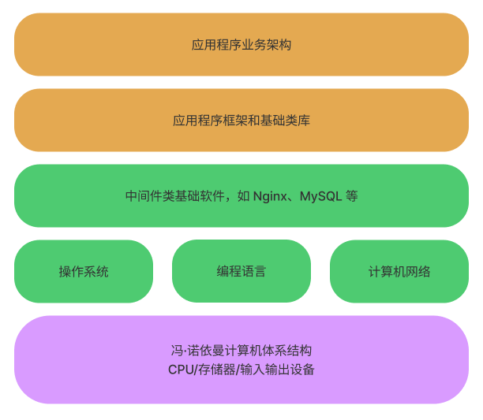
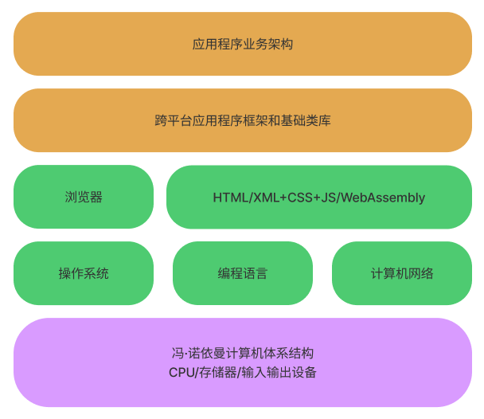

# 应用程序基础架构

对基础架构了解的越全面，做业务架构就会越从容，并且从基础架构到业务架构过度也会更加紧密自然。

## 应用程序基础架构

一个应用程序的基础架构如下图所示：

### 冯·诺伊曼计算机体系结构

最底层是冯·诺依曼计算机体系结构：CPU  + 存储 + 输入输出设备；

冯·诺依曼计算机体系结构是一个简洁的模型，对外具有开放性的设计，这种开放性主要体现在以下两点：

- CPU 指令具有**可编程性**，CPU 具有一套基础的指令集，用来完成基本的数学计算，数据读入和写入以及程序流程控制，CPU 指令集虽然是有限的，但是可以根据这些有限的指令组合出复杂的指令执行序列；
- CPU 专注于计算：CPU 只会读取指令和来自外部设备的数据，然后基于这些指令和数据进行计算，而不需要了解外部设备的职责，也就可以支持任意的外部设备。

### 编程语言

虽然 CPU 的指令集具备了可编程性，但如果我们直接使用 CPU 指令进行编程，不是一件容易的事情，因为使用机器指令编写代码又累又难以维护。这就有了编程语言和编译器，程序员使用更容易写程序的编程语言编写好代码，编译器再将编写好的代码编译成机器码（指令）执行。

### 操作系统

有了编程语言后，软件的开发效率得到了极大的解放，我们可以根据业务的需求编写出很多的应用软件。但这么多软件怎么才能一起在一台机器上正确的运行，怎么保护硬件不被恶意软件破坏，为了解决这些问题，一种特殊的软件出现了——**操作系统**。

操作系统主要解决了两个问题：

- 软件治理：操作系统首先解决了**软件治理**的问题，通过操作系统统一管理软件的运行。比如实现了线程调度，内存管理，虚拟文件系统等，让不同软件更好的使用硬件资源，互不干扰的运行；
- 封装了基础编程接口：操作系统解决了**基础编程接口**的问题，为应用软件和硬件建立的桥梁，使得每个软件不用单独访问硬件，进一步简化了软件的开发。

### 计算机网络

计算机网络通过远程传输数据将单机的计算能力开放出去。其解决了数据怎么从一个点，经过诸多网络设备，安全地到达另一个点的问题。

### 基础软件

像计算机体系结构，编译语言和编译器，操作系统就是我们开发一个应用程序必须依赖的基础架构，它们都解决了一些和业务无关的通用性问题，这些问题往往无论你具体要做什么样的应用都需要面对。

基础架构通常以独立的软件存在，所以也称为**基础软件**。例如，我们熟知的 Linux、Nginx、MySQL、浏览器等这些软件都属于基础软件，这些基础软件极大地降低了应用开发的难度。在今天软件服务化的大趋势下，很多基础软件最终以互联网服务的方式提供出去，这就是所谓的云计算。

## 服务端应用程序基础架构

服务端应用基础架构如下图所示：

服务端应用往往有以下三个特征：

- **规模大**：服务端程序是被所有用户所共享，为所有用户服务，但一台物理的机器资源总归是有限的，能够服务的用户数必然存在上限，所以一个服务端程序在用户规模到达一定程度后，需要**分布式化**，以具备更高的负载能力；
- **连续服务时间长**：服务端程序通常都是 7x24 小时不间断服务的，当用户规模达到一定基数后，每一秒都可能会有用户在使用它，不存在关闭程序这样的概念；
- **容错性低**：服务的用户越多，就意味着服务端对程序运行崩溃的容忍度越低，我们没办法要求服务器不会崩溃，但是在它崩溃时它的工作必须立刻转交给其他的实例，所以，服务端程序必须是多实例的，对于单个程序实例的临时不可用状态，要做到用户无感知。

因此在服务端应用架构时，我们需要在服务开发方面考虑使用各种技术来满足用户的需求，也要从服务治理的角度出发保证服务健康运行和不间断运行。

关于服务端开发，需要考虑的有：

- 流量调度和负载均衡：服务端面向的是多租户，用户越多，服务端的应用就会时刻在高负载和低容错下运行，而单机的负载能力是有上限，因此服务端的程序往往是分布式的，服务端有了多个运行实例后，怎么将来自客户端的流量均匀地调度到可用机器上是一个重要的课题；
- 业务状态：服务端应用程序是有业务状态的，业务状态需要可靠存储和高效访问，所以服务端应用程序需要考虑怎么使用各种各样的存储中间件达到这一目的；
- 网络协议：这里说的网络协议是指服务端程序的使用界面（接口），如 RESTFul API；
- 授权：既然服务端应用多是面向用户的，那么自然而然就应该考虑基于用户的授权体系，OAuth 2.0；
- RPC 框架：实现服务端的接口，或者进行服务间的调用；

关于服务治理，需要考虑的有：

- 服务的发布、升级和版本管理：变更是故障之源；
- 日志、健康和报警：即时发现故障，定位问题；
- 过载保护和容量规划。

## 客户端应用程序基础架构

客户端应用程序基础架构如下图所示：

和服务端应用架构相比，客户端应用架构具有非常大的差别。最大的差别是客户端面临客户端多样性的挑战，比如不同的类型的终端，电脑和手机，不同的操作系统。

第一个想消除客户端的多样性，并且跨平台提供统一编程接口的，是**浏览器**。在很多人看来，浏览器主要改变了软件分发的方式，让软件可以即取即用，无需安装。但从技术角度来说，底层操作系统对软件的支持同样可以做到即取即用，只要实现了软件的快速地透明地安装和卸载即可。

浏览器的地位其实十分特殊，如果从使用软件的角度去看待，浏览器可以看作是操作系统上的操作系统，一旦某种浏览器流行起来，开发人员都在浏览器上做应用，用户都基于浏览器访问应用，那么必然会导致底层操作系统管道化，这是操作系统厂商所不愿意看到的。

> 注：操作系统管道化是指操作系统不再需要实现软件治理，应用都在浏览器上，操作系统运行好浏览器这一个基础软件即可，操作系统就变成了辅助浏览器访问 Web 程序的管道。

浏览器是一个基础软件，它能够解决多大的问题，依赖于它的市场占有率。**基于同样的浏览器技术核心也可以构建出跨平台的客户端应用框架**，我们看到 [React Native](https://reactnative.cn/docs/getting-started.html) 就是沿着这个思路走的。当然这不是唯一的一条路，还有人会基于类似 QT 这样的传统跨平台方案。

而移动端的小程序的思路和浏览器类似，支持小程序的应用就成为了访问其他应用（小程序）的入口，这点就可浏览器的功能类似了。

## 总结

像冯·诺伊曼计算机体系结构计算机体系结构，编译语言和编译器，操作系统就是我们开发一个应用程序必须依赖的基础架构，它们都解决了一些和业务无关的通用性问题，这些问题往往无论你具体要做什么样的应用都需要面对，所以知晓计算机应用的基础架构是十分有必要的。

服务端应用架构和客户端应用架构有所区别。服务端应用为多个用户服务，具有规模大、持续运行时间长、容错性低的特征，在设计服务端应用时不光要考虑使用哪些基础软件开发出满足用户需求的应用，还要从服务治理角度出发保证服务健康和不间断的运行。

客户端应用往往面向的是单个用户，其最需要解决的是跨平台的问题。浏览器是第一个消除客户端多样性、提供统一的跨平台编程接口基础软件。浏览器不仅仅是改变了软件的分发方式（即取即用、无需安装），而且成为不同应用的入口，成为操作系统上的操作系统。一旦某种浏览器流行起来，开发人员都在浏览器上做应用，用户都基于浏览器访问应用，那么必然会导致底层[操作系统管道化](https://36kr.com/p/1638705659905)。

移动端的小程序思路和浏览器类似，支持小程序的应用成为了访问其他应用（小程序）的入口。

### 参考链接

本文是极客时间专栏《许式伟的架构课》的学习笔记，原文链接：[架构设计的宏观视角 (geekbang.org)](https://time.geekbang.org/column/article/90170)。

