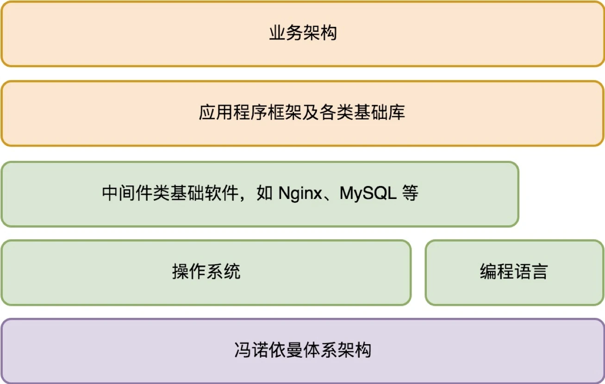
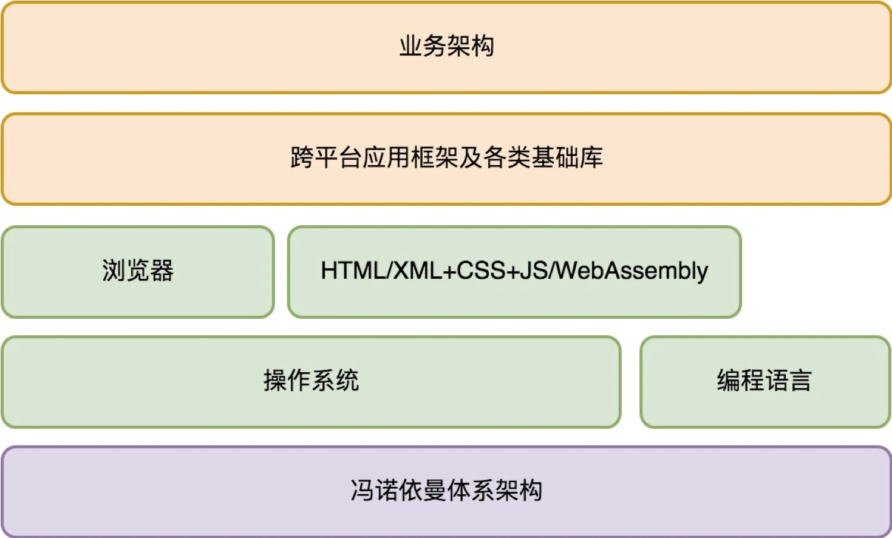
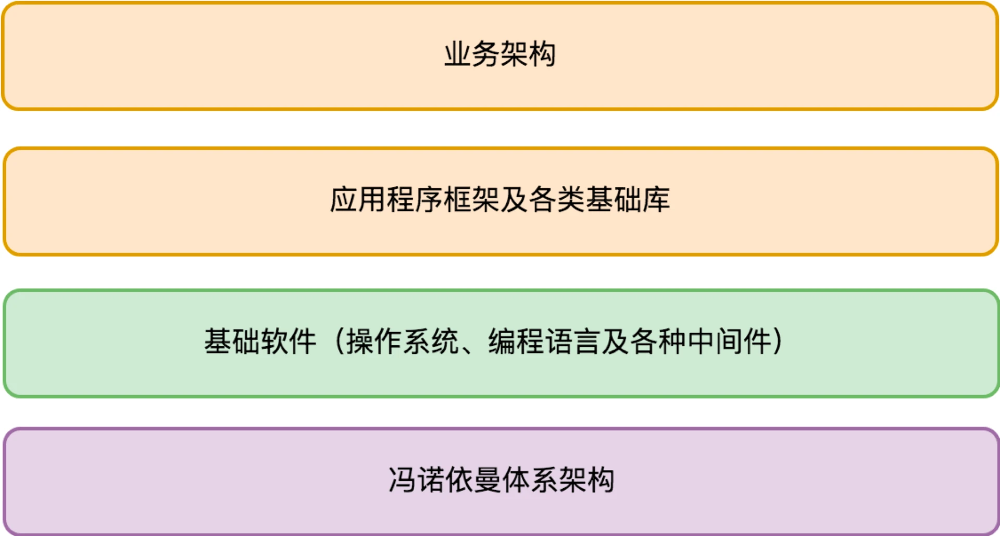

# 架构设计的宏观视角

原文链接：[01 | 架构设计的宏观视角 (geekbang.org)](https://time.geekbang.org/column/article/90170)

作为架构师，我们需要的第一个能力是宏观的全局掌控能力。站在宏观视角，从基础架构开始，逐步过渡到业务架构，刨析一个应用程序的整体构成。

## 应用程序的基础架构

对基础架构了解的越全面，做业务架构就会越从容，并且从基础架构到业务架构过度也会更加紧密自然。

冯·诺依曼计算机体系结构：CPU  + 存储 + 输入输出设备。

电脑的 CPU 是一个非常简洁的模型，它只读入指令和写出数据，根据指令对数据进行计算。CPU 具有一套基础的指令集，用来完成基本的数学计算，数据读入和写入以及程序流程控制，任何高层的复杂的业务逻辑到了 CPU 都会转换成这一条条指令被 CPU 依次执行。CPU 指令集虽然是有限的，但指令的执行序列是无限的，这样一来 CPU 指令就具有了**可编程性**。由编程语言来应对变化，使用 CPU 统一执行。CPU 是一个非常简洁的模型，**对外部设备具有开放的设计**，CPU 不需要了解外部设备的职责，专注自己计算这一纯粹的职责。

虽然 CPU 的指令集具备了可编程性，但如果我们直接使用 CPU 指令进行编程，不是一件容易的事情，使用机器指令编写代码又累又难以维护。这就有了编程语言和编译器，编程语言面向编写代码的人员，编译器再将编写好的代码编译成机器码（指令）执行。

我们现在有了编程语言，我们可以根据外界的需求编写对应的软件，但这么多软件怎么才能一起在一台机器上正确的运行，怎么保护硬件不被恶意软件破坏，为了解决这些问题，一种特殊的软件出现了——操作系统。操作系统首先解决了**软件治理**的问题，通过操作系统统一管理软件的运行。比如实现了线程调度，内存管理，虚拟文件系统等，让不同软件更好的使用硬件资源，互不干扰的运行。其次，操作系统解决了**基础编程接口**的问题，为应用软件和硬件建立的桥梁，使得每个软件不用单独访问硬件，简化了软件的开发。

像计算机体系结构，编译语言和编译器，操作系统就是我们开发一个应用程序必须依赖的基础架构，它们都解决了一些和业务无关的通用性问题，这些问题往往无论你具体要做什么样的应用都需要面对。而且，基础架构通常以独立的软件存在，所以也称为**基础软件**。

初次之外，像我们熟知的 Linux、Nginx、MySQL 都是为了解决一些特定问题的基础软件，这些基础软件极大的降低了应用软件的开发难度，使得应用软件更加关系业务。并且在今天软件服务化的趋势下，很多基础软件最终通过网络的形式进行交付，这就是所谓的**云计算**。

## 完整的程序架构

在越强大的基础架构支撑下，应用程序开发需要关注的问题就越收敛，我们的开发效率就越高。在我们只需要关注应用程序本身的业务问题如何构建时，我们说自己是在设计应用程序的业务架构（或者叫“应用架构”）。

### 服务端应用程序的业务（应用）架构

对于一个服务端应用程序来说，其完整的架构体系大体如下：

### 客户端应用程序的业务（应用）架构

和服务端应用架构相比，客户端应用架构具有非常大的差别。最大的差别是客户端面临客户端多样性的挑战，比如不同的类型的终端，电脑和手机，不同的操作系统。

第一个想消除客户端的多样性，并且跨平台提供统一编程接口的，是**浏览器**。在很多人看来，浏览器主要改变了软件分发的方式，让软件可以即取即用，通过网页浏览，无需安装。但从技术角度来说，底层操作系统对软件的支持同样可以做到即取即用，只要实现了软件的快速地透明地安装和卸载即可。浏览器的地位其实十分特殊，我们可以看作是操作系统之上的操作系统。一旦某种浏览器流行起来，开发人员都在浏览器上做应用，那么必然会导致底层操作系统管道化（操作系统不再需要实现软件治理，应用都在浏览器上，操作系统运行好浏览器这一个基础软件即可，操作系统就变成了浏览器的附属品），这是操作系统厂商所不愿意看到的。

浏览器是一个基础软件，它能够解决多大的问题，依赖于它的市场占有率。但是**基于同样的浏览器技术核心也可以构建出跨平台的应用框架**。我们看到 React Native 就是沿着这个思路走的。当然这不是唯一的一条路，还有人会基于类似 QT 这样的传统跨平台方案。

有趣的是，移动浏览器的战场似乎是从中国开始打起的，这就是微信引发的**小程序**之战，它本质上是一场浏览器的战争。

整体来说，对于一个客户端应用程序来说，其完整的架构体系大体如下：

### 总的架构

无论服务端，还是客户端，我们可以统一将其架构图简化为下图所示：

图中淡紫色是硬件层次的依赖，是我们程序工作的物理基础（**基础架构**）。淡绿色的是软件层次的依赖，是我们程序工作的**生态环境**。桔色的是库或源代码层次的依赖，是我们**程序本身**的组成部分。细分的话它又可以分两部分：一部分是业务无关的框架和基础库，还有一部分是业务架构。