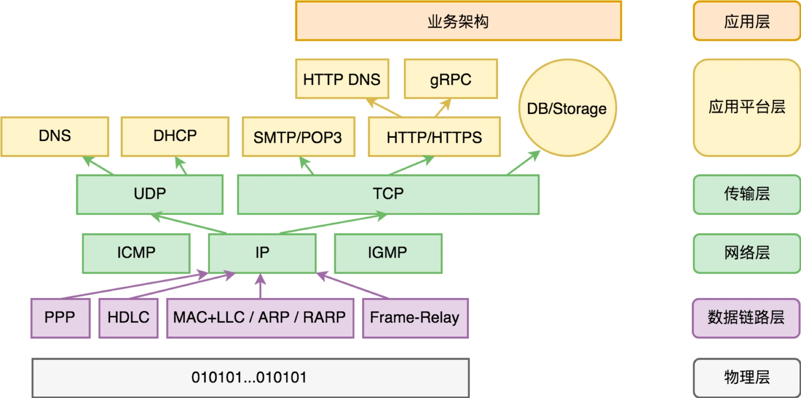

# 操作系统

[06 | 操作系统进场 (geekbang.org)](https://time.geekbang.org/column/article/93315)

在编程语言出现以后，软件的生产力得到了极大的解放。随着越来越多的软件出现，就但是了这些软件如何共处，也就是软件治理的需求。比如以下这些需求场景：

- 多任务需求：多个软件如何同时运行？
- 内存管理，文件系统需求：多个软件如何共同使用计算机上的存储空间？
- 设备管理：多个软件如何共同使用同一个外部设备？
- 进程间通信，共享内存：多个软件如何相互通讯，如何进行数据交换？
- 安全管理需求：病毒、恶意软件如何治理？

## 操作系统的启动过程

参考链接：[计算机启动过程 - AdamWong | 博客园 (cnblogs.com)](https://www.cnblogs.com/adamwong/p/10582183.html)

1. Turn on.

2. CPU jump to physical address of BIOS(In Intel ti is 0xFFFF0).

3. BIOS runs POST(Power-On Self Test).

4. Find bootable devices.

5. Loads boot sector from MBR.

6. BIOS yields control to OS BootLoader.

   

1. 通电开机。

2. CPU 去固定的存储地址加载指令序列执行，这个固定地址指向 ROM（Read Only Memory，只读内存）上的 BIOS 程序。这个固定地址在 Intel CPU 上为 0xFFFF0。

   BIOS（Basic Input/Output System，基本输入输出系统），BIOS 能为电脑提供最低级、最直接的硬件控制与支持，是联系最底层的硬件和软件系统的桥梁。为了在关机后使 BIOS 不会丢失，早期的 BIOS 存储在 ROM 中，并且其大小不会超过 64KB；目前的 BIOS 大多有 1MB 到 2MB，被存储在闪存（Flash Memory）中。BIOS 一般包含以下内容：

   - 存储设备的驱动程序，用以识别常规的外置存储设备，比如硬盘、光驱、U 盘。
   - 基础外部设备的驱动程序，比如键盘、鼠标、显示器。
   - 设备和启动配置的基础管理能力。
   - 支持执行外置存储中引导区的机器代码程序。
   - 跳转到外置存储引导区的固定地址，把执行权交给该地址上的引导程序。

3. 硬件自检（POST，Power-On Self Test）

   如果硬件出现问题，主板会发出不同含义的蜂鸣 ，启动中止。如果没有问题，屏幕就会显示出 CPU 、内存、硬盘等信息。BIOS 在执行完硬件自检和初始化后，会将自己复制到从 0xA0000 开始的物理内存中并继续执行。

4. 选择引导设备

   BIOS 完成 POST 和初始化之后，会根据 CMOS 中设定的顺序选择引导的设备，这个设备可以是 U 盘可以是硬盘。

5. 加载引导程序

   如果 CMOS 中设置的是磁盘启动，则 BIOS 去读取 MBR。MBR（Master Boot Record，主引导记录），是一个 512byte 的扇区，位于磁盘的固定位置。MBR 里面包含了一段引导程序，一个分区表和 Magic Number。

6. BIOS 将执行权交给引导程序，从内置存储 ROM 交给外置存储。

   引导程序通常很短，只能做比较少的事情，在常规情况下，它只是简单地跳转到真正的操作系统的启动程序，但有时计算机上安装了多个操作系统，此时引导程序会提供菜单让你选择要运行的操作系统。

## 操作系统的需求演进

从客户价值来讲，操作系统首先解决的是软件治理的问题，大体可分为以下六个子系统：

- 进程管理。
- 存储管理。
- 输入设备管理。
- 输出设备管理。
- 网络管理。
- 安全管理。

操作系统其次解决的是基础编程接口问题。这些编程接口一方面简化了软件开发，另一方面提供了多软件共同运行的环境，实现了软件治理。

从商业价值来讲，操作系统是刚性需求，核心的流量入口，兵家必争之地。所以，围绕它的核心能力，操作系统必然会不断演化出新的形态。

操作系统和浏览器的关系？

在 PC 时期，操作系统和浏览器看起来至少需求上是有差异化的：操作系统，是以管理本地软件和内容为主（对内）。浏览器，是以管理互联网内容为主（对外）。但这个边界必然会越来越模糊，操作系统也会来涉足互联网的内容，比如操作系统的应用市场。而另一方面，在浏览器中也有一些特殊角色：网址导航、搜索引擎、Web 应用市场，它们共同构成了探索互联网世界的“地图”。

## 软件运行机制及内存管理

原文链接：[07 | 软件运行机制及内存管理 (geekbang.org)](https://time.geekbang.org/column/article/93802)

操作系统的核心职能就是实现软件治理，而软件治理的一个很重要的部分，就是让多个软件共同合理的使用计算机资源。而内存作为计算机最基础的内存资源有着特殊的位置。CPU 可以直接访问的内存资源很少，包括主板上的只读内存（ROM）、寄存器、内存（RAM）。

```
Note:
ROM：只读内存，在主板上，只读，而且数据是非易失的。
RAM：随机存取内存，是与 CPU 直接交换数据的内部存储器。它可以随时读写，而且速度很快，通常作为操作系统或其他正在运行中的程序的临时数据存储介质。 
```

### 计算机运行的全过程

从操作系统的视角来看，计算机从开机到关机，整个 “计算” 过程，由很多软件，也就是子 “计算” 过程，共同完成。从时序来说，计算机完整的 “计算” 过程如下：


- BIOS 程序位于主板上的只读内存（ROM），并没有和 CPU 绑定，体现了开发性的设计，这样以来，对于不同的输入和输出需要就在 BIOS 中修改，而不需要修改 CPU。
- 引导区引导程序，则是程序从内置存储（ROM）转到外置存储的边界。引导区引导程序很短，常规下就是实现了跳转到真正操作系统的启动程序这一逻辑，BIOS 只需要把它加载到内存执行就可以，但是这样系统的控制权就很巧妙地转到外置存储了。
- OS 引导程序，则是外置存储接手计算机控制权的真正开始，操作系统就从这里开始接手计算机，并在最终初始化工作完成后，将执行权交给 OS Shell 程序。
- OS Shell 程序，负载操作系统和用户交互。OS Shell 程序是一个命令行程序，DOS 中叫 command.com，而在 Linux 下则叫 sh 或者 bash 之类。

### 内存管理

- CPU 的实模式和保护模式

  这两个模式 CPU 对内存的操作方式完全不同。在实模式下，CPU 直接通过物理地址访问内存。在保护模式下，CPU 通过一个地址映射表把虚拟的内存地址转为物理的内存地址，然后再去读取数据。

  相应的，工作在实模式下的操作系统，我们叫实模式操作系统；工作在保护模式下的操作系统，我们叫保护模式操作系统。

- 实模式下的内存管理

  在实模式操作系统下，所有软件包括操作系统本身，都在同一个物理地址空间下。这时候操作系统给应用分配内存可以通过以下两种方式：

  - 将操作系统内存管理相关的函数放到一个公共内存，内存需要分配内存，就去公共内存取到函数地址执行。

  - 把内存管理设计成一个中断请求，每次有内存相关函数调用通过中断来完成。

    所谓中断，是 CPU 响应硬件设备事件的一个机制。当某个输入输出设备发生了一件需要 CPU 来处理的事情，它就会触发一个中断。内存中维护了一个**中断向量表**，本质上就是中断号和函数的映射表。比如，比如键盘按了一个键，它会触发 9 号中断。在 CPU 收到中断请求时，它会先停下手头的活到中断向量表找到第 9 项对应的函数地址并去执行它，完成后再回去干原来的活。

    中断本来被设计用来响应硬件事件之用，但是 CPU 也提供了指令允许软件触发一个中断，我们把它叫软中断。比如  Linux 操作系统的 0x80 中断，用来在发生系统调用时，从用户空间切换到内核空间，并由内核来执行对应函数。

  在实模式下，如何运行外置存储的软件？

  就是把外置存储的软件加载到内存，并执行。但由于实模式使用的时物理内存，每次将软件从外置存储加载到内存时，很多函数和数据的地址并不是固定的，即存在浮动地址的问题。

- 保护模式下的内存管理

  实模式下操作系统管理内存由两个问题：

  - 安全问题，所有的应用都运行在一起，共享同一块物理内存，程序之间可以修改对方的内存，这样程序就很容易遭到破坏。
  - 当软件很复杂时，这种方式也会变得难以执行。

  保护模式下，内存访问不是直接通过物理内存，而是通过虚拟内存，这样就解决了实模式下的安全问题。并且每个应用操作的虚拟内存就像在操作真个物理内存一样，这样一来也解决了实模式下浮动内存的问题。 

  保护模式下，整个内存空间被分成很多个连续的**内存页**，每个内存页大小是固定的，比如 64K。每次 CPU 访问某个虚拟内存地址中的数据，它都会先计算出这是要访问哪个内存页，然后 CPU 再通过一个地址映射表，把虚拟的内存地址转为物理的内存地址，然后到这个物理内存地址去读取数据。地址映射表是一个数组，下标是内存页页号，值是该内存页对应的物理内存首地址。

  内存分页后，软件从外置存储加载到内存不再是一次性全部加载到内存，而是按需以内存页为单位进行加载程序片段。当一个内存页对应的物理内存地址还不存在，这种情况叫缺页，没法读取数据，这时 CPU 就会发起一个**缺页的中断请求**。

  这个缺页的中断请求会被操作系统接管。发生缺页时，操作系统会为这个内存页分配物理的内存，并恢复这个内存页的数据。如果没有空闲的物理内存可以分配，它就会选择一个最久没有被访问的内存页进行淘汰，淘汰的数据会放到 swap 区，并且被淘汰的数据再次被需要时就会从 swap 区恢复数据。

  按需加载，缺页中断，淘汰策略就解决了内存不足的问题。


## 操作系统内核与编程接口

原文链接：[08 | 操作系统内核与编程接口 (geekbang.org)](https://time.geekbang.org/column/article/94486)

应用软件是如何依赖底层的基础架构的呢，如冯·诺伊曼计算机体系，编程语言，操作系统，这就依赖与这些基础架构对外的开发的编程接口。

首先是冯·诺伊曼计算机体系，这一层提供了编程接口（CPU 指令集），但 CPU 指令集难以使用和维护。

然后是编程语言，人们发明的编程语言来降低编程的门槛，编程语言面向程序员，CPU 指令面向机器，编译器负责将程序员理解和编写的程序编译成机器能够理解的机器码。并且会逐渐演化出更多的编程接口共应用程序使用，比如字符串算法库中的字符串拼接，比较，长度等函数。

最后是操作系统，操作系统提供了系统调用和动态库的方式，供应用程序使用。

### 系统调用

操作系统通过软中断的方式将操作系统的能力向应用程序开放，即系统调用（system call）。

系统调用的工作过程？

根据和应用的关系，我们可以将操作系统分为内核和外围，操作系统内核就是一个特殊的软件，它可以为应用程序提供某些服务，操作系统管理这所有的硬件，也管理这所有的运行中的软件（进程）。

操作系统内核的执行权限和常规软件不同，比如 Intel CPU 通常把代码的执行权限分为 Ring 0~3 四个等级，操作系统内核通常运行在 Ring 0 级（内核态），常规软件在 Ring 3 级（用户态）。

一次系统调用，通过软中断（Linux 的软中断指令 `int 0x80`，int 是 interrupt 的缩写），从用户态切换到内核态，并通过中断向量表在内核态调用相关函数。

### 动态库

从操作系统的角度来说，它仅仅提供最原始的系统调用是不够的，有很多业务逻辑的封装，在用户态来做更合适。但是，它也无法去穷举所有的编程语言，然后一一为它们开发各种语言的基础库。所以一般操作系统都会设计动态库，提供给编程语言使用，比如有：

- Windows 的 dll（Dynamic Link Library）。
- Linux/Android 的 so（shared object）。
- Mac/iOS 的 dylib（Mach-O Dynamic Library）。

有了动态库，编程语言的设计者实现其标准库来说就多了一个选择：直接调用动态库的函数并进行适度的语义包装。大部分语言会选择这条路，而不是直接用系统调用。

应用程序对基础架构的依赖，总的来说可以用下面这张图表示：


## 外存管理与文件系统

原文链接：[09 | 外存管理与文件系统 (geekbang.org)](https://time.geekbang.org/column/article/94991)

对外置存储设备的管理。

### 外存的分类

- 顺序读写型。如：磁带。
- 随机只读型。更准确说是单次完整写入多次读取型，也就是每次写数据都是整个存储介质一次性完整写入数据。如：光盘（含可擦写光盘）。
- 随机读写型。如：软盘、硬盘、U 盘、SSD 等等。

### 外存存储数据的格式

外存和内存（RAM）最大的区别就是，外存具有持久化数据的能力，即在计算机断电重新运行的时候，数据还能够存在与磁盘中。这就要求外置存储的数据有一种“自描述性”的数据格式，我们可以随时查看之前写了哪些内容，都什么时候写的，这就是文件系统的由来。

文件系统把存储设备中的数据组织成为了一棵树。节点可以是目录（也叫“文件夹”），也可以是文件。树的根节点为目录，我们叫根目录。如果是目录，那么它还可以有子节点，子节点同样可以是子目录或文件。文件则是叶节点，保存我们希望存储的资料。

不论是目录还有文件，都应该有一些描述性的信息，比如名字、创建时间、最后编辑时间、最后访问时间，权限等信息。

文件系统的实现有很多种，比如对于随机读写型外置存储，常见的文件系统有：


一般来说，拿到一块存储设备，我们往往第一步是对其进行分区（当然也可以省略这一步，把整个设备看做一个分区），分区本质上只是把一个存储设备模拟成多个存储设备来使用。

第二步是对每个分区进行格式化。所谓格式化就是给这个分区生成文件系统的初始状态。格式化最重要的是标记分区的文件系统格式（用来告诉别人这个分区是数据是怎么组织的），并且生成文件系统的根目录。

第三步是把该分区挂载（mount）到操作系统管理的文件系统名字空间中。完成挂载后，该分区的文件系统管理程序就工作起来了，我们可以对这个文件系统进行目录和文件的读取、创建、删除、修改等操作。

## 输入和输出设备：交互的演进

原文链接：[09 | 外存管理与文件系统 (geekbang.org)](https://time.geekbang.org/column/article/94991)

操作系统时如何管理输入和输出设备的。

人机交互设备的演进：


总结这些改变，我们会发现，人机交互在往越来越自然的方向发展。所谓自然，人与计算机的交互，就是越来越接近人与其他人，与这个世界面对面沟通。

### 输入设备

常见的输入设备有：键盘、鼠标、麦克风、摄像头。

### 输出设备

常见的输入设备有：显示器、音箱、打印机。

### 人机交互的演进

人机交互设备的演进：


总的来说，我们会发现，人机交互在往越来越自然的方向发展。所谓自然，人与计算机的交互会越来越接近人与其他人，与这个世界面对面沟通。

人机交互演化的核心变化是输入设备的变化。我们看到，输入手段的变化是非常剧烈的，且每一次演变都是颠覆性的变化。要做的交互越自然，首先要求计算机通过各种输入设备能去了解人的输入意图，而且目前更多的时使用软件去做这件事。事实上输入意图的理解越来越难了，因为交互在朝着自然（Nature）和智能（Intelligence）的方向发展。我们不可能让每一个软件都自己去做输入意图的理解（今天的现状是每个软件自己做），在未来，必然将由**操作系统来实现智能交互的基础架构**。

## 多任务：进程、线程与协程

原文链接：[11 | 多任务：进程、线程与协程 (geekbang.org)](https://time.geekbang.org/column/article/96324)

### 多任务与执行体

多任务需求随处可见，比如我们想边工作边听音乐；又或者我们在业务系统运行的同时，还需要跑一个后台监控程序，以报告随时可能发生的异常。简单来说，多任务就是在一定的时间段内，计算机能够做多件事情。

如何实现多任务？

从物理层面来讲，有两个方法：一个是多颗 CPU，一个是单颗 CPU 多个核心。

单核系统能不能实现多任务需求，也可以，即**多任务分时系统**。

方法是把 CPU 的时间切成一段段时间片，每个时间片只运行某一个软件。这个时间片给软件 A，下一个时间片给软件 B。因为时间片很小，我们会感觉这些软件同时都在运行。这种分时间片实现的多任务系统，我们把它叫分时系统。

现在的系统大多都是多任务分时系统，分时系统的原理说起来比较简单，把当前任务状态先保存起来，把另一个任务的状态恢复，并把执行权交给它即可。这里面涉及的问题有：

- 任务是什么，怎么抽象任务这样一个概念？
- 任务的状态都有什么？怎么保存与恢复？
- 什么时机会发生任务切换？

对于第一个问题，任务的抽象并不是统一的，大部分操作系统提供了两套：进程和线程。有的操作系统还会提供第三套叫协程（也叫纤程）。这里统一将进程、线程、协程叫做**执行体**，所谓执行体，是指可被 CPU 赋予执行权的对象，它至少包含下一个执行位置（获得执行权后会从这里开始执行）以及其他的运行状态。

对于第二个问题，任务的状态就是执行体的上下文，就是一堆寄存器的值。要切换执行体，只需要保存和恢复一堆寄存器的值即可。那么任务的状态就存放在寄存器和内存中。

对于第三个问题，一般来讲，分配给任务的时间片使用完毕就会切换任务，具体体现在操作系统的调度策略。

### 进程、线程、协程


进程作为程序的运行时的状态，作为资源分配的单位，从安全角度来所也是应用软件隔离的单位，不同进程间基于最低授权原则，即只给完成某项任务的权限。

线程的出现，则是因为操作系统发现同一个软件内还是会有多任务的需求，这些任务处在相同的地址空间，彼此之间相互可以信任，线程也是操作系统调度的基本单位，是一个进程中不同分执行路径。

协程并不是操作系统内核提供的，它有时候也被称为用户态线程。这是因为协程是在用户态下实现的。


为什么需要协程？或者协程能够用来解决什么问题？


对网络服务器来说，大量的来自客户端的请求包和服务器的返回包，都是网络 IO；在响应请求的过程中，往往需要访问存储来保存和读取自身的状态，这样以来，每次请求都会涉及大量的本地或网络 IO。

操作系统提供的标准网络 IO 有以下这些成本：

- 系统调用机制产生的开销。
- 数据多次拷贝的开销（数据总是先写到操作系统缓存再到用户传入的内存）。
- 因为没有数据而阻塞，产生调度重新获得执行权，产生的时间成本。
- 线程的空间成本和时间成本（标准 IO 请求都是同步调用，要想 IO 请求并行只能使用更多线程）。


我们为什么希望减少线程数量？

主要因为线程的时间成本和空间成本

时间成本：

- 执行体切换本身的开销，它主要是寄存器保存和恢复的成本，可腾挪的余地非常有限。
- 执行体的调度开销，它主要是如何在大量已准备好的执行体中选出谁获得执行权。
- 执行体之间的同步与互斥成本。

空间成本：

- 执行体的执行状态。

- TLS（线程局部存储）。// TODO ...

- 执行体的堆栈。
- 

协程解决了这两个问题，回归到同步 IO 的编程模式（异步 IO 编程真的很反人类，它让程序逻辑因为 IO 异步回调函数而碎片化），降低执行体的空间成本和时间成本。

## 进程内的协同

原文链接：[12 | 进程内协同：同步、互斥与通讯 (geekbang.org)](https://time.geekbang.org/column/article/96994)

进程间的执行协同，即线程间或协程间的协同。常见的协同的方式包括原子操作、互斥、同步和通讯。如下图所示：


### 原子操作

需要注意的是，原子操作是 CPU 提供的能力，与操作系统无关。

### 执行体互斥

互斥体也叫锁。锁用于多个执行体之间的互斥访问，避免多个执行体同时操作一组数据产生竞争，即保证了在并发环境下，对数据的一组操作串行执行。

锁的最大问题在于不好控制，体现在以下两个方面：

- 锁 Lock 了但是忘记 Unlock 后是灾难性的，因为相当于服务器挂了，所有和该锁相关的代码都不能被执行。所以在使用锁时，要确保他能够被释放，不论是在程序正确运行还是运行出错的情况下。

- 锁不容易控制的另一个表现是锁粒度的问题。这就要求，锁的粒度尽量小，且不要再锁中执行费时的操作。在锁的最佳编程实践中，如果明确一组数据的并发访问符合 “绝大部分情况下是读操作，少量情况有写操作” ，这种 “读多写少” 特征，那么应该用读写锁。读写锁的特性简单来说就是：读操作不阻止读操作，阻止写操作；写操作阻止一切，不管读操作还是写操作。

### 执行体的同步

这里的同步和 IO 中的同步语义不同。这里的同步更像是控制执行体间的操作顺序，协同完成某项任务。

同步的一个最常见的场景是：把一个大任务分解为 n 个小任务，分配给 n 个执行体并行去做，等待它们一起做完。这种同步机制我们叫 “等待组”。

条件变量（Condition Variable）是一个更通用的同步原语，即当一个执行体再某种条件满足时进入等待该条件不满的队列中等待。比如，借助于条件变量，我们可以实现阻塞队列，如下代码：

```java
class BlockingQueue {

    private int capacity = 100;
    private int size;

    private final Lock lock = new ReentrantLock();

    private Condition notEmpty = lock.newCondition();
    private Condition notFull = lock.newCondition();

    public void product() throws InterruptedException {
        lock.lock();
		try {
            // 队列满时，进入等待队列不满的条件队列
            while (size == capacity){
                 notFull.await();
            }
            // 入队
            // 唤醒一个等待的消费者线程
            notEmpty.signal();
        } finally {
            lock.unlock();
        }
    }

    public void consume() throws InterruptedException {
        lock.lock();
		try {
            // 队列为空时，进入等代队列不为空的条件队列
            while (size == 0){
                 notEmpty.await();
            }
            // 出队
            // 唤醒一个等待的生产者线程
            notFull.signal();
        } finally {
            lock.unlock();
        }
    }
}
```

需要注意的是，**执行体在判断条件是否满足时，使用的时循环而不是 if 判断**，原因是在等待队列的执行体被唤醒后执行体不一定能够得到执行权，还需要再判断一次条件是否满足。执行体被唤醒后会接着上次等待地方继续执行，使用 if 做不到再次判断这一点。

### 执行体通讯

怎么在执行体间收发消息。

管道。

## 进程间的协同

原文链接：[13 | 进程间的同步互斥、资源共享与通讯 (geekbang.org)](https://time.geekbang.org/column/article/97617)

进程间的协同，即不同进程之间如何互斥、同步、资源共享和通讯。不同的操作系统，对进程间的协同支持如下所示：


### 启动进程

在讨论进程间的协同前，我们先看下怎么在一个进程中启动另一个进程。这通常有两种方法：

- 创建子进程。
- 让 Shell 配合执行某个动作。

iOS 很有意思，它并不支持创建子进程。在进程启动这件事情上，它做了两个很重要的变化：

- 软件不再创建多个进程实例，永远是单例的。
- 一个进程要调用另一个进程的能力，不是去创建它，而是基于 URL Scheme 去打开它。

### 同步于互斥

同步互斥相关的内容有：

- 锁（Mutex），读写锁（RWMutex）。
- 信号量（Semaphore）。
- 等待组（WaitGroup）。
- 条件变量（Cond）。

信号量（Semaphore）概念是 Dijkstra（学过数据结构可能会立刻回忆起图的最短路径算法，对的，就是他发明的）提出来的。信号量本身是一个整型数值，代表着某种共享资源的数量（简记为 S）。信号量的操作界面为 PV 操作。

**P 操作意味着请求或等待资源**。执行 P 操作 P(S) 时，S 的值减 1，如果 S < 0，说明没有资源可用，等待其他执行体释放资源。

**V 操作意味着释放资源并唤醒执行体**。执行 V 操作 V(S) 时，S 的值加 1，如果 S <= 0，则意味着有其他执行体在等待中，唤醒其中的一个。

### 资源共享

共享内存。

共享文件系统。

### 消息通讯

进程间可以通过网络来通讯。

套接字作为网络通讯的抽象，本身就是最强大的通讯方式，没有之一。进程间基于套接字来进行通讯，也是极其自然的一个选择。

## IP 网络：连接世界的桥梁

原文链接：[14 | IP 网络：连接世界的桥梁 (geekbang.org)](https://time.geekbang.org/column/article/98406)

### 网络协议

网络和其他所有的输入输出设备一样，只能交换数据。无论你要对方做什么，你首先需要发送对方理解得了的数据给它。所以双方要就沟通的语言达成共识，这就是网络协议。

我们平常可能经常听人提及，网络协议有 OSI 模型，它把网络协议分成了七层结构，从上到下分别是：应用层、表示层、会话层、传输层、网络层、数据链路层、物理层。但这样描述有点过于抽象，我们不妨用下图 5 层协议来理解网络协议的分层结构：


- 第一步，分批次。数字物流系统单次能够传递的数据大小是有限的。如果数据太大，就必须分开多次来传输。从物理网络视角看，数据并不是流（stream），而是一个个大小有明确限制的数据包。

- 第二步，套上信封，写好寄件单位的部门（源端口号）、收件单位的部门（目标端口号）、批次编号。

  为什么要写部门（端口号）？方便知道由谁（哪个应用程序软件）来负责收件。为什么要写批次编号？是为了防止寄丢了，寄丢了就得重新传一份该批次编号的东西。

  这层我们叫传输层。它主要是为了解决传输可靠性的问题。当然传输层有两套协议（两种信封），一套是 TCP 协议，另一套是 UDP 协议。UDP 协议不保证对方一定收到，信封上就没写批次编号。

- 第三步，再套上一层信封，上面写上寄件单位地址（源 IP 地址）、收件单位地址（目标 IP 地址）。有了地址，这封信在广域网（WAN）上流转，就知道自己应该去往何方了。这一层叫做网络层，它定义的信封格式，叫 IP 协议。

  互联网的复杂性是在于，它不是一家数字物流公司的事。信寄到某处，可能就换一家物流公司了。它是所有的数字物流公司通力协作的结果。所以 IP 协议最核心的意义是标准化，解决跨物流公司传输的问题。

- 第四步，再套上一层信封，这层我们叫它数据链路层。具体信封上写什么，完全是具体负责这段路程的物流公司说了算。当信件从一个物流公司转到另一个物流公司做交接的时候，这一层信封拆掉，重新换上新的信封。

- 第五步，接下来就可以在物理层传输了。

在整个数字物流系统中，与数据传输这件事本身有关的网络协议，我们整理如下：


网络地址：

数字物流世界的地址有三层：

- MAC 地址：一台计算机有一个或多个网卡，每个网卡会有自己的唯一标识即 MAC 地址。这个标识跟随网卡设备存在，和网络环境无关。
- IP 地址：IP 地址类似于门牌号：你家住在哪个城市哪条路几号。它决定了网络路由怎么走，信息如何到达你的计算机网卡。
- 域名：更多的时候我们是通过域名来访问，而不是通过 IP 地址来访问，一是为了方便记忆，而是为了应对 IP 地址的变更。

### 数据的传输过程


情形一，源主机和目标主机在同一个局域网内，中间通过交换机连接，采用了最常见的以太网协议。

// TODO ...

情形二，源主机和目标主机都有公网 IP 地址，它们中间经过若干交换机和路由器相连。

// TODO ...

情形三，源主机和目标主机至少有一方在局域网内且只有私有 IP 地址，它们中间经过若干交换机和路由器相连。

// TODO ...

## 可编程的互联网世界

原文链接：[15 | 可编程的互联网世界 (geekbang.org)](https://time.geekbang.org/column/article/99184)

// TODO ...

### 网络应用程序的全视图



第一层是物理层。你可以理解为网络设备的原生能力，它定义了硬件层次来看的基础网络协议。

第二层是数据链路层。它负责解决的是局部网络世界的数据传输能力。网络数据传输技术会层出不穷，今天主流有固网、WiFi、3G/4G，明天有 5G/6G，未来也必然还会出现更快速的网络新技术。

所以第三层是 IP 网络层，它负责的是互联网世界的一体化，彼此包容与协作。如果拿单机的应用程序的全视图来类比的话，IP 网络类似于单机体系中的操作系统。

第四层是 TCP/UDP 传输层。它也是互联网 “操作系统” 的重要组成部分，和 IP 网络一起构成互联网 “操作系统” 的内核。IP 网络解决的是网如何通的问题，而传输层解决的是如何让互联网通讯可信赖的问题，从而大幅降低互联网应用程序开发的负担。

第五层是应用层，应用层的协议，无疑当属 HTTP 协议（超文本传输协议，HyperText Transfer Protocol）和 SMTP/POP3 协议了。

### 应用层协议与网关

HTTP 协议

HTTP 请求

```
GET /abc/example?id=123 HTTP/1.1
Host: api.qiniu.com
User-Agent: curl/7.54.0
Accept: */*

```

HTTP 协议的请求（Request）分协议头和正文两部分，中间以空行分隔。GET 请求一般正文为空。

协议头的第一行是请求的命令行，具体分为三部分，以空格分隔。第一部分为命令，常见有 GET、HEAD、PUT、POST、DELETE 等。第二部分是请求的资源路径。第三部分为协议版本。

协议头从第二行开始，每行均为请求的上下文环境或参数，即请求头。


HTTP 响应

```java
HTTP/1.1 200 OK
Content-Type: text/html; charset=utf-8
Content-Length: 68
ETag: W/"fb751fe2cb812eb5d466ed9e3c3cd519"

<html><head><title>Hello</title></head><body>qiniu.com</body></html>
```

第一部分为协议版本。

第二部分是状态码（Status Code），用来表征请求的结果，200 表示成功，4xx 通常表示请求（Request）本身不合法，5xx 则通常表示 HTTP 服务器有异常。

第三部分是状态文本（Status Text），方便接收方看到回复后可以立刻判断问题，而不用去查状态码对应的文档。当协议正文非空的时候，往往还需要用 Content-Type 字段来指示协议正文的格式

### TCP/IP 层编程接口

从基于 IP 协议的网络视角来看，数据并不是源源不断的流（stream），而是一个个大小有明确限制的 IP 数据包。IP 协议是无连接的，它可以在不连接对方的情况下向其发送数据。规格（编程接口）示意如下：

```go
package net

type IPAddr struct {
    IP   IP
    Zone string // IPv6 scoped addressing zone
}

func DialIP(network string, laddr, raddr *IPAddr) (*IPConn, error)
func ListenIP(network string, laddr *IPAddr) (*IPConn, error)

func (c *IPConn) Read(b []byte) (int, error)
func (c *IPConn) ReadFrom(b []byte) (int, Addr, error)
func (c *IPConn) ReadFromIP(b []byte) (int, *IPAddr, error)
func (c *IPConn) Write(b []byte) (int, error)
func (c *IPConn) WriteTo(b []byte, addr Addr) (int, error)
func (c *IPConn) WriteToIP(b []byte, addr *IPAddr) (int, error)
func (c *IPConn) Close() error
```

编程接口来说，TCP 的编程接口看起来是这样的：

```go
package net

type TCPAddr struct {
    IP   IP
    Port int
    Zone string // IPv6 scoped addressing zone
}

func DialTCP(network string, laddr, raddr *TCPAddr) (*TCPConn, error)
func ListenTCP(network string, laddr *TCPAddr) (*TCPListener, error)

func (c *TCPConn) Read(b []byte) (int, error)
func (c *TCPConn) Write(b []byte) (int, error)
func (c *TCPConn) Close() error

func (l *TCPListener) Accept() (Conn, error)
func (l *TCPListener) AcceptTCP() (*TCPConn, error)
func (l *TCPListener) Close() error
```

UDP 的编程接口看起来是这样的：

```go
package net

type UDPAddr struct {
    IP   IP
    Port int
    Zone string // IPv6 scoped addressing zone
}

func DialUDP(network string, laddr, raddr *UDPAddr) (*UDPConn, error)
func ListenUDP(network string, laddr *UDPAddr) (*UDPConn, error)

func (c *UDPConn) Read(b []byte) (int, error)
func (c *UDPConn) ReadFrom(b []byte) (int, Addr, error)
func (c *UDPConn) ReadFromUDP(b []byte) (int, *UDPAddr, error)
func (c *UDPConn) Write(b []byte) (int, error)
func (c *UDPConn) WriteTo(b []byte, addr Addr) (int, error)
func (c *UDPConn) WriteToUDP(b []byte, addr *UDPAddr) (int, error)
func (c *UDPConn) Close() error
```

### HTTP 层的编程接口

```go
package http

func Get(url string) (*Response, error)
func Post(url, contentType string, body io.Reader) (*Response, error)
func PostForm(url string, data url.Values) (*Response, error)

func NewRequest(method, url string, body io.Reader) (*Request, error)

var DefaultClient = new(Client)
func (c *Client) Do(req *Request) (*Response, error)

func NewServeMux() *ServeMux
func (mux *ServeMux) Handle(pattern string, handler Handler)
func (mux *ServeMux) HandleFunc(pattern string, handler func(ResponseWriter, *Request))
func ListenAndServe(addr string, handler Handler) error
func ListenAndServeTLS(addr, certFile, keyFile string, handler Handler) error
```

## 安全管理：数字世界的守护

原文链接：[16 | 安全管理：数字世界的守护 (geekbang.org)](https://time.geekbang.org/column/article/99636)

数字世界是高效的，但数字世界也是脆弱的。在越来越多的日常生活被数字化的今天，安全问题也越来越凸显出了它的重要性。

### 病毒和木马

首先是实模式的操作系统，以微软的 DOS 系统为代表。实模式的操作系统进程都运行在物理地址空间下。这意味着，每个软件进程都可以访问到其它软件进程（包括操作系统）的内存数据，也可以随意地修改它。所以这个时期的计算机是非常脆弱的，它选择的是信任模式：我相信你不会搞破坏。不过，好在这个时期网络还并不发达，所以一个单机版本的恶意软件，能够干的真正恶意的事情也很有限。这一时期恶意软件以计算机病毒为主，其特征主要是**繁衍自己（复制自己）**，对计算机系统本身做某种程度的破坏。

现代操作系统基本上都是保护模式的操作系统。保护模式就是让软件运行的内存地址空间隔离，进程之间相互不能访问（除非基于共享内存技术，那也是进程自己主动选择，与被动无感知的情况下被人窥视不同）。从安全角度来说，进程间的隔离是很重要的进步。

从互联网进入人们视野时，计算机的联网，将安全问题变得严峻起来。这一时期恶意软件开始以木马为主。木马和病毒一样会去繁衍自己（复制自己），但是它较少以破坏计算机的运行为目的，相反它默默隐藏起来，窃取着你的隐私信息（比如，键盘按键，剪切板的内容，内存数据，文件系统中关键文件的内容等）。然后，它再通过互联网把窃取的信息默默地传递出去（比如通过电子邮件）。

再保护模式下，进程间已经相互隔离了，但为什么木马进程还能获取到内存中的数据，这是因为木马靠复制自己，将自己伪装成正常软件的一部分，这要木马程序和进程软件就在一个进程内，对该进程的内存一览无余。

为了彻底阻止木马程序篡改正常的应用程序，聪明的操作系统创造者们想到了好方法：数字签名。这本质上是白名单技术。所有正常发布的软件都到操作系统厂商那里登记一下。这样，一旦木马去修改软件，把自己附加上去，这个软件的签名验证就通不过，也就直接暴露了。

第一个大规模把软件发布变成一个封闭环境的是苹果的 iOS 操作系统。苹果通过引入 App Store，要求所有应用发布都必须通过 App Store 进行。今天无论是 Android 还是 iOS 操作系统都基于应用市场这样的封闭软件发布的形态。

但是木马程序还可以在软件编译时或其他环境将木马注入到软件中，要发现这种异常，在安装软件前，往往需要对软件进行扫描，已发现各种潜在危险。通过这些机制，木马难以在有机会传播。

### 软件的信息安全

在移动时代，安全问题的大环境发生了巨大变化。首先，移动时代我们越来越多的敏感信息更加容易被软件触及例如：通讯录和通话记录、短信、个人照片和视频、个人地理位置（GPS）信息、移动支付的支付密码、支付验证码、录像和录音权限、通话权限。

iOS 操作系统在安全管理上的考虑不可谓不周全：

- 首先，在软件隔离机制上，除了基于 CPU 的保护模式，确保软件之间的内存隔离外，iOS 还引入了沙盒系统（Sandbox），确保软件之间文件系统隔离，相互之间不能访问对方保存在磁盘上的文件。
- 其次，通过上面我们已经提及的数字签名机制，防止了软件被恶意篡改，让病毒和木马无法传播繁衍。
- 最后，对涉及敏感信息的系统权限进行管控。各类敏感信息的授予均是在应用程序使用的过程中进行提示，提醒用户注意潜在的安全风险。

操作系统通过软件签名技术和安装前的检查，令木马难以在由机会传播，但这并没有杜绝软件的风险，因为有的软件本身就是不安全的，**一个软件到底是正常的还是恶意的？边界已经越来越模糊了**。

以前病毒和木马都有复制和繁衍自己，这样一个显著的特征，但如今病毒和木马的复制繁衍能力已经被操作系统的安全机制所阻止，所以恶意软件和普通软件一样，都是通过某种手段吸引用户下载安装。

### 网络环境的信息安全

们上网过程需要经过一系列的中间节点，有交换机，有路由器。我们的上网产生的所有数据包，都经由这些中间节点，这意味着我们有以下三个级别的安全风险。

- 被窃听（拦截）的风险。可能会有人在这些节点上监听你访问和提交的内容。
- 被篡改的风险。可能会有人在这些节点上截获并修改你访问的内容。
- 被钓鱼（伪装）的风险。可能会有人冒充你要访问的服务提供方和你通讯。
- 否认，A 把消息成功发送了，但之后 A 否认这件事发生过；或者 B 其实收到了消息，但是否认他收到过。

怎么防止内容被篡改？

**数字签名**

一个受数字签名保护的文档如下所示：


其中，“要防篡改的内容” 是信息原文。“密钥提示” 是在数字签名的 “密钥” 有多个的情况下，通过 “密钥提示” 找到对应的 “密钥”。如果用于保护信息的 “密钥” 只有一个，那么可以没有 “密钥提示”。“指纹” 则是对信息使用特定 “密钥” 和信息摘要算法生成的信息摘要。

在 Go 语言中，使用上代码如下：

```go
import "crypto/hmac"
import "crypto/sha1"
import "encoding/base64"

textToProtected := "要防篡改的内容"
keyHint := "123"
key := findKey(keyHint) // 根据 keyHint 查找到 key []byte

h := hmac.New(sha1.New, key) // 这里用sha1，也可以改成别的
h.Write([]byte(textToProtected))
textDigest := base64.URLEncoding.EncodeToString(h.Sum(nil))
textResult := textToProtected + ":" + keyHint + ":" + textDigest
```

在接受方得到发送方的发送的受保护的文档后，进行一些步骤验证文档的可信性：

- 根据 textResult 分解得到 textToProtected、keyHint、textDigest。

- 根据 keyHint 查找到 key，再根据 textToProtected 和 key 算一次我们期望的信息摘要 textDigestExp。
- 判断 textDigestExp 和 textDigest 是否相同，若相同，表示没被篡改，否则则表示信息不可信，应丢弃。


加密技术

如果我们希望更彻底的隐私保护，避免被窃听、被篡改、被钓鱼，那么数字签名就不顶用了，而需要对内容进行加密。

非对称加密和对称加密。

指的是加密和解密使用相同的密钥。这种方式相对简单，加密解密速度快，但是由于加密和解密需要使用相同的密钥，如何安全地传递密钥，往往成为一个难题。

非对称性加密，指的是数据加密和解密需要使用不同的密钥。通常一个被称为公钥（Public Key），另一个被称为私钥（Private Key），二者一般同时生成，但是公钥往往可以公开和传播，而私钥不能。经过公钥加密的数据，需要用私钥才能解密；反之亦然。这种方法较为复杂，且性能较差，好处就是由于加密和解密的密钥具有相对独立性，公钥可以放心地传播出去，不用担心安全性问题。


 双方（A 和 B）如何通过非对称加密来保护传输内容的安全性呢？

- A 向 B 发信息 R。具体来说，A 首先用 A-private-key 对 R 进行签名，得到（R，R-digest）；然后用 B-public-key 对（R，R-digest）加密，得到 encoded（R，R-digest）；然后把最终的加密信息发出去。
- B 收到 encoded（R，R-digest），用 B-private-key 解密得到（R，R-digest），然后再用 A-public-key 验证信息的确来自 A。
- B 理解了 R 后，回复信息给 A。这时两人的角色互换，其他同上。

上述提到过，非对称加密虽然更加安全，但效率较低，有没有一种更好的解决方案呢？

有，答案就是过非对称加密技术来保证握手过程中（连接建立）的可靠性（公钥加密，私钥解密），再通过对称加密技术来保证数据传输过程中的可靠性的。如 TLS 的交互过程：

// TODO ... TLS 的交互过程

### HTTPS

HTTPS = HTTP + SSL/TLS

### 更多安全问题

- 服务器的安全问题（DDOS 攻击、漏洞与入侵）。
- 企业信息安全。
- 社会工程学的安全问题。
- ……

