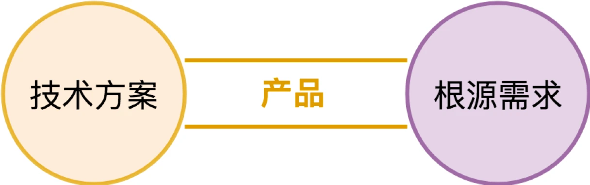
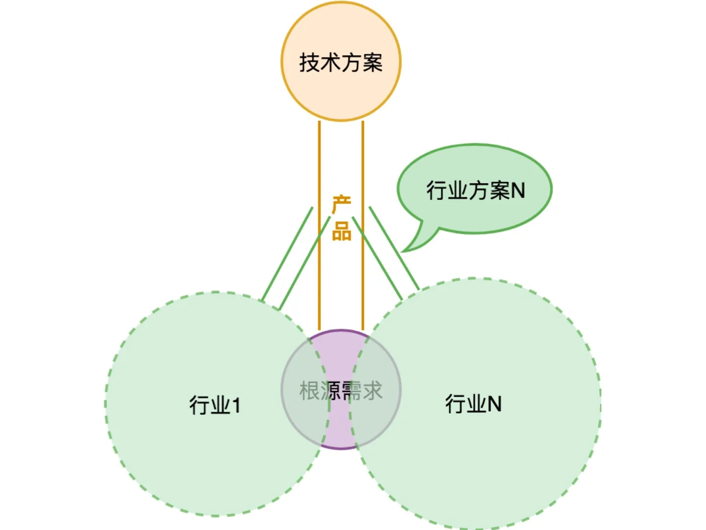
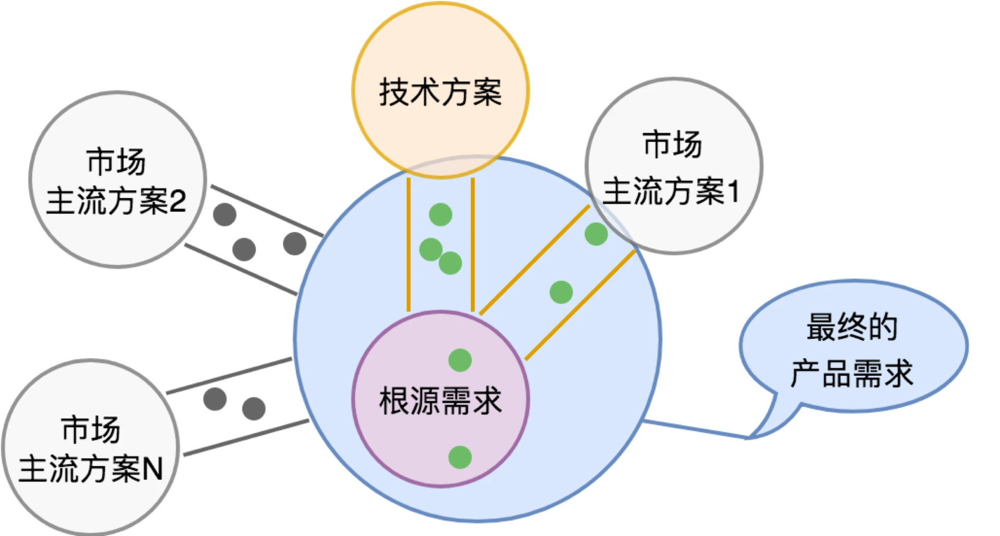

# 需求分析

原文链接：[17 | 架构：需求分析 (上) (geekbang.org)](https://time.geekbang.org/column/article/100140)

​				   [18 | 架构：需求分析 (下) · 实战案例 (geekbang.org)](https://time.geekbang.org/column/article/100930)

## 为什么要需求分析？

首先，当然是因为软件的本身就是为了满足用户的需求，那么，用户的需求为何，我们需要明确定义。

其次，需求边界的需要，用户的需求清楚了，不代表产品清楚了，用户需求的满足一定会有行业分工，我们做什么，合作伙伴做什么，需要清楚大家的边界。

最后，架构设计的需要，架构需要切分子系统，需要我们梳理并对用户需求进行归纳与抽象。架构还需要防止**过度设计**，把简单的事情复杂化。

```
Note：
什么是过度设计？
不会发生的事情你考虑了并且为它做足了准备，就是过度设计。但是判断是不是过度设计是很困难的，需要对需求未来演化有很强的判断力。

关于过度设计？
想着如何扩展肯定是好事，比想不到强太多，过度设计，这是架构师成长的必经之路。要想构建自己对需求发展的预判能力，就要分清楚需求的稳定点和变化点，这个是需要花时间在用户的需求理解上的，不可能一蹴而就。
```

从上述三个维度来看，需求分析需要包含以下内容：

- 我们要面向的核心用户人群是谁？
- 用户原始需求是什么？最核心问题是哪几个？
- 已经有哪些玩家在里面？上下游有哪些类型的公司，在我们之前，用户是怎么解决他们的问题的？我们的替换方案又是怎样的？
- 我们的产品创造的价值点是什么？用户最关注的核心指标是什么？
- 用户需求潜在的变化在哪些地方？区分出需求的变化点和稳定点。


**产品经理和架构师其实是一体两面。两者都需要关心用户需求与产品定义。**

为什么这么说呢？

一方面，用户需求的深层理解是很难传递的。你看到的产品文档，是产品经理和用户沟通交流后的二次理解，是需求的提炼和二次加工，很难原汁原味地传递用户的述求。所以架构师自己亲身近距离地接触用户，和用户沟通，去体会用户的述求是非常有必要的。

另一方面，产品设计过程需要架构师的深度参与，而不是单向的信息传递。产品本身是运用先进的技术来满足用户需求过程的产物。从这方面来看，**产品是桥，它一端连接了用户需求，一端连接了先进的技术**。产品经理，在挖掘需求的同时，也需要有技术高度的，他不一定要深刻了解技术的原理，但是一定要深刻理解新技术的边界。产品经理更多从用户需求出发，而架构师更多从技术实现出发，两者是在产品这座桥的两端相向而行，最终必然殊途同归。

## 怎么做需求分析？

怎么做需求分析，或者提升我们的需求分析能力，尤其是预判能力（判断需求的不稳定处，对需求的未来演化具有判断能力，从而做出开发性的设计而不是过度设计）？

首先，心态第一，心里得装着用户。除了需要 “在心里对需求反复推敲” 的严谨态度外，对**用户反馈的尊重之心**也至关重要。

其次，对问题刨根究底，找到**根源需求**。有很多用户反馈需求的时候，往往已经带着他自己给出的解决方案。

最后，在理清楚需求后，要对需求进行归纳整理。一方面，将需求分别归类到不同的子类别中。另一方面，形成需求的变化点和稳定点的基本判断。稳定点往往是系统的核心能力，而变化点则需要对应地去考虑扩展性上的设计。在分析需求的稳定点和变化点时需要明确的参考坐标系，因为不同的坐标系分析出的稳定点和变化点时不同的，所以需要明确的一点是，当我们说需求的变化点和稳定点时，这是**站在我们要设计的产品角度**来说的（不太理解这里说的站在要设计产品的角度 TODO ...）。

对变化点的梳理至关重要。产品功能必须是收敛的，必须是可完成的。如果某个子类别的需求呈现出发散而无法收敛的趋势，这个事情，团队一定要坐下来一起去反复推敲。

## 产品定义

需求分析的目标和最终结果，都是要最终形成清晰的产品定义，但产品定义并不是简单的产品需求的归类。

产品是桥，它一端连接了用户需求，一端连接了先进的技术。所以产品定义不可能做到和技术方案完全没关系。



什么是产品定义？

首先，需要明确产品中有哪些元素，或者叫资源，以及这些资源的各类操作方式。

其次，需要对**产品如何满足用户需求**进行确认。户的使用场景未必全部是我们的产品所能直接满足的，面向特定的行业，有可能需要相应的行业解决方案，把我们的产品整合进去。我们要**避免把行业方案视作产品的一部分**，而是是用开放的心态（而非竞争的心态）寻求合作伙伴一起完成这类行业的需求覆盖。



最后，产品定义还需要考虑市场策略，我们的产品如何进入市场，和既有市场格局中的其他主流解决方案的关系是什么样的。



比如，我们希望获取的用户，可能大部分都已经有一个既有的产品和技术方案，在满足他的需求。在考虑如何让客户从既有方案迁移到我们的产品后，我们确定产品的边界时又会复杂很多。在一些极其关键的市场，我们有可能会把迁移需求视作产品需求的一部分。但更多的情况下，我们产品上只为这些市场上的主流方案提供迁移路径，而不是完整的迁移方案。

## 为什么架构课从基础平台开始？

为什么在谈架构时会先谈诸如冯·诺伊曼计算机体系结构，编程语言和编译器，操作系统这些基础平台开始？

一是因为“基础平台” 是我们所依赖的环境，是我们应用的业务架构的一部分。越了解我们所处的环境，我们就越能够运用自如。对基础架构了解的越全面，做业务架构就会越从容，并且从基础架构到业务架构过度也会更加紧密自然。

二是直接探讨架构容易过度抽象，是围绕着基础平台的演进过程来谈需求分析更容易理解。信息世界的构建过程，本身就是一个最宏大的架构实践。我们通过对信息世界的骨架构成的参悟，能够帮助我们感悟到架构思维的要点。

所以，在谈这些基础平台时，我们起始关注的是：构建信息世界的宏观骨架和基础平台的需求演进的过程。

学内功需要悟心，学架构也需要悟心。怎么准确研判需求，对需求演进进行预测，这并不是靠技术技能，而是靠**谦和求取**的心态。

**学习架构，关键在于匠心与悟心**。