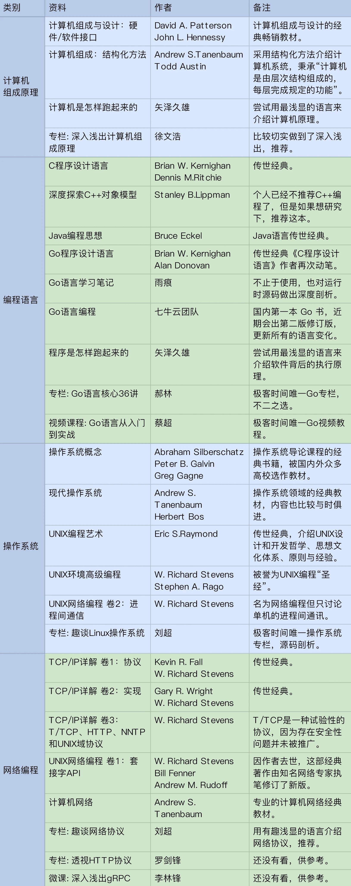

# 基础平台总结

原文链接：[19 | 基础平台篇：回顾与总结 (geekbang.org)](https://time.geekbang.org/column/article/101498)

## 抽象的信息世界的骨架

冯·诺依曼体系结构：CPU + 存储器 + 输入输出设备。

从需求演进角度看，虽然我们信息科技发展日新月异，但是底层设计并没有发生过变化，非常稳定。从这一点来说，我们不能不佩服他们的远见。

编程语言的演进

汇编语言的诞生，出现了程序员这个新职业开始，此后编程语言的演进便进入高速发展期。

然而，尽管语言很多，但是编程范式的演进却并不剧烈。大家熟知的过程式、函数式、面向对象基本上能够把几乎所有的语言都囊括其中。Go 语言独树一帜地宣称自己是面向连接的语言，我们着重对比了面向对象与面向连接思想上的差异。

编程语言本身与业务架构的设计关联性不大，虽然模块规格的描述会借助语言的文法。但是语言长期演进所沉淀下来的社区资源，是我们架构设计所依赖的重要基础。充分利用好这些资源可以大大降低系统的研发成本。

操作系统

从 UNIX => DOS => Windows/Mac/Linux => iOS/Android，从用户交互、进程管理、安全管理等角度看，操作系统的需求演变非常剧烈。

传统操作系统主要包含五个子系统：设备管理（包括存储设备、输入 / 输出设备、网络设备）、进程管理和安全管理。

操作系统的商业模式也发生了剧烈的变化

早期操作系统的营收模式以软件销售收入为主。但是从苹果的 iOS 开始，操作系统都无一例外地增加了以下三个模块：

- 账号（Account）；

- 支付（Pay）；

- 应用市场（AppStore）。

这里的账号不同于操作系统本机管理计算机的账号，是指互联网的账号。互联网账号的价值完全不同，它是支付和应用商店的基础。实现了“帐号 - 支付 - 应用市场”这样的商业闭环，意味着操作系统的商业模式，从软件销售转向了收税模式。这类操作系统，我们称之为现代操作系统。所有现代操作系统，所凭借的都是自己拥有巨大的流量红利。

## 基础平台参考资料

## 架构之美在于悟

学架构在于匠心和悟心。它靠的是悟，不是记忆。用思考的方式去记忆，而不是用记忆的方式去思考。

**我们日常所依赖的基础平台，随处可见的架构之美，看到了，悟到了，就学到了。如果你只能从你自己写业务代码中感受架构之道，那么你可能就要多留些心思了**。

作为架构师，如何构建需求分析能力，尤其是需求的预判能力？

首先，归纳总结能力很重要。分析现象背后的原因，并对未来可能性进行推测。判断错了并不要紧，分析一下你的推测哪些地方漏判了，哪些重要信息没有考虑到。

另外，批判精神也同样至关重要。批判不是无中生有的批评，而是切实找到技术中存在的效率瓶颈和心智负担。尤其在你看经典书籍的时候，要善于找出现状与书的历史背景差异，总结技术演进的螺旋上升之路，培养科学的批判方法论。