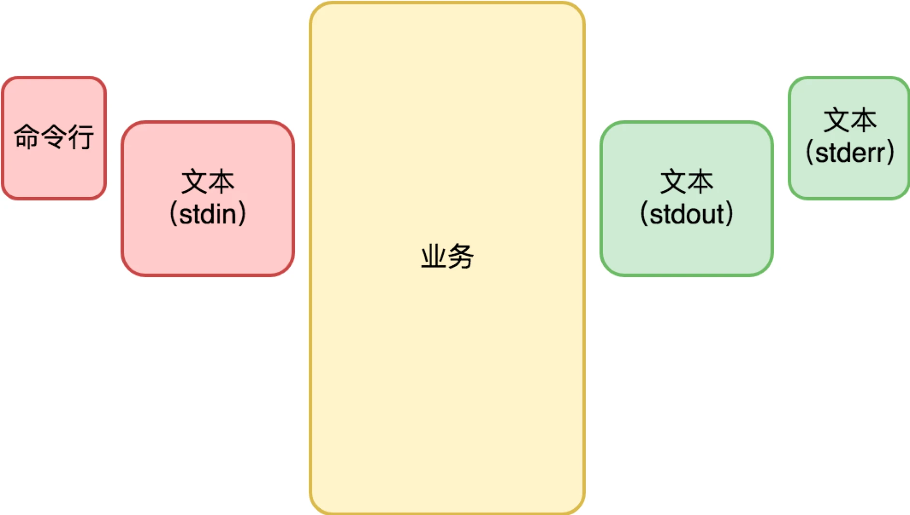
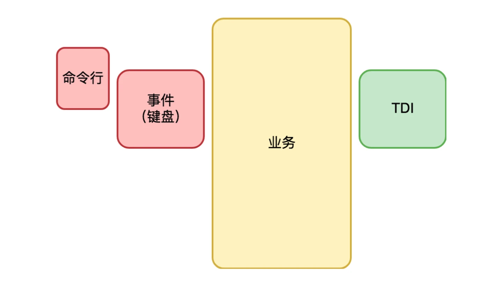
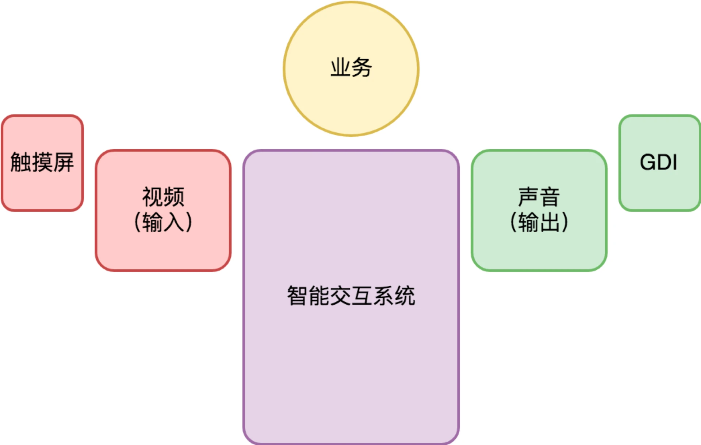
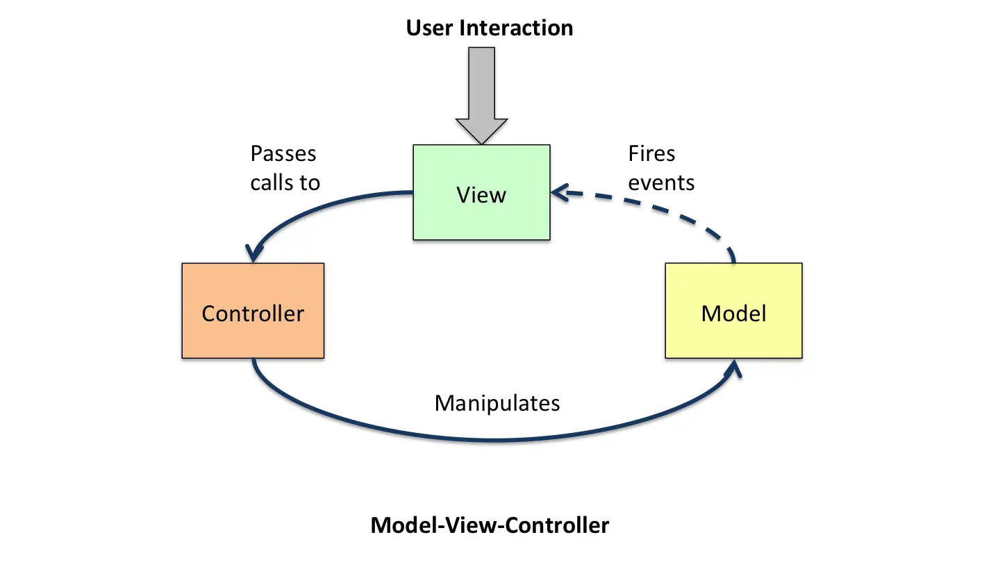

# 桌面开发

## 桌面开发的宏观视角

原文链接：[20 | 桌面开发的宏观视角 (geekbang.org)](https://time.geekbang.org/column/article/102260)

对于桌面程序，最关系的问题是交互，为了把关注点收敛到交互上，下面重点讨论操作系统对交互范式的设计。

### 命令行界面

命令行交互使用的设备是键盘 + 显示器。

输入被抽象为一段以回车（Enter 键）为结束的文本（通常是单行文本，要输入多行文本，需要在行末输入“ \ ”对回车进行转义）。

输入分为标准输出（stdout）和标准错误（stderr）都是向屏幕输出。

输入的方式有两种，命令行和标准输入（stdin），标准输入输出支持重定向，一个程序的输出，可以被重定向写入到文件（标准输出和标准错误可以输出到不同的文件以进行区分），也可以通过管道功能重定向为另一个程序的输入。

命令行交互程序的结构可示意如下：

### 字符界面

字符界面使用的交互设备也是键盘 + 显示器，但是输入不再是一段文本，而是键盘按键事件（KeyDown 和 KeyUp）。

输出也不是一段文本，而是可以修改屏幕任何位置显示的字符（屏幕被分割成 M*N 的格子，每个格子可以显示一个字符）。

这个时候，键盘的功用在需求上分化为两个：一是输入文本，二是输入命令。从输入文本的角度，需要有当前输入的光标（Caret）位置。字符界面程序保留命令行输入的方式，但一般不太使用标准输入。其结构示意如下：

### 图形界面

图形界面交互使用的设备是键盘 + 鼠标 + 显示器 + 音箱，从交互演进角度，这是一个划时代的变化。

与字符界面时期相比，**图形界面时代变化的根源是输出的变化：从字符变成像素**。屏幕被分割为精度更高的 M * N 的格子，每个格子显示的是一个很小很小的像素，每个像素可以有不同的颜色。

与字符界面程序相比，图形界面程序还有一个重大变化，就是多窗口。

窗口（Window），也有人会把它叫视图（View），是一个独立可复用的界面元素。复杂的窗口可以切分出多个逻辑独立的子窗口，以降低单个窗口的程序复杂性。

窗口有了父子和兄弟关系，就有了窗口系统。一旦界面涉及复杂的窗口系统，交互变得更为复杂。

为了降低编程的负担，窗口系统往往接管了桌面程序的主逻辑，提供了一套基于事件驱动的编程框架，业务代码由窗口系统提供的界面框架所驱动。整个程序的结构如下所示：

到了移动时代，手机成了最主流的计算机。使用的交互设备发生了变化，变成了触摸屏 + 麦克风 + 内置扬声器。鼠标交互方式被淘汰，变成了多点触摸。键盘 + 鼠标 + 显示器的能力被融合到触摸屏上。音箱也被内置到手机中，变成内置扬声器。这些变化都是移动设备便携性的需求引起的，从架构角度，本质上还是桌面交互。

### 智能交互

智能语音交互，如 Siri。
未来交互会怎样？智能交互很可能不会止步于语音，而是视频（同是兼顾视觉和听觉），且与触摸屏完美融合。使用的交互设备有触摸屏 + 摄像头 + 麦克风 + 内置扬声器。整个程序的结构如下所示：

上述交互场景主要是人与终端的交互，在信息技术领域，交互不仅仅是人与终端，也有可能是终端与终端之间的交互，比如：

- 商品自助结算（图像识别、磁识别、一维码等），商品与结算机的交互。
- NFC 刷公交卡，共享单车的开锁（扫码、蓝牙），终端与其它设备的交互。
- 汽车的方向盘交互（未来演化为自动驾驶交互），方位控制。
- 摇杆控制（无人机等设备），涉及了空间方位的控制。

在万物互联的未来，传感器会变的更丰富，智能程度也增高，反而物与物之间、终端与物体之间的交互会更多，反而人不需要经常作为任务的发起点进行太多交互，更多的交互放在智能设备（不局限于手机、计算机）之间。

## 图形界面程序的框架

原文链接：[21 | 图形界面程序的框架 (geekbang.org)](https://time.geekbang.org/column/article/104436)

图形界面的交互方式仍然是主流形式，它的结构如下所示：

### 事件队列

无论是什么桌面操作系统，每个进程都有一个全局的事件队列（Event Queue）。当我们在键盘上按了一个键、移动或者点击鼠标、触摸屏幕等等，都会产生一个事件（Event），并由操作系统负责将它扔到进程的事件队列。整个过程大体如下：

- 键盘、鼠标、触摸屏等硬件产生了一个硬件中断。
- 操作系统的硬件中断处理程序收到对应的事件（Event）。
- 确定该事件的目标进程。
- 将事件放入目标进程的事件队列（Event Queue）。

### 窗口与事件响应

窗口（Window），也有人会把它叫视图（View），是一个独立可复用的界面元素（UI Element）。一个窗口响应发送给它的事件（Event），修改内部的状态，然后调用 GDI 绘制子系统更新界面显示。

响应事件的常见机制有两种：

- 一种是事件处理类（EventHandler，在 iOS 中叫 Responder）

- 另一种是用委托（delegate）。

### 事件派发

事件是怎么从全局的事件队列（Event Queue）到窗口的呢？

这就是事件分派（Event Dispatch）过程，它通常由一个事件分派循环（Event Dispatch Loop）来完成。一些平台把这个过程隐藏起来，直接提供一个类似 RunLoop 这样的函数。也有一些平台则让你自己实现。

窗口有了父子和兄弟关系，就有了窗口系统。一旦界面涉及复杂的窗口系统，交互变得更为复杂。事件分派过程怎么知道应该由哪个窗口响应事件呢？

这就是事件处理链（EventHandler Chain）。

不同事件的分派过程并不一样。

对于鼠标或者触摸屏的触摸事件，事件的响应方理应是事件发生处所在的窗口。但也会有一些例外的场景，比如拖放。为了支持拖放，Windows 系统引入了鼠标捕获（Mouse Capture）的概念，一旦鼠标被某个窗口捕获，哪怕鼠标已经移出该窗口，事件仍然会继续发往该窗口。

对于键盘事件（onKeyDown/onKeyUp/onChar），则通常焦点窗口先响应，如果它不感兴趣再逐层上升，直到最顶层的窗口。

### 窗口内容绘制

在收到 onPaint 或 onDraw 消息时，我们就要绘制我们的窗口内容了，这时就需要操作系统的 GDI 子系统。GDI 含义是图形设备接口（Graphic Device Interface），它指的是一组向指定窗口（注意不是屏幕）绘制图形的方法集合

从大分类来说，我们首先要确定要绘制的内容是 2D 还是 3D 的。对于 2D 内容，操作系统 GDI 子系统往往有较好的支持，但是不同平台终究还是会有较大的差异。而对于 3D 内容来说，OpenGL 这样的跨平台方案占据了今天的主流市场，而 Vulkan 号称是 NextGL（下一代的 OpenGL），其潜力同样不容小觑。

### 通用控件

为了进一步简化开发过程，操作系统往往还提供了一些通用的界面元素，通常我们称之为控件 (Control)。常见的控件有如下这些：

静态文本（Label）、按钮（Button）、单选框（RadioBox）、复选框（CheckBox）、输入框（Input，也叫 EditBox/EditText）、进度条（ProgressBar）等。

## 桌面应用程序架构建议

### MVC 

关于桌面程序，我想你听得最多的莫过于 MVC 这个架构范式。MVC 架构为桌面应用程序最核心的交互问题提出了解决方案。

MVC 全称是 “模型 (Model)- 视图 (View)- 控制器 (Controller)”。Model 是数据，View 是数据的显示结果，同时也接受用户的交互动作，也就是事件。Controller 负责 Process（处理），它接受 “Model + 由 View 转发的事件” 作为 Input，处理的结果（Output）仍然是 Model，它更新了 Model 的数据。

MVC 架构图：

在图中，View 监听 Model 层的数据变更事件。View 转发用户交互事件给 Controller。Controller 则负责将用户交互事件转为 Model 层的 DOM API 调用。

Model

DataCore + DataChanaged

DataCore 

Model 层的职责不应该是简单的承载数据，应该是负责业务需求的内核逻辑。从界面编程来讲，Model 层应该是和操作系统的界面程序框架最为无关的部分，是接近业务需求的部分，是最容易测试的部分，也同时是跨平台最容易的部分，所以将某种技术框架和 Model 层融合，导致了 Model 层边界的不稳定。

DataChanaged

Model 在数据变化是应该发出 DataChanaged 事件。

Model 层作为架构的最底层，它不需要知道其他层的存在，不需要知道到底是 MVC 还是 MVP，或者是其他的架构范式。DataChanged 事件就是 Model 层面对需求变化点的对策。

View

View 层首要的责任，是负责界面呈现。View 层另一个责任是被自然带来的，那就是：它是响应用户交互事件的入口，这是操作系统的界面编程框架决定的。

View 的设计细节中，也有很多问题需要考虑：

- View 层不一定会负责生成所有用户看到的 View。有的 View 是 Controller 在做某个逻辑的过程中临时生成的，那么这样的 View 就应该是 Controller 的一部分，而不应该是 MVC 里面的 View 层的一部分。
- View 层可能需要非常友好的委托（delegate）机制的支持。例如，支持一组界面元素的交互事件共同做委托（delegate）。
- 负责界面呈现，意味着 View 层和 Model 层的关系非常紧密，紧密到需要知道数据结构的细节，这可能会导致 Model 层要为 View 层提供一些专享的只读访问接口。这合乎情理，只是要确保这些访问接口不要扩散使用。
- 负责界面呈现，看似只是根据数据绘制界面，似乎很简单，但实则不简单。原因在于：为了效率，我们往往需要做局部更新的优化。在局部更新这个优化足够复杂时，我们往往不得不在 Model 和 View 之间，再额外引入一层 ViewModel 层来做这个事情。ViewModel 层顾名思义，是为 View 的界面呈现而设计的 Model 层，它的数据组织更接近于 View 的表达，和 View 自身的数据呈一一对应关系（Bidi-data-binding）。

Controller

Controller 层是负责用户交互的。可以有很多个 Controller，分别负责不同的用户交互需求。

负责用户交互的 Controller 层，是可以被分解的，而且应该作正交分解，彼此完全没有耦合关系。从这点来看，Controller 层最应该思考的问题是代码的内聚性。

一个 Controller 模块，可能包含一些属于自己的辅助 View，也会接受 View 层委托的一些事件，由事件驱动自己状态，并最终通过调用 Model 层的使用接口来完成一项业务。

分层

从分层角度，我们会倾向于认为 Model 层在最底层；View 层在中间，它持有 Model 层的 DOM 指针；Controller 层在最上方，它知道 Model 和 View 层，它通过 DOM 接口操作 Model 层，但它并不操作 View 去改变数据，而只是监听自己感兴趣的事件。

### 再谈 MVC

原文链接：[32 | 架构：系统的概要设计 (geekbang.org)](https://time.geekbang.org/column/article/117783)

虽然不同桌面应用的业务千差万别，但是桌面本身是一个很确定性的领域，因此会形成自己固有的系统分解的套路。这个套路就是 MVC 架构。

桌面程序的核心关注点是和用户交互，虽然每个时期桌面程序的交互方不太一样，但是它们的框架结构是非常一致的，都是基于事件分派做输入，GDI 做界面呈现。

为什么会形成 MVC 架构类应对大多数的桌面程序开发呢？

本质上还是桌面程序的需求决定的。对于需求分析来说，要分清需求的稳定点和变化点。稳定点是系统的核心能力，而变化点则需要做好开放性设计。

从这个角度来看，我们可以认为，**业务的核心逻辑是稳定，业务的核心逻辑也体现了系统的核心价值**，除非出现了新的技术革命导致产品的内在逻辑发生了质的变化。所以我们最底层一般以类和函数的形态来组织业务的核心逻辑，这就是 Model 层。

用户交互是一个变化点，大家都是一个 “画图” 程序，无论是在 PC 桌面和手机上，Model 层是一样的，但是用户交互方式并不一样，View、Controllers 就有不小的差别。

当然 Model 层也有自己的变化点。它的变化点在于存储和网络。Model 层要考虑持久化，就会和存储打交道，就有自己的 IO 子系统。Model 层要考虑互联网化，就要考虑 B/S 架构，考虑网络协议。不过无论是存储还是网络，从架构视角来说变化都是可预期的。存储介质会变，网络技术会变，但是变的只是实现，它们的使用接口并没变化。这意味着 Model 层不只是核心逻辑稳定，IO 和网络子系统也都很稳定。当然这也是把它们归于 Model 层的原因。

用户交互这个变化点，主要体现在两个方面。一方面是屏幕尺寸导致的变化。更小的屏幕意味着界面上的信息需要被更高效地组织起来。另一方面则是交互的变化，鼠标交互和触摸屏的多点触摸交互是完全不同的。

View 层主要承担了界面呈现的工作。当然这也意味着它也承担了屏幕尺寸这个变化点。

Controller 层主要承担的是交互。具体来说就是响应用户的输入事件，把用户的操作转化为对 Model 层的业务请求。Controller 层有很多 Controller。这些 Controller 通常各自负责不同的业务功能点。

也就是说，Model 层是一个整体，负责的是业务的核心逻辑。View 层也是一个整体，但在不同的屏幕尺寸和平台可能有不同的实现，但数量不会太多。而且现在流行所谓的响应式布局，也是鼓励尽可能在不同屏幕尺寸不同平台下共享同一个 View 的实现。Controller 层并不是一个整体，它是以插件化的形式存在，不同 Controlller 非常独立。

### 兼容 API

对于一个桌面程序最核心的问题是交互问题，解决这个问题便要引入合理的架构，比如 MVC 以及它的变体。

我们同时也需要为应用程序提供应用程序的二次开发接口（API，全称为 Application Programming Interface），**建立程序的应用生态**。提供了 API 的应用程序，意味着它身处一个应用生态之中，可以与其他应用程序完美协作。