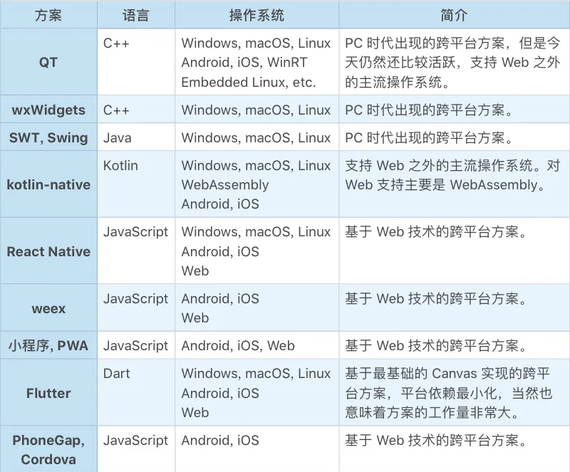
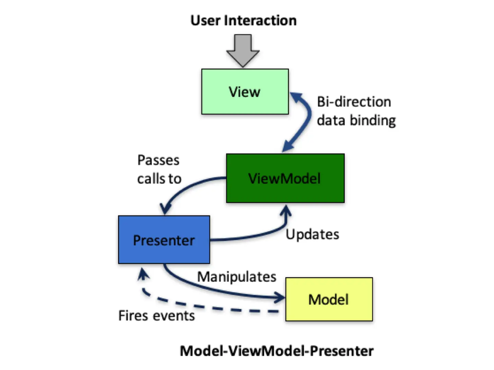

# Web 开发

## 浏览器、小程序、PWA

原文链接：[23 | Web开发：浏览器、小程序与PWA (geekbang.org)](https://time.geekbang.org/column/article/106156)

### 浏览器

从商业价值来看，浏览器带来的进步是以下三点：

- **软件服务化**。当产品从原生应用（Native App）的单机程序走向云服务后，社会分工就发生了巨大的变化。
- **随时发布**。这极大改进了软件迭代的效率。
- **跨平台**。浏览器消除了不同操作系统平台的差异性，让一份代码到处运行成为可能

从界面开发的角度来讲，浏览器有给我们带来了以下变化：

- 操作系统的窗口系统被覆盖。

  浏览器中，一个网页就是一个窗口，不再有父子窗口。网页中的界面元素都是虚拟视图（Virtual View），无论是大家耳熟能详的通用控件（比如 input，image，div 等等），还是自绘窗口（canvas）都一样。这种虚拟视图的抽象使得可以通过统一的机制来完成事件分派。

- 窗口的绘制机制变化了。之前是调用操作的 GDI 绘制界面，现在是使用 HTML + CSS 声明界面。它们最大的区别是，一个在绘制界面，一个在声明界面。

  View 层的一大难点是做**局部更新**的优化。在 View 局部优化比较复杂的时候，我们甚至会引入 ViewModel 层来做视图局部更新的支持。从这一点来看，HTML + CSS 更像是 ViewModel 成，一旦 HTML DOM 被修改时，浏览器就自动更新了 View，局部更新的优化，由浏览器来完成。

- 语言限制。浏览器的确大幅改善了界面开发的效率，但是从语言支持的角度，大部分操作系统都支持各种语言作为开发工具，而浏览器长期以来只支持 JavaScript 一门语言。

- B/S 架构。无论是 B/S 还是 C/S，本质上还是软件服务化。这对软件架构产生了巨大影响。

  一方面，从 Server 端的逻辑看，系统从单用户变成了多用户。另一方面，从 Browser 端（或 Client 端）看，仍然是单用户，但是没有了数据，数据都在 Server 端。这对应用架构提出了新的挑战。

从技术角度来看，浏览器主要带来了：

- 跨平台桌面程序开发。
- Web 开发（B/S 新型架构应用）。

**DOM**

原文链接：[DOM概述 - Web API 接口参考 | MDN (mozilla.org)](https://developer.mozilla.org/zh-CN/docs/Web/API/Document_Object_Model/Introduction)

文档对象模型（DOM）是 HTML 和 XML 文档的编程接口。它提供了对文档的结构化的表述，并定义了一种方式可以使从程序中对该结构进行访问，从而改变文档的结构，样式和内容。DOM 将文档解析为一个由**节点和对象**（包含属性和方法的对象）组成的结构集合。简言之，它会**将 Web 页面和脚本或程序语言连接起来**。

### 小程序

2016 年 9 月，微信小程序（最初叫“应用号”）开始内测。

> 小程序是一种不需要下载安装即可使用的应用，它实现了应用“触手可及”的梦想，用户用扫一扫或者搜一下即可打开应用。     ——微信之父 张小龙

小程序更像是 Native 程序在线化，而不是 PC Web 移动化。因为小程序是一个应用，而不是由一个个 Web 页面构成。

我们需要提交应用给微信或支付宝，他们也会像苹果审核 AppStore 上的应用一样，掌控着 App 的生杀大权。而且理论上可以比苹果更牛的是，他们可以下线一个已经有千万甚至上亿级别用户的 App，让他们一无所有。苹果可以掐掉一个 App 的新增，他们可以掐掉一个 App 的全部。

### PWA

国内大厂们纷纷布局小程序的时候，Google 也在发力自己的移动浏览器方案，叫 PWA，全称 “Progressive Web App”。

PWA 本质上还是 Web App，借助了新技术具备了一些 Native App 的特性，所以它兼具 Web App 和 Native App 的优点，同时在安全、体验和用户黏性三个方面都有很大的提升。

## 跨平台 Web 开发建议

原文链接：[24 | 跨平台与 Web 开发的建议 (geekbang.org)](https://time.geekbang.org/column/article/107128)

在思考浏览器从技术上给我们带来什么的时候，我们可以把它分为两点：

- 跨平台桌面程序的开发；
- Web 开发（B/S 架构的新型应用）。

### 跨平台桌面程序开发

跨平台是桌面程序开发的一个难题，主要是因为以下两个原因：

- 操作系统的差异，不同的操作系统抽象的界面程序框架并不一致，这些不一致性必然增加开发的难度。放弃某个操作系统，就意味着放弃某个流量入口，也就意味着放弃这些用户。所以虽然很麻烦，我们还是不得不支持着每一个主流的操作系统。
- 屏幕尺寸。就算相同的操作系统，在不同尺寸的屏幕上，交互的范式也会存在很大的差异性，这也会导致不低的跨平台工作量。

首先我们看下操作系统

- C 本地：Windows，macOS，Linux 等等。
- PC Web：Chrome，Safari，FireFox 等等。
- Mobile 本地：Android，iOS 等等。
- Mobile Web：小程序，PWA 等等。

屏幕尺寸

- 大屏：PC、笔记本，Pad 等等。
- 中屏：手机。
- 小屏：手表。

**跨平台解决方案**：

关于跨平台开发，我觉得有一句话特别深刻：“每一次统一的努力，都最终变成新的分裂”。当然，这样的事情在很多领域都会发生，只是跨平台开发更加如此。

### Web 开发

浏览器给我们从技术上带来了 Web 开发，Web 的 B/S 架构有了更高的复杂性，这主要表现在以下几个方面：

- 多用户

  有了 Server 端，意味着用户的数据不再是保存在 Client（Browser）端，而是存储在 Server 端。

- 更高的数据可靠性（安全）要求

  数据在 Client 端，客户自己对数据的可靠性负责。硬盘坏了，数据丢了，用户会后悔没有对数据进行备份。但是一旦数据在 Server 端，数据可靠性的责任方就到了软件厂商这边。

- 更可能的分工安排

  详细来说，Web 应用从流派来说，分为两大类：胖前端与胖后端。
  
  所谓**胖前端**，是指把尽可能多的业务逻辑放在前端。极端情况下，整个网站就是一个单页的应用。胖前端无论开发体验还是用户体验，都更接近于本地应用（Native App）。
  
  所谓**胖后端**，是指主要逻辑都在后端，包括界面交互的事件响应，也通过网络调用交给了后端来实现。

客户端

也就是浏览器。

浏览器界面框架并没有窗口系统，取而代之的是 HTML + CSS 这些标记语言来描述页面。HTML + CSS 更像是 ViewModel 层，因为 HTML DOM 从数据角度完整描述了界面的样子，而 View 层已经被浏览器自己实现了。

这极大简化了界面开发的复杂性，因为界面的**局部更新**是一个复杂的话题，今天浏览器通过引入 HTML+CSS 这样的 ViewModel 层把它解决了，一旦 HTML DOM 被修改时，浏览器就自动更新了 View，局部更新的优化由浏览器来完成，不需要程序员去控制，从而简化了界面开发。

这个时候我们重新看 MVC 框架在浏览器下的样子，你会发现它变成了 MVMP 模式，全称为 “Model-ViewModel-Presenter”，如下所示：

**事件响应过程**，浏览器的 View 收到了用户的交互事件，它把这些事件委托（delegate）给了 ViewModel 层，并且通过 HTML DOM 暴露出来。通过修改 HTML 元素的事件响应属性，一般名字叫 onXXX（比如 onclick），可以获得事件的响应机会。

**Model 层的数据变化（DataChanged）事件**。在标准的 MVC 模式中，Model 层的数据变化是通知到 View 层，但是在浏览器下 View 是由浏览器实现的，要想让它接受 DataChanged 事件并且去处理是不太可能了。所以解决思路自然是让 Controlller 层来做，这样就变成了 MVP 模式。 但是我们又不是标准的 MVP，因为 Presenter 层更新界面（Update View）并不是操作 View，而是 ViewModel。

综上，浏览器下的 MVC，最终实际上是 MVMP（Model-ViewModel-Presenter）。

服务端

Server 端的架构：

在图中，我们把服务端分成了两层。

- 底层是多租户的 Model（Multi-User Model）层，实现了自动化（Automation，指外部系统对我们业务的 API 请求）所需的 API，一般情况下它是一套 RESTful API 接口。

- 上层是 Web 层，对外提供 **Web API**。Web 层和 Model 层的假设不同，Web 层是基于会话的（Session-based），因为它负责用户的接入，每个用户登录后，会形成一个个会话（Session）。Web 层又分为 Session-based Model 层和 Session-based ViewModel 层。

  在服务端，Session-based Model 和 Session-based ViewModel 并不发生直接关联，它们通过自己网络遥控浏览器这一侧的 Model 和 ViewModel，从而响应用户的交互。

  Session-based Model 是什么样的呢？它其实是 Multi-User Model 层的转译。把多租户的 API 转译成单租户的场景。所以这一层并不需要太多的代码，甚至理论上自动实现也是有可能的。

  Session-based ViewModel 是一些 HTML+JavaScript+CSS 文件。它是真正的 Web 业务入口。它通过互联网把自己的数据返回给浏览器，浏览器基于 ViewModel 渲染出 View，这样整个系统就运转起来了。

  这里的 **Web API** 是基于 session 的，和 Multi-User Model 中的 RESTful API 不同，具有 session 这个状态，而 RESTful API 强调无状态。

