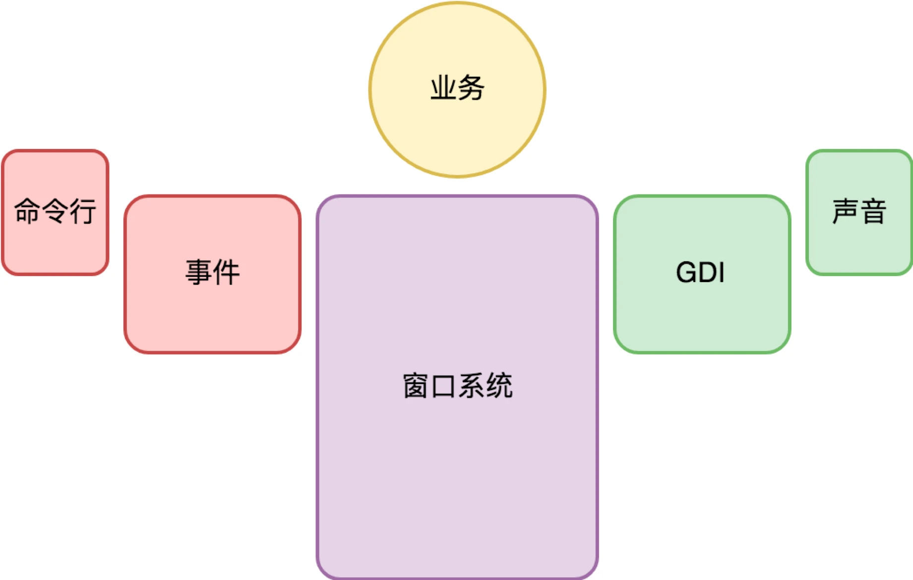

# 桌面开发总结

原文链接：[33 | 桌面开发篇：回顾与总结 (geekbang.org)](https://time.geekbang.org/column/article/118674)

## 基础平台

Native 桌面操作系统和浏览器的演变过程。

交互是桌面系统相关技术迭代的根源，每一次桌面系统大的变更周期，都是由一场新的交互革命所驱动。

虽然现在有很多桌面操作系统，使用的接口不尽相同，但都是基于事件分派做输入，GDI 做界面呈现。

互联网的出现，衍生出了浏览器，它支持了一种新的应用形态：Web 应用。这意味着在操作系统之上，产生了一个新操作系统。Web 应用也在演变，从静态页，到以 Gmail 为代表的 AJAX 应用，到 PWA，到小程序。

PC 浏览器之争已经结束，但移动浏览器的竞争才刚开始。

## 业务架构

谈如何开发一个桌面软件。

怎么做一个桌面程序？

标准的套路是 MVC 架构。无论是单机还是 Web 应用，它都是适用的，只是 Web 程序需要考虑客户端与服务端的分工，需要引入网络协议。

跨平台开发，是桌面程序开发绕不过去的问题。

桌面开发的未来趋势，**桌面开发技术的演进，目标是越来越低的门槛**，它和儿童编程教育相向而行，有一天必然汇聚于一点上。

系统架构（概要设计）打的是地基。

这个阶段需要选择操作系统、选择语言、选择主框架，选择项目所依赖的最核心的基础设施。这就是我说的有关于基础架构的工作。

这个阶段也需要分解业务系统。我们一般以子系统为维度来阐述系统各个角色之间的关系。对于关键的子系统，我们还会进一步分解它，甚至详细到把该子系统的所有模块的职责和接口都确定下来。

个阶段我们的核心意图并不是确定系统完整的模块列表，我们的焦点是整个系统如何被有效地串联起来。如果某个子系统不作进一步的分解也不会在项目上有什么风险，那么我们并不需要在这个阶段对其细化。

为了降低风险，概要设计阶段也应该有代码产出。

这样做的好处是，一上来我们就关注了全局系统性风险的消除，并且给了每个子系统或模块的负责人一个更具象且确定性的认知。

代码即文档。代码是理解一致性更强的文档。

## 桌面开发参考资料

桌面开发需要关注的技术：

- JavaScript。毫无疑问，这是当前桌面开发的第一大语言，务必要精通。这方面我推荐程劭非（winter）的极客时间专栏“重学前端”。
- 微信小程序。这方面资料比较少，我推荐高磊的极客时间视频课“9 小时搞定微信小程序开发”。
- React 和 Vue。这应该当前比较知名的两大前端框架，可以学习一下。前者可以看下王沛的“React 实战进阶 45 讲”，后者可以看下唐金州的“Vue 开发实战”。
- Flutter 和 SwiftUI。这两个技术很新，其中 Flutter 已经有一些资料，比如陈航的“Flutter 核心技术与实战”。SwiftUI 与 Swift 语言关联很紧，在张杰的“Swift 核心技术与实战”中有所涉略。
- PWA 和 WebAssembly。
- Android、iOS。

