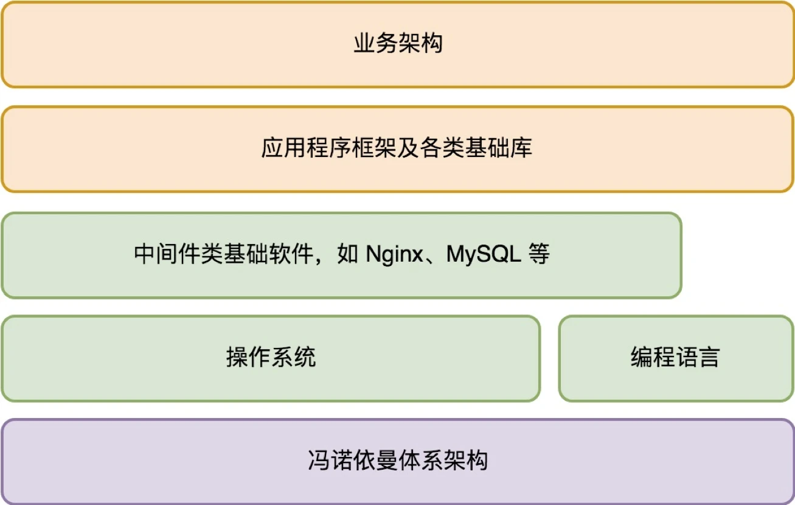

# 服务端开发的宏观视角

原文链接：[34 | 服务端开发的宏观视角 (geekbang.org)](https://time.geekbang.org/column/article/120049)

桌面开发技术的迭代，是交互的迭代，是人机交互的革命。而服务端开发技术的迭代，虽然一开始沿用了桌面操作系统的整套体系框架，但它正逐步和桌面操作系统分道而行，转向数据中心操作系统（DCOS）之路。

## 服务端程序的需求

桌面程序是面向单个用户的，服务端程序是被多个用户共享的，这是服务端程序和桌面程序不同的一点。

- 规模

  服务端程序是被所有用户所共享，为所有用户服务的。一台物理的机器资源总归是有限的，能够服务的用户数必然存在上限，所以一个服务端程序在用户规模到达一定程度后，需要**分布式化**，跑在多台机器上以服务多个用户。

- 连续服务时长

  桌面程序是为单个用户服务的，用户在单个桌面程序的连续使用时长通常不会太长。但是服务端程序不同，它通常都是 7x24 小时不间断服务的。当用户规模达到一定基数后，每一秒都可能会有用户在使用它，不存在关闭程序这样的概念。

- 质量要求

  桌面程序崩溃影响的用户只有一个，但服务端程序崩溃影响的用户可能有多个，这意味着两者对程序运行崩溃的容忍度不同。我们没办法要求服务器不会崩溃，但是在它崩溃时它的工作必须立刻转交给其他的实例。所以，服务端程序必须是多实例的。单个程序实例的临时不可用状态，要做到用户无感知。

## 服务端体系架构

一个服务端程序完整的体系架构如下：

一个服务端的程序必然设计网络，考虑到网络后，服务端的体系架构如下：

从宏观视角看，一个服务端程序应该首先是一个多实例的分布式程序，其宏观体系架构示意如下：

