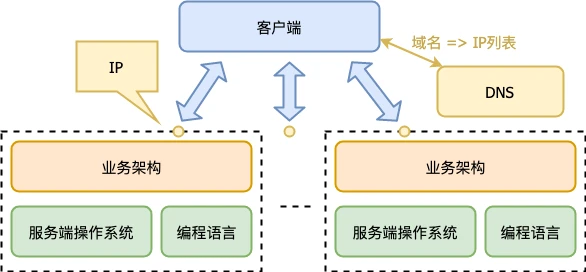

# 流量调度和负载均衡

原文链接：[35 | 流量调度与负载均衡 (geekbang.org)](https://time.geekbang.org/column/article/125952)

相比桌面程序而言，服务端程序依赖的基础软件不只是操作系统和编程语言，还多了两类：

- 负载均衡（Load Balance）；
- 数据库或其他形式的存储（DB/Storage）。

## 流量调度

什么是 “流量调度”？我们首先要了解这样几个常见的服务端程序运行实例（进程）相关的概念：

- 连接数；
- IOPS；
- 流量，入向流量和出向流量。

一个基本的服务端程序的服务请求，通常是由一个请求包（Request）和一个应答包（Response）构成。这样一问一答就是一次完整的服务。连接数，有时候也会被称为并发数，指的是同时在服务中的请求数。也就是那些已经发送请求（Request），但是还没有收完应答（Response）的请求数量。

IOPS，指的是平均每秒完成的请求（一问一答）的数量。它可以用来判断服务端程序的做事效率。

流量分入向流量和出向流量。

- 入向流量可以这么估算：平均每秒收到的请求包（Request）数量 * 请求包平均大小；

- 出向流量可以这么估算：平均每秒返回的应答包（Response）数量 * 应答包平均大小。

### DNS 流量调度

一个域名通过 DNS 解析到多个 IP，每个 IP 对应不同的服务端程序实例。这样就完成了流量调度。这里我们没有用到常规意义的负载均衡（Load Balance）软件，但是我们的确完成了流量调度。

这种做法有什么不足？

- 升级不便

  要想升级 IP1 对应的服务端程序实例，必须先把 IP1 从 DNS 解析中去除，等 IP1 这个实例没有流量了，然后我们升级该实例，最后把 IP1 加回 DNS 解析中。看起来还好，但是我们不要忘记，DNS 解析是有层层缓冲的。我们把 IP1 从 DNS 解析中去除，就算我们写明 TTL 是 15 分钟，但是过了一天可能都还稀稀拉拉有一些用户请求被发送到 IP1 这个实例。所以通过调整 DNS 解析来实现升级，有极大的不确定性，完成一个实例的升级周期特别长。

- 流量调度不均衡

  DNS 服务器是有能力做一定的流量均衡的。比如第一次域名解析返回 IP1 优先，第二次域名解析让 IP2 优先，以此类推，它可以根据域名解析来均衡地返回 IP 列表。是域名解析均衡，并不代表真正的流量均衡。但是域名解析均衡，并不代表真正的流量均衡。一方面，不是每次用户请求都会对应一次 DNS 解析，客户端自己有缓存。另一方面，DNS 解析本身也有层层缓存，到 DNS 服务器的比例已经很少了。

## 负载均衡

### 网络层负载均衡

章文嵩博士发起的负载均衡软件 LVS（Linux Virtual Server）就工作在这一层。LVS 支持三种调度模式：

- VS/NAT：通过网络地址转换（NAT）技术做调度。请求和响应都会经过调度器中转，性能最差。
- VS/TUN：把请求报文通过 IP 隧道转发至真实服务器，而真实服务器将响应直接返回给客户，所以调度器只处理请求报文。这种做法性能比 VS/NAT 好很多。
- VS/DR：通过改写请求报文的 MAC 地址，将请求发送到真实服务器，真实服务器将响应直接返回给客户。这种做法相比 VS/TUN 少了 IP 隧道的开销，性能最好。

### 应用层负载均衡

应用网关。

HTTP 网关收到一个 HTTP 请求（Request）后，根据一定调度算法把请求转发给后端真实的业务服务器实例 RS（Real Server），收到 RS 的应答（Response）后，再把它转发给客户端。

服务端重试解决某个服务实例出错的问题，在发现某个 RS 实例挂了后，HTTP 网关可以将同一个 HTTP 请求（Request）重新发给其他 RS 实例。

为了能够支持重试，HTTP 请求（Request）需要被保存起来。

大部分 HTTP 请求不大，直接在内存中存储即可，保存代价不高。但是文件上传型的请求，由于请求包中包含文件内容，可能就需要依赖临时文件或其他手段来保存 HTTP 请求。

### 优雅升级

负载均衡的价值并不只是做流量的均衡调度，它也让我们的业务服务器优雅升级成为可能。

通过流量调度的能力，将需要升级的实例的流量隔离，升级好后在恢复流量。