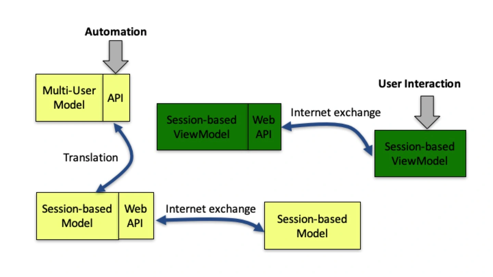
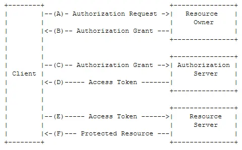
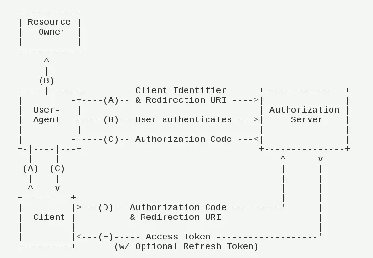

# 服务端程序架构建议

原文链接：[40 | 服务端的业务架构建议 (geekbang.org)](https://time.geekbang.org/column/article/134384)

在Web开发中，提到了服务端体系架构图：

在图中，我们把服务端分成了两层。底层是 Multi-User Model 层，一般情况下它对外提供了一套 RESTful API 接口。上层是 Web 层，对外提供 Web API。Web 层又分为 Session-based Model 层和 Session-based ViewModel 层。

一般来说，Session-based Model 是一个非常简单的转译层。而在胖前端的模式下，Session-based ViewModel 层也几乎没有任何后端的代码，就是一些托管的资源文件，包含一些 HTML + CSS + JavaScript 文件。

我个人会倾向于认为，Session-based ViewModel 层属于桌面开发的范畴，哪怕是胖后端的模式下也会这样去归类。只不过在胖后端的方式下，桌面程序的很多逻辑不再是由 JavaScript 完成，而是由类似 PHP 之类的语言完成。

所以在谈论服务端程序开发建议时，主要谈的是 Multi-User Model 层。

## 网络协议

**这里说的网络协议是指服务端程序的使用界面（接口）**。

探讨 Multi-User Model 层，第一个重要话题是网络协议，它是服务端程序的使用界面（接口）。考虑到这一层网络协议往往提供的是 **RESTful API**，所以有时它也会被称为 RESTful API 层。

RESTful API

所谓 RESTful，是指符合 REST 原则。REST 的全称是 “Representational State Transfer”。它强调的是：

- 客户端和服务器之间的交互在请求之间是 “无状态” 的。这里的无状态更严谨的说法是 “无会话（Session）” 的，从客户端到服务器的每个请求，都必须包含理解请求所必需的完整信息。服务器可以在请求之间的任何时间点重启，客户端不会得到通知。
- REST 原则第二个强调的点，是统一的表现规范，也就是 Representational 一词传递的意思。它认为，所有网络 API 请求都应该统一抽象为对某种资源 URI 的 GET、PUT、POST、DELETE 操作。

REST 是 Representational State Transfer的缩写，如果一个架构符合REST原则，就称它为RESTful架构。RESTful 架构可以充分的利用 HTTP 协议的各种功能，是 HTTP 协议的最佳实践。RESTful API 是一种软件架构风格、设计风格，可以让软件更加清晰，更简洁，更有层次，可维护性更好。

更多关于 RESTful 参考：

[RESTful API 一种流行的 API 设计风格](https://restfulapi.cn/)

[What is REST | (restfulapi.net)](https://restfulapi.net/)

## 授权

原文链接：[44 | 实战（四）：“画图”程序后端实战 (geekbang.org)](https://time.geekbang.org/column/article/140069)

当前，主流的授权方式有两种：一种是**基于 Token**，一种是**基于 AK/SK**。这两种授权方式的场景非常不同。

基于 AK/SK 的授权，多数发生在面向企业用户提供 API，也就是说提供的是一个 ToB 的云服务。如果大家经常使用各类云计算服务，对 AK/SK 这类授权应该并不陌生。AK/SK 授权的背后是数字签名。

我们强调一下，AK/SK 并不是公私钥。实际上 AK 是密钥提示（keyHint），SK 是数字签名的密钥（key）。

基于 Token 的授权，多数发生在面向终端用户的场景，也就是我要做一个 ToC 的应用。

当前推荐的 Token 授权标准是 OAuth 2.0，它得到了广泛的支持，大家如果有在使用各类 C 端应用程序的开放接口，会发现他们往往都是基于 OAuth 2.0 的（有的还会同时支持 OAuth 1.x 版本）。

OAuth 2.0 有两种核心应用场景：

- **对外提供 Open API**，而不仅仅局限于自己的 App 用，这也是 OAuth 2.0 的核心优势。OAuth 2.0 提供了一个很好的方式，能够让我们的客户不用向第三方应用去暴露自己的用户隐私（比如用户名和密码）的前提下，调用 API 来使用我们的服务。

  Open API 即开放 API，也称开放平台。 所谓的开放 API（OpenAPI）是服务型网站常见的一种应用，网站的服务商将自己的网站服务封装成一系列 API 开放出去，供第三方开发者使用，这种行为就叫做开放网站的 API，所开放的 API 就被称作 OpenAPI（开放 API ）。

- **是作为 OpenID 提供方**，也就是说，第三方应用接入我的 OAuth 接口，并不是为了要调用我的什么能力，而只是为了复用我的用户。

  这当然不是谁都能够做得到的，还是要有足够大的用户基数，并且有一定的入口价值才有可能被接受。国内被广泛使用的典型 OpenID 提供方有：微信、支付包、新浪微博。

  为了支持 OAuth 2.0 作为 OpenID 的场景，OpenID Foundation 还专门引入了 OpenID Connect 协议规范，详细资料如下：[OpenID Connect | OpenID](https://openid.net/connect/)。

OAuth 2.0 作为 Open API 涉及的三个角色：

- 服务提供商。包括授权服务（Authorization Server）和资源服务（Resource Server）。
- 终端用户，也就是资源拥有方（Resource Owner）。终端用户是服务提供商的用户，它的资源也存在于服务提供商提供的服务中。但是这些资源的归属是属于终端用户的，所以我们称之为资源拥有方。

- 第三方应用，也就是客户端（Client）。在 OAuth 的视角中，官方应用和第三方应用并无大的区别，以相同的机制在工作。从这一点来说，称之为客户端会更加合理。

这三个角色交互的基本场景是：

- 首先，第三方应用，也就是客户端（Client），向服务提供商提出接入申请。这一步可以理解为类似把 App 注册到应用商店的过程，每个应用只需要做一次。
- 然后，客户端（Client）向终端用户，也就是资源拥有方（Resource Owner）申请访问权限。这个申请发生在服务提供商提供的环境中，所以服务提供商可以感知资源拥有方是拒绝，还是接受了客户端的请求。
- 然后，客户端（Client）向服务提供商的授权服务（Authorization Server）发起授权请求，并得到了可用于访问资源的 Token。
- 最后，客户端（Client）通过 Token 向服务提供商的资源服务（Resource Server）发起资源访问请求。

整个过程具体流程如下：

1. 终端用户打开客户端以后，客户端要求终端用户给予授权。
2. 终端用户同意给予客户端授权。

3. 客户端使用上一步获得的授权，向认证服务器申请令牌（Token）。
4. 认证服务器对客户端进行认证以后，确认无误，同意发放令牌。
5. 客户端使用令牌，向资源服务器申请获取资源。
6. 资源服务器确认令牌无误，同意向客户端开放资源。

这个图体现了 OAuth 2.0 的核心思想。但不同场景下，具体的授权流程有一定的差异。常见的授权模式有如下几种：

- 授权码模式（Authorization Code）；

- 简化模式（Implicit）；
- 用户名 + 密码模式（Resource Owner Password Credentials）；
- 客户端模式（Client Credentials）；
- 访问令牌（Access Token）；
- 更新令牌（Refresh Token）。

其中，基于访问令牌（Access Token）的授权模式是最核心的一种，请求频率最大。更新令牌（Refresh Token）则次之。每次访问令牌（Access Token）失效后，通过更新令牌（Refresh Token）获得新的访问令牌（Access Token）。

我们重点解释下授权码模式（Authorization Code），这是 OAuth 作为第三方开放接口用的最多的一种场景。它的业务流程如下：

1. 终端用户访问某个网站，客户端（通常是一个标准的浏览器）将终端用户重定向到认证服务。
2. 终端用户选择是否给予该网站相应的授权。
3. 如果授权，认证服务器将用户导向网站事先指定好的 “重定向 URI”（Redirection URI），同时附上一个授权码。
4. 该网站收到授权码，附上早先的 “重定向 URI”，向认证服务器申请令牌。这一步是在网站的后端服务器上完成的，对终端用户不可见。
5. 认证服务器核对了授权码和重定向 URI，确认无误后，网站的后端服务器返回访问令牌（access token）和更新令牌（refresh token）。

如果我们自己做账号与授权体系，最常规的做法，当然是自己建立一个帐号数据库，做基于用户名 + 密码的登录授权并转为基于 Cookie 的会话（Session）。

但我们考虑提供 Open API 的话，就需要考虑遵循 OAuth 2.0 的授权协议规范，以便第三方应用可以快速接入，而不是搞半天去研究我们自己发明的授权是怎么回事。除此之外，我们也可以考虑基于微信、支付宝等 OpenID 来实现用户的快速登录，而不是让用户在注册环节折腾半天。

所以，比较理想的方式是我们基于 [OpenID Connect | OpenID](https://openid.net/connect/) 协议来提供帐号系统，基于 OAuth 2.0 协议来实现 [Open API](https://oauth.net/2/) 体系。

比如 CoreOS 团队搞了一个叫 dex 的项目就是居于这个思路来做账号与授权，地址如下：

https://github.com/dexidp/dex

https://github.com/xushiwei/dex

OpenID Connect 作为 OAuth 2.0 的一个扩展，最重要的一个改进是引入了身份令牌（ID Token）概念。因为 OAuth 2.0 本身只关心授权，所以它会返回访问令牌（Access Token）和更新令牌（Refresh Token）。但无论是访问令牌还是更新令牌，都并没有包含身份（Identity）信息。没有身份信息，就没法作为 OpenID Provider。身份令牌（ID Token）解决了这一问题。ID Token 是一个 [JSON Web Tokens - jwt.io](https://jwt.io/)。

其实还有一种基于用户名 + 密码的授权方式，不过我们在业界基本上看不到用 “用户名 + 密码” 来作为网络 API 的授权机制，因为不安全。假如在每一次 API 请求中都带上密码，那么显然密码泄漏的概率会更大。

也由写情况会用到用户名 + 密码的授权方式：

- 登录，授权往往只发生在登录那一下，登录后就会生成一个会话（Session）用途的 Cookie。此后 Web 应用的授权都基于 Session，直到 Session 过期。
- 作为 Token 授权的入口。其实 RESTful API 层中的 Token 授权，和 Web 应用中的 Session 授权的地位是非常像的。Session 授权会有过期时间，Token 授权也会有过期时间。Session 授权有自动顺延，Token 授权有 Refresh。Session 授权的典型入口是登录（login），Token 授权也一样有 “用户名 + 密码” 授权这个入口。

## RPC 框架

明确了授权机制，确定了业务 API，那么下一步就是怎么实现的问题了，即选择一个 RPC 框架去实现 API。

如果业务 API 选择了基于 protobuf，那么 grpc 框架是个不错的选择。

对于 RESTful API 的 RPC 框架，七牛云对外开源了一套非常精简的 restrpc 服务器框架，其 Github 主页为：https://github.com/qiniu/http

