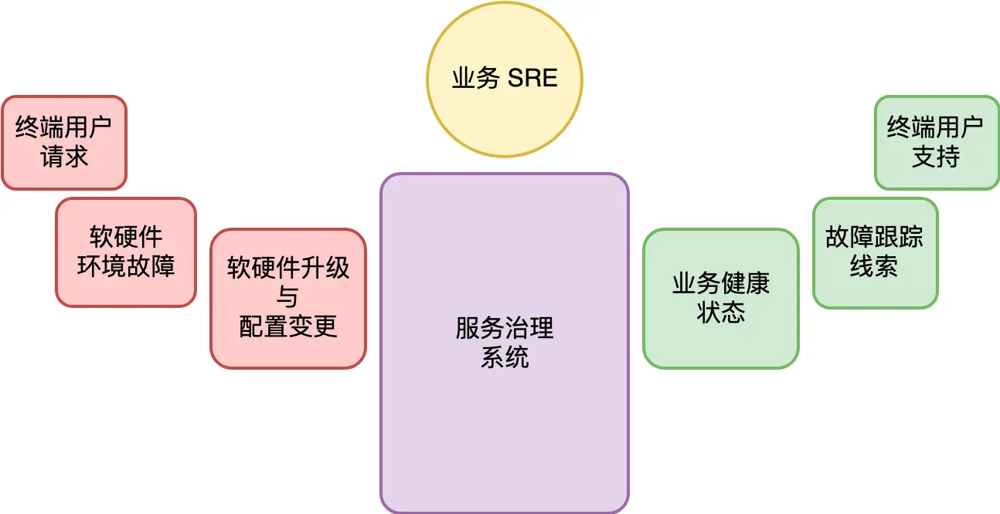

# 服务治理的宏观视角

原文链接：[47 | 服务治理的宏观视角 (geekbang.org)](https://time.geekbang.org/column/article/144803)

## 服务治理的目标

很多开发人员可能会习惯地认为，把软件开发出来交付给用户是其工作的结束。但实际上对于任何一个产品或者产品里面的某项功能来说，把东西开发出来只是个开始，实际上这个产品或功能在其被取代或去除之前，都会有很长一段时间的维护期。

对于这个示意图，我们核心需要理解的是两点：

- 虽然功能开发阶段的成本是非常显性的，但是功能维护期，包括了功能迭代和售后维保，它的隐性成本往往更高。

- 产品的功能开发期虽然有可能很短，但是它是起点，是源头。它每一分每一秒时间是怎么花的，很大程度上决定了这个产品或功能的最终维护代价。

互联网的诞生，对今天我们的生活产生了翻天覆地的影响。虽然细究起来它进入民用市场还只有短短二十多年的历史，但它的发展速度只能以 “恐怖” 来形容。以互联网为载体的软件，它不只是在功能上要满足用户需求，还要提供健康的 24 小时不间断的服务。功能开发与维护的边界变得模糊，一些公司甚至每天都在发布新的版本。

我们知道，传统意义上的操作系统，实现的是软件治理，它们的关注点是如何让众多的软件一起融洽相处，感觉上好像自己在独享着物理的硬件资源。而服务治理的核心目标，除了软件治理外，更重要的是考虑如何确保这些软件能够真正做到 24 小时不间断的服务。而这，才是服务端操作系统的使命。

## 服务治理系统

软件在线上成功跑了起来，为用户提供了服务，我们接着面临的挑战是怎么保证它不会挂掉。这涉及非常多层面的事情。

首先，知道服务是不是可用，这就涉及**监控与报警**。在发现服务挂掉后，能够快速发现，快把它重启起来，恢复到正常的状态。

微观上某个软件进程挂掉不能影响到正常的服务，这就要尽可能全面地把**单点故障的风险消除掉**。

服务治理并没有那么简单纯粹。虽然在理想情况下我们应该尽可能自动化所有故障的恢复，但故障的可能性太多，很多时候是我们无法提前预知的，这意味着人工介入无可避免。所以，互联网不只是产生了服务端开发这样的工种，同时也产生了运维，或者说业务 SRE 这样的工种。

SRE 全称是 Site Reliability Engineer (网站可靠性工程师)，这是 Google 引入的一个职位，后被各类公司所借鉴。区别于传统意义上的运维，SRE 也是一个特殊的工程师群体，和服务端开发一样，他们肩负着自己独特的使命。

**导致故障的因素（故障类型）**：

- 软硬件升级与各类配置变更。
- 软硬件环境的故障也可能引发我们的服务异常。
- 终端用户的请求也可能引发故障。比较典型的场景是秒杀类，短时间内大量的用户涌入，导致系统的承载能力超过规划，产生服务的过载。当然还有一些场景比如有针对性的恶意攻击、特定类型的用户请求导致的服务端资源大量消耗等，都可能引发服务故障。

一个合理的服务治理系统，不只是需要能够及时反应业务系统的健康状况。更重要的是，要在发生了故障的情况下，能够提供故障跟踪与排查的有效线索，方便业务 SRE 可以快速定位跟踪的根因（Root Cause），并进行及时的止损。

一个服务治理系统架构看起来是这样的：

## 服务治理发展历程

服务治理的发展进程涉及面非常之广。有自动化，有业务架构改造，还有人力（SRE）。

我们的期望，是把服务治理建立成自治系统，而不是简单的自动化系统。

基于这样的思考，人们逐渐建立了基于物理机器资源的服务治理体系。脚本成为了平台。而平台的形成，正是脚本的抽象化、产品化、普适化的结果。

把一个服务实例绑定在某一台物理的服务器，虽然让服务视图看起来很直观，但是这种绑定让我们应对物理资源故障变得被动，同时也不利于服务器资源的充分利用。

虚拟机和容器技术的诞生，促使人们开始探索物理资源和应用服务之间的解耦。而一旦我们完成了这一步，服务的逻辑视图就完全语义化了，它与物理资源就只是一个应用的过程。物理资源环境发生任何故障，都可以迅速在新的硬件设备上重新构建。

对 SRE 来说，机器的损坏和生命周期管理基本上已经不需要任何操作了。硬件已经被池化。成千上万的机器加入系统，或者出现问题，被修复，这一切都不需要 SRE 的任何操作。这意味着，随着系统的层次结构不断上升，我们完成了从手动触发，到自动触发，到**自主化**。这正是今天 DCOS（数据中心操作系统）走的路。

