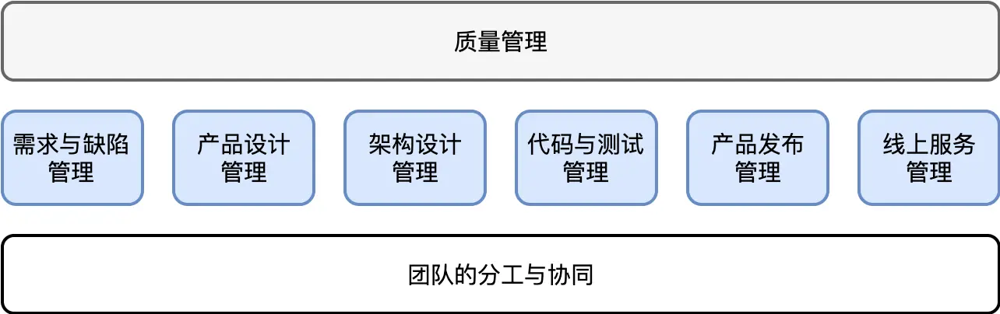

# 软件工程的宏观视角

原文链接：[68 | 软件工程的宏观视角 (geekbang.org)](https://time.geekbang.org/column/article/182924)

## 软件工程

软件工程是一门最年轻的学科，相比其他动辄跨世纪的自然科学而言，软件工程只有 50 年的历史。这门学科的实践太少了，任何一门学科的实践时间短的话，都很难沉淀出真正高效的经验总结，因为这些总结通常都是需要很多代人共同推动来完成的。

软件工程和建筑工程对比：

- 软件工程有着很大的不确定性。

  大部分大型的软件系统都有着几千几万人的规模，并且这几千几万人中没有两个人的工作是重复的；每个人昨天和今天的工作也是不一样的，没有人会写一模一样的代码，我们总是不停地写新的东西，做新的工作。这些东西是非常不同的，软件工程从事的是创造性的工作。

  大家都知道创造是很难的，创造意味着会有大量的试错，因为我们没有做过。大部分软件的形成都是一项极其复杂的工程，它们远比传统的工程复杂得多，无论是涉及的人力、时间还是业务的变数都要多很多。这些都会导致软件工程有非常大的不确定性。

- 软件的快速变化。

  建筑工程在完工以后就结束了，基本上很少会进行变更。但在软件工程里，软件生产出来只是开始。只要软件还在服务客户中，程序员们的创造过程就不会停止，软件系统仍然持续迭代更新，以便形成更好的市场竞争力。

  这些都与传统建筑工程的模式大相径庭。一幢建筑自它完成之后，所有的变化便主要集中在一些软装的细节上，很少会再发生剧烈的变动，更不会持续地发生变动。但软件却不是这样，它从诞生之初到其生命周期结束，自始至终都在迭代变化，从未停止。

今天如果我们站在管理的视角再看软件工程的话，我们知道管理学谈的是确定性。管理学本身的目的之一就是要抑制不确定性，产生确定性。而软件工程有着很大的不确定性，这意味着软件工程有着很强的管理难度。

比如，开发工期、时间成本是否能确定。比如，人力成本、研发成本以及后期运维的成本是否能确定。

所以，软件项目的管理又期望达到确定性。但软件工程本身是快速变化的，是不确定的。这就是软件工程本身的矛盾。我们的目标是在大量的不确定性中找到确定性，这其实就是软件工程最核心的点。

## 架构师的职责

如果用 “瀑布模型” 的方式来表达，现代软件工程的全过程大体如下：

从开始的需求与历史版本缺陷，到新版本的产品设计，到架构设计，到编码与测试，到最终的产品发布，到线上服务的持续维护。

贯穿整个工程始终的，还有不变的团队分工与协同，以及不变的质量管理。

更为重要的是，这个过程并不是只发生一遍，而是终其生命周期过程中，反复迭代演进。

它是一个生命周期往往以数年甚至数十年计的工程。对于传统工程，我们往往也把一个工程称为项目，项目工程。但软件工程不同，虽然我们平常也有项目的概念，但软件工程并不是一个项目，而是无数个项目。每个项目只是软件工程的一个里程碑（Milestone）。所以，光靠把控软件工程师的水平，依赖他们自觉保障工程质量，是远远不够的。**软件工程是一项非常复杂的系统工程，它需要依赖一个能够掌控整个工程全局的团队，来规划和引导整个系统的演变过程。这个团队就是架构师团队。**

软件架构师的职责，并不单单是我们通常理解的，对软件系统进行边界划分和模块规格的定义。从根本目标来说，**软件架构师要对软件工程的执行结果负责**，这包括：按时按质进行软件的迭代和发布、敏捷地响应需求变更、防范软件质量风险（避免发生软件质量事故）、降低迭代维护成本。

因此，虽然架构师的确是一个技术岗，但是架构师干的事情，并不是那么纯技术。

首先是用户需求的解读。怎么提升需求分析能力，尤其是需求演进的预判能力？它无关技术，关键是心态，心里得装着用户。除了需要 “在心里对需求反复推敲” 的严谨态度外，对用户反馈的尊重之心也至关重要。

其次是产品设计。产品边界的确立过程虽然是产品经理主导，但是架构师理应深度参与其中。原因在于，产品功能的开放性设计不是一个纯粹的用户需求问题，它通常涉及技术方案的探讨。因此，产品边界的确立不是一个纯需求，也不是一个纯技术，而是两者合而为一的过程。

以上两点，是架构本身的专业性带来的。若我们从工程本身出发，架构师还需要承担一下责任。

这里面最为突出但也非常基础的，是贯穿软件工程始终的 “团队分工与协同” 问题、“软件的质量管理” 问题。从 “团队分工与协同” 来说，话题可以是团队的目标共识，也可以是做事方式的默契，各类规范的制定。从 “软件的质量管理” 来说，话题可能涉及软件的版本发布，质量保障的过程体系等等。

从更宏观的视角看，我们还涉及人力资源规划的问题。什么东西应该外包出去，包给谁？软件版本的计划是什么样的，哪些功能先做，哪些功能后做？

看起来，这些似乎和架构师的 “本职工作” 不那么直接相关。但是如果你认同架构师的职责是 “对软件工程的执行结果负责”，那么就能够理解为什么你需要去关注这些内容。