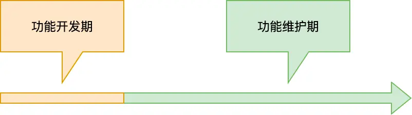

# 软件的质量管理，单元测试、持续构建与发布

原文链接：[73 | 软件质量管理：单元测试、持续构建与发布 (geekbang.org)](https://time.geekbang.org/column/article/188797)

## 软件质量管理

软件工程与传统工程非常不同。它快速变化，充满不确定性。不仅如此，一个软件工程往往是生命周期以数年甚至数十年计的工程。对于传统工程，我们往往把一个工程同时也称之为项目，项目工程。但软件工程不同，虽然我们平常也有项目的概念，但软件工程并不是一个项目，而是无数个项目。每个项目只是软件工程中的一个里程碑（Milestone）。

这些都决定了软件工程质量管理的思想与传统工程截然不同。在传统工程中，设计的工作往往占比极少，重复性的工作占据其生命周期的绝大部分时间。所以传统工程有极大的确定性。检查清单（Check List）很可能就已经可以很好地实现其工程质量的管理。

但对于软件工程来说，设计工作在整个工程中持续发生。哪怕是非设计工作，比如编码实现，也仍然依赖个体的创造力，同样存在较强的不确定性。显然，检查清单（Check List）完全无法满足软件工程的质量管理需要。

到底应该怎么管理软件工程的质量？

开发期和维护期

我们把软件或软件的某项功能生命周期分成两个大的阶段，一个阶段是开发期，一个阶段是维护期。开发期与维护期是相对而言的，只是在表征上，开发期有更强的设计属性。维护期虽然也持续会有设计工作，但是工作量会小一个数量级以上。

因为开发期的时间跨度虽然可能不长，但是它的影响太大了，基本决定了后期维护期的成本有多高。这也意味着软件工程是需要有极强预见性的工程。我们在开发期恰如其分地多投入一分精力，后面在维护期就有十倍甚至百倍以上的回报。设计工作的质量至关重要。但是它执行上又不太有复制性，可复制的只是设计范式和设计思维。我们只能在这种执行的不确定性中找工程上的确定性。

## 单元测试

自动化测试

手工测试，有以下缺点：

- 其一，一般常规测试是基于手工的，**不具备可回归性**。因此，常规测试的效率不高，一次完整的测试集跑下来可能需要几天甚至一周之久。
- 其二，易于缺乏效率，所以往往为了赶工会导致测试仅仅针对典型数据，测试的覆盖率往往也很低。

软件工程的生命周期往往几年甚至几十年之久，我们必然关注单次测试的效率。所以**自动化测试的核心价值就在于可回归性与提高测试的覆盖率**。

从分类来说，一般自动化测试我们分两个层次：一个是模块级的单元测试，一个是系统级的集成测试。

对于单元测试和集成测试，从测试成本上来看：

- 其一，单元测试的实施成本低，最容易去做。不少高级语言比如 Go 语言甚至在语言内建的工具链上就直接支持。而集成测试虽然也有自动化的方法和支持工具，但是往往需要更高额的代价。
- 其二，减少问题发现的周期，进而降低问题的修复成本。单元测试将问题发现周期缩短，基本上在问题现场就发现问题，这降低了 Bug 的修复成本。如果问题在系统的集成测试阶段发现，那么从问题定位，到回忆当初实现这段代码时候的思路，到最终去解决掉它，必然需要多花费几倍甚至几十倍的时间。

因此，我们鼓励更严格的单元测试要求，更高的单元测试覆盖率，以尽可能把发现问题做到前头。

## 持续构建，持续发布

其次，我们降低软件工程不确定性的方法是：持续构建，持续发布。

我们鼓励更小的发布。我们鼓励更短的发布周期，更高的发布频率。这能够让每次发布的负担降低到最低。

这种极度高频交付的机制与传统工程的质量管理机制迥异。但是它被证明是应对软件工程不确定性的最佳方式。为什么会这样？

- 其一，交付的功能越少，因为错误而发生回滚的代价越低，影响面越小。如果我们同时发布了数十个功能，却因为某一个功能不达标而影响整体交付，这其实是降低了软件的功能交付效率。更好的方式显然是把这个出问题的功能回滚，把其他所有功能都放行

- 其二，交付频率越高，我们对交付过程的训练越频繁，过程的熟练度越高，执行效率也越高。当交付成为一个自然习惯后，我们会把交付看作功能开发的一部分，而不是以前大家对研发的理解，认为做完功能就完事，后续上不上线与我无关。我们会鼓励更多把研发的绩效与功能线上的表现关联起来，面向客户价值，而非仅仅面向功能开发。