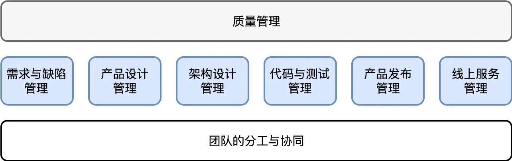
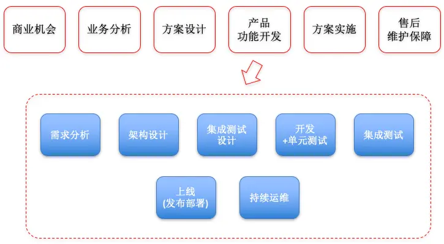

# 软件工程的未来

原文链接：[76 | 软件工程的未来 (geekbang.org)](https://time.geekbang.org/column/article/192408)

软件工程的瀑布模型：

在这样一个模型里面，涉及的角色分工已经非常多：产品经理；架构师；开发工程师；质量保障（QA）工程师；网站可靠性工程师（SRE）；……

但这还只是常规描述的工种。实际的分工要细致很多。更不要说对特殊的领域，比如企业服务，也就是大家常说的 2B 行业，它的基本过程是这样的：

比之纯粹的产品研发上线过程，它多了单个客户的跟进与落地实施过程，也由此引入更多的角色分工，比如：售前工程师、交付（实施）工程师、售后工程师、项目经理等。

未来软件工程会走向何方？

首先 “快速变化” 是软件工程的自然属性，其 “不确定性” 也只能抑制而无法消除。

但显而易见的是，软件工程的问题最终还是由软件解决。事实上今天很多问题已经解决得很好，比如源代码的管理。我们经历了 cvs、svn，最终到今天的 git。基本上开发人员的协同问题已经形成非常约定俗成的方法论，并以软件或云服务的方式被固化下来。

今天，线上服务管理正如火如荼的发展。假以时日，不需要多久之后，一个全新的时代开启，我们中大部分人不必再为线上服务的稳定性操心。

需求管理与测试这块也已经得到很好的解决。唯一比较遗憾就是是界面（UI）相关的测试虽然也有相关的工具链，但当前的普及率仍然极低。

从全局来看，今天软件工程已经形成较为成熟的分工。但各类分工的最佳实践与软件系统，仍然是相对孤立的。这一定程度上也与软件工程还很年轻有关。从软件工程的软件系统发展来说，可以预期的是，未来一定会形成更加一体化的系统，上一道 “工序” 的输出就是下一道 “工序” 的输入。

软件工程的未来发展会怎样，细节上很难给出确定性的判断。但是，我们相信，软件工程极大成熟的标志，是一体化的软件工程支撑系统，和高效的人才培养体系。包括今天仍然极为稚嫩的架构师培养体系，和产品经理培养体系，都应该得到了极大的完善。

到那个时候，软件工程就成为了一门真正成熟的科学。

总结来说，软件工程的未来，它的成熟不单单是工程方法论和业务系统软件的成熟，也需要包括人才培养体系的成熟。因为，软件工程的不确定性与它充满设计与创造有关，人的主观能动性是它的优势，但也意味着不确定性无法得到彻底的消除。我们要做的，只能说在大量的不确定性中，找到尽可能多的确定性。

