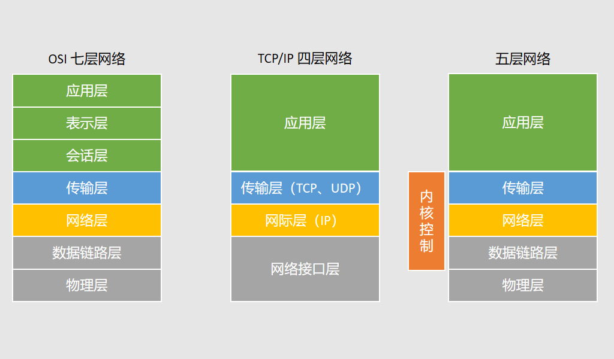
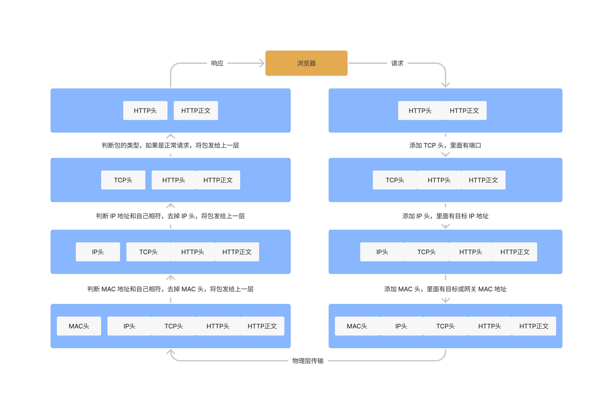

# 网络模型

网络模型。

## 七层网络模型

七层网络模型，即 OSI(Open System Interconnection Reference Model) 模型，即开放式系统互联模型，它是第一个试图在世界范围内规范网络标准的框架。

七层分别为：

- 应用层（Application Layer）：提供为应用软件而设计的接口，以设置与另一应用软件之间的通信，正对特定应用，不关心数据传输，例如：HTTP、HTTPS、FTP、Telnet、SSH、SMTP、POP3等；
- 表现层（Presentation Layer）：协商数据的传输格式和转换数据的传输格式；
- 会话层（Session Layer）：负责管理两个连网实体间的连接，其主要功能就是建立连接、维持稳定的通信、断开连接，是一个逻辑上的概念；
- 传输层（Transport Layer）：建立端口到端口的通信，具有**封包拆分合并这一核心能力**（发送时将一个包进行拆分，接收的时候按照顺序进行重组）；
- 网络层（Network Layer）：负责将封包从一个 IP 地址传输到另一个 IP 地址，涉及到**网络路由**；
- 数据链路层（Data Link Layer）：确保两个临近设备间的数据传输，并隐藏底层实现，帧纠错；
- 物理层（Physical Layer）：封装具体的传输方式（电缆、光纤、无线网等），并提供稳定的传输接口。

## TCP/IP 四层网络模型

OSI 七层网络模型实现复杂，制定的周期长，并且在制定完成前 TCP/IP 四层网络模型（四层分别为：应用层、传输层、网际层、网络接口层）就已经被广泛使用。

TCP/IP 四层网络模型没有给出网络接口层的具体内容，为了方便学习和开发，通常将 TCP/IP 四层模型的网络接口层拆分为数据链路层和物理层来理解，这就有了五层模型，分别为应用层、传输层、网络层、数据链路层和物理层，如下：

- 应用层：数据从一个应用发往另一个应用的过程，不同的应用监听不同的端口；
- 传输层：提供端到端的通信，封包的拆分和重组，保证传输的可靠性；
- 网络层：提供路由和寻址，将网络包从一个 IP 经过路由转发，达到目的 IP 地址；
- 数据链路层：两个节点之间的物理连接，负责网络包在本地网络设备之间的通信，ARP 协议就属于该层；
- 物理层：负责 0-1 信号的传输，封装物理传输方式，提供稳定的传输接口。

七层、四层、五层网络模型关系如所示：

## 一个请求工作流程

下图展示了一个 HTTP 请求在网络中的工作流程。

从上述图片可以看出，每层网络包都有不同格式的头，头里面包含这层网络里特有的信息，辅助网络包从这层运转到下一层。

只要在网络上传输的包都是完整的，可以有上层没下层（最上层为应用层，最下层为物理层），但不能有下层没上层。也就是说，如果一个包有 IP 头，那么其一定有 TCP 头和 HTTP 头。

## 总结

我们熟知的网络模型有 7 层、4 层和 5 层网络模型，其中 7 层网络模型（OSI）是第一个试图在世界范围内规范网络模型的框架，其定义的网络模型的 7 个层次从上到下分别为：应用层、表现层、会话层、传输层、网络层、数据链路层和物理层。

OSI 模型制定周期较长，且在其制定完成前 TCP/IP 协议群（4 层网络模型）已经被广泛使用，4 层从上到下分别为：应用层、传输层、网际层和网络接口层。

TCP/IP 协议群并没有给出网络接口层具体含义，为了方便学习和开发，将网络接口层分成数据链路层和物理层，这就有了 5 层协议，从上到下完整为：应用层、传输层、网络层、数据链路层和物理层。

### 参考连接

- [OSI模型 - 维基百科，自由的百科全书 (wikipedia.org)](https://zh.wikipedia.org/wiki/OSI模型)
- [OSI七层模型与TCP/IP四层（参考）模型 - 简书 (jianshu.com)](https://www.jianshu.com/p/c793a279f698)

- [网络分层的真实含义是什么？ (geekbang.org)](https://time.geekbang.org/column/article/7724)
