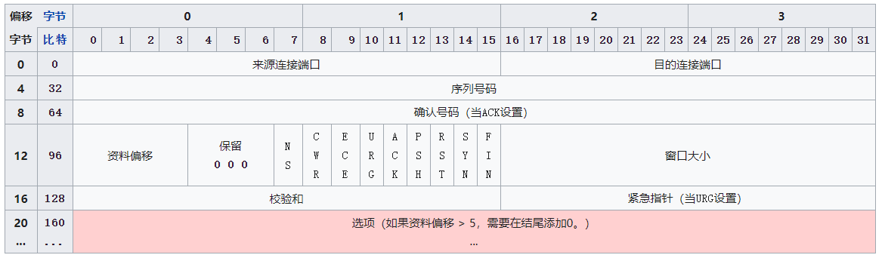
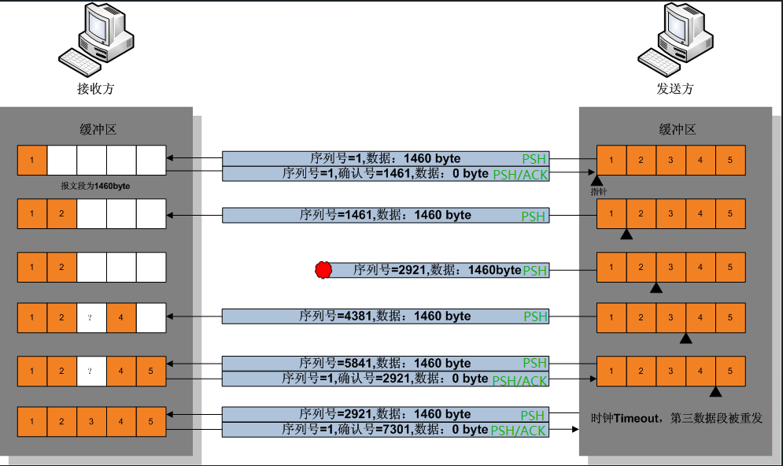

# TCP 协议

TCP(Transport Control Protocol)，传输层控制协议，是一种面向连接的、可靠的、基于字节流的传输层通信协议：

- 面向连接：在通信前会建立连接，通信双方都需要一些额外的结构来存储通信状态；
- 可靠的：提供无差错、不丢失、不重复、无乱序的数据传输能力；
- 基于字节流：发送的时候发的是一个流，没头没尾。

## TCP 报文结构

TCP 结构分为报文头和报文体，报文体用来存放数据，报文头结构如下所示：

> 图片来自于：[传输控制协议 - 维基百科，自由的百科全书 (wikipedia.org)](https://zh.wikipedia.org/wiki/传输控制协议)

其中：

- 来源连接端口（16 位）：识别发送连接端口；
- 目的连接端口（16 位）：识别接收连接端口；
- 序列号（seq，32 位）：表示发送的数据起始序号；
- 确认号（ack，32 位）：表示期望收到的数据的开始序列号，即已经收到的数据字节长度加 1；
- 资料偏移（4 位）：以 4 字节为单位计算出的数据段开始地址的偏移值；
- 保留（3 位）：置 0；
- 标志位（9 位）：区分 TCP 类型，分别为：
  - NS：ECN 显式拥塞通知（Explicit Congestion Notification）是对 TCP 的扩展；
  - CWR：Congestion Window Reduced，定义于 RFC 3168（2001）；
  - ECE：ECN-Echo 有两种意思，取决于 SYN 标志的值；
  - URG：为 1 表示高优先级数据包，紧急指针字段有效；
  - ACK：为 1 表示确认号字段有效；
  - PSH：为 1 表示是带有 PUSH 标志的数据，指示接收方应该尽快将这个报文段交给应用层而不用等待缓冲区装满；
  - RST：为 1 表示出现严重差错，可能需要重新创建 TCP 连接，还可以用于拒绝非法的报文段和拒绝连接请求；
  - SYN：为 1 表示这是连接请求或是连接接受请求，用于创建连接和使顺序号同步；
  - FIN：为 1 表示发送方没有数据要传输了，要求释放连接。

- 窗口（16 位）：表示从确认号开始，本报文的发送方可以接收的字节数，即接收窗口大小，表明 TCP 目前处理数据的能力大小，用于流量控制（照顾通信对象）和拥塞控制（照顾通信环境）；
- 校验和（Checksum，16 位）：对整个的 TCP 报文段，包括 TCP 头部和 TCP 数据，用 checksum 映射到一个不可逆的 16bit 的编码中，这样据可以在接收方校验报文在传输的过程中是否被修改过。

## TCP 协议运作过程

TCP 协议的运行可划分为三个阶段：连接创建、数据传送和连接终止。

### 连接创建

一对终端同时初始化一个它们之间的连接是可能的，但通常都是有一端（服务器端）打开一个套接字，然后**监听**来自另一端（客户端）的连接，这通常就指**被动打开**。服务端被动打开后，客户端就能开始创建**主动打开**。

服务端执行了 listen 函数后，就在服务器上创建了两个队列：

- SYN 队列：存放完成了二次握手的结果，队列的长度由 listen 函数的 backlog 参数指定；
- ACCPET 队列：存放完成了三次握手的结果，队列的长度由 listen 函数 backlog 参数指定。

客户端和服务端创建连接会经过三次握手，过程如下：

- 客户端向服务端发送一个 SYN（`SYN=1`）包，请求连接；

  - `SYN = 1`：标志位，表示请求建立连接；
  - `seq = 0`：**相对序列号**，表示客户端还没有发送数据；
  - `seq = A(raw)`：**原始序列号**，表示客户端为这个连接请求设定随机数 A 作为序列号；
  - `ack = 0`：**相对确认号**，为 0 表示客户端还没有接受到数据；
  - `ack = 0(raw)`：**原始确认号**，为 0 表示客户端还没有接受到数据；

- 服务端接收到一个合法的 SYN 包时，会向客户端发送一个 SYN/ACK 包，告诉客户端，可以通讯了，并且让客户端发送一个确认数据包；

  - `SYN = 1, ACK = 1`：标志位，表示服务端接受请求连接并需要得到响应；
  - `seq = 0`：**相对序列号**，表示服务端还没有发送数据；
  - `seq = B(raw)`：**原始序列号**，表示服务端为这个连接请求设定的随机数 B 作为序列号；
  - `ack = 1`：**相对确认号**，表示服务端当前接受到数据字节数，虽然客户端没有发送任何有效数据，确认号还是被加 1，但并不会对有效数据的计数产生影响，因为包含 SYN 或 FIN 标志位；
  - `ack = A + 1(raw)`：**原始序列号**，表示服务端期望客户端发送的下个数据从 `A + 1` 开始；

- 客户端接受到 SYN/ACK 包时，发送一个 ACK 包，告诉服务端连接已被确认，服务端收到这个 ACK 包后开始建立 TCP 连接。

  - `ACK = 1`：标志位，表示已经收到数据，响应请求；
  - `seq = 1`：**相对序列号**，表示客户端已经发送 1 个数据（虽然客户端还未发送有效数据）；
  - `seq = A + 1(raw)`：**原始序列号**，表示客户端发送数据起始序列号；
  - `ack = 1`：**相对确认号**，表示客户端成功接收的数据字节数，虽然服务端没有发送任何有效数据，确认号还是被加 1，但并不会对有效数据的计数产生影响；
  - `ack = B + 1`：表示客户端期望服务端发送的数据从 `B + 1` 开始。

  > 上述的序号（seq）和确认码（ack）都在 TCP 报文段首部的固定位置，分别代表发送序号（已发送数据字节数）和接收序号（已经接收数据字节数）。
  >
  > **一个端的发送序号是另一个端的接收序号**。

> 图片来自于：[传输控制协议 - 维基百科，自由的百科全书 (wikipedia.org)](https://zh.wikipedia.org/wiki/传输控制协议)

### 数据传输

TCP 协议在数据传输过程中至少要做三件事情，报文拆分，添加 TCP 头、数据重组；

- 报文拆分：应用层数据拆分成 TCP 段，之所以拆分包有两个主要原因，一个是来自应用层数数据较大，不适合一个报文传输完，另一个就是网络中存诸多的并行线路，拆分成不同的 TCP 段后，可以同时经过不同的线路到达目的地，从而提高网络的复用率。

- 顺序保证：使用序号；

- 流量控制：并使用**滑动窗口**来实现流量控制。

  > 为了记录所有发送的包和接收的包，TCP 也需要发送端和接收端分别都有缓存来保存这些记录，缓存里存放的就是包的 ID，并按包的序号顺序依次排列。
  >
  > 滑动窗口表示接收端现在能够处理报文的能力（即接收端可用缓存的大小），在 TCP 里，接收端会给发送端滑动窗口的大小，发送端根据这个窗口的大小来控制发送数据的速度。

TCP 传输过程如下图所示：

在 TCP 的数据传输过程中，有很多机制来保证了传输的可靠性。它们包括：

- 使用序号，对收到的 TCP 报文段进行排序以及检测重复的数据；
- 使用校验和检测报文段的错误，即无错传输；
- 使用确认和计时器来检测和纠正丢包或延时；
- 流量控制（Flow control）：照顾通信的对象，按照通信双方的处理能力，来控制数据的传输；
- 拥塞控制（Congestion control）：照顾通信环境；
- 丢失包的重传。

### 连接终止

TCP 连接终止经过四次挥手，过程如下：

- 假设客户端想要关闭连接，客户端发送一个 FIN 标志位置为 1 的包，表示自己已经没有数据可以发送了，但是仍然可以接受数据，且改包携带者一个随机数 A 作为序号，发送完毕后，客户端进入 `FIN_WAIT_1` 状态；

- 服务器端确认客户端的 FIN 包，发送一个 ACK 包，ACK 包的确认码为 `A+1`，表明自己接受到了客户端关闭连接的请求，但还没有准备好关闭连接，发送完毕后，服务器端进入 `CLOSE_WAIT` 状态，客户端接收到这个确认包之后，进入 `FIN_WAIT_2` 状态，等待服务器端关闭连接；

- 服务器端准备好关闭连接时，向客户端发送结束连接请求，FIN 置为 1，并携带着序列号 B，发送完毕后，服务器端进入 `LAST_ACK` 状态，等待来自客户端的最后一个 ACK；

- 客户端接收到来自服务器端的关闭请求，发送一个 ACK 包，ACK 包的确认码为 `B+1`，并进入 `TIME_WAIT` 状态，等待可能出现的要求重传的 ACK 包，服务器端接收到这个确认包之后，关闭连接，进入 `CLOSED` 状态。

  客户端等待了某个固定时间（两个报文最大生存时间，2MSL，2 Maximum Segment Lifetime）之后，没有收到服务器端的 ACK ，认为服务器端已经正常关闭连接，于是自己也关闭连接，进入 `CLOSED` 状态。
  
  > 这里等待 2MSL 是为了避免客户端发送给服务端的 ACK 包丢失，如果丢失，服务端在一段时间还没有收到客户端的 ACK 包，会在再一次发送 FIN 包，那么客户端收到 FIN 包后会再次发送 ACK 包，通知服务端关闭连接。

> 图片来自于：[传输控制协议 - 维基百科，自由的百科全书 (wikipedia.org)](https://zh.wikipedia.org/wiki/传输控制协议)

## 总结

TCP 是一个面向连接的、可靠的、基于字节流的传输层协议。其在通信双方用一定的数据结构来维护通信的状态，协议的结构设计建立在了网络连接不可靠这一基础之上，提供了一系列措施来解决数据网络传输中的各种问题（传输的包有差错、有丢失、有重复、顺序乱了等）。除了可靠传输，TCP 还实现了流量控制和拥塞控制的能力，保证通信节点和通信环境都可以在健康的条件下运行。

面向连接表现在在通信前首先需要建立连接，TCP 建立连接的过程叫做三次握手；在数据传输过程中使用序号和确认号来保证封包传输的顺序，使用了滑动窗口来实现流量控制，滑动窗口标识接收端接收数据的能力（缓存队列可用空间）；TCP 在通信完成后需要关闭建立的连接，这一过程叫做四次挥手。

### 参考链接

- [传输控制协议 - 维基百科，自由的百科全书 (wikipedia.org)](https://zh.wikipedia.org/wiki/传输控制协议)
- [UDP协议：因性善而简单，难免碰到“城会玩” (geekbang.org)](https://time.geekbang.org/column/article/8924)
- [TCP协议（上）：因性恶而复杂，先恶后善反轻松 (geekbang.org)](https://time.geekbang.org/column/article/8975)
- [TCP协议（下）：西行必定多妖孽，恒心智慧消磨难 (geekbang.org)](https://time.geekbang.org/column/article/9141)