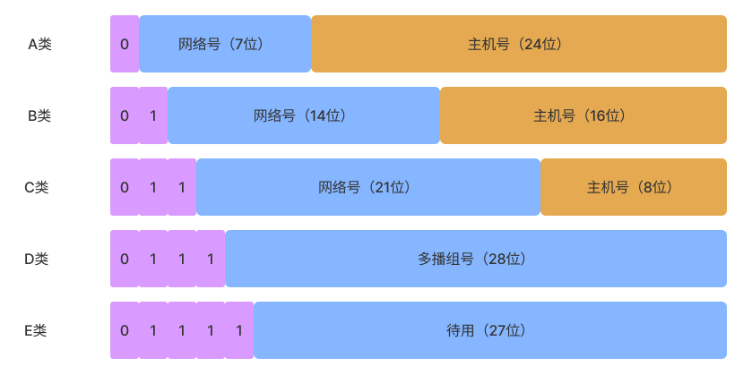
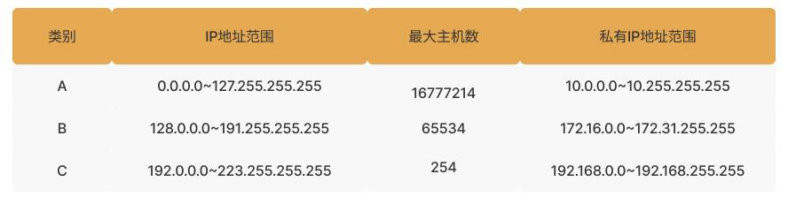
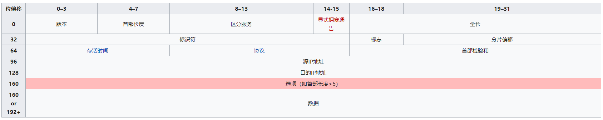

# IP 协议

网际协议（英语：Internet Protocol，缩写：IP），又称互联网协议，IP 是在 TCP/IP 协议群中网络层的主要协议。IP 是一种无连接的协议，操作在使用分组交换的链路层（如以太网）上。此协议会尽最大努力交付数据包，但不保证数据包均能送达目的地，也不保证所有数据包均按照正确的顺序无重复地到达。这些方面是由上层的传输协议（如传输控制协议 TCP）处理的。

## IP 协议工作过程

- 分片：把数据切分成片，适配底层传输网络；

- 增加协议头：IPv4 协议头；
- 延迟、吞吐量、丢包率：
  - 延迟：1 bit 从网络一个终端到另一个终端所需时间；
  - 吞吐量：单位时间传输的数据量；
  - 丢包率：没有到达目的地的包占发送总数的比率。

- 寻址：逐级找到目的地地址；
- 路由：寻找的地址不在局域网中，则需要路由去寻找对应的网络路径。

## IPv4

网际协议版本 4（英语：Internet Protocol version 4，缩写：IPv4，又称互联网通信协议第四版），是网际协议开发过程中的第四个修订版本，也是此协议第一个被广泛部署和使用的版本。

### IPv4 地址

IP 地址是一个网卡在网络世界里的通讯地址。

IPv4 长度为 32 位，每 8 bit 位一组，用十进制表示，用点分隔，如 `127.0.0.1`。

在 window 上我们可以使用 `ipconfig` 命令来查看本机的 IP 地址，在 linux 上可以使用 `ifconfig` 和 `ip addr` 命令来查看 IP 地址。

### IPv4 地址分类

根据 IPv4 地址范围，将 IP 地址分为 A、B、C、D、E 五类，如下图所示：

下面这个表格，详细地展示了 A、B、C 三类地址所能包含的主机的数量：

按照上述分类，可用主机数被分成了三大类，使用起来不够灵活，于是有了折中的方案叫做**无类型域间选路**，简称 CIDR，这种方式将 32 位的 IP 地址一分为二，前部分是网络号、后部分是主机号。

例如：16.158.165.91/22，这种形式就是 CIDR，从 CIDR 中我们可以获取到以下信息：

- 22 的意思是，32 位中，前 22 位是网络号，后 10 位是主机号；

- 这里有个概念是子网掩码，子网掩码和 IP 地址的二进制做按位与操作得到的结果就是网络号，通过 22 可以知道子网掩码为 255.255.252.0（32 位中，前 22 位为 1，其余位为 0，用二进制格式表示就为 `11111111 11111111 11111100 00000000`）；

- 子网掩码为 255.255.252.0，和 IP 地址按位与得网络号就为 16.158.164.0；

- 这个网络的第一个 IP 地址（主机号最小）就为 16.158.164.1；

- 这个网络最后一个 IP 地址（主机号最大）就为 16.158.167.255，这个地址也是广播地址，如果向这个地址发送消息，所有 16.158.164.0 这个网段里的机器都可以收到。

  > 上述广播地址计算的结果需要使用二进制来说明，这里只考虑第三组数即可。
  >
  > 子网掩码为 22，对应第三组数二进制为：11111100，即 252
  >
  > 165 二进制为：10100101
  >
  > 按位与得：10100100，即为 164；
  >
  > 最小的主机号 101001 00, 00000000，即为 164.0
  >
  > 最大的主机号 101001 11,11111111，即为 167.255

上述表格还给出了私有 IP 的范围，私有 IP 范围外的 IP 就是共有 IP，平时我们看到的数据中心里，办公室、家里或学校的 IP 地址，一般都是私有 IP 地址段，这些地址允许组织内部的人员自己管理、自己分配，而且可以重复（只要不在同一个私有网络里），私有 IP 地址有效的解决了 IP 地址不足的问题。

而公有 IP 地址有个组织统一分配，在全世界范围内是唯一的。

### IPv4 协议头部

IPv4 协议头如下所示：

> 上述图片来自：[IPv4 - 维基百科，自由的百科全书 (wikipedia.org)](https://zh.wikipedia.org/wiki/IPv4)

- 版本（Version，4 字节）：版本字段，通信双方使用的版本必须一致，对于 IPv4，字段的值是 4；
- 首部长度（4 字节）：首部长度说明首部有多少 32 位字，最小为 5，最大为 15；
- 服务类型：确定是否需要低延迟、高吞吐量、低丢包率或低成本；
- 源地址（4 字节）：报文的发送端 IP 地址；
- 目的地址（4 字节）：报文接收端 IP 地址。

### MAC 地址

MAC(Media Access Control Address)， 全称叫做媒体访问控制地址，48 位，用 16 进制来表示，MAC 地址在网卡生产好后就确定了，不可更改，每个网卡的 MAC 地址是唯一的，类似于身份证号码。

我们知道 IP 地址是计算机在网络世界里的通信地址，那么为什么 MAC 地址不可以作为计算机的通信地址呢？主要原因有两个：

1. MAC 地址是各个制造商来制定的，基于 MAC 地址路由是不合理的，IP 地址是基于网络拓扑而设计的，更适合高效的路由算法；
2. 一个网卡的 MAC 地址一旦被确定是不可以被更改的，如果基于 MAC 地址来通信，一旦网卡出现故障，更换网卡后通信的地址势必会发生改变，而基于 IP 地址，就可以引入一个中间层，即使网卡被更换，MAC 地址改变了，但 IP 地址是不变的，这样通信地址是不变的；
3. MAC 地址是不适合作为网络中的通信地址的，但其还是具有定位网络设备的能力，MAC 地址的定位功能局限在一个网络里面，也即同一个网络号下的 IP 地址之间，可以通过 MAC 进行定位和通信，从 IP 地址获取 MAC 地址要通过 ARP 协议，是通过在本地发送广播包，也就是“吼”，获得的 MAC 地址。

### ARP 协议

ARP ，地址解析协议，IP 地址并不以任何永久的方式绑定到网卡，而且事实上一个网络接口可以有许多 IP 地址，为了正确地交付一份报文，主机和路由器需要其它机制来识别设备接口和 IP 地址之间的关联，ARP 协议就起到这样的作用，其用来实现 IP 地址到 MAC 地址的转换。

此外，反向操作有时候也是必须的，比如，一台主机在启动时需要知道自己的 IP 地址（除非地址已经被管理员预先设置）。目前被用于这一用途的协议有动态主机设置协议（DHCP）和引导协议（BOOTP）。

### DHCP

DHCP，动态主机配置协议，用来给一个接入网络的设备自动分配 IP，其过程如下所示：

- 新来的机器用 0.0.0.0 作为 IP，向 255.255.255.255 发送一个广播包，广播包封装了 UDP，UDP 封装了 BOOTP，广播包的内容表明了我是一个新入网的设备，我需要得到一个 IP 地址来连接网络，并且包含自己的 MAC 地址；
- 如果一个网络管理员配置了 DHCP Server 的话，会收到这个请求，根据 MAC 地址判断是否为一个新入网的设备，如果是，需要租给其一个 IP 地址，这一过程叫做 DHCP Offer，此时 DHCP Server 依然用 255.255.255.255 作为目的地址，并发送一个广播包，内容包含了新分配的 IP；
- 新来的机器收到来自 DHCP Server 的响应包后（可能有多个，如果有多个 DHCP Server，优先处理最先接收的那个），发送一个 DHCP Request 包，包的内容包括本身的 MAC 地址、准备使用的 IP 地址，以及分配该 IP 地址的 DHCP Server 的 IP，由于此时该机器还么有 IP，所以还是会用 0.0.0.0 作为本机 IP，向 255.255.255.255 发送一个广播包；
- 当 DHCP Server 接收到客户机的 DHCP request 之后，会广播返回给客户机一个 DHCP ACK 消息包（广播包），表明已经接受客户机的选择，并将这一 IP 地址的合法租用信息和其他的配置信息都放入该广播包，发给客户机；
- 新来的机器收到 DHCP ACK 包后，就可以使用该 IP 了。

## IPv6

IPv4 只能支持 43 亿设备，随着连接网络的设备越来越多，仅靠 IPv4 是不够的。

在讨论 IPv4 时，我们提到了私有 IP 地址，私有 IP 地址有效的解决了 IP 地址不足的问题，但私有 IP 地址只能用于 LAN（局域网），不能用于 WAN（广域网），为此对于需要连接外网的设备，必须通过网关利用 **NAT** 协议将私有 IP 地址转换为全球合法的共有 IP 才能访问外网的设备或从外网的设备接收数据。

IPv6 使用 128 位地址（8 个 16 位），可以支持更多的 IP 地址，解决了 IPv4 地址不足的问题。

### IPv6 地址

IPv6 地址一共有 128 位，分成 8 组，每组用 16 进制的数字来表示，用冒号分隔，如：

`0123:4567:0000:0000:0123:4567:0000:0708`

IPv6 地址可以简写，如上述 IP 地址，可以省略掉若干组 `0000`，但只能省略掉一组，且必须是连续的，如：

`0123:4567::0123:4567:0000:0708`

此外开头的 0 也可以简写，`0000` 可以使用 0 来表示，如：

`123:4567::0123:4567:0:0708`

`3c4d::/16`：表示前 16 位相同的地址集合；

`1234:5678:0708::/64`，表示前 64 位相同的地址集合。

### IPv6 寻址

全局单播，IPv6 地址可以分成三个部分：

- 站点前缀：48 位，用来区分机构，一般由 ISP(Internet Service Provider) 或 RIR(Regional Internet Registry) 来将 IP 地址分配给运营商；
- 子网号：16 位，用于站点内部区分子网；
- 接口号：64 位，用于站点子网内部区分设备。

本地单播

- Link-local 前缀：10 位，必须以 fe80 开头;
- 0：54 位 0；
- 接口号：64 位。

分组多播

- 8 个 1，ff00 开头；
- 在网络中定义了分组编号，而且有设备可以识别这个分组编号；
- 分组下有完整的设备清单。

### 新设备接入

新设备接入 IPv6 后，会使用 IPv6 的**邻居发现协议**（ND 协议），为自己申请一个 IP 地址。当新设备需要发送消息到目的地时，还可以通过 ND 协议广播查询目标设备，如果需要路由，可以同 ND 协议查找路由器。

## 总结

IP 地址是一个网卡在网络世界通信的地址，其在网络层，基于网络拓扑而设计，被作用于路由算法。

IP 协议分为 IPv4 和 IPv6，IPv4 支持 43 亿设备，随着连网设备变多，IPv4 已经不够使用。IPv4 的私有 IP 地址可以解决这一问题，但对于需要连接外网（广域网，WAN）的设备需要通过 NAT 网关将私有 IP 映射到一个共有 IP。IPv6 也解决了 IP 地址不足的问题，其用更多的位数（128 位），可以支持更多的设备同时连接外网。

### 参考连接

- [IPv4 - 维基百科，自由的百科全书 (wikipedia.org)](https://zh.wikipedia.org/wiki/IPv4)

- [ifconfig：最熟悉又陌生的命令行 (geekbang.org)](https://time.geekbang.org/column/article/7772)

- [DHCP与PXE：IP是怎么来的，又是怎么没的？ (geekbang.org)](https://time.geekbang.org/column/article/8015)

