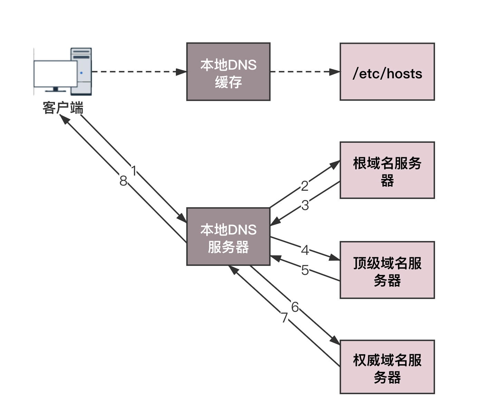

# DNS 协议

域名解析协议（DNS, Domain Name System）是用来将域名和 IP 地址进行映射，我们在访问一个网站时可以使用其域名，这样就解决了 IP 地址具有不方便记忆并且不能显示地址组织的名称和性质等缺点。

## 域名

域名是一串用点分隔的字符串，代表互联网上某一天计算机或计算机组的名称。域名有一定的层次结构，从上到下依次为根域名、顶级域名、二级域名、三级域名。如 `www.baidu.com.`，最后面的 `.` 就表示顶级域名，`com` 表示顶级域名，`baidu` 表示二级域名，`www` 表示三级域名。

域名的每个层都对应一个域名服务器，从上到下依次为：

- 根域名服务器：返回顶级域名服务器的 IP 地址；
- 顶级域名服务器：返回权威域名服务器的地址；
- 权威域名服务器：返回响应主机的 IP 地址。

除了上述域名服务器外还有一种重要的域名服务器——本地域名服务器，本地域名服务器管理本地域名的解析和映射，并且能够向上级域名服务器进行查询。

## 域名解析流程

下面通过一个例子来说明 DNS 解析流程，比如我们需要访问 `www.baidu.com`，期间就可能发送以下 DNS 解析流程：

- 浏览器查询浏览器 DNS 缓存，如果命中直接返回；
- 浏览器 DNS 缓存没有命中会去查询本地 DNS 缓存，即操作系统配置的 hosts 文件，如果命中直接返回；

- 当 DNS 缓存没有命中是，浏览器发出一个 DNS 请求给本地域名服务器，询问 `www.baidu.com` 的 IP 地址；
- 本地域名服务器收到 DNS 请求后，先在本地缓存中查找有没有 `www.baidu.com` 的 DNS 记录，如果有就直接返回 IP 地址，如果没有就向根域名服务器发起请求；
- 根域名服务器收到请求后返回顶级域名服务器（`.com`）的 IP 地址；
- 本地域名服务器接着向根域名返回的顶级域名服务器发起请求；
- 顶级域名服务器收到请求后返回权威域名服务器（`.baidu.com`）所在地址；
- 本地域名服务器接着向权威域名服务器发起请求；

- 权威域名服务器收到请求后查询到域名对应的 IP 地址并返回给本地域名服务器；
- 本地域名服务器收到 IP 地址后返回给浏览器；
- 浏览器收到 IP 地址后，就可以和目标服务器建立连接。

上述流程可以用下图表示：

> 上述图片来自：[DNS协议：网络世界的地址簿 (geekbang.org)](https://time.geekbang.org/column/article/9895)

## 负载均衡

一次 DNS 解析过程，对于客户端来讲仅仅是为了拿到域名对应的 IP 地址，然后去建立连接，进行通信。但是对于域名服务器来讲，它在返回域名对应 IP 的过程中还可以做到另一件事，负载均衡，这时候的一个域名往往有多个可用的 IP 地址，在域名解析的时候，我们只要配置策略，这次返回第一个 IP，下次返回第二个 IP，就可以实现负载均衡了。

## 总结

DNS 是网络世界的地址簿，可以通过域名查地址。域名是分层层次的，对应的域名服务器是按照树状结构组织的，因而域名查找是使用递归的方法，并通过缓存的方式增强性能；

在域名和 IP 的映射过程中，给了应用基于域名做负载均衡的机会，可以是简单的负载均衡，也可以根据地址和运营商做全局的负载均衡。

### 参考链接

- [DNS协议：网络世界的地址簿 (geekbang.org)](https://time.geekbang.org/column/article/9895)
- [超详细 DNS 协议解析 - SegmentFault 思否](https://segmentfault.com/a/1190000039039275)

