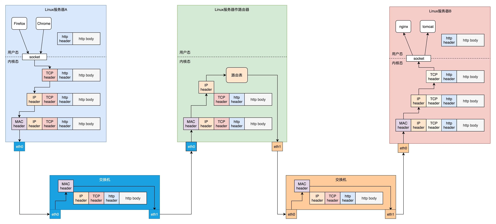

# Socket 通信基础

Socket 可以理解为是一种跨机器的通信机制，其基于网络协议在两个机器间建立起了一种通信机制。

## 网络协议基础

一台机器将自己想要表达的内容，按照某种约定好的格式发送出去，当另外一台机器收到这些信息后，也能够按照约定好的格式解析出来，这种约定好的格式就是网络协议，Socket 通信是基于网络协议的，这里简单陈述下网络协议。

网络具有分层的结构，主要有 OSI（7 层） 和 TCP/IP 网络模型（4 层或 5 层），这三种网络模型关系如下所示：

这里讨论 5 层网络模型，分别为：

- 应用层：负责数据在应用之间的传输，不同的应用会监听不同的端口；
- 传输层：负责端到端的通信，具有封包拆分合并这一核心能力，提供可靠的数据传输能力（TCP）；
- 网络层：负责将数据从一个 IP 地址通过路由转发到目的 IP；
- 数据链路层：负责数据包在本地网络间机器的传输，ARP 协议就属于该层；
- 物理层：负责 0-1 信号的传输，封装物理传输方式，提供稳定的传输接口。

二、三、四层网络（即数据链路层、网络层、传输层）都是在 Linux 系统内核里面处理的，应用层如浏览器、Nginx 都是用户态的，内核里面对网络包的处理是不区分应用的。那么应用层和下层的传输层通信肯定会经过用户态到内核态的切换，这个切换就是通过 Socket 这个系统调用完成的。

有人会问，Socket 属于网络分层中的哪一层，其实它哪一层都不属于，它属于操作系统的概念，而非网络协议分层的概念。只不过操作系对于网络协议的实现模式是，二到四层的处理代码在内核里面，应用层的处理代码让应用自己去做，两者需要跨内核态和用户态通信，就需要一个系统调用完成这个衔接，这个系统调用就是 Socket。

> 这里简单陈述下上面涉及到的和 Linux 操作系统有关的几个概念：
>
> CPU 指令集具有 Ring 0~3 四个级别，Ring0 级别的指令权限最高，Ring3 级别的指令权限最低。操作系统很好地利用了这个机制，将能够访问关键资源的代码放在 Ring0，我们称为**内核态**（Kernel Mode）；将普通的程序代码放在 Ring3，我们称为**用户态**（User Mode）。
>
> 用户态的程序没有直接调用内核态指令的权限，如果用户态的代码需要访问核心资源，怎么办？答案是通过系统调用（syscall），一次系统调用，通过软中断（Linux 的软中断指令 `int 0x80`，int 是 interrupt 的缩写），将执行体从用户态切换到内核态，在内核态执行相关指令访问核心资源。

## 数据包的流转过程

下面将介绍数据包是怎么结合 Socket 在网络的各层中流转的，比如有 Linux 服务器 A，Linux 服务器 B，Linux 服务器作为的路由器，现在在服务器 A 经过路由器向服务器 B 发送一个请求，数据包的流转如下图所示：

> 上述图片来自：[Socket通信之网络协议基本原理 (geekbang.org)](https://time.geekbang.org/column/article/105338)

详情流程如下：

- 在客户端浏览器，我们将请求封装为 HTTP 协议，通过 Socket 发送到内核；
- 内核先通过传输层，添加 TCP 头将包发送给 IP 层；
- 在 IP 层中添加 IP 头，将包发送给 MAC 层；
- 在 MAC 层中添加 MAC 头，从硬件网卡中发送出去；
- 从网卡出去的包会先到达网络 1 的交换机，通常称交换机为二层设备，因为交换机只会处理的第二层，交换机将 MAC 头拿下来，发现目标 MAC 在自己右边的网口，于是将数据包从这个网口发送出去；
- 数据包到达中间的路由服务器，发现 MAC 地址匹配，就交给 IP 层，在 IP 层根据 IP 头中的信息，在路由表中查找，数据包应该从那个网口出去，路由器又叫三层设备，因为其只处理到网络层；
- 从路由器右面的网口发出去的包会到网络 2 的交换机，还是会经历一次二层的处理，转发到交换机右面的网口；
- 最终网络包会被转发到 Linux 服务器 B，它发现 MAC 地址匹配，就将 MAC 头取下来，交给上一层；
- IP 层发现 IP 地址匹配，将 IP 头取下来，交给上一层；
- TCP 层会根据 TCP 头中的序列号等信息，发现它是一个正确的网络包，就会将网络包缓存起来，等待应用层的读取；
- 应用层通过 Socket 监听某个端口，因而读取的时候，内核会根据 TCP 头中的端口号，将网络包发给相应的应用。

## 总结

网络协议是分层的，操作系统在对网络协议支持实现方面将传输层、网络层和数据链路层在内核中实现，应用层则由应用自己编码处理，那么从应用层到传输层的数据流转势必需要通过用户态到内核态的切换，这个切换就是通过系统调用 Socket 来完成的。

- 上述笔记来自：[Socket通信之网络协议基本原理 (geekbang.org)](https://time.geekbang.org/column/article/105338)

