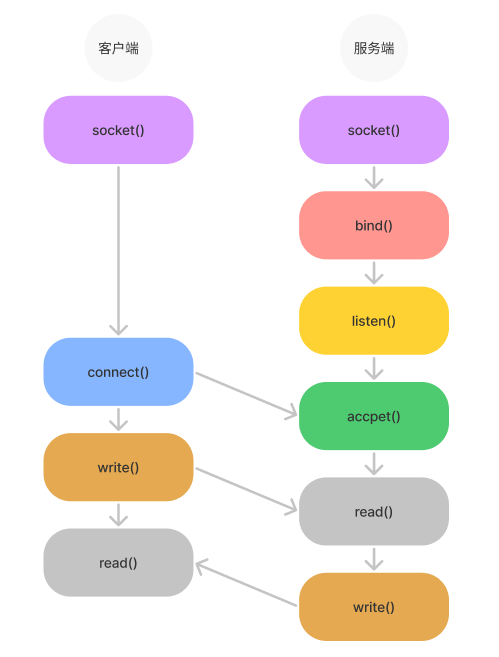
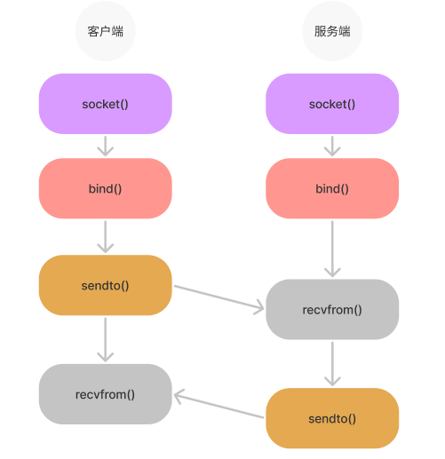

# Socket 系统调用

网络协议是分层的，操作系统在对网络协议支持实现方面将传输层、网络层和数据链路层在内核中实现，应用层则由应用自己编码处理，那么从应用层到传输层的数据流转势必需要通过用户态到内核态的切换，这个切换就是通过系统调用 Socket 来完成的。

那么在应用层，我们应该如何使用 socket 的接口来进行通信呢？

## 调用规格

下面先介绍 Socket 通信过程中会使用到的系统调用函数规格（TCP），包括

- socket：创建一个 socket，返回一个文件描述符，用来唯一标识 socket；
- bind：给 socket 分配 IP 和端口；
- listen：将一个 socket 标记为 passive socket（进入监听状态），这个 socket 将用来通过 accpet 函数接收连接请求；
- accept：处理挂起连接队列里的第一个请求，并创建一个用来连接的 socket，返回创建 socket 的文件描述符；
- connect：将一个 socket 连接到一个指定地址；
- write：将缓冲区的数据写入文件；
- read：从文件读取数据到缓冲区。

### socket 函数

socket 更多的是考虑应用层到传输层的通信，传输层以下的网络分层如网络层、数据链路层一般不需要考虑，这也是网络分层带来的好处。

在传输层有两个主流的协议 TCP 和 UDP，所以 socket 程序设计也是主要操作这两个协议，不管 socket 操作的是 TCP 还是 UDP，都需要先调用 socket 函数：

```c
int socket(int domain, int type, int protocol);
```

socket 函数用来创建一个 socket 文件描述符（FD），唯一标识一个 socket，socket 有三个参数：

- domain：表示使用什么 IP 协议，AF_INET 表示 IPv4，AF_INET6 表示 IPv6；
- type：表示 socket 类型，SOCK_STREAM 表示 TCP 面向流的，SOCK_DGRAM 表示 UDP 面向数据报文的，SOCK_RAW 表示可以直接操作 IP 层或非 TCP 和 UDP 的协议，如 ICMP。
- protocol：表示协议，如 IPPROTO_TCP、IPPTOTO_UDP。

socket 函数成功调用会返回一个文件描述符，调用失败会返回 -1。

### bind 函数

bind 函数用来给 socket 分配 IP 和端口，函数为：

```c
int bind(int sockfd, const struct sockaddr *addr, socklen_t addrlen);

struct sockaddr {
    sa_family_t sa_family;
    char        sa_data[14];
}
```

bind 函数的入参分别表示：

- sockfd：socket 文件描述符，用来指明需要给那个 socket 绑定 IP 和端口；
- addr：指向 sockaddr 结构体的指针；
- addrlen：指 sockaddr 结构体字节数量。

bind 函数调用成功后返回 0，调用失败返回 -1。

### listen 函数

listen 函数用来将一个 socket 标记为 passive socket（进入监听状态），这个 socket 将用来通过 accpet 函数接收连接请求，函数如下：

```c
int listen(int sockfd, int backlog);
```

listen 函数的入参分别表示：

- sockfd：socket 文件描述符，用来指定那个 socket 需要进入监听状态；
- backlog：挂起连接队列的最大长度，如果在队列已满时连接请求到达，客户端可能会收到带有 ECONNREFUSED 指示的错误，或者，如果底层协议支持重传，请求可能会被忽略，以便稍后重新尝试连接成功。 

listen 调用成功后返回 0，失败返回 -1。

### accept 函数

accpet 函数用来处理挂起连接队列里的第一个请求，并创建一个用来连接的 socket，返回创建 socket 的文件描述符，函数如下：

```c
int accept(int sockfd, struct sockaddr *addr, socklen_t *addrlen);
```

accpet 函数的入参分别表示：

- sockfd：socket 文件描述符，指绑定了 IP 和端口，并进入了监听状态的 socket；
- addr 和 addrlen：与监听地址有关。

accept 调用成功后会返回创建 socket 的文件描述符，失败返回 -1。

> 注：accpet 函数会阻塞当前线程直到连接队列出现一个请求，如果这个 socket 被标记为非阻塞，而连接队列中没有请求，则 accep 失败并出现错误 EAGAIN 或 EWOULDBLOCK。

还有一个函数 accpet4，函数如下：

```c
int accept4(int sockfd, struct sockaddr *addr, socklen_t *addrlen, int flags);
```

和 accpet 相比，多了一个 flags 参数，其用来设置创建用来连接 socket 的状态，其可能的值为：

- SOCK_NONBLOCK：设置 socket 为非阻塞的；
- SOCK_CLOEXEC：为新文件描述符启用 close-on-exec 标志，在 exec 成功调用后自动关闭该文件描述符。

### connect 函数

connect 函数用来将一个 socket 连接到指定地址，函数如下：

```c
int connect(int sockfd, const struct sockaddr *addr, socklen_t addrlen);
```

- sockfd：socket 文件描述符，指需要发起连接的 socket；
- addr 和 addrlen：指需要连接的地址信息。

connect 函数调用成功后返回 0，失败后返回 -1。

### write 函数

write 函数用来将缓冲区的数据写入文件，函数如下：

```c
ssize_t write(int fd, const void *buf, size_t count);
```

write 函数参数如下：

- fd：文件描述符，指被写入数据的文件；
- buf：缓冲区，用来存放被写入的数据；
- count：需要从缓冲区提取数据的字节数。

write 调用成功返回写入的字节数量（0 表示没有数据被写入），-1 表示写入失败。

### read 函数

read 函数用来从一个文件中读取数据到缓冲区，函数如下：

```c
ssize_t read(int fd, void *buf, size_t count);
```

read 函数的参数如下：

- fd：文件描述符，指待读取的文件；
- buf：缓冲区，读取的数据会放到缓冲区；
- count：读取的数量。

read 函数调用成功后返回读取的字节数量（0 表示未读取到数据）。

## 针对 TCP 编程

应用层针对 TCP，进行 Socket 编程，编程的步骤如下：

- 服务端和客户端都调用 socket，得到文件描述符；
- 服务端调用 bind，绑定 IP 和端口；
- 服务端调用 listen，进行监听；
- 服务端调用 accept，等待客户端连接；
- 客户端调用 connect，连接服务端；
- 服务端 accept 返回用于传输的 socket 的文件描述符；
- 客户端调用 write 写入数据；
- 服务端调用 read 读取数据；
- .......
- 通信完毕，关闭 socket。

上述流程可以如下图所示：



比如使用 Java 进行 Socket 编程，代码如下所示：

```java
@Slf4j
public class SocketBIO {

    public static void main(String[] args) throws IOException {
        ServerSocket server = new ServerSocket(8081, 10);

        while (true) {
            // 线程会被阻塞在 accept 方法
            Socket client = server.accept();
            log.info("Client's port: {}", client.getPort());
            try (InputStream inputStream = client.getInputStream();
                 BufferedReader reader = new BufferedReader(new InputStreamReader(inputStream))) {
                while (true) {
                    // 线程阻塞在读取数据上
                    String readLine = reader.readLine();
                    if (readLine != null) {
                        log.info("Read from client: {}", readLine);
                    } else {
                        client.close();
                        break;
                    }
                }
            } catch (IOException e) {
                e.printStackTrace();
            }
        }
    }
}
```

启动后，使用 [netcat](https://eternallybored.org/misc/netcat/) 进行测试，命令如下：

```
nc -nv 127.0.0.1 8081

输入字符串，观察服务端的日志输出
```

## 针对 UDP 编程

UDP 是没有连接的，所以不需要三次握手，也就不需要调用 listen 和 connect，但是 UDP 的交互仍然需要 IP 地址和端口号，因而也需要 bind。对于 UDP 来讲，没有所谓的连接维护，也没有所谓的连接的发起方和接收方，甚至都不存在客户端和服务端的概念，大家就都是客户端，也同时都是服务端。只要有一个 socket，多台机器就可以任意通信，不存在哪两台机器是属于一个连接的概念。每次通信时，调用 sendto 和 recvfrom，并传入需要通信的 IP 地址和端口。

UDP Socket 编程流程如下所示：




## 总结

上述笔记总结自：[Socket通信：遇上特大项目，要学会和其他公司合作 (geekbang.org)](https://time.geekbang.org/column/article/105359)