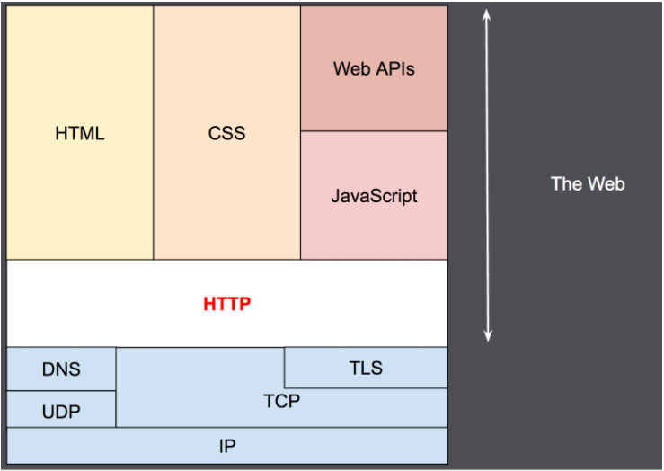

# HTTP 概述

超文本传输协议（HTTP, ）是一个传输超媒体文档的**应用层**协议，起初是为了 Web 浏览器和 Web 服务器之间的通信设计的，后也可以用于其他目的。HTTP 遵循典型的客户端-服务端模型，客户端打开一个连接以发送请求，然后等待服务端响应。HTTP 是无状态的协议，这意味着服务器不会在两个请求间保留任何数据（状态）。

HTTP 协议在网络分层中位置如下所示：



> 图片来自：[HTTP概述 - HTTP | MDN (mozilla.org)](https://developer.mozilla.org/zh-CN/docs/Web/HTTP/Overview)

## HTTP 发展史

- HTTP/0.9（1991）：定义了协议最核心内容，确定了客户端/服务端这种基本结构，使用域名加端口号来表示目标地址，还有换行回车作为基本的分隔符；
- HTTP/1.0（1996）： 引入了返回码，引入了 HTTP header，引入了多字符集，支持多行请求；
- HTTP/1.1（1999）：大量帮助传输效率提升的特性被加入，比如，长连接（keep-alive），分块传输（chunked），缓存控制策略，客户端告知服务端可以处理的数据类型（Accept 请求头）；
- HTTP/2.0（2015）：允许客户端选择 HTTP 协议版本（ALPN），**头部压缩**，多路复用（**允许客户端同时在一个连接中同时传输多组请求响应的方法**，存在线头阻塞），二进制报文（帧）；
- HTTP/3.0：基于 UDP 传输，多路复用（无线头阻塞）。

## HTTP 交互实体

HTTP 协议遵循了客户端和服务端模型，请求通过一个客户端（浏览器）发出，服务端在收到客户端请求后处理并返回给客户端。客户端和服务端之间可能又多个代理，它们的作用的表现各不相同，有的是网关，有的是缓存。

> 代理或代理服务器是存在于服务端和客户端之间的服务器，它用来接收客户端的请求并发送给服务端，根据处理请求的方式不同又分为正向代理和反向代理：
>
> - 正向代理：代理的是客户端，代理服务器收到来自客户端的请求后，**代替**客户端请求服务端，并将来自服务端的响应返回给客户端。正向代理隐藏了真实的客户端，即服务端对真实请求的客户端是没有感知的，一些翻墙工具就是正向代理；
> - 反向代理：代理的是服务端，代理服务器收到来自客户端的请求后，通过某些规则将请求**转发**到服务端，并将来自服务端的响应返回给客户端。正向代理隐藏了真实的服务端，对于客户端来说代理服务器就是服务端，Nginx 就是性能非常好的反向代理服务器，用来做负载均衡。

综上所述，HTTP 交互实体包括客户端、服务端和多个代理。其实在一个浏览器和处理请求的服务器之间，还有路由器、交换机等许多网络设备，但由于网络分层的设计，这些在传输层、网络层和数据链路层的细节都被隐藏起来了，HTTP 协议位于最上方的应用层，对于底层的传输细节是不需要关心的，这也是网络分层带来的好处。

## HTTP 基本性质

- 易扩展：HTTP 的通信双方可以通过 HTTP 头来协商工作，HTTP 头的设计让 HTTP 扩展变得容易；
- 无状态：在同一个连接中，两个执行成功的请求间是没有联系的，使用 HTTP Cookies 可以解决这个问题（把 Cookies 添加到头部中，创建一个会话让每次请求都能共享上下文的信息，达到相同的状态），但 HTTP 本质上是无状态的；
- HTTP 和连接：HTTP 并不需要底层的传输协议是面向连接的，但要求它是可靠的，所以理论上 HTTP 可以依赖任何可靠的传输层协议来发送消息，不一定是要 TCP，HTTP/3 其承载协议就将 TCP 转移到基于 UDP 的 [QUIC](https://en.wikipedia.org/wiki/QUIC) 上面来。

## HTTP 报文

HTTP 的报文有两种类型，请求报文和响应报文。

> 注：HTTP 报文（在HTTP/2之前）是语义可读的，在HTTP/2中，这些消息被文本封装在了帧中，这使得报文不能被直接读取，但是原理仍是相同的，因此用 HTTP/1.1 格式来理解 HTTP/2 报文仍旧有效。

### 请求报文

一个请求报文的例子如下所示：

```
GET / HTTP/1.1
Host: developer.mozilla.org
Accept-Language: fr

Request Body...
```

请求由以下元素组成：

- HTTP method：经常用一个动词来表示客户端的动作行为类型，如上述的 GET 表示客户端想要从服务端获取资源；
- 资源路径：紧跟着 HTTP method 后的就是资源路径（URL），不包含协议类型（`http://`）、域名（`www.example.com`）和端口；
- HTTP 协议版本号：如上述的 HTTP/1.1；
- HTTP 请求头：上述的 Host 和 Accept-Language 就是 HTTP 请求头，其是 Key-Value 结构，冒号前表示 Key，冒号后表示 Value；
- 空行：在请求头和请求体之间有一个空行，这个是规定；
- 请求体：客户端发送给服务端的请求内容，可选。

### 响应报文

一个响应报文的例子如下所示：

```
HTTP/1.1 200 OK
Date: Sat, 09 Oct 2010 14:28:02 GMT
Server: Apache
Last-Modified: Tue, 01 Dec 2009 20:18:22 GMT
ETag: "51142bc1-7449-479b075b2891b"
Accept-Ranges: bytes
Content-Length: 29769
Content-Type: text/html

<!DOCTYPE html... (here comes the 29769 bytes of the requested web page)
```

 响应由以下元素组成：

- HTTP 协议版本号：如上述的 HTTP/1.1；
- 响应状态码：告知客户端请求执行的状态，每个状态码都有着其代表的含义；
- 响应状态信息：告知客户端请求执行的状态码描述信息，这个信息是非权威的，可有服务端自行设置；
- HTTP 响应头：和请求头类似；
- 空行：规定响应头和响应体之间有一个空行；
- 响应体：服务端发送给客户端的响应内容，可选。

## HTTP 头

HTTP 头用来控制服务端和客户端的工作方式，是 HTTP 协议的扩展点，这里罗列部分比较常见的 HTTP 头，完整的可查阅：[HTTP headers - HTTP | MDN (mozilla.org)](https://developer.mozilla.org/en-US/docs/Web/HTTP/Headers)。

- `Contetnt-Type`：请求头或响应头，请求的时候，告知服务端数据的媒体类型（Media Type/MIME Type），返回的时候告知客户端，数据的媒体类型；
- `Content-Length`：请求头或响应头，发送/接收 Body 内容的字节数；
- `User-Agent`：请求头，这个字段可以帮助统计客户端使用的浏览器、操作系统等；
- `Accept`：请求头，是 HTTP 协商能力的体现，告诉服务端客户端可以处理的媒体类型，`*/*` 表示所有类型；
- `Accept-Encoding`：建议服务端发送何种编码（压缩算法）；
- `Referer`：告诉服务端打开当前页面的上一个页面的 URL，非浏览器环境请求通常不发送 `Referer` 头，比如使用 curl 发起 HTTP 请求，Referer 常用来分析用户行为。

## HTTP 状态码

这里罗列比较常用的状态码，完整的可查阅：[HTTP response status codes - HTTP | MDN (mozilla.org)](https://developer.mozilla.org/en-US/docs/Web/HTTP/Status)

### 100 - 199

`1xx` 类状态码表示提供信息，如：

- `100 Continue`：表示如果请求已经完成，客户端应继续请求或忽略响应；
- `101 Switching Protocols`：响应客户端的升级协议请求的状态码，并指示服务器正在切换的协议。

### 200 - 299

`2xx` 类的状态码表示请求已被服务端成功接收并处理，如：

- `200 OK`：成功；
- `201 Created`：已创建；
- `202 Accepted`：已接收；
- `203 Non-Authoritative Information`：非权威内容；
- `204 No Content`：没有内容；
- `205 Reset Content`：重置内容；
- `206 Partial Content`：服务器下发了部分内容。

### 300 - 399

`3xx` 类的请求表示重定向，如：

- `300 Multiple Choices`：用户请求了多个选项资源；
- `301 Moved Permanently`：资源永久转移；
- `302 Found`：资源被找到；
- `303 See Other` ：可以使用 GET 方法在另一个地方获取到资源；
- `304 Not Modified`：资源没有修改，和 HTTP 缓存配合使用；
- `305 Use Proxy`：需要代理；
- `307 Temporary Redirect`：临时重定向；
- `308 Permanent Redirect` ：永久重定向。

301 和 308 的区别：

- 共同点：其都表示客户端请求的资源被永久的移到了一个新的地址；
- 不同点：
  - 客户端在收到 308 请求后，沿用旧的请求方法请求新的地址；
  - 客户端在收到 301 请求后，通常会向新地址发起 GET 请求；

302、303、307 的区别：

- 共同点：其都表示资源被临时转移到新地址；
- 不同点：
  - 302 是 HTTP 1.0 提出的，最早叫做 `Moved Temporarily` ，很多浏览器实现没有遵循标准，把所有请求都重定向为 GET；
  - 1999 年标准委员会增加了 303 和 307，并将 302 重新定义为 `Found`，303 告诉客户端使用 GET 方法重定向资源，307 告诉客户端使用原请求方法重定向资源。

### 400 - 499

`4xx` 类状态码表示客户端出错，如

- `400 Bad Request`：请求参数格式错误；
- `401 Unauthorized`：没有授权；
- `402 Payment Required`：请先付费；
- `403 Forbidden`：禁止访问；
- `404 Not Found`：没找到；
- `405 Method Not Allowed`：方法不被允许；
- `406 Not Acceptable`：服务端可提供的内容和客户端期待的不一样。

### 500 - 599

`5xx` 类状态码表示服务端出错，如：

- `500 Internal Server Error`：服务器内部错误；
- `501 Not Implemented`：未实现；
- `502 Bad Gateway`：网关错误；
- `503 Service Unavaliable`：服务不可用；
- `504 Gateway Timeout`：网关超时；
- `505 HTTP Version Not Support`：不支持 HTTP 版本。

## 总结

HTTP 最初作为万维网（World Wide Web）的超文本（HTML）传输协议而提出，主要为了实现浏览器和服务器之间的通信，现 HTTP 在整个 Web 体系种有着至关重要的作用。基于 HTTP 协议交互的实体包括客户端、服务端和多个代理。HTTP 具有易扩展（基于 HTTP 头）、无状态、需要传输层的协议是可靠这些基本性质。

### 参考链接

- [HTTP概述 - HTTP | MDN (mozilla.org)](https://developer.mozilla.org/zh-CN/docs/Web/HTTP/Overview)

- [HTTP协议的演化 (geekbang.org)](https://time.geekbang.org/column/article/134752)