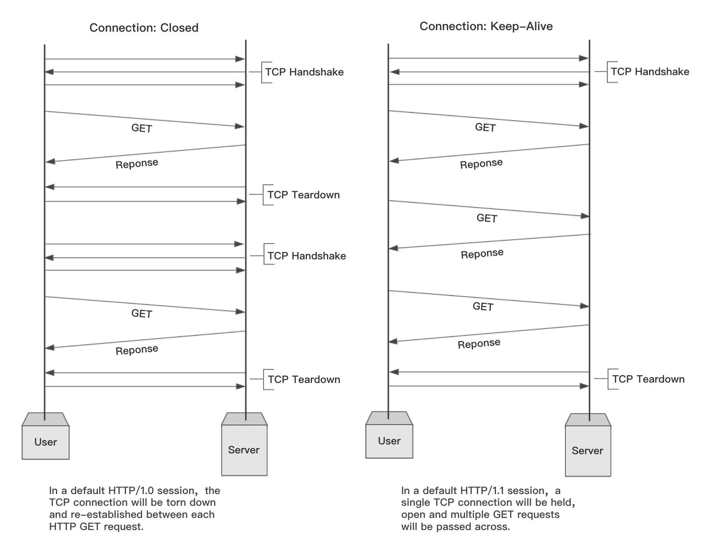

# HTTP 长连接

HTTP 协议位于应用层，依赖传输层协议的可靠的数据传输能力。在 HTTP/1.0 版本时，每一组请求和响应的交互，都要完成一次 TCP 的连接和关闭操作，这在曾经的互联网资源比较贫瘠的时候并没有暴露出多大的问题，但随着互联网的迅速发展，频繁的创建连接耗费的时间尤为明显。于是在 HTTP/1.1 提出了长连接和分块传输的概念，所谓长连接，是指打开一次 TCP 连接，可以连续被多次报文传输使用，这样一来就不用为每次请求创建连接了。

下图展示了 HTTP 长连接和短连接的区别：



> 图片来自：[Evolution of HTTP](https://medium.com/platform-engineer/evolution-of-http-69cfe6531ba0)

## 长连接和分块传输

从上图可以看出 HTTP 长连接将中间几次请求的握手连接都节省了，下面通过一个例子来展示 HTTP 长连接的使用。

> 注：这里需要使用到 [Netcat](http://netcat.sourceforge.net/) 来发起 HTTP 请求，如果是在 Windows 上使用，下载地址为：[netcat 1.11 for Win32/Win64 (eternallybored.org)](https://eternallybored.org/misc/netcat/)。

这里先看下不使用长连接，请求和响应应该是什么样子的，先在一个文本中写好请求报文（request.txt），如下：

```http
GET / HTTP/1.0
Host: cn.bing.com
User-Agent: Mozilla/5.0 (Windows NT 10.0; Win64; x64)
Accept: text/html


```

使用 Netcat 发送 HTTP 请求报文，命令如下：

```poweshell
nc.exe cn.bing.com 80 < ..\request.txt
```

收到来自服务端的响应如下：

```http
HTTP/1.1 200 OK
Cache-Control: private
Content-Type: text/html; charset=utf-8
... 此处省略部分响应头
Connection: close

... 此处省略响应的 HTML
```

修改上述文件，使用长连接：

```http
GET / HTTP/1.1
Host: cn.bing.com
User-Agent: Mozilla/5.0 (Windows NT 10.0; Win64; x64)
Connection: keep-alive
Accept: text/html


```

同样地使用 Netcat 发起请求：

```powershell
nc.exe cn.bing.com 80 < ..\request.txt
```

得到的响应如下：

```http
HTTP/1.1 200 OK
Cache-Control: private
Transfer-Encoding: chunked
Content-Type: text/html; charset=utf-8
... 此处省略部分响应头

439
... 此处省略响应的 HTML
0
```

可以看到，在响应头中多出了 `Transfer-Encoding: chunked`，在响应体前后会多出一个数字，如上述的 439 和 0，这里就是 HTTP/1.1 提供的分块传输的能力。

事实上，如果协议头中存在上述的 chunked 头，表示将采用分块传输编码，响应的消息将由若干个块分次传输，而不是一次传回。刚才的 439，指的是接下去这一块的大小，在这些有意义的块传输完毕后，会紧跟上一个长度为 0 的块和一个空行，表示传输结束了，这也是最后的那个 0 的含义。

## 长连接的应用

HTTP 由于本身机制的问题，无法主动推送消息（HTTP/1.1 及之前），这时候客户端如果想从服务端实时的获取某个消息，需要不断的轮询（Poll）请求，看消息是否到达，但客户端轮询会带来两个问题：

- 大量的请求，消耗带宽资源；
- 不够实时，任然存在最多一个轮询周期的消息延迟。

如果服务端可以在消息到达时主动通知客户端，这样就能解决上述问题。

[Comet](https://en.wikipedia.org/wiki/Comet_(programming)) 使用 HTTP 长连接的特性实现了服务端推送消息的能力，其大致原理为：客户端发送一个普通的 HTTP 请求到服务端以后，服务端不像以往一样在处理后立即返回数据，而是保持住连接不释放，每当有更新事件发生，就使用分块传输的方式返回数据。

在 Comet 方式下，看起来服务端有了推送行为，其实只是客户端发起了一个长时间连接的请求，服务端对于客户端请求有条件、讲时机的多次返回，因此我们把它称为服务端“假 Push”。服务端想真正具有推送消息的能力，可以使用 WebSocket。

## 总结

HTTP 最早期的模型，也是  HTTP/1.0 的默认模型，是短连接。这意味着发起每一个 HTTP 请求之前都会有一次 TCP 握手，而且是连续不断的。

短连接有两个比较大的问题：

- 创建新连接耗费的时间尤为明显；
- TCP 协议握手本身就是耗费时间的，所以 TCP 可以保持更多的热连接来适应负载，但短连接都是冷连接，便享受不到 **TCP 热连接性能增强**这一特性。

为了解决短连接存在的问题，长连接被设计出来，一个长连接会保持一段时间，重复用于发送一系列请求，节省了新建 TCP 连接握手的时间，还可以利用 TCP 的热连接性能增强能力。当然这个连接也不会一直保留着，连接在空闲一段时间后会被关闭（服务器可以使用 Keep-Alive 协议头来指定一个最小的连接保持时间）。

长连接也还是有缺点的，就算是在空闲状态，它还是会消耗服务器资源，而且在重负载时，还有可能遭受 [DoS attacks](https://developer.mozilla.org/zh-CN/docs/Glossary/DOS_attack) 攻击。这种场景下，可以使用非长连接，即尽快关闭那些空闲的连接，也能对性能有所提升。

在 HTTP/1.1 里，默认就是长连接的。

### 参考链接

- [HTTP 协议的演化 (geekbang.org)](https://time.geekbang.org/column/article/134752)

- [服务端推送技术 (geekbang.org)](https://time.geekbang.org/column/article/136587)

- [HTTP/1.x 的连接管理 - HTTP | MDN (mozilla.org)](https://developer.mozilla.org/zh-CN/docs/Web/HTTP/Connection_management_in_HTTP_1.x)