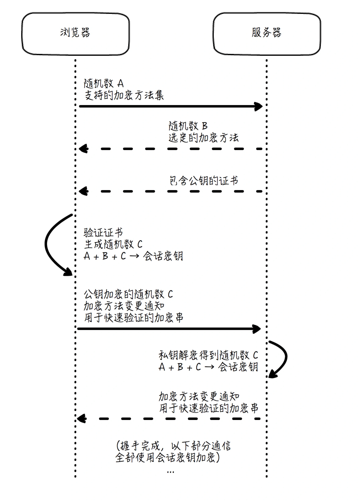

# HTTPS

在一开始的时候，HTTP 的设计者并没有把专门的加密安全传输放进协议设计里面。因此单独使用 HTTP 进行明文的数据传输，一定存在着许多的安全问题。为了解决这些安全问题，提出了 HTTPS 协议。

HTTPS 协议经由 HTTP 进行通信，利用 SSL/TLS 来加密数据包，提供对网站服务器的身份认证，保护交换资料的隐私与完整性。

> 注：SSL 指的是 Secure Socket Layer，而 TLS 指的是 Transport Layer Security，事实上，一开始只有 SSL，但是在 3.0 版本之后，SSL 被标准化并通过 RFC 2246 以 SSL 为基础建立了 TLS 的第一个版本，因此可以简单地认为 SSL 和 TLS 是具备父子衍生关系的同一类安全协议。

## 加密解密

所谓的加密解密就是将明文信息变成不可读的密文信息，拥有解密方法的对象才能将密文还原成加密前的内容，加密算法可分为两类，对称加密和非对称加密。

### 对称加密

对称加密加密和解密用的是同一个密钥，且加密和解密双方都知道密钥，密钥是不能对外公开的，因此对称加密的密钥在交互双方之间的安全传输往往是一个难题。

### 非对称加密

非对称加密加密和解密使用不同的密钥，一把是作为对外公开的公钥，一把是对外保密的私钥。公钥加密的信息只有私钥才能解密，私钥加密的信息只有公钥才能解密。

使用非对称加密算法加密传输数据需要两套公钥和私钥才能保证数据安全传输，只有一套是不够用的。比如客户端使用公钥将传输的数据进行加密，服务端使用私钥进行解密，就可以获取要源数据；若此时服务端需要向客户端响应数据，就没办法使用现有的这套公密钥进行加密（使用公钥加密，客户端没有服务端的私钥就没办法解密，使用私钥加密，外部使用公钥都可以解密），所以需要客户端也提供一套公钥和私钥，使用客户端提供的公钥进行加密，这样客户端收到响应后就可以使用对外保密的私钥进行解密。

非对称加密相对于对称加密来说性能较差，除了性能外非对称加密还面临怎样辨别公钥是否可靠的问题。

## 数字证书

仅靠加密算法，还不能实现真正意义上的交互安全，即使是使用非对称加密也一样。虽然可以保证私钥不被泄露出去，但是通信双方都没办法判断公钥的可靠性，也就不知道公钥来源是否是合法的。

这时候就要引入一个权威机构（CA, Certificate Authority），来证明公钥的合法性，简要过程是：

- 发布公钥的服务端去权威机构给自己的公钥生成证书（生成证书包含**公钥**、**公钥所有者**、**颁发机构**和**证书有效期**）；
- 服务端在客户端访问时将证书发出；
- 客户端拿到证书后需要验证证书的有效性；
- 验证有效后客户端就相信证书里的公钥是可靠的，就可以使用公钥加密数据和服务端进行通信。

上述有两个关键的步骤，就是服务端的**证书申请**和客户端的**证书验证**。

### 证书申请

一个证书申请的步骤如下：

- 创建私钥：

  ```shell
  openssl genrsa -out exampleprivate.key 1024
  ```

- 创建公钥：根据私钥生成公钥；

  ```shell
  openssl rsa -in exampleprivate.key -pubout -out examplepublic.pem
  ```

- 创建证书请求：给公钥生成证书需要一个证书请求；

  ```shell
  openssl req -key exampleprivate.key -new -out examplecertificate.req
  ```

- 数字签名：将证书请求发送给权威机构后，权威机构要为该证书签名，数字签名是为了后续来验证证书的有效性；

  签名算法的过程大概是：对证书做摘要生成指纹，并使用权威机构自己的私钥为该指纹加密，生成**数字签名**（Digital Signature），而这个数字签名也随证书一起发布，权威机构给证书签名的命令如下：

  ```shell
  openssl x509 -req -in examplecertificate.req -CA cacertificate.pem -CAkey caprivate.key -out examplecertificate.pem
  ```

  这个命令会返回 Signature ok，而 examplecertificate.pem 就是签过名的证书。

### 证书验证

客户端在收到来自服务端发送的证书后，需要对验证证书的有效性，验证步骤如下：

- 客户端拿到权威机构的公钥；
- 对证书内容做摘要得到指纹 P1；
- 使用权威机构的公钥对证书的数字签名进行解密，如果不能解密，则说明该证书不是该是权威机构发布的，解密后得到指纹 P2；
- 对比 P1 和 P2，如果 P1 和 P2 相等，就说明证书没有被篡改，客户端就选择相信这个证书。

> 在验证证书时需要获取到权威机构的公钥，同样地，客户端怎么判断这个公钥是否有效呢？
>
> 答案是使用其上一级的证书颁发机构。
>
> CA 是分级管理的，每一级 CA 都根据上述同样的原理，由它的上一级 CA 来加密证书和生成数字签名，来保证其真实性，从而形成一个单向的信任链。同时，标志着最高级别 CA 的根证书数量非常少，且一般在浏览器或操作系统安装的时候就被预置在里面了，因此它们是被我们完全信任的，这就使得真实性的鉴别递归有了最终出口。
>
> 总的来说就是一个递归自下而上验证的过程，如果一直正确，直至抵达了顶端——浏览器内置的根证书，就说明服务端送过来的证书是安全有效的。

## TLS 工作原理

HTTPS 就是 HTTP + SSL/TLS，这里 TLS 连接建立原理如下图所示：



> 上述图片来自：[为HTTP穿上盔甲：HTTPS (geekbang.org)](https://time.geekbang.org/column/article/135864)

TLS 建立连接步骤：

- Client Hello：客户端向服务端发起请求，并携带以下信息：
  - 客户端产生的随机数 A；
  - 客户端支持的加密方法列表；
- Server Hello：服务端回应 Client Hello，并携带以下信息：
  - 服务端产生的随机数 B；
  - 服务端根据客户端的支持情况确定出的加密方法组合（Cipher Suite）；
- Certificate, Server Key Exchange, Server Hello Done：服务端在打招呼后紧接着告知客户端：
  - Certificate：证书信息；
  - 客户端验证证书有效性，验证有效后产生一个随机数 C，现在客户端有三个随机数 A、B、C，客户端使用这三个随机数和约定的加密算法生成会话密钥，该密钥作为后续通信**对称加密**的密钥使用；

- Client Key Exchange, Change Cipher Spec, Encrypted Handshake Message：接着客户端告诉服务端：
  - Client Key Exchange：本质上它就是上面说的这个 C，但使用了服务端公钥加密；
  - Change Cipher Spec：客户端同意正式启用约好的加密方法和密钥了，后面的数据传输全部都使用密钥 X 来加密；
  - Encrypted Handshake Message：快速验证，这是客户端对于整个对话进行摘要并加密得到的串，如果经过服务端解密，和原串相等，就证明整个握手过程是成功的；
- Change Cipher Spec, Encrypted Handshake Message：服务端收到消息后，用自己私钥解密上面的 Client Key Exchange，得到了 C，这样它和客户端一样，也得到了 A、B 和 C，后面服务端和客户端的通信数据都可以用这个会话密钥进行对称加密，服务端最后也告知客户端：
  - Change Cipher Spec：服务端也同意要正式启用约好的加密方法和密钥，后面的数据传输全部都使用 X 来加密；
  - Encrypted Handshake Message，快速验证：这是服务端对于整个对话进行摘要并加密得到的串，如果经过客户端解密，和原串相等，就证明整个握手过程是成功的。

这里可以看出，TLS 通过非对称加密来保证握手的可靠性，再通过对称加密来保证数据传输过程中的可靠性。这种通过较严格、较复杂的方式建立信息交换的渠道，再通过更简单高效的方式来完成主体数据的传输，并且前者具有长效性（即公钥和私钥相对稳定），后者具有一过性（密钥是临时生成的），这种设计模式是比较常用的。

## 总结

HTTPS 为 HTTP 协议穿上了安全的盔甲，其安全性主要通过 TLS 协议实现。

TLS 本质上是一个数据加密协议，其通过非对称加密的方式建立连接，使用对称加密的方式来传输主题数据，既保证了连接建立的可靠性，又保证了数据加密的效率。非对称加密的公钥通过权威机构颁布的数字证书来获取，以证明这个公钥的来源是可靠的。

### 参考连接

- [为HTTP穿上盔甲：HTTPS (geekbang.org)](https://time.geekbang.org/column/article/135864)

- [HTTPS协议：点外卖的过程原来这么复杂 (geekbang.org)](https://time.geekbang.org/column/article/9492)