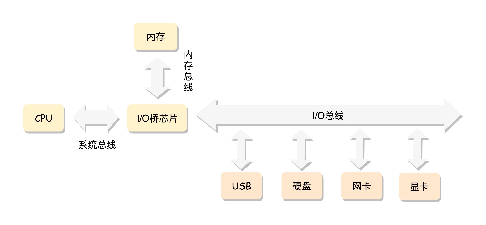
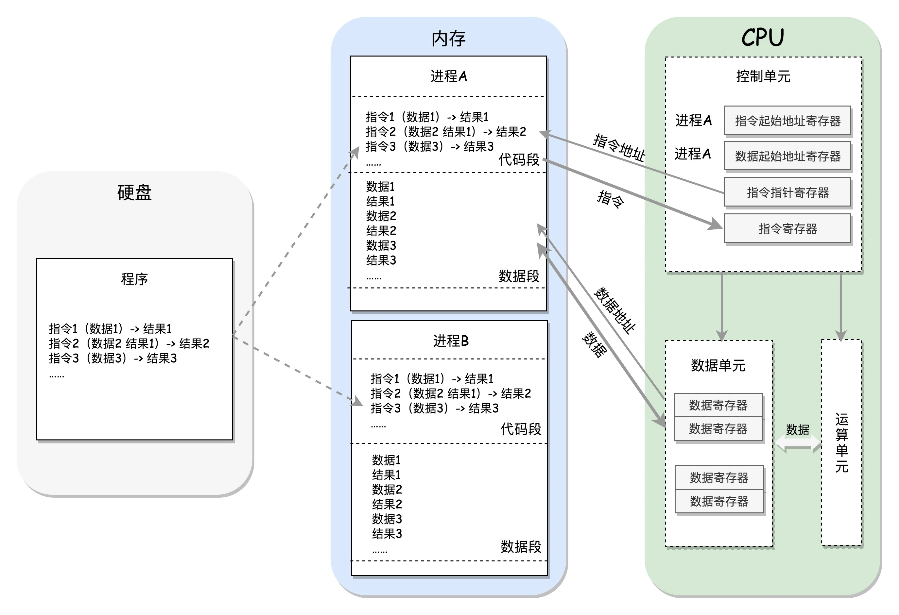
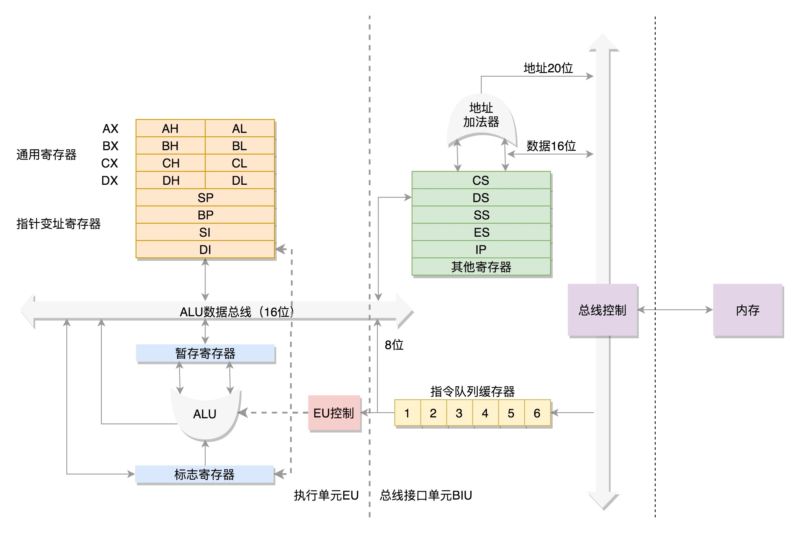
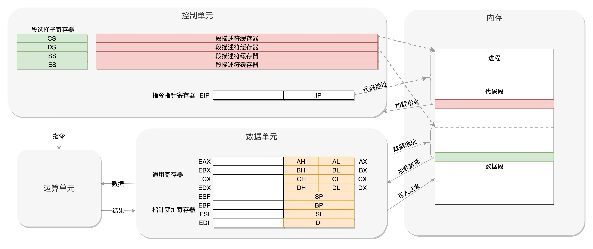

# x86 架构

x86 泛指一系列基于 Intel 8086 且向后兼容的中央处理器（CPU）指令集架构，最早的 8086 处理器于 1978 年由 Intel 推出，为 16 位微处理器。

## 计算机组成

冯·诺伊曼计算机体系结构将计算机分为：CPU、存储器和输入输出设备。下图展示了计算机组成的逻辑视图：

> 图片来自：[x86架构：有了开放的架构，才能打造开放的营商环境-极客时间 (geekbang.org)](https://time.geekbang.org/column/article/89417)

其中 CPU 是最核心的设备，其负责执行指令，具有计算能力，CPU 进一步可细分为：

- 运算单元：只做计算；
- 数据单元：指 CPU 中的缓存和寄存器，比内存更快，用来存放 CPU 计算需要的一些数据和临时计算结果；
- 控制单元：控制指令执行。

内存：用来存放程序运行时的数据、指令和结构；

总线：总线是上述提到的计算机组件交换数据的方式，PC 上一般有 5 种总线：

- 数据总线（Data Bus）：负责在 CPU 和其他组件之间传输数据，每条数据线每次只能传输一位数据，数据总线的宽度代表了 CPU 和其他组件间传输数据的速度；
- 地址总线（Address Bus）：CPU 通过地址总线来指定存储单元，地址总线决定了 CPU 所能访问的最大内存空间的大小；
- 控制总线（Control Bus）：将 CPU 控制单元（Control Unit）的信号，传送到周边设备；
- 扩展总线（Expansion Bus）：可连接扩展槽和电脑；
- 局部总线（Local Bus）：取代更高速数据传输的扩展总线。

不同类型总线位数含义是不同的，比如数据总线的位数（宽度），决定了总线一次能够取数据的位数，地址总线位数决定了能访问内存地址范围有多广。

下面以一个程序的运行为例，来说明这些组件之间是如何协同工作的，程序运行示意图如下：

> 图片来自：[x86架构：有了开放的架构，才能打造开放的营商环境-极客时间 (geekbang.org)](https://time.geekbang.org/column/article/89417)

如上图所示，CPU 运行程序过程如下：

- 一个程序启动运行后，会创建一个进程作为程序运行的载体，并将磁盘上程序的数据加载到进程内存空间，进程内存空间主要分为代码段和数据段，代码段里存放程序的运行指令，数据段里存放程序运行需要的数据；
- 控制单元在时序脉冲的作用下，将指令计数器里所指向的指令地址送到地址总线上去，然后 CPU 将这个地址里的指令读到指令寄存器，指令一般由两个部分组成，一部分指代具体的操作（操作码），一部分指代操作数据的地址（操作数）；
- 对于执行指令过程中所需要用到的数据，会将数据地址也送到地址总线，然后 CPU 把数据读到 CPU 的内部数据单元暂存起来；
- 然后运算单元对数据进行运算加工，并将运算结果存放到数据单元；
- 接着在控制单元修改指令指针寄存器，运行下一条指令，如此周而复始。

## 8086 处理器原理

x86 泛指一系列基于 Intel 8086 且向后兼容的中央处理器指令集架构，最早的 8086 处理器于 1978 年由 Intel 推出，为 16 位微处理器。8086 处理器架构图如下所示：

> 图片来自：[x86架构：有了开放的架构，才能打造开放的营商环境-极客时间 (geekbang.org)](https://time.geekbang.org/column/article/89417)

### 数据单元

如上图所示，8086 CPU 数据单元里有 8 个 16 位通用寄存器，分别为 `AX`、`BX`、`CX`、`DX`、`SP`、`BP`、`SI`、`DI`，这些寄存器主要用于在计算过程中暂存数据，这些寄存器比较灵活，其中 `AX`、`BX`、`CX`、`DX` 可以分成两个 8 位的寄存器来使用，分别是 `AH`、`AL`、`BH`、`BL`、`CH`、`CL`、`DH`、`DL`，其中 H 就是 High（高位），L 就是 Low（低位）的意思。这样，比较长的数据也能暂存，比较短的数据也能暂存。

### 控制单元

8086 CPU 控制单元中有个 `IP` 寄存器，其就是**指令指针寄存器**（Instruction Pointer Register），指向代码段中下一条指令的位置，CPU 会根据它来不断地将指令从内存的代码段中，加载到 CPU 的指令队列中，然后交给运算单元去执行。

如果需要切换进程呢？

每个进程都分代码段和数据段，为了指向不同进程的地址空间，有四个 16 位的段寄存器，分别是 `CS`、`DS`、`SS`、`ES`：

- `CS` 就是代码段寄存器（Code Segment Register），通过它可以找到代码在内存中的位置；
- `DS` 是数据段的寄存器，通过它可以找到数据在内存中的位置；
- `SS` 是栈寄存器（Stack Register）。

在切换进程时需要修改上述寄存器的指向。

如何从数据段和代码段加载数据？

对于一个段，有一个起始的地址，而段内的具体位置，我们称为偏移量（Offset），在 `CS` 和 `DS` 中都存放着一个段的起始地址，代码段的偏移量在 `IP` 寄存器中，数据段的偏移量会放在通用寄存器中。这样通过起始地址和偏移量 CPU 就可以知道指令或数据在内存的地址，控制单元将地址送到地址总线上去，然后 CPU 就可以去加载指令或数据。

> 注：`CS` 和 `DS` 都是 16 位的，也就是说其能够记录的起始地址最多为 16 位，`IP` 寄存器和通用寄存器都是 16 位的，其记录的偏移量也最多为 16 位。但是 8086 的地址总线地址是 20 位，怎么凑够这 20 位呢？方法就是”起始地址 *16 + 偏移量“，也就是把 `CS` 和 `DS` 中的值左移 4 位，变成 20 位的，加上 16 位的偏移量，这样就可以得到 20 位的数据地址。
>
> 从这个计算方式可以算出，无论真正的内存多么大，对于只有 20 位地址总线的 8086 来讲，能够区分出的地址也就 `2^20=1M`，超过这个空间就访问不到了。又因为记录段偏移量的寄存器是 16 位的，则一个段的最大大小为 `2^16=64k`。

## 32 位处理器

后来计算机的发展日新月异，内存越来越大，总线也越来越宽。32 位 CPU 有 32 根地址总线，也就是其可以访问 `2^32=4G` 的内存。总线位数增加后，使用 8086 的架构是不行的，但是又不能完全抛弃原来的模式，因为这个架构是**开放**的，开放意味着后续架构的迭代要和之前的版本保持兼容。那么 32 位处理器是怎么和 8086 处理器保持兼容的呢？

首先，通用寄存器有扩展，可以将 8 个 16 位的扩展到 8 个 32 位的，但是依然可以保留 16 位的和 8 位的使用方式。

指令寄存器也扩展到 32 位，但兼容 16 位。

段寄存器（Segment Register）改动较大，`CS`、`DS`、`SS`、`ES` **仍然为 16 位**，但不再存放段的起始地址。而是将段的起始地址放在内存的某个地方，这个地方是一个表格，表格中的每项是**段描述符**（Segment Descriptor）。这里面才是真正的段的起始地址，而段寄存器里面保存的是在这个表格中的哪一项，称为**选择子**（Selector）

这样，8086 架构直接从段寄存器拿到起始地址，而到了 32 位处理器则是先从段寄存器拿到选择子，再通过选择子从内存中获取到段描述符，段描述符里有起始地址。并且为了后续能快速拿到起始地址，段寄存器会将首次拿到的段描述符放到高速缓存器中。

可以看出 32 位处理器获取段地址的方式并不兼容 8086 模式，因而到了 32 位的系统架构下，提出了两种模式，能直接从段寄存器中获取到段的起始地址的**实模式**，以及先从段寄存器获取选择子，再从选择子中获取起始地址的**保护模式**。

这样的设计虽没有做到无缝兼容，但也做到了通过切换模式兼容，也是可以接受的。

32 位处理器架构图如下所示：

> 图片来自：[x86架构：有了开放的架构，才能打造开放的营商环境-极客时间 (geekbang.org)](https://time.geekbang.org/column/article/89417)

## 总结

这里介绍了 x86 处理器的架构，和 CPU 工作的基本原理。

CPU 可细分为数据单元、控制单元和计算单元，数据单元就是用来存放 CPU 计算需要的一些数据和计算结果，控制单元用来控制指令的执行。执行时控制单元需要从进程内存空间的代码段加载指令，从数据段加载数据。

加载段的起始地址时，32 位处理器为了兼容 8086 处理器，提出了实模式和保护模式的概念：

- 实模式下，段的加载方式和 8086 一致，寄存器中直接存放段的起始地址；
- 保护模式下，寄存器存放存放的是选择子，再从选择子中获取段的起始地址。

指令和数据加载完成后，运算单元就可以进行计算。

本文是极客时间专栏《趣谈 Linux 操作系统》的学习笔记，原文链接：[x86架构：有了开放的架构，才能打造开放的营商环境-极客时间 (geekbang.org)](https://time.geekbang.org/column/article/89417)

### 参考链接

- [CPU的内部架构和工作原理 - 知乎 (zhihu.com)](https://zhuanlan.zhihu.com/p/70281565)