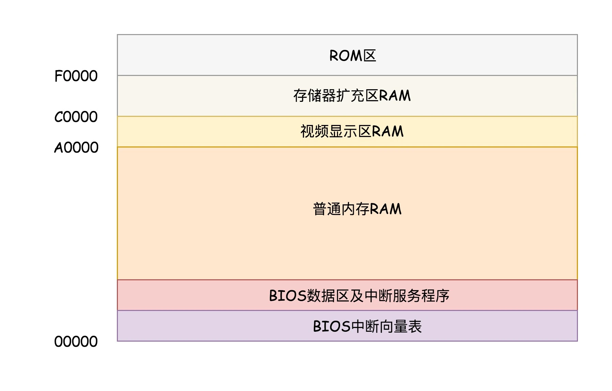

# 计算机启动过程

计算机启动的简要流程为：当电脑的电源开启，BIOS 就会从主板上的 ROM 芯片执行，执行加电自检（POST），测试和初始化 CPU、RAM、直接存储器访问控制器、芯片组、键盘、软盘、硬盘等设备。当所有的 Option ROM 被加载后，BIOS 就试图从启动设备（如硬盘、软盘、光盘）加载启动程序，由启动程序加载操作系统。

## BIOS

计算机加电启动后，CPU 会从一个固定存储地址加载指令序列执行，这个固定的存储地址指向计算机主板的 ROM 上的一段启动程序——BIOS。

这里的 ROM，全称为 Read Only Memory，即只读内存，既然是只读的，那么其上存储的指令序列必然是提前固化好的。这段固化好的程序就是 BIOS（Basic Input and Output System），基本输入输出系统。

8086 架构中，地址总线是 20 位的，也就是其只能够访问 `2^20=1M` 大小的内存，内存大小是十分有限，所以必须合理规划内存的分配。8086 架构对内存的分配如下图所示：

> 图片来自：[从BIOS到bootloader：创业伊始，有活儿老板自己上 (geekbang.org)](https://time.geekbang.org/column/article/89739)

如上图所示，8086 架构将 `1M` 空间最上面的 `0xF0000` 到 `0xFFFFF` 这 `64K` 映射给 ROM，也就是说，到这部分地址访问的时候，会访问 ROM。当电脑刚加电的时候，会做一些重置的工作，将代码段寄存器（`CS`）设置为 `0xFFFF`，将指令寄存器（`IP`）设置为 `0x0000`，所以第一条指令就会指向 `0xFFFF0`，正是在 ROM 的范围内。在这里，有一个 `JMP` 命令会跳到 ROM 中执行初始化工作的代码，于是，BIOS 开始工作了。

## 引导程序

从上面内存分配可以看出，ROM 内存空间是有限的，所以 BIOS 只会提供和计算机启动运行相关的基础服务，其上的程序包括：

- 存储设备的驱动程序，用以识别常规的外置存储设备，比如硬盘、光驱、U 盘；
- 基础外部设备的驱动程序，比如键盘、鼠标、显示器；
- 设备和启动配置的基础管理能力；
- 支持执行外置存储中引导区的机器代码程序；
- 跳转到外置存储引导区的固定地址，把执行权交给该地址上的引导程序。

BIOS 在完成好一些基础工作后，会去磁盘的固定位置加载引导程序，把执行权交给引导程序。

> 这里的磁盘固定位置一般是指磁盘正式安装到启动盘的第一个扇区，占 512 字节，而且以 `0xAA55` 结束，这个扇区称为 `MBR`（Master Boot Record，主引导记录） 扇区。
>
> 主引导扇区只有 512 个字节，这意味着主引导程序做不了太多的事情，它能做的最重要事情就是引导某个分区上的第二阶段引导程序，并将执行权交给它。

从上面的过程我们可以发现，在第二段引导程序执行前，执行的程序都非常小，此时在实模式下是可以工作的，但随着第二段引导程序执行，发现需要加载的程序越来越大，实模式 `1M`  的空间已经不能满足需求了。所以还需要将实模式切换到保护模式（`real_to_prot`），扩大可用内存空间。

切换到保护模式要干很多工作（大部分工作都与内存的访问方式有关）：

- 第一项是启用分段：
  - 在内存里面建立**段描述符表**，段描述符存放段的起始地址；
  - 令段寄存器存放选择子，选择子指向某个段描述符；
- 第二项是启动内存分页；
- 打开 Gate 20，也就是第 21 根地址线的控制线。

切换到保护模式后，就有很多内存空间可用了，接着第二段引导程序会让你选择要启动的系统。

选择好启动的系统后引导程序就开始准备启动操作系统，其先将 Linux 内核镜像头部的一些数据结构，放到内存中的数据结构来进行检查，如果检查通过，则会读取整个 Linux 内核镜像到内存。这时候就开始真正启动内核程序了。

> 注：关于引导程序更多的使用和运行细节可以查看 **GNU GRUB** 的原理。GRUB 是一个来自 GNU 项目的启动引导程序，是多启动规范的实现，它允许用户可以在计算机内同时拥有多个操作系统，并在计算机启动时选择希望运行的操作系统。
>
> [GNU GRUB - 维基百科，自由的百科全书 (wikipedia.org)](https://zh.wikipedia.org/wiki/GNU_GRUB)

## 总结

这里再简要总结一些计算机的启动步骤：

- 计算机通电后从主板上的 ROM 加载 BIOS 程序执行；
- BIOS 执行完一些基础工作后将会去加载引导扇区的主引导程序，并将执行权交接出去；
- 主引导程序体积非常小（能做的事情非常有限），其最重要的一件事情就是引导某个分区上的第二阶段的引导程序，将执行权交给它；
- 从实模式切换到保护模式；
- 选择要启动的操作系统；
- 加载系统内核镜像头到内存中进行检查，检查通过加载系统镜像到内存，开始启动内核程序；
- 由内核程序完成其他系统初始化操作。

本文是极客时间专栏《趣谈 Linux 操作系统》的学习笔记，原文链接：[从BIOS到bootloader：创业伊始，有活儿老板自己上 (geekbang.org)](https://time.geekbang.org/column/article/89739)

### 参考链接

- [如何实现可自我迭代的计算机？ (geekbang.org)](https://time.geekbang.org/column/article/93130)

- [操作系统进场 (geekbang.org)](https://time.geekbang.org/column/article/93315)
