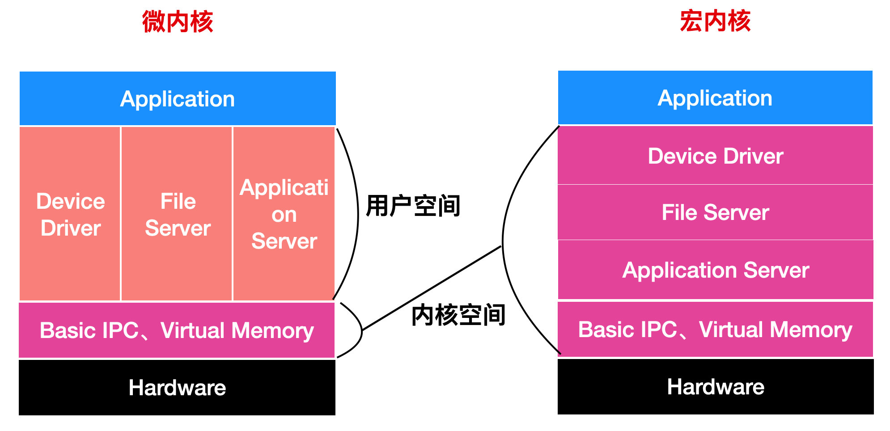

# 内核初始化

这里介绍一些内核的相关概念和内核的初始化工作流程。

## 内核

内核本质上是一个程序，其在操作系统启动时被加载运行。内核的主要作用是为众多应用程序提供对计算机硬件的安全访问入口。

内核在设计上可以分为宏内核和微内核，在宏内核与微内核之间，进行妥协的设计，称为混合内核。宏内核和微内核架构图如下所示：

> 图片来自：[聊了聊宏内核和微内核 - SegmentFault 思否](https://segmentfault.com/a/1190000040898100)

从上述图片可以看出，宏内核是一个大的整体，可以说是一个大的进程，所有系统级别的服务都运行在一个地址空间中，函数之间调用链路少，直接通信简单高效。Linux 内核就属于宏内核。

微内核将一些系统级的功能划分为独立的进程，进程之间相互通信，高度模块化，一个服务的故障不会影响另一个服务。不过由于模块化的影响，函数之间调用链路偏长。同时需要注意，进程之间不会直接通信，而是通过内核服务相互通信，所以微内核包含了一些创建系统必要的几个部分，如线程管理、地址空间和进程通信等。macOS 的内核 Mach 就属于微内核。

混合内核的设计理念来自微内核，只不过它将微内核部分用户态的代码运行在内核空间，这样让内核的运行效率更高些，这是一种妥协做法。Windows 的 NT 内核就是混合内核。

> 宏内核和微内核比较？
>
> 从内核大小来讲，微内核的尺寸要更小，因为其只包含非常简单的硬件抽象层和一组比较关键的系统调用，而宏内核体积比微内核要大，因为其包含了很多系统级别的服务。
>
> 从执行效率上来讲，微内核执行效率较慢，因为其高度模块化，模块之间调用链路较长，宏内核则都在一个地址空间中，调用链路短。
>
> 从扩展性来讲，微内核更好，高度模块化后，一个模块的崩溃不会影响到其他模块，而宏内核的扩展性较差。

## 内核初始化

内核的启动从入口函数 `start_kernel` 开始，该函数在 `init/main.c` 文件中。`start_kernel` 相当于内核程序的 main 函数，这个函数主要处理三件事情：

- 创建样板进程（0 号进程），及各个模块初始化；

- 创建用户态祖先进程（1 号进程），初始化用户态；
- 创建内核态祖先进程（2 号进程），初始化内核态。

### 创建样板进程和初始化各模块

- 创建第一个进程，0 号进程，`set_task_stack_end_magic(&init_task)`；

- 初始化中断模块，`trap_init()`，系统调用也是通过发送中断进行，由 `set_system_intr_gate()` 完成；

- 初始化内存管理模块，`mm_init()`；

- 初始化进程调度模块，`sched_init()`；

- 初始化基于内存的文件系统 `rootfs`，`vfs_caches_init()`，在 `vfs_caches_init()` 函数内部调用 `mnt_init()->init_rootfs()` 注册了基于内存的文件系统 `rootfs`；

-  调用 `rest_init()` 完成其他初始化工作。

### 创建用户态祖先进程

`rest_init` 的第一大工作是，用 `kernel_thread(kernel_init, NULL, CLONE_FS)` 创建第二个进程，这个是 1 号进程，1 号进程用来创建和管理用户态的进程。

有了用户进程后，则需要由一种机制来保证系统的核心资源可以被各个进程安全访问。

`x86` 提供了分层的权限机制，把区域分成了四个 0~4 四个 Ring，Ring 0 权限最高，Ring 4 权限最低。操作系统则利用了这个机制，将能够访问关键资源的代码放在 Ring 0，我们称为内核态（Kernel Mode）；将普通的程序代码放在 Ring 3，我们称为用户态（User Mode）。当用户态的代码不能直接访问内核态的代码，而是要通过**系统调用**来实现。

系统调用的过程简要步骤为：

- 用户态程序欲访问内核中资源；
- 内核将用户态程序上下文保存到寄存器；
- 内核态执行系统调用；
- 恢复第二步保存的寄存器；
- 用户态程序获取到内核执行的结果，接着中断前的位置开始执行。

在执行 `kernel_thread` 函数时，进程仍在内核态，而创建 1 号进程的目的是为了让其初始化用户态程序，管理用户态的进程，所以在 `kernel_thread` 函数内部需要**从内核态过渡到用户态**。这一过程步骤如下：

- 1 号进程执行 `kernel_init` 函数，使用 `do_execve->do_execveat_common->exec_binprm->search_binary_handler` 系统调用链路去运行 init 文件；
- `search_binary_handler` 函数就是最终运行文件的逻辑，会先调用 `load_elf_binary` 加载可执行文件，随后调用 `start_thread`；
- 在 `start_thread` 函数中调整寄存器的状态到用户态，这一步实际上在模拟系统调用的第二个步骤；
- 最后调用 `iret` 从系统调用中返回，这时候恢复寄存器，1 号进程就在用户态运行。

可以看出通过模拟系统调用过程中会先保存用户态上下文到寄存器然后在恢复执行这一过程来实现内核态到用户态的转换。

1 号进程到了用户态后，就会成为所有用户态进程的祖先，去完成用户态程序的启动和相关初始化工作。

### 创建内核态祖先进程

`rest_init` 的还有一项工作是创建 2 号进程，2 号进程工作在内核态，负责所有内核态线程的调度和管理，去进行内核态相关资源的初始化工作。

## 总结

本文介绍了内核的一些基本概念，和内核初始化步骤。

内核初始化后意味着用户要开始使用操作系统了，所以这一过程会初始化好基础的系统资源，并启动用户需要使用的应用程序。内核初始化的入口函数为 `start_kernel`，执行的初始化工作包括：

- 创建样板进程（0 号进程）；
- 初始化中断模块；
- 初始化内存模块；
- 初始化进程调度模块；
- 初始化基于内存的文件系统 `rootfs`；
- 调用 `rest_init` 创建 1 号线程和 2 号线程：
  - 1 号线程会成为所有用户态进程的祖先，用来初始化用户态的应用程序；
  - 2 号进程会程序内核态进程的组祖先，负责内核态线程的调度和管理。

这其中还涉及到用户态和内核态的概念，用户态程序需要通过系统调用来访问内核态的程序，以保证系统的核心资源被应用程序安全访问。

本文是极客时间专栏《趣谈 Linux 操作系统》的学习笔记，原文链接：[内核初始化：生意做大了就得成立公司 (geekbang.org)](https://time.geekbang.org/column/article/90109)

### 参考链接

- [聊了聊宏内核和微内核 - SegmentFault 思否](https://segmentfault.com/a/1190000040898100)

