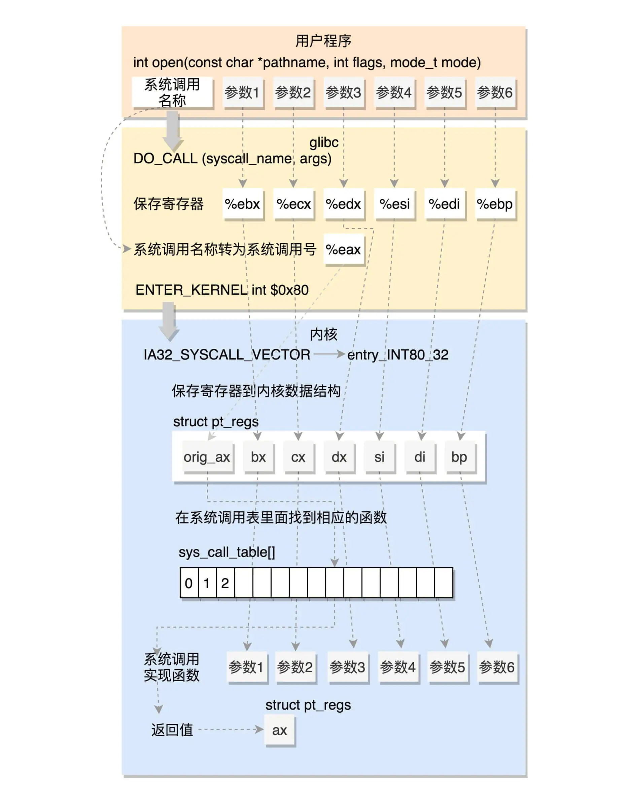
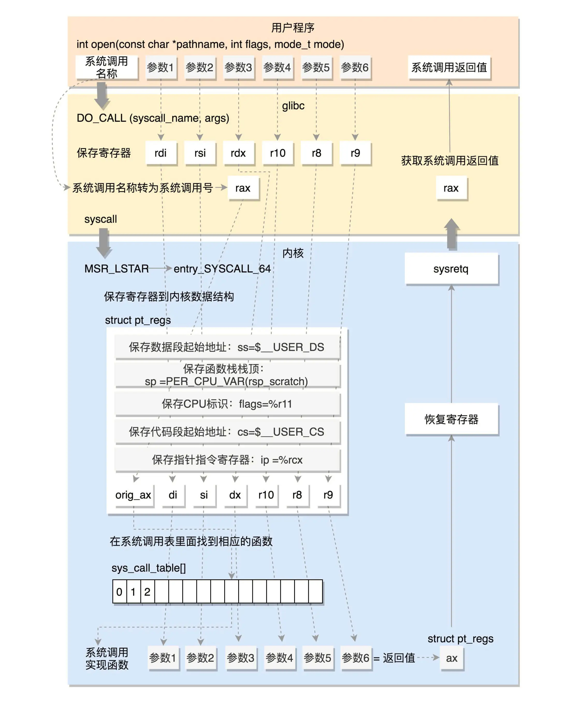

# 系统调用过程

系统调用是操作系统提供的使用系统服务的接口， `glibc` 将进一步及将系统调用封装成更友好的接口供外部程序使用。也就是说程序在使用系统调用时有两种方式，调用操作系统提供的系统调用接口或调用 `glibc` 封装了系统调用的函数。

## C 语言宏定义

`glibc` 进行系统调的代码使用了大量的宏定义，这里先 C 语言宏定义进行简单的介绍。

宏（Macro）是预处理命令的一种，它允许用一个标识符来表示一个字符串，预处理器会将源码中的宏定义全部替换成定义时指定的字符串。

宏定义的一般形式为：

```c
#define  宏名  字符串
```

- `#` 表示这是一条预处理命令，所有的预处理命令都以 `#` 开头；
- `define ` 是预处理命令；
- 宏名是标识符的一种，命名规则和标识符相同，按照惯例，宏名称使用大写加下划线的形式声明；
- 字符串可以是数字、表达式、if 语句、函数等。

下面是一个简单的例子：

```c
#include <stdio.h>
#define N 100
int main(){
    int sum = 20 + N;
    printf("%d\n", sum);
    return 0;
}
```

上述代码定义了一个名为 N 的宏，在代码中使用 N，预处理器就会将 N 替换成 100，所以上述代码的运行结果为 120。

### 对宏定义的几点说明

- 宏定义是用宏名来表示一个字符串，在宏展开时又以该字符串取代宏名，这只是一种简单粗暴的替换，字符串中可以含任何字符，它可以是常数、表达式、if 语句、函数等，预处理程序对它不作任何检查，如有错误，只能在编译已被宏展开后的源程序时发现；

- 宏定义不是说明或语句，在行末不必加分号，如加上分号则连分号也一起替换；

- 宏定义必须写在函数之外，其作用域从宏命令定义起到源程序结束，如要终止其作用域可使用 `#undef` 命令，例如：

  ```c
  #define PI 3.14159
  int main(){
      // Code
      return 0;
  }
  #undef PI
  void func(){
      // Code
  }
  ```

  如上述代码所示，宏定义 PI 只在 `main()` 函数中有效，在 `func()` 中无效。

- 代码中的宏名如果被引号包围，那么预处理程序不对其作宏代替，例如：

  ```c
  #include <stdio.h>
  #define OK 100
  int main(){
      printf("OK\n");
      return 0;
  }
  ```

  如上述代码所示，OK 以原样字符输出，不会被替换为 100。

- 可用宏定义表示数据类型，例如：

  ```c
  #define UINT unsigned int
  ```

  在程序使用时：

  ```c
  UINT a, b;
  ```

  在使用宏声明类型时注意其和 `typeof` 的区别，宏定义只是简单的字符串替换，由预处理器来处理；而 `typedef` 是在编译阶段由编译器处理的，它并不是简单的字符串替换，而给原有的数据类型起一个新的名字，将它作为一种新的数据类型，如：

  ```c
  #define PIN1 int *
  typedef int *PIN2;  //也可以写作typedef int (*PIN2);
  ```

  使用宏：

  ```c
  PIN1 a, b;
  ```

  在宏代换后变成：`int * a, b;`，此时 a 是指向整型的指针变量，而 b 是整型变量。

  使用 `typeof` ：

  ```c
  PIN2 a,b;
  ```

  此时 a 和 b 都表示指向整型的变量，因为 PIN2 是一个新的、完整的数据类型。

### 函数宏

宏可以带参数，这类宏也叫做函数宏，对带参数的宏，在展开过程中不仅要进行字符串替换，还要用实参去替换形参。

带参数的宏的一般形式是：

```c
#define 宏名(形参列表) 字符串
```

比如：

```c
#define M(y) y*y+3*y  //宏定义
// Code
k=M(5);  //宏调用
```

上述宏在调用时经过预处理展开就为 `k=5*5+3*5`。

## 系统调用过程

这里以使用 `glibc` 调用内核 `open` 为例在介绍系统调用的过程。

### 32 位系统调用过程

- 用户程序调用 `open` 函数；
- 经过 `glibc` 处理，该函数最终会调用 `DO_CALL` 宏函数（32 位），该函数执行流程如下；
  - 将请求参数保存到寄存器中；
  - 将系统调用名称转为系统调用号保存到寄存器 eax 中；
  - 通过软中断 `ENTER_KERNEL` （即 `int $0x80`）进入内核态；
  - 进入内核态后 `entry_INT80_32` 被调用，其过程如下：
    - 将用户态的寄存器保存到 `pt_regs` 结构中；
    - 在系统调用函数表 `sys_call_table` 中根据调用号找到对应的函数；
    - 将寄存器中保存的参数取出来作为函数入参，执行函数实现，将返回值写入 `pt_regs` 的 `ax` 位置；
  - 通过 `INTERRUPT_RETURN`（即 `iret`）根据 `pt_regs` 恢复用户态进程。

上述调用过程如下图所示：



> 图片来自：[系统调用：公司成立好了就要开始接项目 (geekbang.org)](https://time.geekbang.org/column/article/90394)

### 64 位系统调用过程

- 用户程序调用 `open` 函数；

- 经过 `glibc` 处理，该函数最终会调用 `DO_CALL` 宏函数（64 位），该函数执行流程如下：
  - 将请求参数保存到寄存器中；
  - 将系统调用名称转为系统调用号保存到寄存器 `rax` 中；
  - 通过 `syscall` 进入内核态；
  - 将用户态的寄存器保存到 `pt_regs` 结构中；
  - 在系统调用函数表 `sys_call_table` 中根据调用号找到对应的函数；
  - 执行函数实现，将返回值写入 `pt_regs` 的 `ax` 位置；
  - 通过 `sysretq` 返回用户态。

上述调用过程如下图所示：



> 图片来自：[系统调用：公司成立好了就要开始接项目 (geekbang.org)](https://time.geekbang.org/column/article/90394)

## 总结

这里介绍了 `glibc` open 函数在 32 位操作系统和 64 位操作系统下的执行流程。系统调用的过程简要步骤为：

- 用户态程调用系统调用相关函数；
- 内核将用户态程序上下文保存到寄存器；
- 进入内核态执行系统调用；
- 恢复第二步保存的寄存器；
- 用户态程序获取到内核执行的结果，接着中断前的位置开始执行。

本文是极客时间专栏《趣谈 Linux 操作系统》的学习笔记，原文链接：[系统调用：公司成立好了就要开始接项目 (geekbang.org)](https://time.geekbang.org/column/article/90394)

### 参考链接

- [C语言宏定义_C语言中文网 (biancheng.net)](http://c.biancheng.net/cpp/html/65.html)

- [C语言带参数宏定义_C语言中文网 (biancheng.net)](http://c.biancheng.net/cpp/html/66.html)