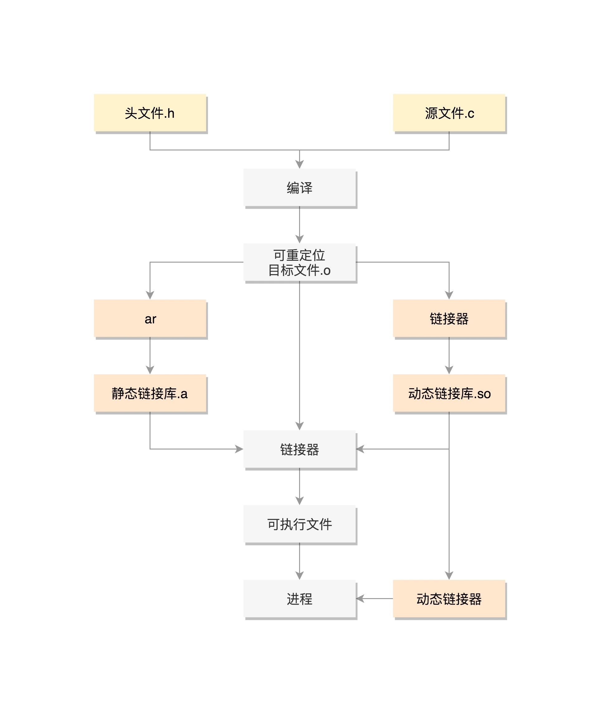

# 进程创建执行

这里介绍 C 语言程序（创建进程）在 Linux 下编译执行的过程。

## 程序示例

```c
#include <stdio.h>
#include <stdlib.h>
#include <sys/types.h>
#include <unistd.h>

extern int create_process (char* program, char** arg_list);

int create_process (char* program, char** arg_list)
{
    pid_t child_pid;
    child_pid = fork();
    if (child_pid != 0)
        return child_pid;
    else {
        execvp (program, arg_list);
        abort ();
    }
}
```

上述代码（`process.c`）提供了一个方法 `create_process`，用来调用 fork 来创建一个子进程，判断如果在子进程内部，就调用 `execvp` 执行程序。

```c
#include <stdio.h>
#include <stdlib.h>
#include <sys/types.h>
#include <unistd.h>

extern int create_process (char* program, char** arg_list);

int main ()
{
    char* arg_list[] = {
        "ls",
        "-l",
        "/etc/yum.repos.d/",
        NULL
    };
    create_process ("ls", arg_list);
    return 0;
}
```

上述代码（`createprocess.c`） 用来调用上述文件定义的 `create_process` 方法。

## 编译

> Linux 实验环境安装：`yum -y groupinstall "Development Tools"`

编写好的源代码是不能直接执行的，需要**编译**成而二进制文件才能执行。

在 Linux 下面，二进制的程序也要有严格的格式，这个格式我们称为 ELF（Executeable and Linkable Format，可执行与可链接格式）。这个格式可以根据编译的结果不同，分为不同的格式。

这里我们使用 `gcc` 编译上述编写好的程序，编译指令如下所示：

```bash
gcc -c -fPIC process.c
gcc -c -fPIC createprocess.c
```

在编译的过程中会做一些预处理的工作，比如将将头文件嵌入到正文中，将宏定义展开等。经过上述命令编译，我们会得到和编译文件同名并以 `.o` 结尾的文件，这个是 ELF 的一种类型——**可重定位文件**（Relocatable File）。

### 可重定位文件

编译好的可重定位文件包含了可执行的代码、还有一些全局变量和静态变量、可重定位信息等。

这里的可重定位有什么含义呢？

这个编译好的代码和变量，将来加载到内存里面的时候，都是要加载到一定位置的。比如说，调用一个函数，其实就是跳到这个函数所在的代码位置执行，修改一个全局变量，也是要到变量的位置那里去修改。

但此时的 `.o` 文件还不是一个可以直接运行的程序，其内的函数和变量的地址是无法确定的，但是必须是要可重定位的。

## 链接

可重定向文件（目标文件）是从源代码文件产生程序文件这一过程的中间产物，并不是一个可以直接运行的程序，还需要通过链接器把目标文件链接在一起来生成**可执行文件**或**库文件**。链接的方式有两种，静态链接和动态链接。

### 静态链接

首先我们使用 ar 命令将多个 `.o` 文件归档为一个库文件 `libstaticprocess.a`，命令如下：

```bash
ar cr libstaticprocess.a process.o
```

然后通过静态链接形成一个可执行文件，命令如下：

```bash
gcc -o staticcreateprocess createprocess.o -L. -lstaticprocess
```

上述命令中：

- -L  表示在当前目录下找 `.a` 文件；
- `-lstaticprocess` 会自动补全文件名，比如加前缀 `lib`，后缀 `.a`，变成 `libstaticprocess.a`；
- 找到这个 `.a` 文件后，将里面的 `process.o` 取出来，和 `createprocess.o` 做一个链接，形成二进制执行文件 `staticcreateprocess`。

这个**可执行文件** `staticcreateprocess` 就是 ELF 的第二种格式，其可以直接用来执行。

### 动态链接

静态链接库一旦链接进去，代码和变量都合并了，这样程序运行的时候，就不依赖于这个库是否存在。但是这样有一个缺点，就是相同的代码段，如果被多个程序使用的话，在内存里面就有多份，而且一旦静态链接库更新了，二进制文件需要重新编译。

因而就出现了另一种，动态链接库（Shared Libraries），不仅仅是一组对象文件的简单归档，而是多个对象文件的重新组合，可被多个程序共享。

创建一个共享的动态链接库，命令如下：

```bash
gcc -shared -fPIC -o libdynamicprocess.so process.o
```

当一个动态链接库被链接到一个程序文件中的时候，最后的程序文件并不包括动态链接库中的代码，而仅仅包括对动态链接库的引用，并且不保存动态链接库的全路径，仅仅保存动态链接库的名称。

```bash
gcc -o dynamiccreateprocess createprocess.o -L. -ldynamicprocess
```

当运行这个程序的时候，首先寻找动态链接库，然后加载它。默认情况下，系统在 `/lib` 和 `/usr/lib` 文件夹下寻找动态链接库。如果找不到就会报错，我们可以设定 `LD_LIBRARY_PATH` 环境变量，程序运行时会在此环境变量指定的文件夹下寻找动态链接库，比如在当前会话种配置当前文件夹为动态链接库目录：

```bash
export LD_LIBRARY_PATH=.
```

动态链接库，就是 ELF 的第三种类型，**共享对象文件**（Shared Object）。

## 加载运行

知道了 ELF 这个格式，这个时候它还是个程序，那怎么把这个文件加载到内存里运行呢？

答案是通过系统调用 `exec` 调用 `load_elf_binary` 来加载程序到内存中。

`exec` 是一组函数，分别有：

- 包含 p 的函数（`execvp`, `execlp`）会在 PATH 路径下面寻找程序；
- 不包含 p 的函数需要输入程序的全路径；
- 包含 v 的函数（`execv`,  `execvp`,  `execve`）以数组的形式接收参数；
- 包含 l 的函数（`execl`,  `execlp`,  `execle`）以列表的形式接收参数；
- 包含 e 的函数（`execve`,  `execle`）以数组的形式接收环境变量。

## 总结

本文介绍了一个 C 语言编写的程序（创建进程）是如何在 Linux 上编译执行的，完整的执行过程如下所示：



> 图片来自：[进程：公司接这么多项目，如何管？ (geekbang.org)](https://time.geekbang.org/column/article/90855)

这里总结一些 ELF 文件，ELF 全称是 The Executable and Linking Format，意为可执行可链接文件，从使用的角度来说 ELF 有三种类型：

- 可重定位文件（`.o`）：由源文件编译而成，不能直接运行，可重定位；
- 可执行文件：经过链接过程，可以被 CPU 加载到内存运行；
- 共享目标文件（`.so`）：动态链接库文件，

对于 ELF，有几个工具能帮你看这些文件的格式。`readelf` 工具用于分析 ELF 的信息，`objdump` 工具用来显示二进制文件的信息，`hexdump` 工具用来查看文件的十六进制编码，`nm` 工具用来显示关于指定文件中符号的信息。

本文是极客时间专栏《趣谈 Linux 操作系统》的学习笔记，原文链接：[进程：公司接这么多项目，如何管？ (geekbang.org)](https://time.geekbang.org/column/article/90855)

