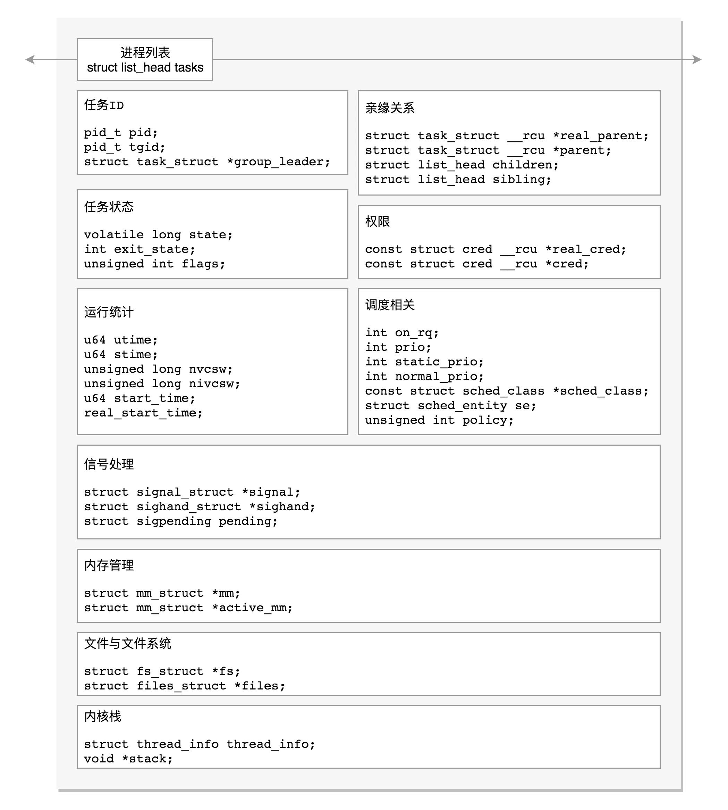

# 进程数据结构

**在 Linux 里不论是进程还是线程，到了内核里，我们都统一叫做任务（Task），由一个统一的结构 `task_struct` 进行管理**。`task_struct` 总体的数据结构如下所示：



> 图片来自：[进程数据结构（下）：项目多了就需要项目管理系统 (geekbang.org)](https://time.geekbang.org/column/article/93014)

## 任务 ID

task_struct 涉及任务 ID 的有以下几个：

```c
pid_t pid;
pid_t tgid;
struct task_struct *group_leader; 
```

**对于一个进程来讲，其都有一个主线程**。

- `pid`：process id，即进程 ID；
- `tgid`：thread group id，即线程组 ID；
- `group_leader`：进程主线程的 ID。

如果进程只有一个主线程，那么 `tgid` 和 `group_leader` 都指向进程自己，代表这是进程；如果有多个子线程，那么子线程的 `tgid` 和 `group_leader` 指向主线程，代表这是一个子线程。

## 信号处理

下面是 `task_struct` 中关于信号处理的字段：

```c
/* Signal handlers: */
struct signal_struct    *signal;
struct sighand_struct    *sighand;
sigset_t      blocked;
sigset_t      real_blocked;
sigset_t      saved_sigmask;
struct sigpending    pending;
unsigned long      sas_ss_sp;
size_t        sas_ss_size;
unsigned int      sas_ss_flags;
```

- `blocked`：表示阻塞；
- `pending`：表示等待处理；
- `sighand`：表示正在通过信号函数处理。

## 任务状态

在 `task_struct` 里面，涉及任务状态的是下面这几个变量：

```c
volatile long state;    /* -1 unrunnable, 0 runnable, >0 stopped */
int exit_state;
unsigned int flags;
```

state（状态）可以取的值定义在 `include/linux/sched.h` 头文件中，包括：

```c
/* Used in tsk->state: */
#define TASK_RUNNING                    0
#define TASK_INTERRUPTIBLE              1
#define TASK_UNINTERRUPTIBLE            2
#define __TASK_STOPPED                  4
#define __TASK_TRACED                   8
/* Used in tsk->exit_state: */
#define EXIT_DEAD                       16
#define EXIT_ZOMBIE                     32
#define EXIT_TRACE                      (EXIT_ZOMBIE | EXIT_DEAD)
/* Used in tsk->state again: */
#define TASK_DEAD                       64
#define TASK_WAKEKILL                   128
#define TASK_WAKING                     256
#define TASK_PARKED                     512
#define TASK_NOLOAD                     1024
#define TASK_NEW                        2048
#define TASK_STATE_MAX                  4096
```

- `TASK_RUNNING`：并不代表进程正在运行，而是在时刻准备运行状态；
- `TASK_INTERRUPTIBLE`：可中断睡眠状态，中途可以被信号唤醒；
- `TASK_UNINTERRUPTIBLE`：不可中断睡眠状态，不可被信号唤醒，只能等 I/O 操作完成；
- `TASK_KILLABLE`：可以终止睡眠状态，进程处于这种状态中，它的运行原理类似 `TASK_UNINTERRUPTIBLE`，只不过可以响应致命信号；
- `TASK_WAKEKILL`：在接收到致命信号时唤醒进程；
- `TASK_STOPPED`：进程接收到 `SIGSTOP`、`SIGTTIN`、`SIGTSTP` 或者 `SIGTTOU` 信号之后进入该状态；
- `TASK_TRACED`：表示进程被 debugger 等进程监视，进程执行被调试程序所停止；
- `EXIT_ZOMBIE`：一旦一个进程要结束，先进入的是 `EXIT_ZOMBIE` 状态，但是这个时候它的父进程还没有使用 `wait()` 等系统调用来获知它的终止信息，此时进程就成了僵尸进程；
- `EXIT_DEAD`：是进程的最终状态；
- `PF_EXITING`：表示正在退出；
- `PF_VCPU`：表示进程运行在虚拟 CPU 上；
- `PF_FORKNOEXEC`：表示 `fork` 完了，还没有 `exec`。

## 进程调度

进程的状态切换往往涉及调度，下面这些字段都是用于调度的：

```c
//是否在运行队列上
int        on_rq;
//优先级
int        prio;
int        static_prio;
int        normal_prio;
unsigned int      rt_priority;
//调度器类
const struct sched_class  *sched_class;
//调度实体
struct sched_entity    se;
struct sched_rt_entity    rt;
struct sched_dl_entity    dl;
//调度策略
unsigned int      policy;
//可以使用哪些 CPU
int        nr_cpus_allowed;
cpumask_t      cpus_allowed;
struct sched_info    sched_info;
```

## 运行统计信息

运行统计信息记录了进程的运行情况，涉及到的字段有：

```c
u64        utime;            //用户态消耗的CPU时间
u64        stime;            //内核态消耗的CPU时间
unsigned long      nvcsw;    //自愿(voluntary)上下文切换计数
unsigned long      nivcsw;   //非自愿(involuntary)上下文切换计数
u64        start_time;       //进程启动时间，不包含睡眠时间
u64        real_start_time;  //进程启动时间，包含睡眠时间
```

## 进程亲缘关系

全部进程其实就是一棵进程树，任何一个进程都有父进程，而拥有同一父进程的所有进程都具有兄弟关系，进程的亲缘关系就反映了这些信息：

```c
struct task_struct __rcu *real_parent;  /* real parent process */
struct task_struct __rcu *parent;       /* recipient of SIGCHLD, wait4() reports */
struct list_head children;              /* list of my children */
struct list_head sibling;               /* linkage in my parent's children list */
```

- `parent`：指向父进程，当前进程终止时，必须向父进程发送信号；
- `children`：表示链表的头部，链表中的所有元素都是它的子进程；
- `sibling`：用于把当前进程插入到兄弟链表中；
- `real_parent`：通常情况下，`real_parent` 和 `parent` 是一样的，但是也会有另外的情况存在，例如，bash 创建一个进程，那进程的 `parent` 和 `real_parent` 就都是 `bash`，如果在 `bash` 上使用 GDB 来 debug 一个进程，这个时候 GDB 是 `parent`，`bash` 是这个进程的 `real_parent`。

## 进程权限

```c
/* Objective and real subjective task credentials (COW): */
const struct cred __rcu         *real_cred;
/* Effective (overridable) subjective task credentials (COW): */
const struct cred __rcu         *cred;
```

- `real_cred`：说明谁能操作我这个进程；
- `cred`：说明我这个进程能操作谁。

`cred` 定义如下：

```c
struct cred {
......
        kuid_t          uid;            /* real UID of the task */
        kgid_t          gid;            /* real GID of the task */
        kuid_t          suid;           /* saved UID of the task */
        kgid_t          sgid;           /* saved GID of the task */
        kuid_t          euid;           /* effective UID of the task */
        kgid_t          egid;           /* effective GID of the task */
        kuid_t          fsuid;          /* UID for VFS ops */
        kgid_t          fsgid;          /* GID for VFS ops */
......
        kernel_cap_t    cap_inheritable; /* caps our children can inherit */
        kernel_cap_t    cap_permitted;  /* caps we're permitted */
        kernel_cap_t    cap_effective;  /* caps we can actually use */
        kernel_cap_t    cap_bset;       /* capability bounding set */
        kernel_cap_t    cap_ambient;    /* Ambient capability set */
......
} __randomize_layout;
```

从这里的定义可以看出，信息包括（大部分是关于用户和用户所属的用户组信息，表示）：

- `uid/gid(real UID/real GID)`：用户 ID 和 用户组 ID，一般情况下，谁启动的进程，就是谁的 ID（判断权限时一般不用）；
- `euid/egid(effective UID/effective GID)`：起作用的用户 ID 和用户组 ID，当这个进程要操作消息队列、共享内存、信号量等对象的时候，其实就是在比较这个用户和组是否有权限；
- `fsuid/fsgid`：在进程操作文件时，判断该用户和组是否有相应的权限；
- `suid/sgid(saved UID/saved GID)`：当进程被执行时拷贝自 `euid/egid`。

一般说来，`fsuid`、`euid`，和 `uid` 是一样的，`fsgid`、`egid`，和 `gid` 也是一样的，因为谁启动的进程，就应该审核启动的用户到底有没有这个权限，但是也有特殊情况。举个例子：

- 用户 A 想玩一个游戏，这个游戏是用户 B 安装的，游戏文件的权限为 `rwxr–r--`，表示用户 B 对文件可读可写可执行，其他用户对该文件只读；
- 用户 B 修改游戏文件权限为 `rwxr_xr_x`，这样用户 A 就可以运行该游戏进行游玩了；
- 用户 A 在游玩过程中想存档，需要保存游戏数据，但是用户 A 并没有写权限；
- 为了让用户 A 在游玩时能够写入数据，我们可以通过 `chmod u+s program` 命令，给这个游戏程序设置 `set-user-id` 的标识位，把游戏的权限变成 `rwsr-xr-x`；
- 用户 A 再次启动游戏的时候，创建的进程 `uid` 还是用户 A，但是 `euid` 和 `fsuid` 因为设置了 `set-user-id` 标识的缘故而被设置为文件所有者的 ID，即用户 B 的 ID；
- 这样用户 A 在玩游戏的时候就可以存档了。

Linux 系统可以通过用户 ID 和用户组决定进程对系统资源的访问权限，使用用户来控制权限的粒度较粗，为此 Linux 还提供了另一个进程权限机制 capabilities。

capabilities，用位图表示权限，在 `capability.h` 可以找到定义的权限，这里列举一部分：

```c
#define CAP_CHOWN            0
#define CAP_KILL             5
#define CAP_NET_BIND_SERVICE 10
#define CAP_NET_RAW          13
#define CAP_SYS_MODULE       16
#define CAP_SYS_RAWIO        17
#define CAP_SYS_BOOT         22
#define CAP_SYS_TIME         25
#define CAP_AUDIT_READ       37
#define CAP_LAST_CAP         CAP_AUDIT_READ
```

对于普通用户运行的进程，当有这个权限的时候，就能做这些操作；没有的时候，就不能做，这样粒度要小很多。

## 内存管理

每个进程都有自己独立的虚拟内存空间，这需要有一个数据结构来表示，就是 `mm_struct`，相关字段为：

```c
struct mm_struct                *mm;
struct mm_struct                *active_mm;
```

## 文件与文件系统

每个进程有一个文件系统的数据结构，还有一个打开文件的数据结构，相关字段为：

```c
/* Filesystem information: */
struct fs_struct                *fs;
/* Open file information: */
struct files_struct             *files;
```

## 内核栈

程序在运行过程中，一旦调用到系统调用，就需要进入内核继续执行，那如何将用户态的执行和内核态的执行串起来呢，这就需要以下两个重要的成员变量：

```c
struct thread_info    thread_info;
void  *stack;
```

## 总结

本文是极客时间专栏《趣谈 Linux 操作系统》的学习笔记，原文链接：

- [进程数据结构（上）：项目多了就需要项目管理系统 (geekbang.org)](https://time.geekbang.org/column/article/91550)

- [进程数据结构（中）：项目多了就需要项目管理系统 (geekbang.org)](https://time.geekbang.org/column/article/92151)

- [进程数据结构（下）：项目多了就需要项目管理系统 (geekbang.org)](https://time.geekbang.org/column/article/93014)