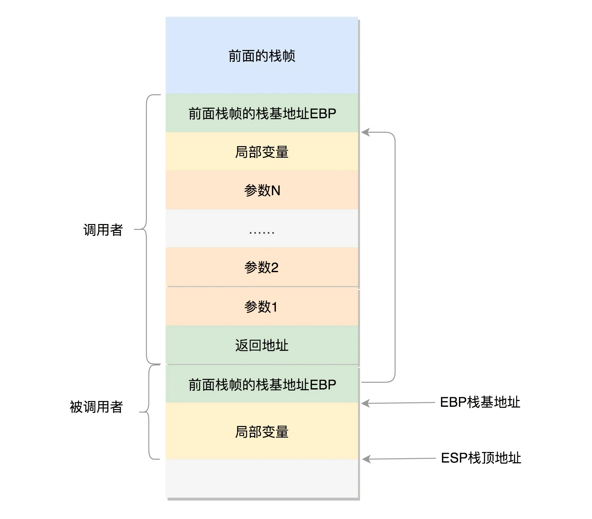
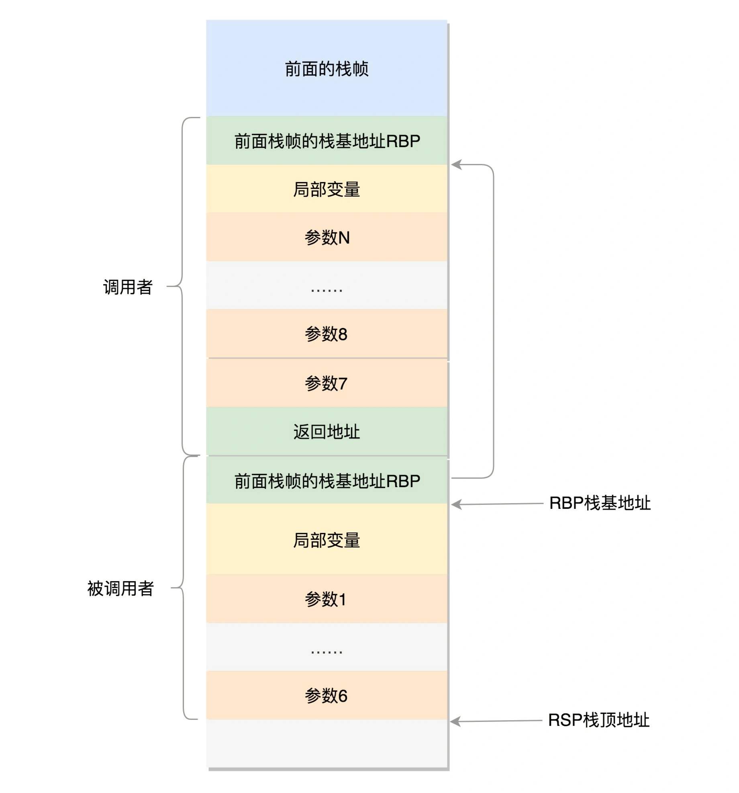
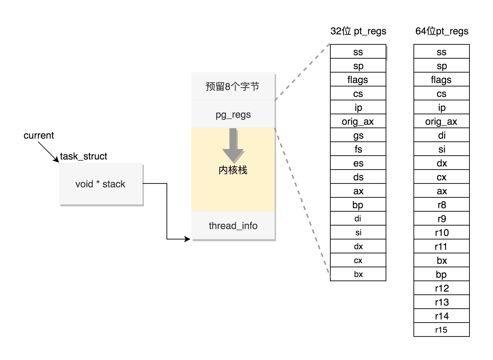
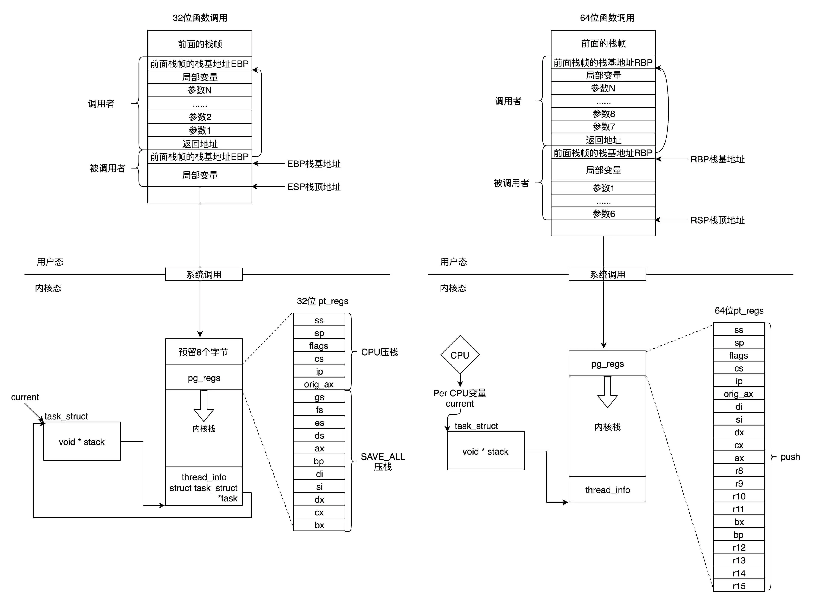

# 进程函数栈结构

程序在运行过程中，一旦调用到系统调用，就需要进入内核继续执行，那如何将用户态的执行和内核态的执行串起来呢？

## 用户栈

用户态中，程序的执行往往是一个函数调用另一个函数，函数调用都是通过栈来进行的，下面将介绍用户态函数栈的结构。

### 32 位函数栈

在进程的内存空间里面，栈是一个从高地址到低地址，往下增长的结构，也就是上面是栈底，下面是栈顶，入栈和出栈的操作都是从下面的栈顶开始的，32 位用户态函数栈结构如下图所示：



> 图片来自：[进程数据结构（下）：项目多了就需要项目管理系统 (geekbang.org)](https://time.geekbang.org/column/article/93014)

如上图所示：在 CPU 里有两个寄存器 `ESP`（Extended Stack Poniter） 和 `EBP`（Extended Base Pointer），`ESP` 是栈顶指针寄存器，入栈和出栈操作会自动调整 `ESP` 的值，`EBP` 是栈基地址寄存器，指向当前栈帧的最底部。

假设函数 A 调用了函数 B，会经过以下过程：

- 首先需要将**函数 A 的局部变量**、**调用函数 B 需要的参数**、**返回到函数 A 的地址**依次入栈，这就形成了函数 A 的栈帧；

- 接下来是函数 B 入栈，B 先保存方法 A 的栈基地址，保存函数 B 的局部变量等一些相关信息；
- 当函数 B 执行完毕后将返回结果保存到 CPU 寄存器 `EAX` 中，并从栈中弹出返回函数 A 的地址和请求函数 B 的参数，将指令跳转回去继续执行函数 A。

### 64 位函数栈

对于 64 位操作系统，模式多少有些不一样，因为 64 位操作系统的寄存器数目比较多。相比于 32 位，其变化的地方有以下几点：

- 栈顶指针寄存器变成了 `RSP`，指向栈顶位置；

- 栈基指针寄存器变成了 `RBP`，指向当前栈帧的起始位置；

- `RAX` 寄存器用于保存函数调用的返回结果；

- 改变比较多的是参数传递，`RDI`、`RSI`、`RDX`、`RCX`、`R8`、`R9` 这 6 个寄存器，用于传递存储函数调用时的前 6 个参数，如果超过 6 的时候，还是需要放到栈里面。


64 位用户态函数栈结构如下图所示：



> 图片来自：[进程数据结构（下）：项目多了就需要项目管理系统 (geekbang.org)](https://time.geekbang.org/column/article/93014)

## 内核栈

程序在运行过程中，一旦调用到系统调用，就需要进入内核继续执行，那如何将用户态的执行和内核态的执行串起来呢，这就需要以下两个重要的成员变量：

```c
struct thread_info    thread_info;
void  *stack;
```

上面已经介绍了用户态函数栈的结构，接下来，我们通过系统调用，从进程的内存空间到内核中了，内核中也有各种各样的函数调用，也需要这样一个机制。这时候，`task_struct` 中定义成员变量 `stack`，也就是内核栈，就派上用场了。

### 内核栈结构

Linux 会给每个进程分配内核栈，其结构如下所示：



如上图所示，内核栈是一个非常特殊的结构，这段空间的最低位置，是一个 `thread_info` 结构，这个结构是对 `task_struct` 结构的补充。因为 `task_struct`  结构庞大但是通用，不同的体系结构就需要保存不同的东西，所以往往与体系结构有关的，都放在 `thread_info` 里面。

在内核代码里面有这样一个 union，将 `thread_info` 和 `stack` 放在一起，在 `include/linux/sched.h` 文件中就有：

```c
union thread_union {
#ifndef CONFIG_THREAD_INFO_IN_TASK
  struct thread_info thread_info;
#endif
  unsigned long stack[THREAD_SIZE/sizeof(long)];
};
```

在内核栈的最高地址端，存放的是另一个结构 `pt_regs`，用来保存系统调用时用户态的上下文。

在内核中，CPU 的寄存器 `ESP` 或者 `RSP`，已经指向内核栈的栈顶，在内核态里的调用都有和用户态相似的过程。


Linux 给每个 task 都分配了内核栈，32 位系统和 64 位系统有以下区别：

- 内核栈大小：在 32 位系统为 8K，64 位系统为 16K；

- 内核栈格式：主要集中在 `pt_regs` 结构上，区别如上图所示；

- 内核栈和 `task_struct` 的关联方式不同：

  - 通过 `task_struct` 找到内核栈：32 和 64 位操作系统都通过 `task_struct` 中的 stack 指针找到进程对应的内核栈；

  - 通过内核栈找到 `task_struct`：

    - 32位：`thread_info` 中的 task 指针直接指向 `task_struct`；
    
    - 64位， `task_struct` 的指针存放到 Per CPU 变量 `current_task` 中，可调用 `this_cpu_read_stable` 进行读取。
    
      > Per CPU 变量就是为每个 CPU 构造一个变量的副本，这样多个 CPU 各自操作自己的副本，互不干涉。
    

## 总结

函数的调用过程很适合通过栈的先入后出特性来实现。在进程的内存空间里面，栈是一个从高地址到低地址，往下增长的结构，也就是上面是栈底，下面是栈顶，入栈和出栈的操作都是从下面的栈顶开始的。本文介绍了用户函数栈和内核栈的结构，32 位和 64 位结构不同。

在 Linux 中总的进程栈如下图所示：



> 图片来自：[进程数据结构（下）：项目多了就需要项目管理系统 (geekbang.org)](https://time.geekbang.org/column/article/93014)

本文是极客时间专栏《趣谈 Linux 操作系统》的学习笔记，原文链接：[进程数据结构（下）：项目多了就需要项目管理系统 (geekbang.org)](https://time.geekbang.org/column/article/93014)